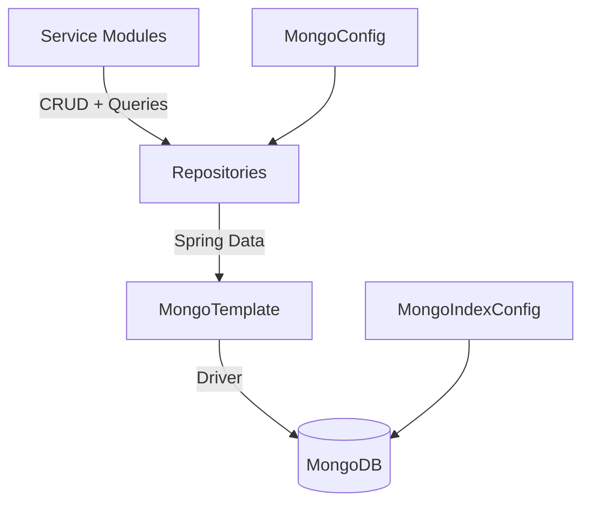
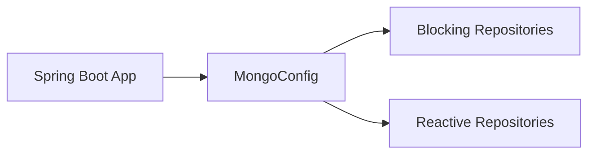
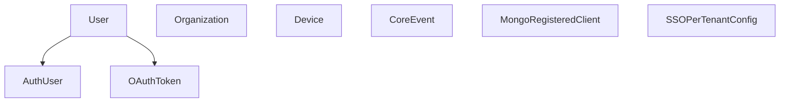
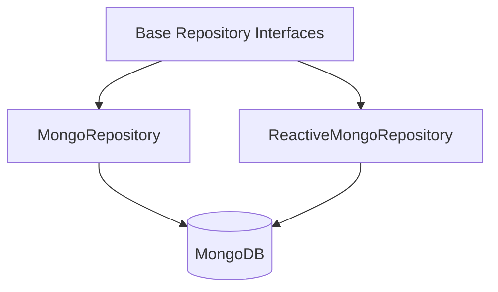
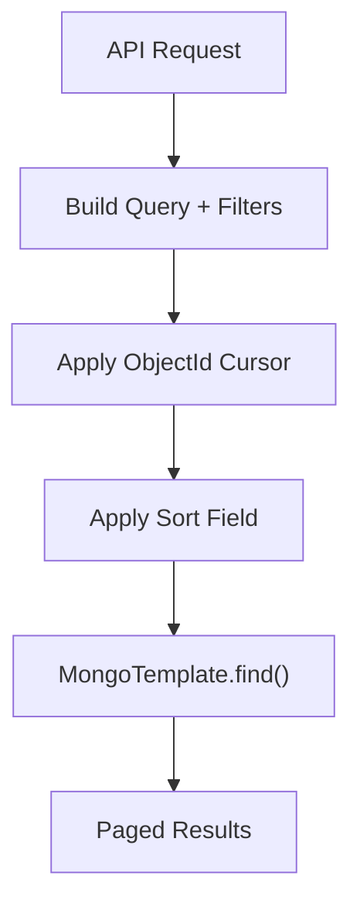
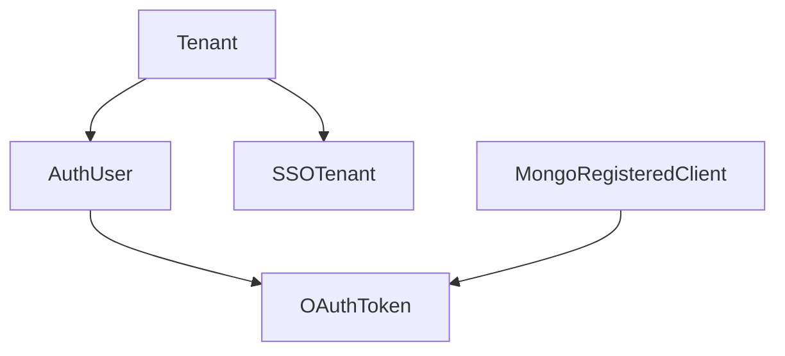

# Data Mongo Core

## Overview

The **Data Mongo Core** module provides the MongoDB-based persistence layer for the OpenFrame platform. It defines:

- MongoDB configuration and index setup
- Core domain documents (users, organizations, devices, events, OAuth, tenants)
- Blocking and reactive repositories
- Custom query implementations with filtering, sorting, and cursor-based pagination
- Multi-tenant and SSO-aware data models

This module is the foundation for higher-level services such as API Service Core, Authorization Service Core, Gateway Service Core, Stream Service Core, and Management Service Core. It encapsulates MongoDB concerns so that service modules interact with strongly typed repositories instead of low-level database operations.

---

## Architectural Role

Data Mongo Core acts as the **data access abstraction layer** between business services and MongoDB.

### Key Responsibilities

1. Configure MongoDB (blocking and reactive modes)
2. Define domain documents mapped to collections
3. Provide reusable repository interfaces
4. Implement advanced filtering and cursor pagination
5. Enforce multi-tenant and uniqueness constraints via indexes

---

## Configuration Layer

### MongoConfig

The `MongoConfig` class enables:

- `@EnableMongoRepositories` for blocking repositories
- `@EnableReactiveMongoRepositories` for reactive repositories (WebFlux)
- `@EnableMongoAuditing` for automatic `@CreatedDate` and `@LastModifiedDate`
- Custom `MappingMongoConverter` with dot replacement (`__dot__`) for map keys

Reactive repositories are conditionally enabled when the application runs in a reactive web context.

### MongoIndexConfig

Initializes critical indexes at startup:

- Compound index on `application_events` (`userId`, `timestamp`)
- Compound index on `application_events` (`type`, `metadata.tags`)

This ensures efficient filtering and sorting for event-driven features.

---

## Domain Model (Documents)

Data Mongo Core defines the persistent domain model for the platform.

### User and AuthUser

- `User`
  - Stored in `users` collection
  - Indexed by `email`
  - Tracks roles, verification state, and status
  - Email normalization (lowercase)
  - Audited timestamps

- `AuthUser`
  - Extends `User`
  - Adds multi-tenant awareness (`tenantId`)
  - Stores `passwordHash`, `loginProvider`, `externalUserId`
  - Compound unique index on (`tenantId`, `email`)

This supports domain-based multi-tenancy and hybrid authentication (local + SSO).

---

### Organization

Stored in `organizations` collection.

Features:

- Unique `organizationId`
- Soft delete (`deleted`, `deletedAt`)
- Indexed search fields (`name`, `organizationId`)
- Contract validation logic (`isContractActive()`)
- Auditing support

Soft delete is enforced at query level in custom repositories.

---

### Device

Stored in `devices` collection.

Represents managed infrastructure assets:

- Machine linkage (`machineId`)
- OS, model, serial number
- Status (`ACTIVE`, `OFFLINE`, `MAINTENANCE`)
- Health and configuration embedded documents
- Last check-in timestamp

---

### CoreEvent

Stored in `events` collection.

Represents system or user-triggered events:

- `type`
- `payload`
- `timestamp`
- `userId`
- `status` (`CREATED`, `PROCESSING`, `COMPLETED`, `FAILED`)

Optimized for filtering by user, type, and time ranges.

---

### OAuth Documents

#### MongoRegisteredClient

Stored in `oauth_registered_clients`.

- Unique `clientId`
- Authentication methods
- Grant types
- Redirect URIs
- Scope configuration
- Token TTL settings
- PKCE and consent enforcement flags

#### OAuthToken

Stored in `oauth_tokens`.

- Access and refresh tokens
- Expiry timestamps
- Associated `userId` and `clientId`
- Scope list

These support the Authorization Server’s token lifecycle.

---

### SSOPerTenantConfig

Extends base SSO configuration with:

- Unique `tenantId`
- Created and updated timestamps

Enables per-tenant SSO provider configuration.

---

## Repository Layer

Data Mongo Core provides both **blocking** and **reactive** repository patterns.

### Base Repository Abstractions

- `BaseUserRepository`
- `BaseTenantRepository`
- `BaseIntegratedToolRepository`

These are technology-agnostic and parameterized by wrapper type:

- Blocking → `Optional<T>` / `boolean`
- Reactive → `Mono<T>` / `Mono<Boolean>`

This allows services to switch execution models without rewriting business contracts.

---

### Reactive Repositories

Enabled only in reactive web environments.

Examples:

- `ReactiveUserRepository`
- `ReactiveOAuthClientRepository`

They extend both Spring reactive repositories and base interfaces.

---

### Blocking Repositories

Examples:

- `OAuthTokenRepository`
- Custom repository implementations for complex queries

These use `MongoTemplate` for advanced query control.

---

## Custom Query Implementations

For advanced filtering, sorting, and pagination, several custom repositories are implemented.

### Cursor-Based Pagination Pattern

Used in:

- `CustomMachineRepositoryImpl`
- `CustomEventRepositoryImpl`
- `CustomOrganizationRepositoryImpl`

#### Key Characteristics

- Uses `_id` as stable cursor anchor
- Validates sortable fields
- Secondary sort by `_id` for deterministic ordering
- Safe handling of invalid cursor values

This enables efficient pagination without offset-based performance degradation.

---

### Filtering Strategies

#### Devices

- Status
- Device type
- OS type
- Organization membership
- Free-text search (hostname, IP, model, serial)

#### Events

- User IDs
- Event types
- Date range (converted to UTC `Instant`)
- Regex search
- Distinct queries for event types and user IDs

#### Organizations

- Soft-delete exclusion (always enforced)
- Category (case-insensitive)
- Employee range
- Active contract detection
- Search across name and organization ID

#### Integrated Tools

- Enabled flag
- Type
- Category
- Platform category
- Distinct type/category retrieval

All filtering is pushed to MongoDB for optimal performance.

---

## Multi-Tenancy and Security Alignment

Data Mongo Core supports multi-tenancy at the data model level.

Key enforcement mechanisms:

- Compound unique index on (`tenantId`, `email`)
- Unique `clientId` for OAuth clients
- Domain-based tenant lookup via base repository abstraction
- Soft deletion to preserve auditability

This ensures tenant isolation and predictable identity management.

---

## Auditing and Lifecycle Management

Enabled via `@EnableMongoAuditing`.

Supported fields:

- `@CreatedDate`
- `@LastModifiedDate`

Used in:

- `User`
- `Organization`
- `SSOPerTenantConfig`

Auditing ensures consistent lifecycle tracking without manual timestamp management.

---

## Performance Considerations

1. Indexed search fields (email, organizationId, clientId)
2. Compound indexes for event queries
3. Cursor-based pagination instead of offsets
4. Database-level filtering (no in-memory filtering)
5. Distinct queries for filter metadata

This makes Data Mongo Core suitable for high-volume event streams and multi-tenant SaaS workloads.

---

## Summary

The **Data Mongo Core** module is the persistence backbone of OpenFrame. It:

- Encapsulates MongoDB configuration
- Defines all core documents
- Provides flexible repository abstractions
- Implements efficient filtering and cursor pagination
- Enforces multi-tenant constraints
- Supports both blocking and reactive execution models

By isolating MongoDB-specific concerns in this module, higher-level services remain clean, testable, and focused on business logic rather than data access mechanics.