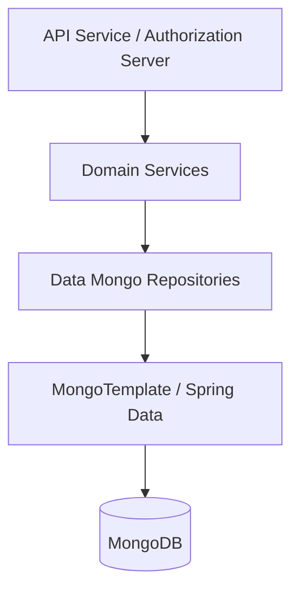
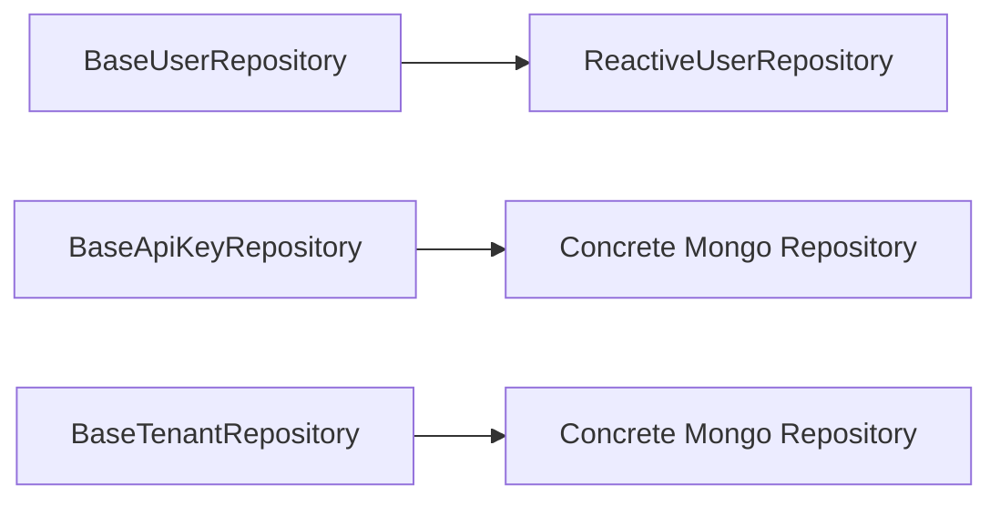
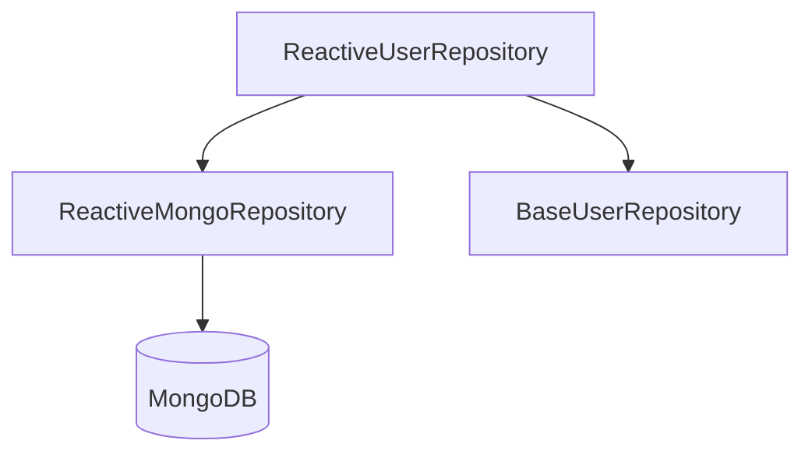
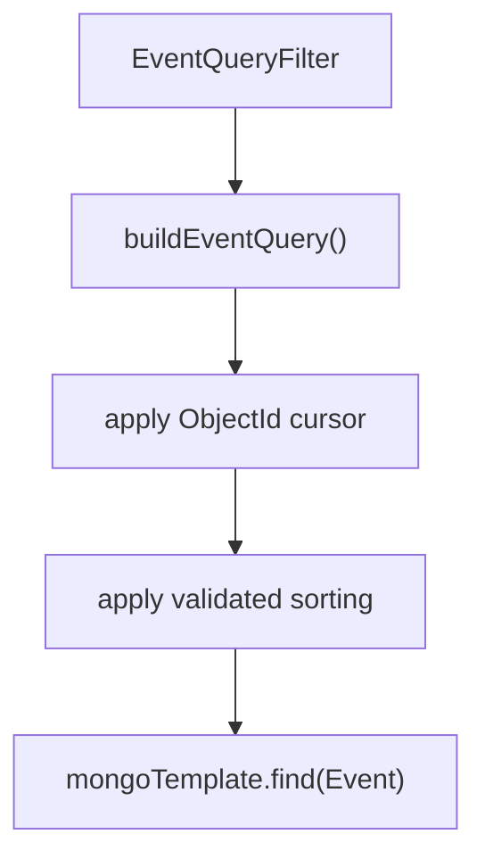
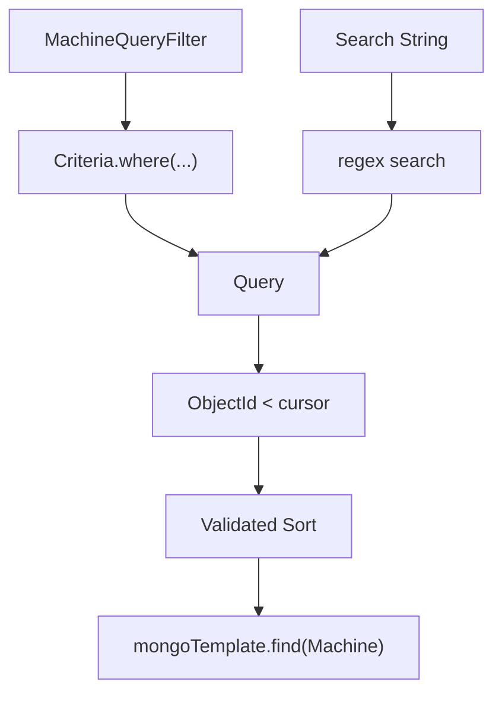
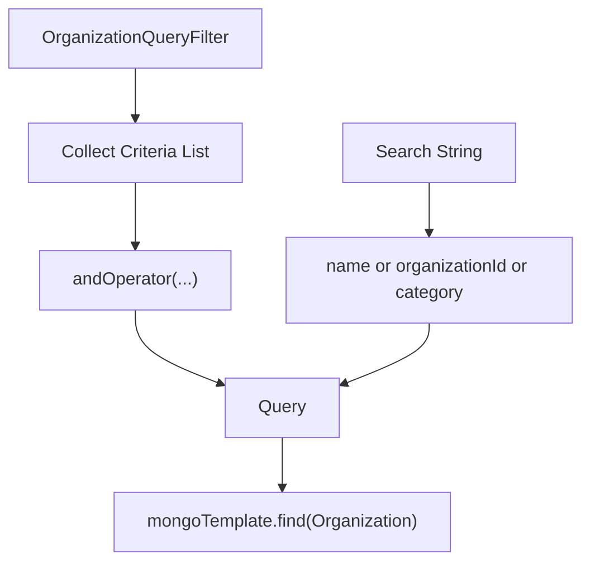
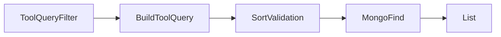
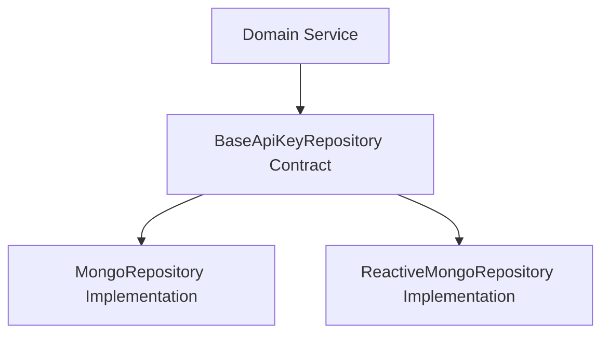
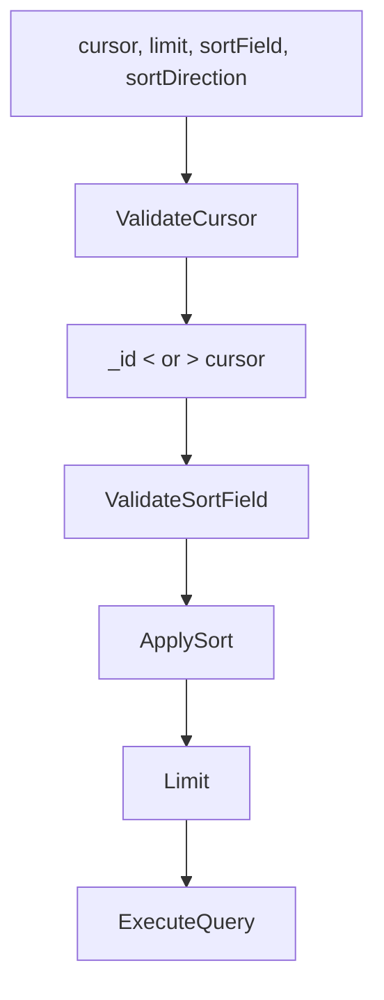

# Data Mongo Repositories

The **Data Mongo Repositories** module provides the MongoDB persistence layer for OpenFrame services. It implements both blocking and reactive repository patterns on top of Spring Data MongoDB and `MongoTemplate`, offering:

- Standard CRUD repositories
- Technology-agnostic base repository contracts
- Advanced filtering and cursor-based pagination
- Distinct value extraction and aggregation-like queries

This module sits on top of the document models defined in the Data Mongo Core and Documents module and is consumed by API services, Authorization Server components, and domain services.

---

## 1. Architectural Context

The Data Mongo Repositories module acts as the bridge between domain services and MongoDB collections.

### Key Characteristics

- ✅ Spring Data `MongoRepository` and `ReactiveMongoRepository`
- ✅ Custom repositories using `MongoTemplate`
- ✅ Cursor-based pagination using `_id` (ObjectId)
- ✅ Explicit control over sorting and allowed sortable fields
- ✅ Technology-agnostic base repository interfaces

---

## 2. Repository Patterns Used

### 2.1 Standard Spring Data Repositories

Used for simple CRUD and indexed lookups.

Examples:

- `OAuthTokenRepository`
- `ExternalApplicationEventRepository`
- `ReactiveOAuthClientRepository`

These extend:

- `MongoRepository<T, ID>` (blocking)
- `ReactiveMongoRepository<T, ID>` (reactive)

---

### 2.2 Technology-Agnostic Base Repositories

To support both blocking and reactive stacks, base interfaces define generic contracts.

Examples:

- `BaseUserRepository<T, B, ID>`
- `BaseApiKeyRepository<T, B, L, ID>`
- `BaseTenantRepository<T, B, ID>`
- `BaseIntegratedToolRepository<T, B, ID>`

This design ensures:

- Consistent domain-level contracts
- Easy swap between reactive and blocking implementations
- Reduced duplication across stacks

---

### 2.3 Custom Repository Implementations with MongoTemplate

For advanced filtering, search, sorting, and cursor pagination, custom implementations use `MongoTemplate`.

Examples:

- `CustomMachineRepositoryImpl`
- `CustomEventRepositoryImpl`
- `CustomOrganizationRepositoryImpl`
- `CustomIntegratedToolRepositoryImpl`

These repositories:

- Build dynamic `Query` objects
- Compose `Criteria` trees
- Apply search via regex
- Enforce allowed sortable fields
- Implement cursor-based pagination

---

## 3. Reactive Repositories

### 3.1 Reactive OAuth Client Repository

**Component:** `ReactiveOAuthClientRepository`

- Extends `ReactiveMongoRepository<OAuthClient, String>`
- Provides `findByClientId(String clientId)`
- Returns `Mono<OAuthClient>`

Used in reactive security and OAuth flows where non-blocking I/O is required.

---

### 3.2 Reactive User Repository

**Component:** `ReactiveUserRepository`

- Extends `ReactiveMongoRepository<User, String>`
- Implements `BaseUserRepository<Mono<User>, Mono<Boolean>, String>`
- Supports:
  - `findByEmail`
  - `existsByEmail`
  - `existsByEmailAndStatus`

This repository is conditionally enabled for reactive web applications.

---

## 4. OAuth and Token Persistence

### 4.1 OAuth Token Repository

**Component:** `OAuthTokenRepository`

- Extends `MongoRepository<OAuthToken, String>`
- Lookup by:
  - `findByAccessToken`
  - `findByRefreshToken`

Used by:

- Authorization Server flows
- Token validation and refresh logic

---

### 4.2 Reactive OAuth Client Repository

Supports client lookup by `clientId` for dynamic or reactive OAuth configurations.

---

## 5. Event Repositories

### 5.1 External Application Event Repository

**Component:** `ExternalApplicationEventRepository`

- Blocking `MongoRepository`
- Query methods:
  - `findByUserIdAndTimestampBetween`
  - `findByTypeAndTags` (custom `@Query`)

Supports audit and integration-related event retrieval.

---

### 5.2 Custom Event Repository

**Component:** `CustomEventRepositoryImpl`

Provides:

- Dynamic filtering via `EventQueryFilter`
- Date range filtering with UTC normalization
- Regex-based search
- Cursor-based pagination
- Distinct user ID and event type extraction

### Cursor Pagination Strategy

- Uses `_id` (ObjectId) as a cursor
- Applies `lt` or `gt` depending on sort direction
- Enforces secondary sort by `_id`
- Limits results via `query.limit(limit)`

---

## 6. Machine (Device) Repository

### 6.1 Custom Machine Repository

**Component:** `CustomMachineRepositoryImpl`

Responsibilities:

- Build device queries from `MachineQueryFilter`
- Apply multi-field search (hostname, IP, serial number, etc.)
- Support cursor-based pagination
- Enforce allowed sortable fields

### Sorting Safety

Each custom repository defines:

- `SORTABLE_FIELDS`
- `DEFAULT_SORT_FIELD`
- `isSortableField(String field)`

This prevents:

- Injection of arbitrary field names
- Accidental inefficient sorting

---

## 7. Organization Repository

### 7.1 Custom Organization Repository

**Component:** `CustomOrganizationRepositoryImpl`

Advanced capabilities:

- Soft-delete exclusion by default
- Category filtering (case-insensitive)
- Employee count range filtering
- Active contract evaluation using `LocalDate`
- Combined `$and` criteria composition
- Cursor pagination

This repository ensures database-level filtering for performance and avoids in-memory post-processing.

---

## 8. Integrated Tool Repository

### 8.1 Base Integrated Tool Repository

Defines generic contract:

- `findByType(String type)`

---

### 8.2 Custom Integrated Tool Repository

**Component:** `CustomIntegratedToolRepositoryImpl`

Supports:

- Filtering by enabled, type, category, platformCategory
- Regex search (name, description)
- Sorted queries with validation
- Distinct value extraction:
  - `findDistinctTypes()`
  - `findDistinctCategories()`
  - `findDistinctPlatformCategories()`

---

## 9. Tenant and API Key Base Contracts

### 9.1 Base Tenant Repository

Defines:

- `findByDomain`
- `existsByDomain`

Supports both:

- Blocking (`Optional`, `boolean`)
- Reactive (`Mono<T>`, `Mono<Boolean>`)

---

### 9.2 Base API Key Repository

Defines common operations:

- `findByIdAndUserId`
- `findByUserId`
- `findExpiredKeys`

Generic parameters allow reuse for:

- Blocking (`Optional`, `List`)
- Reactive (`Mono`, `Flux`)

---

## 10. Cursor-Based Pagination Strategy (Standardized Pattern)

Several repositories implement a consistent cursor model:

1. Validate cursor string as `ObjectId`
2. Apply `_id` comparison (`lt` or `gt`)
3. Apply primary sort field
4. Apply secondary `_id` sort
5. Apply `limit`

### Benefits

- Stable ordering
- Efficient pagination without `skip`
- Works naturally with MongoDB ObjectId ordering
- Prevents performance degradation on large collections

---

## 11. How This Module Fits the Platform

The Data Mongo Repositories module is a foundational persistence layer used by:

- API services
- Authorization Server
- Domain services
- Event processing components

It ensures:

- Consistent filtering logic across services
- Safe sorting and pagination
- Separation of domain contracts from persistence details
- Support for both reactive and blocking stacks

In the OpenFrame architecture, this module is the MongoDB abstraction layer that enables higher-level modules to remain persistence-agnostic while leveraging advanced MongoDB capabilities.

---

## 12. Design Principles Summary

- ✅ Clear separation of contract and implementation
- ✅ Reactive + blocking support
- ✅ Database-level filtering (not in-memory)
- ✅ Cursor-based pagination over offset pagination
- ✅ Controlled and validated sorting
- ✅ Reusable base interfaces across services

The **Data Mongo Repositories** module provides a robust, scalable, and extensible MongoDB persistence strategy tailored for multi-tenant, security-sensitive, and event-driven workloads in the OpenFrame platform.
