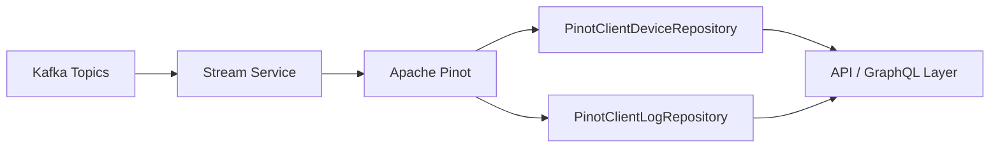
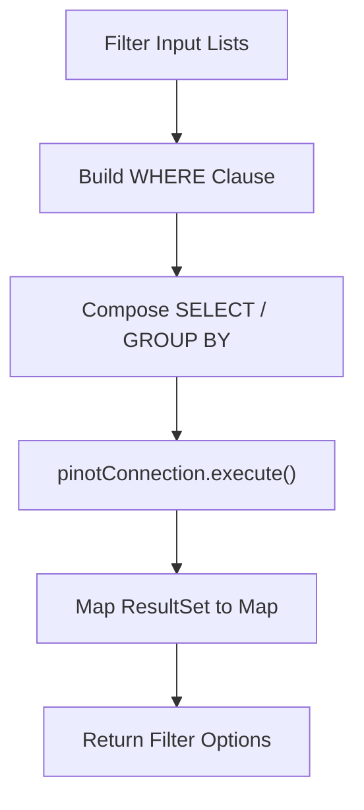
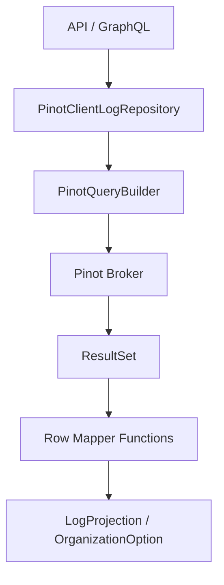
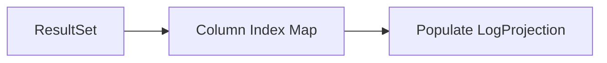
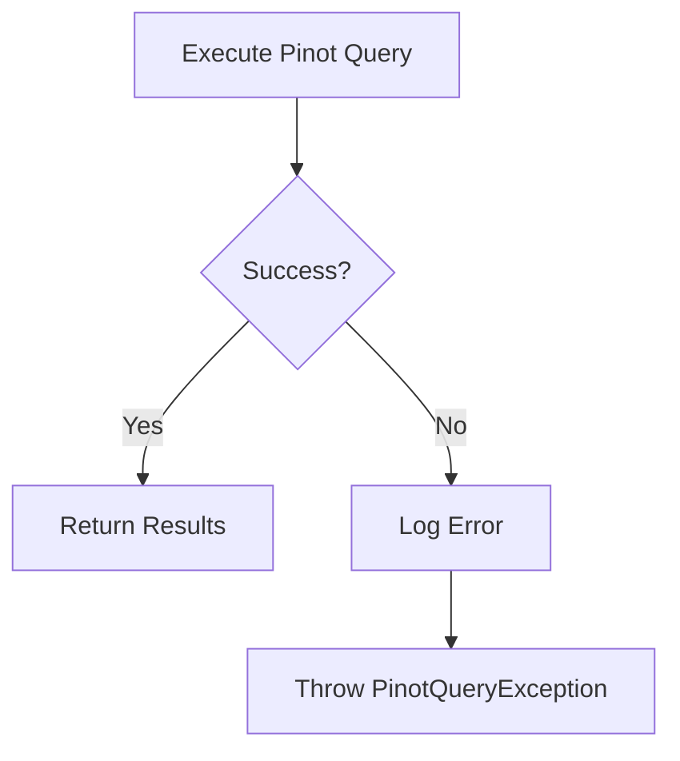
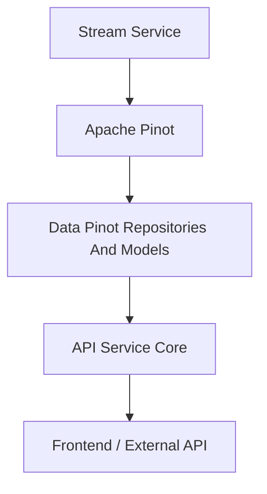

# Data Pinot Repositories And Models

## Overview

The **Data Pinot Repositories And Models** module provides the analytical data access layer for Apache Pinot within the OpenFrame platform. It is responsible for querying high-volume, time-series, and event-driven datasets such as:

- Device aggregations and filter counts  
- Log search and analytics  
- Organization and severity breakdowns  
- Time-range constrained event queries  

Unlike MongoDB repositories (which handle transactional and document-based storage), this module focuses on **low-latency analytical queries** optimized for filtering, aggregation, and search over large datasets indexed in Pinot.

This module contains:

- `PinotEventEntity` – base model placeholder for Pinot event representations  
- `PinotClientDeviceRepository` – device aggregation and filter repository  
- `PinotClientLogRepository` – log search and analytical repository  

---

## Architectural Context

Apache Pinot is used as the **real-time OLAP engine** in the OpenFrame data platform. Events are ingested via Kafka, enriched by stream processors, and stored in Pinot tables optimized for fast filtering and aggregation.



### Responsibilities in the Stack

| Layer | Responsibility |
|--------|---------------|
| Kafka | Event ingestion |
| Stream Service | Event normalization & enrichment |
| Apache Pinot | Analytical storage & indexing |
| Data Pinot Repositories And Models | Query construction & execution |
| API / GraphQL | External data exposure |

---

# Core Components

## 1. PinotEventEntity

**Package:** `com.openframe.data.model.pinot`

`PinotEventEntity` is a model placeholder representing a Pinot-backed event entity. While currently empty, it establishes a domain anchor for Pinot-based event representations.

### Purpose

- Provides structural consistency with other data modules  
- Serves as a future extension point for strongly-typed Pinot models  
- Maintains symmetry with Mongo document models

---

## 2. PinotClientDeviceRepository

**Package:** `com.openframe.data.repository.pinot`

`PinotClientDeviceRepository` provides **aggregation and filtering queries** over the `devices` Pinot table.

It is optimized for:

- Faceted filtering  
- Filter option generation with counts  
- Fast device counting  

### Injection & Configuration

```text
@Bean qualifier: "pinotBrokerConnection"
Property: pinot.tables.devices.name (default: "devices")
```

### Key Capabilities

- Dynamic WHERE clause construction  
- Exclusion-aware filter option generation  
- Aggregation queries with `GROUP BY`  
- Logical filtering with AND / OR composition  
- Automatic exclusion of `DELETED` device status

---

### Query Construction Flow



---

### Filter Option Pattern

Each filter method follows a consistent structure:

```text
SELECT field, COUNT(*) as count
FROM "devices"
WHERE <dynamic conditions>
GROUP BY field
ORDER BY count DESC
```

Supported filter dimensions:

- Status  
- Device Type  
- OS Type  
- Organization ID  
- Tags  

### Exclusion Logic

When generating filter options for a specific field (e.g., `status`), the repository:

- Applies all other filters  
- Excludes the target field from the WHERE clause  

This enables **faceted search behavior** where selecting one filter dynamically updates other filter counts.

---

### Device Count Query

```text
SELECT COUNT(*)
FROM "devices"
WHERE <dynamic conditions>
```

This method ensures:

- Deleted devices are excluded  
- Only valid filter values are included  

---

## 3. PinotClientLogRepository

**Package:** `com.openframe.data.repository.pinot`

`PinotClientLogRepository` is the primary analytical repository for **log search and event querying**.

It supports:

- Time-range filtering  
- Cursor-based pagination  
- Full-text relevance search  
- Multi-field sorting  
- Filter option extraction  
- Organization selection queries  

---

## Log Query Architecture



---

## Core Features

### 1. Dynamic Query Builder Integration

Uses `PinotQueryBuilder` for:

- `whereDateRange()`  
- `whereIn()`  
- `whereEquals()`  
- `whereCursor()`  
- `whereRelevanceLogSearch()`  
- `orderBySortInput()`  

This ensures:

- Clean query composition  
- Centralized query logic  
- Reduced SQL string duplication  

---

### 2. Cursor-Based Pagination

Cursor filtering ensures stable pagination using:

- Primary key field: `toolEventId`  
- Default sort field: `eventTimestamp`  

This guarantees deterministic ordering.

---

### 3. Sort Validation

Sortable columns are whitelisted:

```text
- eventTimestamp
- severity
- eventType
- toolType
- organizationId
- deviceId
- ingestDay
```

Invalid sort fields are rejected.

---

### 4. Log Projection Mapping

Rows are mapped dynamically using a column index map.



Each row maps to:

- toolEventId  
- ingestDay  
- toolType  
- eventType  
- severity  
- userId  
- deviceId  
- hostname  
- organizationId  
- organizationName  
- summary  
- eventTimestamp (converted to Instant)

---

### 5. Organization Option Query

Distinct query returning:

- organizationId  
- organizationName  

Null or empty IDs are excluded.

---

## Error Handling Strategy

Both repositories:

- Log executed queries (debug level)  
- Catch unexpected exceptions  
- Wrap failures in `PinotQueryException`  
- Provide contextual error logging



---

# Design Principles

## 1. Analytical Optimization

- Designed for OLAP workloads  
- Heavy use of `GROUP BY` and `DISTINCT`  
- Time-range constrained queries  
- Efficient count aggregations  

## 2. Dynamic Filtering

- Null-safe list filtering  
- Logical grouping via parentheses  
- Exclusion-based faceted filtering  

## 3. Separation of Concerns

- Query building delegated to `PinotQueryBuilder`  
- Mapping separated via functional row mappers  
- Repositories remain focused on domain intent  

## 4. Strong Safety Controls

- Whitelisted sortable columns  
- Default sort fallback  
- Controlled query assembly  

---

# How This Module Fits Into OpenFrame



### Used By

- API Service Core  
- External API Service  
- GraphQL Data Fetchers  
- Analytics dashboards  

---

# Summary

The **Data Pinot Repositories And Models** module is the analytical backbone of OpenFrame’s real-time querying capabilities.

It provides:

- High-performance log search  
- Faceted device filtering  
- Aggregated filter counts  
- Time-bound event querying  
- Cursor-based pagination  

By leveraging Apache Pinot and structured query construction patterns, this module enables scalable, low-latency analytics across tenant environments while maintaining clean repository abstractions and strong query safety controls.
