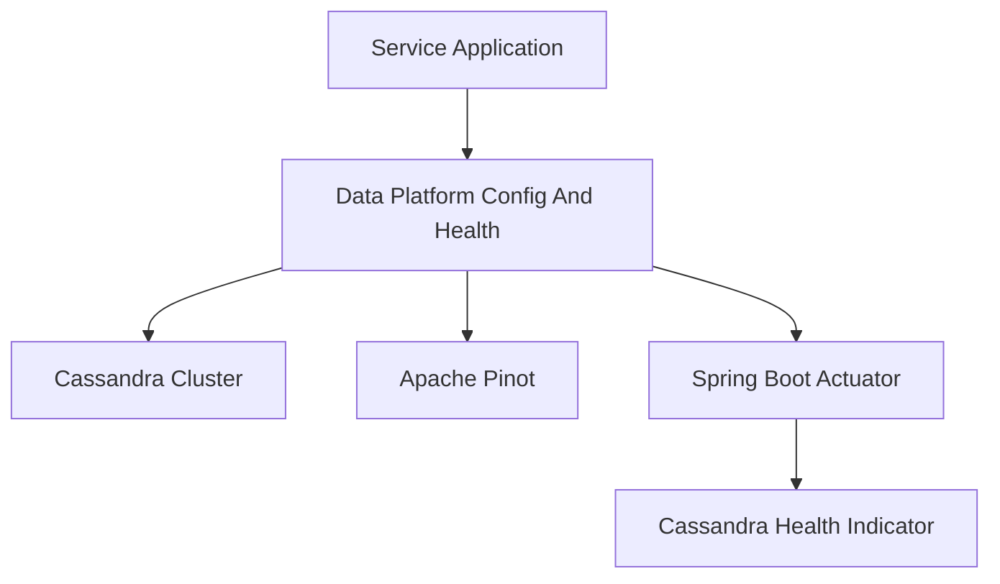
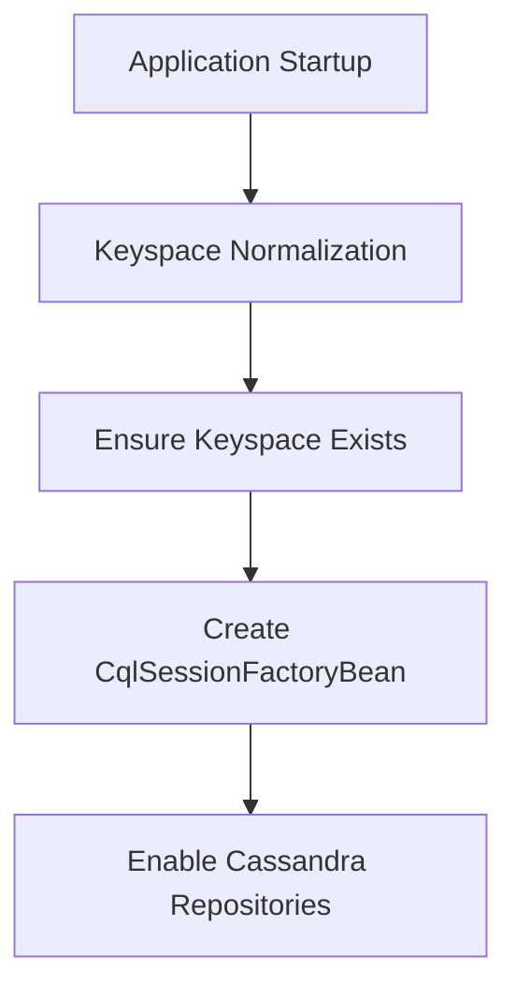
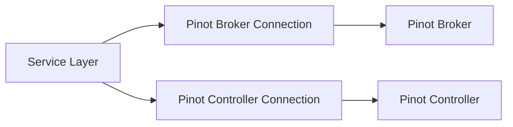
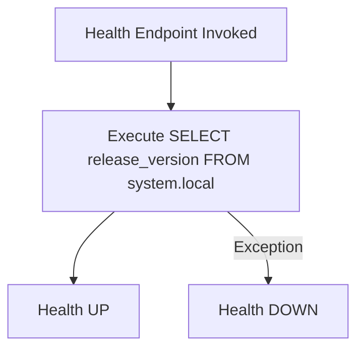

# Data Platform Config And Health

## Overview

The **Data Platform Config And Health** module is responsible for configuring and validating connectivity to the core data infrastructure components used across the OpenFrame platform. It provides:

- Cassandra configuration and keyspace lifecycle management
- Apache Pinot connectivity configuration
- Centralized runtime configuration logging
- Health checks for Cassandra via Spring Boot Actuator

This module acts as the foundational data infrastructure layer for services such as the API Service, Stream Service, and External API Service. It ensures that required data stores are correctly initialized and observable at runtime.

---

## Architectural Context

The Data Platform Config And Health module sits between service applications and underlying data systems.



### Responsibilities in the Platform

- Ensures Cassandra keyspaces exist before application logic runs
- Normalizes tenant-based keyspace names
- Registers Cassandra repositories conditionally
- Establishes Pinot broker and controller connections
- Exposes operational health status
- Logs effective runtime configuration for observability

---

## Component Breakdown

### 1. Cassandra Configuration

**Core Components:**
- `CassandraConfig`
- `CassandraKeyspaceNormalizer`
- `DataConfiguration.CassandraConfiguration`

#### CassandraConfig

Extends `AbstractCassandraConfiguration` and provides:

- Dynamic keyspace name resolution
- Datacenter-aware session configuration
- Contact point and port configuration
- Automatic keyspace creation
- Custom `CqlSessionFactoryBean` configuration

Key behavior:



##### Keyspace Creation Logic

Before the Cassandra session connects to a specific keyspace, the module:

1. Connects to Cassandra using contact points
2. Executes:

```text
CREATE KEYSPACE IF NOT EXISTS <keyspace>
WITH replication = {'class': 'SimpleStrategy', 'replication_factor': <n>}
```

3. Logs success or throws a runtime exception on failure

This guarantees that the application does not fail due to missing keyspaces during deployment.

---

#### CassandraKeyspaceNormalizer

Cassandra keyspaces cannot contain dashes. However, tenant identifiers often do.

This initializer:

- Reads `spring.data.cassandra.keyspace-name`
- Replaces `-` with `_`
- Injects the normalized value into the Spring Environment

Example:

```text
Tenant ID: tenant-prod-eu
Normalized Keyspace: tenant_prod_eu
```

It uses `ApplicationContextInitializer` to ensure it runs after external configuration sources (such as Spring Cloud Config) are loaded.

---

#### DataConfiguration.CassandraConfiguration

Provides conditional repository activation:

- Enabled only when `spring.data.cassandra.enabled=true`
- Registers repositories under `com.openframe.data.repository.cassandra`

This ensures modular activation of Cassandra support depending on service requirements.

---

### 2. Apache Pinot Configuration

**Core Component:**
- `PinotConfig`

Provides two connection beans:

- Broker connection (`pinotBrokerConnection`)
- Controller connection (`pinotControllerConnection`)



Configuration properties:

- `pinot.broker.url`
- `pinot.controller.url`

These connections are used by analytics repositories and reporting layers that query event and device data stored in Pinot.

---

### 3. Runtime Configuration Logging

**Core Component:**
- `ConfigurationLogger`

Triggered on `ApplicationReadyEvent`, this component logs effective runtime configuration values:

- MongoDB URI
- Cassandra contact points
- Redis host
- Pinot controller URL
- Pinot broker URL

Purpose:

- Improve observability
- Simplify troubleshooting in multi-environment deployments
- Confirm correct configuration loading at runtime

This is particularly valuable in containerized and multi-tenant environments.

---

### 4. Cassandra Health Monitoring

**Core Component:**
- `CassandraHealthIndicator`

Implements Spring Boot’s `HealthIndicator` interface.

Health check logic:



- Performs a lightweight system query
- Returns `Health.up()` if successful
- Returns `Health.down()` with exception details if the query fails

This integrates with Spring Boot Actuator endpoints, allowing:

- Kubernetes readiness/liveness probes
- Monitoring system integration
- Automated failover detection

---

## Conditional Activation Model

Several components are guarded by:

```text
spring.data.cassandra.enabled=true
```

This ensures:

- Services not using Cassandra do not initialize related beans
- Startup time and resource usage are optimized
- Configuration remains modular across service types

---

## Configuration Properties Summary

| Property | Purpose |
|-----------|----------|
| spring.data.cassandra.enabled | Enables Cassandra configuration |
| spring.data.cassandra.keyspace-name | Target keyspace |
| spring.data.cassandra.local-datacenter | Datacenter for load balancing |
| spring.data.cassandra.contact-points | Cassandra host(s) |
| spring.data.cassandra.port | Cassandra port |
| spring.data.cassandra.replication-factor | Keyspace replication factor |
| pinot.broker.url | Pinot broker endpoint |
| pinot.controller.url | Pinot controller endpoint |

---

## How This Module Fits Into the System

The Data Platform Config And Health module is a shared infrastructure module consumed by:

- API Service
- Stream Service
- External API Service
- Management and Analytics services

It does **not** implement business logic. Instead, it provides:

- Infrastructure wiring
- Data store initialization
- Observability primitives
- Health verification

By isolating data configuration and health concerns into a dedicated module, the platform achieves:

- Clear separation of concerns
- Reusable infrastructure across services
- Consistent configuration behavior
- Centralized operational visibility

---

## Design Principles

1. **Fail Fast on Infrastructure Errors** – Keyspaces are validated during startup.
2. **Tenant Safety** – Keyspace normalization ensures valid Cassandra identifiers.
3. **Conditional Modularity** – Cassandra support is optional.
4. **Operational Transparency** – Runtime configuration is logged explicitly.
5. **Cloud-Native Health Reporting** – Cassandra is Actuator-integrated.

---

## Conclusion

The **Data Platform Config And Health** module forms the backbone of the OpenFrame data infrastructure layer. It ensures that Cassandra and Pinot are correctly configured, initialized, and observable, while providing production-grade health monitoring and tenant-safe keyspace handling.

It is a foundational infrastructure module enabling reliable, scalable, and observable data operations across the entire OpenFrame platform.