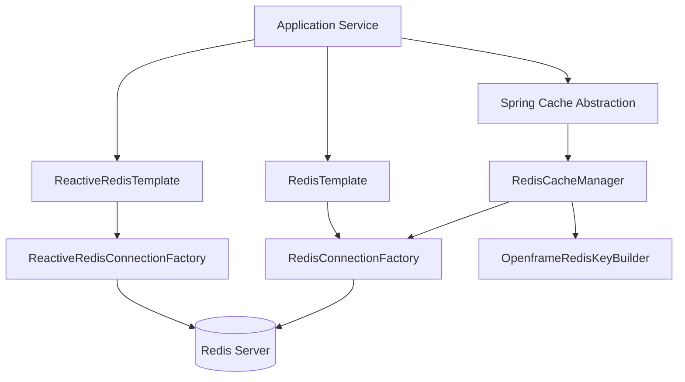
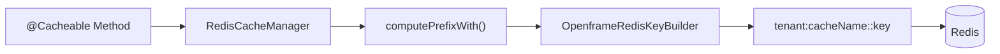
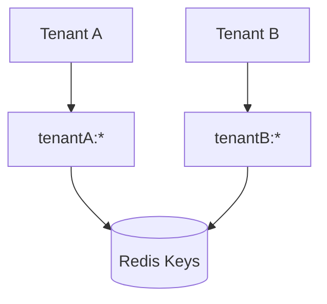

# Data Redis Core

## Overview

The **Data Redis Core** module provides the foundational Redis integration layer for the OpenFrame platform. It standardizes:

- Redis connection and template configuration (blocking and reactive)
- Spring Cache integration backed by Redis
- Tenant-aware cache key generation
- Centralized Redis key prefixing strategy

This module is designed as an infrastructure library and is consumed by higher-level services such as API, Authorization, Gateway, Stream, and Management services. It ensures consistent Redis behavior across all services in a multi-tenant environment.

---

## Responsibilities

The Data Redis Core module is responsible for:

1. Enabling and configuring Redis connectivity
2. Providing `RedisTemplate` and reactive Redis templates
3. Configuring Spring Cache to use Redis
4. Enforcing tenant-aware cache key prefixes
5. Exposing a configurable key builder abstraction

It does **not** contain business logic. Instead, it acts as a reusable infrastructure component.

---

## High-Level Architecture



### Key Concepts

- **Spring Cache Abstraction** is backed by `RedisCacheManager`.
- **RedisTemplate / ReactiveRedisTemplate** provide low-level access.
- **OpenframeRedisKeyBuilder** ensures all keys are tenant-aware.
- Redis usage is conditionally enabled via configuration properties.

---

## Module Components

The Data Redis Core module consists of three primary configuration classes:

1. **RedisConfig** – Core Redis beans and templates
2. **CacheConfig** – Spring Cache integration
3. **OpenframeRedisKeyConfiguration** – Key builder configuration

---

# RedisConfig

**Component:**  
`deps.openframe-oss-lib.openframe-data-redis.src.main.java.com.openframe.data.config.RedisConfig.RedisConfig`

## Purpose

`RedisConfig` defines the primary Redis beans used across the platform. It enables Redis repositories and provides both blocking and reactive Redis templates.

## Activation

The configuration is conditionally enabled using:

```text
spring.redis.enabled=true
```

If this property is not set to `true`, the entire Redis configuration remains inactive.

## Provided Beans

### 1. RedisTemplate<String, String>

- Uses `StringRedisSerializer` for keys and values
- Designed for simple key-value operations
- Compatible with traditional blocking Spring applications

### 2. ReactiveStringRedisTemplate

- Uses `ReactiveRedisConnectionFactory`
- Optimized for reactive applications
- Ideal for WebFlux-based services

### 3. ReactiveRedisTemplate<String, String>

- Fully customized serialization context
- Explicit string serialization for:
  - Keys
  - Values
  - Hash keys
  - Hash values

This ensures predictable storage and interoperability across services.

## Redis Repository Support

```java
@EnableRedisRepositories(basePackages = "com.openframe.data.repository.redis")
```

This enables Spring Data Redis repositories for modules that define Redis-backed repositories.

---

# CacheConfig

**Component:**  
`deps.openframe-oss-lib.openframe-data-redis.src.main.java.com.openframe.data.config.CacheConfig.CacheConfig`

## Purpose

`CacheConfig` integrates Redis with Spring’s caching abstraction.

It configures a `CacheManager` backed by Redis and ensures consistent TTL, serialization, and tenant-aware key prefixes.

## Default Cache Configuration

```text
TTL: 6 hours
Null values: Not cached
Key serializer: StringRedisSerializer
Value serializer: GenericJackson2JsonRedisSerializer
```

### Why GenericJackson2JsonRedisSerializer?

- Stores values as JSON
- Supports polymorphic object types
- Enables flexible caching of DTOs and domain objects

---

## Tenant-Aware Cache Prefixing

One of the most critical responsibilities of Data Redis Core is enforcing tenant isolation.

Cache keys are automatically prefixed using the `OpenframeRedisKeyBuilder`.

```text
<prefix>:<cacheName>::<key>
```

Example structure:

```text
tenantA:userCache::user-123
```

This ensures:

- Multi-tenant safety
- Zero key collisions across tenants
- Logical grouping of cache entries

### Cache Prefix Flow



---

# OpenframeRedisKeyConfiguration

**Component:**  
`deps.openframe-oss-lib.openframe-data-redis.src.main.java.com.openframe.data.redis.OpenframeRedisKeyConfiguration.OpenframeRedisKeyConfiguration`

## Purpose

This configuration exposes a centralized `OpenframeRedisKeyBuilder` bean.

It enables:

- Consistent key naming conventions
- Centralized prefix management
- Tenant-aware key construction
- Future extensibility for advanced namespacing strategies

## Configuration Properties

The builder is backed by:

```text
OpenframeRedisProperties
```

This allows administrators to customize:

- Global prefixes
- Environment-based namespacing
- Tenant resolution strategy

If a custom `OpenframeRedisKeyBuilder` bean is defined elsewhere, this configuration will not override it (`@ConditionalOnMissingBean`).

---

# Conditional Configuration Strategy

All major configuration classes are guarded by:

```text
@ConditionalOnProperty(name = "spring.redis.enabled", havingValue = "true")
```

This provides:

- Easy feature toggling
- Environment-specific activation
- Safer local development setups
- Clean fallback when Redis is not required

---

# Multi-Tenant Design Considerations

Data Redis Core is built with multi-tenancy as a first-class concern.

## Isolation Model



Although tenants share the same Redis instance, key-level isolation ensures logical separation.

## Benefits

- No additional Redis instances required per tenant
- Clear operational visibility
- Predictable cache eviction patterns
- Reduced infrastructure overhead

---

# Reactive vs Blocking Support

The module supports both programming models:

| Model        | Template Bean                     | Use Case |
|-------------|------------------------------------|----------|
| Blocking     | RedisTemplate                     | Traditional Spring MVC services |
| Reactive     | ReactiveRedisTemplate             | WebFlux services |
| Reactive     | ReactiveStringRedisTemplate       | Lightweight string operations |

This flexibility allows OpenFrame services to evolve without changing the Redis foundation.

---

# Serialization Strategy

## Keys

All keys use:

```text
StringRedisSerializer
```

This guarantees:

- Human-readable keys
- Cross-language compatibility
- Debuggability in Redis CLI

## Values (Cache Layer)

```text
GenericJackson2JsonRedisSerializer
```

This ensures:

- Structured JSON storage
- Compatibility across service boundaries
- Forward/backward compatibility during deployments

---

# How Other Modules Use Data Redis Core

Although this module does not contain business logic, it underpins several platform capabilities:

- API layer caching (DTO and query result caching)
- Authorization token and metadata caching
- Gateway rate limiting or session state
- Stream service temporary enrichment state
- Management service operational caching

All of these rely on the standardized configuration provided here.

---

# Extension Points

Developers can customize behavior by:

1. Providing a custom `CacheManager` bean
2. Overriding `OpenframeRedisKeyBuilder`
3. Defining custom TTL per cache
4. Adding Redis-backed repositories in their modules

Because all beans are marked with `@ConditionalOnMissingBean`, overrides are safe and intentional.

---

# Summary

The **Data Redis Core** module provides:

- Unified Redis configuration
- Reactive and blocking support
- Spring Cache integration
- Tenant-aware key prefixing
- Safe, conditional activation

It is a foundational infrastructure component that ensures consistency, isolation, and performance across the OpenFrame microservices architecture.

By centralizing Redis behavior in this module, the platform avoids duplication, enforces best practices, and maintains clean separation between infrastructure and business logic.