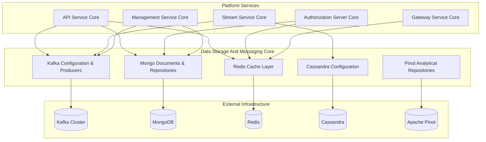
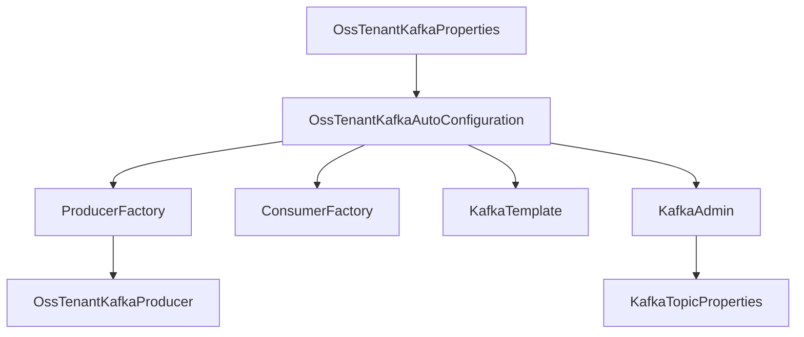
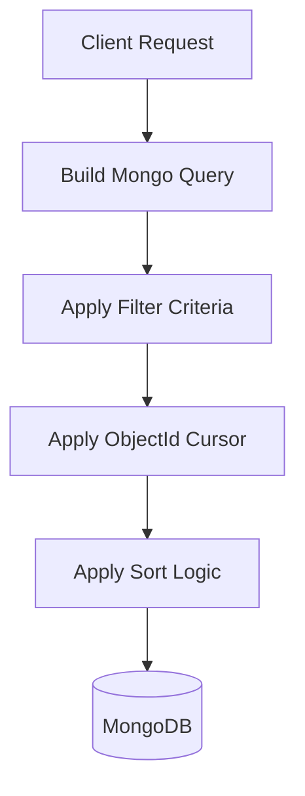
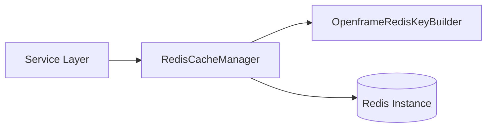
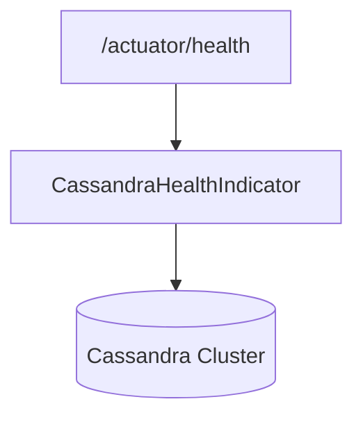
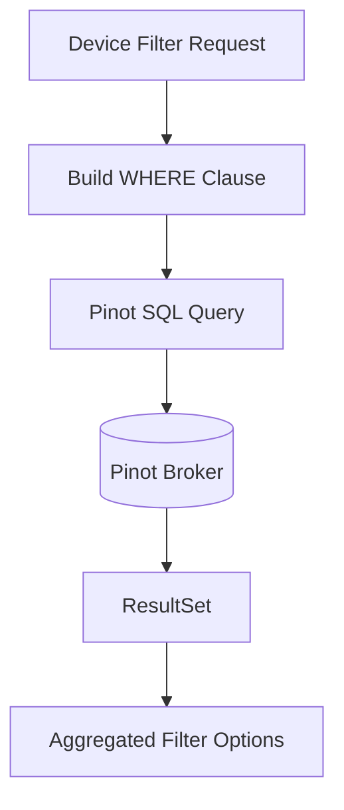
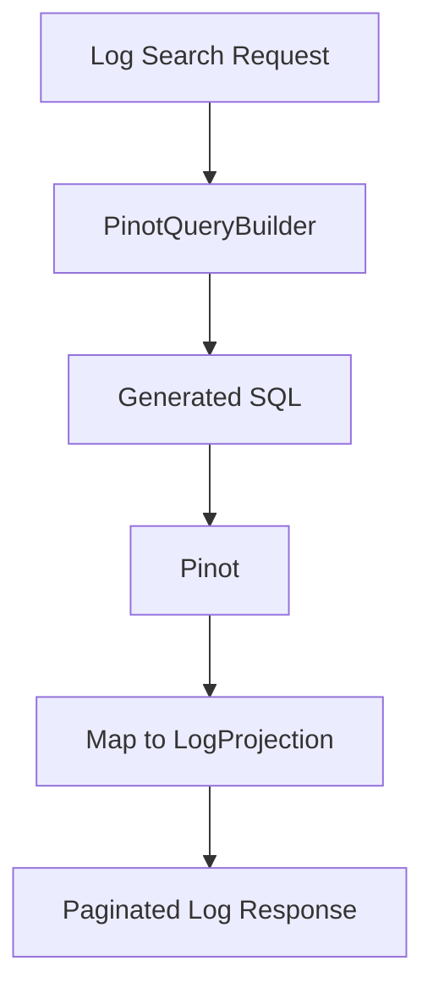
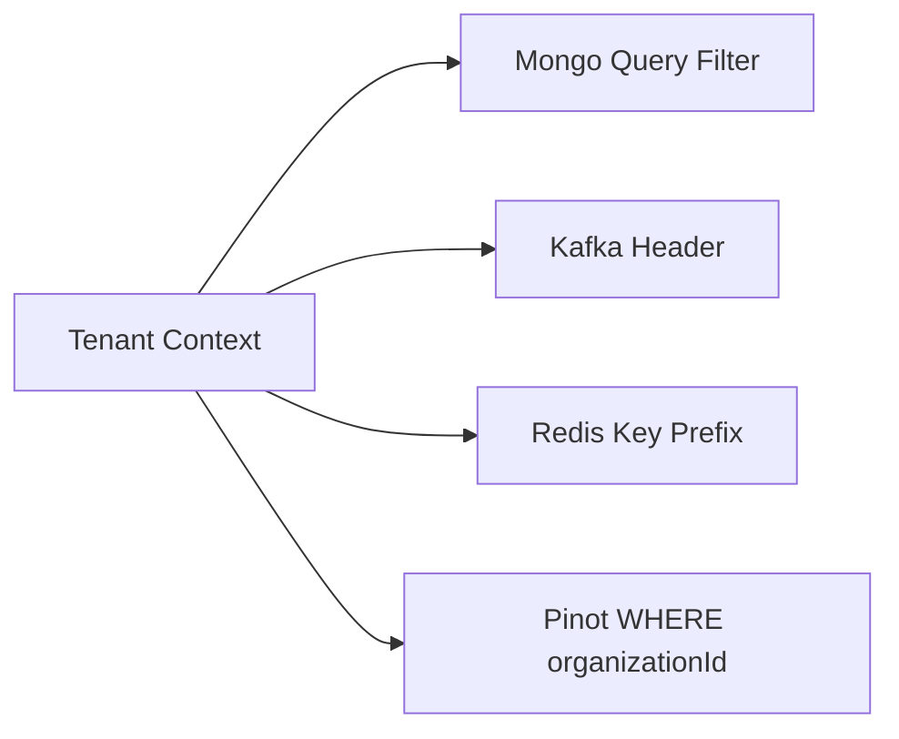

# Data Storage And Messaging Core

The **Data Storage And Messaging Core** module is the foundational infrastructure layer of the OpenFrame platform. It provides standardized configuration, models, repositories, and integration patterns for:

- Kafka-based messaging
- MongoDB operational data storage
- Redis caching
- Cassandra persistence
- Apache Pinot analytical queries

This module is consumed by higher-level services such as the API Service Core, Authorization Server Core, Stream Service Core, Management Service Core, and Gateway Service Core. It centralizes all data access and messaging primitives to ensure consistency, tenant isolation, and observability across the platform.

---

## Architectural Overview



The module is organized into multiple sub-layers, each responsible for a specific data technology.

---

## Sub-Modules

The Data Storage And Messaging Core module is logically divided into the following sub-modules:

1. **Kafka Messaging Layer**  
   Handles topic configuration, producers, consumer factories, headers, and Debezium integration.

2. **MongoDB Persistence Layer**  
   Defines domain documents, indexing strategies, and custom repositories for complex filtering and cursor-based pagination.

3. **Redis Caching Layer**  
   Provides tenant-aware caching and reactive Redis templates.

4. **Cassandra Integration Layer**  
   Enables Cassandra repositories and health monitoring.

5. **Pinot Analytical Repository Layer**  
   Implements high-performance analytical queries for devices and logs.

Each sub-module is documented in detail below.

---

# Kafka Messaging Layer

The Kafka Messaging Layer provides multi-tenant Kafka configuration, topic auto-registration, and standardized message models.

## Key Responsibilities

- Override default Spring Kafka auto-configuration
- Provide OSS tenant–scoped Kafka properties
- Configure producer and consumer factories
- Enable topic auto-creation
- Standardize message headers and payload models
- Support Debezium change events

## Core Components

- `KafkaTopicProperties`
- `OssKafkaConfig`
- `OssTenantKafkaAutoConfiguration`
- `OssTenantKafkaProperties`
- `KafkaHeader`
- `MachinePinotMessage`
- `DebeziumMessage`
- `KafkaRecoveryHandlerImpl`

## Kafka Auto-Configuration Flow



### Topic Management

`KafkaTopicProperties` enables dynamic inbound topic definitions using the configuration prefix:

```text
openframe.oss-tenant.kafka.topics.inbound.<key>.name
```

Topics can be auto-created with configurable partitions and replication factor.

### Debezium Integration

`DebeziumMessage<T>` models CDC (Change Data Capture) events with:

- `before`
- `after`
- `operation`
- `timestamp`
- source metadata (database, schema, table)

This allows Stream Service Core to process database changes in a standardized way.

### MachinePinotMessage

Represents machine/device changes published to Kafka when:

- Device changes
- MachineTag updates
- Tag assignments change

This enables near real-time synchronization with Apache Pinot for analytics.

---

# MongoDB Persistence Layer

The MongoDB layer defines the operational data model for the platform.

## Configuration

- `MongoConfig` – Enables blocking and reactive repositories
- `MongoIndexConfig` – Ensures performance indexes at startup

## Domain Documents

### Identity & Security

- `User`
- `AuthUser`
- `MongoRegisteredClient`
- `OAuthToken`
- `SSOPerTenantConfig`

### Organization & Tenancy

- `Organization`

### Devices & Tools

- `Device`
- `MachineTag`
- `Tag`
- `ToolAgentAsset`

### Events

- `CoreEvent`
- `Alert`

## Repository Patterns

Two repository models are used:

1. Spring Data repositories (standard CRUD)
2. Custom repository implementations using `MongoTemplate`

### Cursor-Based Pagination Pattern

Used in:

- `CustomMachineRepositoryImpl`
- `CustomEventRepositoryImpl`
- `CustomOrganizationRepositoryImpl`



This avoids offset-based pagination and ensures scalability.

### Soft Delete Strategy

`Organization` supports soft delete using:

- `deleted` flag
- `deletedAt` timestamp

Repositories automatically exclude deleted records.

---

# Redis Caching Layer

The Redis layer enables distributed caching with tenant-aware key prefixes.

## Core Components

- `RedisConfig`
- `CacheConfig`
- `OpenframeRedisKeyConfiguration`

## Key Characteristics

- Conditional activation via `spring.redis.enabled`
- Default TTL of 6 hours
- JSON value serialization
- Tenant-prefixed cache keys



The key prefix format ensures multi-tenant isolation:

```text
<prefix>:<cacheName>::<key>
```

---

# Cassandra Integration Layer

Provides optional Cassandra repository activation.

## Core Components

- `DataConfiguration.CassandraConfiguration`
- `CassandraHealthIndicator`

## Responsibilities

- Enable Cassandra repositories when `spring.data.cassandra.enabled=true`
- Provide health checks through Spring Actuator



This is primarily used by the Stream Service Core for high-volume event persistence.

---

# Pinot Analytical Repository Layer

Provides high-performance analytics queries using Apache Pinot.

## Core Components

- `PinotClientDeviceRepository`
- `PinotClientLogRepository`

## Responsibilities

- Dynamic SQL query building
- Filter option aggregation
- Cursor-based pagination for logs
- Distinct value queries
- Safe sort validation

## Device Analytics Flow



## Log Query Flow



Pinot is used for analytical workloads that would be inefficient in MongoDB, such as:

- Aggregated filter counts
- Large log datasets
- Time-range analytics

---

# Multi-Tenant Design Considerations

The Data Storage And Messaging Core module enforces tenant-aware design patterns across all storage technologies:

- Kafka topics scoped by configuration
- Mongo documents containing tenant or organization identifiers
- Redis cache keys prefixed per tenant
- Authorization users indexed by `(tenantId, email)`
- Analytical queries filtered by `organizationId`



This guarantees logical isolation even when infrastructure is shared.

---

# How Other Modules Use This Core

- **API Service Core** – Uses Mongo repositories, Redis caching, and Kafka producers.
- **Authorization Server Core** – Uses Mongo for OAuth clients, tokens, and tenant-based users.
- **Stream Service Core** – Consumes Kafka events and writes to Cassandra and Pinot.
- **Management Service Core** – Publishes configuration and integration events to Kafka.
- **Gateway Service Core** – Uses Redis for token and session optimization.

The Data Storage And Messaging Core acts as the backbone of data persistence and event-driven communication across OpenFrame.

---

# Summary

The **Data Storage And Messaging Core** module centralizes:

- Messaging infrastructure (Kafka)
- Operational persistence (MongoDB)
- Distributed caching (Redis)
- Event storage (Cassandra)
- Analytical querying (Pinot)

It ensures:

- Multi-tenant safety
- Consistent repository patterns
- High-performance analytics
- Scalable messaging
- Unified configuration strategy

This module is foundational to the reliability, scalability, and performance of the entire OpenFrame platform.