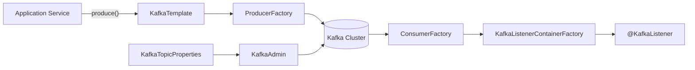
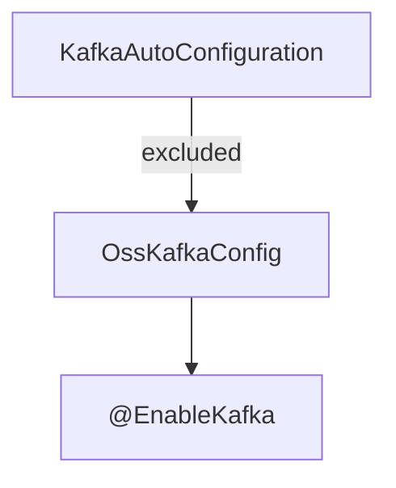
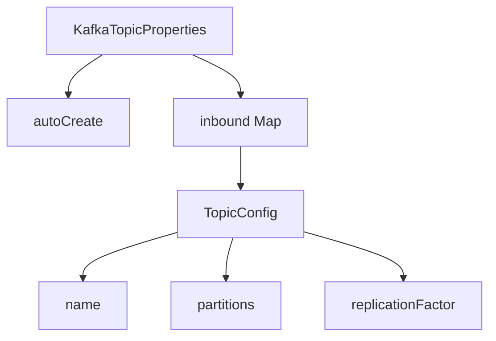
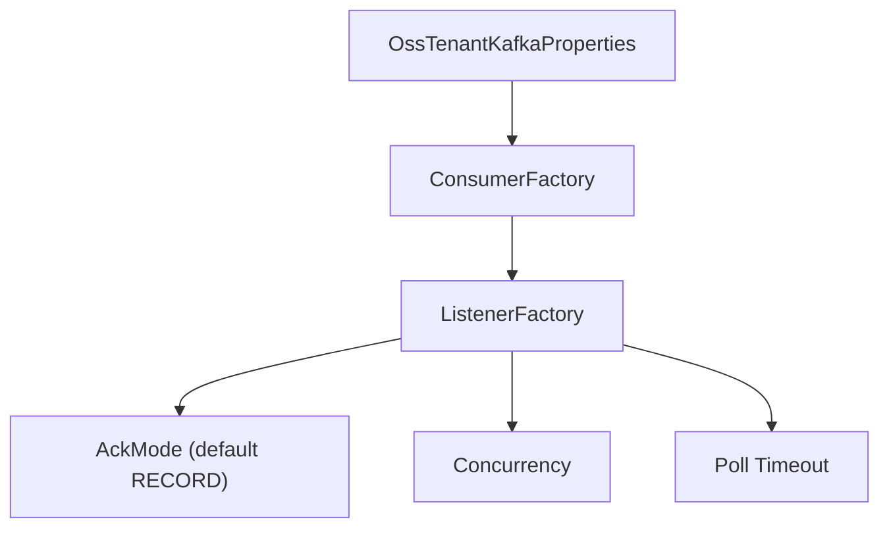
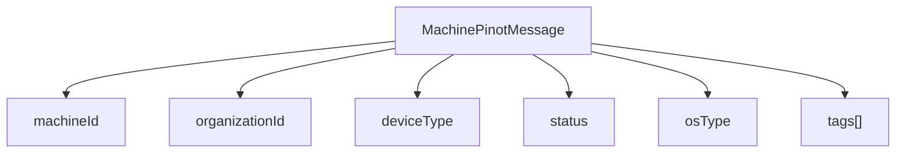
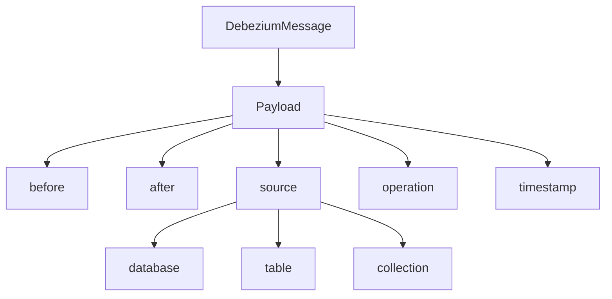
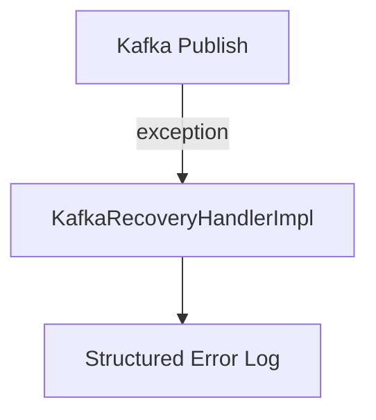
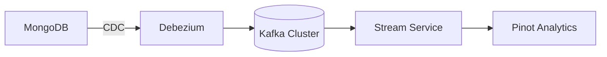

# Data Streaming Kafka Config And Models

## Overview

The **Data Streaming Kafka Config And Models** module provides the foundational Kafka infrastructure for the OpenFrame data platform. It defines:

- Centralized Kafka configuration for the OSS tenant cluster
- Topic provisioning and auto-creation
- Producer and consumer factories
- Shared message models for streaming and CDC (Change Data Capture)
- Retry and recovery handling for failed Kafka publishes

This module acts as the **Kafka backbone** for upstream services such as stream processing, CDC handlers, and enrichment pipelines.

It is consumed primarily by:

- [Stream Service Core Kafka Streams And Deserialization](../stream-service-core-kafka-streams-and-deserialization/stream-service-core-kafka-streams-and-deserialization.md)
- [Stream Service Core Message Handling And Enrichment](../stream-service-core-message-handling-and-enrichment/stream-service-core-message-handling-and-enrichment.md)

---

## Architectural Role in the Platform

At runtime, this module provides a fully configured Kafka stack for the OSS tenant cluster:



### Responsibilities

| Layer | Responsibility |
|--------|----------------|
| Configuration | Override default Spring Kafka auto-configuration and provide OSS-specific setup |
| Properties | Bind tenant-scoped Kafka properties |
| Topic Management | Auto-register and provision inbound topics |
| Messaging Models | Standardized message contracts (Pinot, Debezium) |
| Error Handling | Structured recovery logging for failed publish attempts |

---

# Configuration Components

## OssKafkaConfig

**Component:** `OssKafkaConfig`

This class enables Kafka support while explicitly excluding Spring Boot's default `KafkaAutoConfiguration`.

### Why This Matters

By excluding the default auto-configuration:

- The platform avoids accidental default cluster binding
- All Kafka beans are controlled via OSS tenant–scoped configuration
- Multi-cluster or tenant-specific extensions become possible



---

## OssTenantKafkaProperties

**Component:** `OssTenantKafkaProperties`

Configuration prefix:

```text
spring.oss-tenant
```

This wraps Spring's standard `KafkaProperties` and exposes:

- `enabled` flag (default: true)
- Producer settings
- Consumer settings
- Listener configuration
- Template configuration
- Bootstrap servers

This makes the OSS Kafka cluster a **first-class configurable unit**.

---

## KafkaTopicProperties

**Component:** `KafkaTopicProperties`

Configuration prefix:

```text
openframe.oss-tenant.kafka.topics
```

### Structure



Each inbound topic can specify:

- Topic name
- Partition count
- Replication factor

If `autoCreate` is enabled and Kafka Admin is active, topics are automatically registered during startup.

---

## OssTenantKafkaAutoConfiguration

**Component:** `OssTenantKafkaAutoConfiguration`

This is the core infrastructure configuration class. It is activated when:

```text
spring.oss-tenant.kafka.enabled=true
```

### Beans Created

| Bean | Purpose |
|------|----------|
| ProducerFactory | Builds producers with JSON serialization |
| KafkaTemplate | Main publishing abstraction |
| ConsumerFactory | Builds JSON-deserializing consumers |
| KafkaListenerContainerFactory | Configures listener concurrency and acknowledgment mode |
| KafkaAdmin | Admin client for topic management |
| NewTopics | Topic auto-registration |
| OssTenantKafkaProducer | Tenant-scoped producer abstraction |

### Listener Configuration Flow



Key default behavior:

- Uses `JsonSerializer` and `JsonDeserializer`
- Defaults to `RECORD` acknowledgment mode
- Applies concurrency and polling settings if defined

---

# Messaging Models

## MachinePinotMessage

**Component:** `MachinePinotMessage`

Represents device state changes intended for Pinot indexing and analytics.

### Trigger Sources

- Machine updates
- Tag changes
- Organization association changes

### Structure



This message is typically consumed by stream services and analytics processors.

---

## DebeziumMessage

**Component:** `DebeziumMessage<T>`

A generic wrapper for Debezium CDC events.

It models the canonical Debezium structure:



### Use Case

Used by stream handlers to:

- Detect CREATE / UPDATE / DELETE operations
- Compare `before` and `after` states
- Enrich and transform events into domain-specific messages

---

## KafkaHeader

Defines shared header constants.

```text
message-type
```

This enables:

- Event type discrimination
- Multi-model topic usage
- Downstream routing logic

---

# Recovery Handling

## KafkaRecoveryHandlerImpl

**Component:** `KafkaRecoveryHandlerImpl`

Provides structured logging when message publishing fails.

### Behavior

When a publish attempt fails:

- Captures topic
- Captures key
- Logs exception class
- Logs exception message
- Logs payload summary
- Attaches full stack trace



This ensures:

- Observability
- Debug traceability
- No silent message loss

Note: This implementation logs errors but does not automatically requeue to a dead-letter topic. Dead-letter routing can be layered on top in higher-level services.

---

# Integration with Stream Processing

This module provides infrastructure and models only. Actual processing logic is implemented in:

- [Stream Service Core Kafka Streams And Deserialization](../stream-service-core-kafka-streams-and-deserialization/stream-service-core-kafka-streams-and-deserialization.md)
- [Stream Service Core Message Handling And Enrichment](../stream-service-core-message-handling-and-enrichment/stream-service-core-message-handling-and-enrichment.md)

### End-to-End Flow



1. Data changes are captured via Debezium
2. Events are wrapped as `DebeziumMessage`
3. Messages are published to Kafka
4. Stream services consume and enrich
5. Processed events are indexed in Pinot

---

# Design Principles

### 1. Tenant-Scoped Kafka
All configuration is isolated under the `spring.oss-tenant` prefix to prevent accidental cross-cluster binding.

### 2. Explicit Over Implicit
Default Spring Kafka auto-configuration is disabled to maintain deterministic infrastructure behavior.

### 3. Configuration-Driven Topics
Topic creation is property-driven, reducing operational overhead.

### 4. Strongly-Typed Messages
Standardized models ensure compatibility across:

- Producers
- Stream processors
- Analytics services

---

# Summary

The **Data Streaming Kafka Config And Models** module is the foundational Kafka infrastructure layer of OpenFrame.

It provides:

- Fully customized Kafka auto-configuration
- Topic provisioning and admin support
- JSON-based producer and consumer setup
- CDC-compatible Debezium models
- Analytics-oriented machine event models
- Structured error recovery logging

This module enables the streaming ecosystem of OpenFrame to operate in a scalable, observable, and tenant-aware manner.