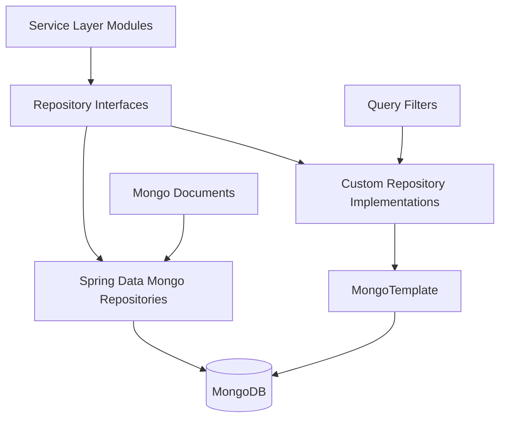
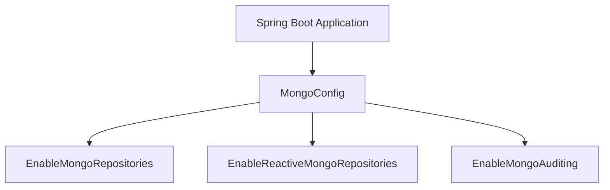
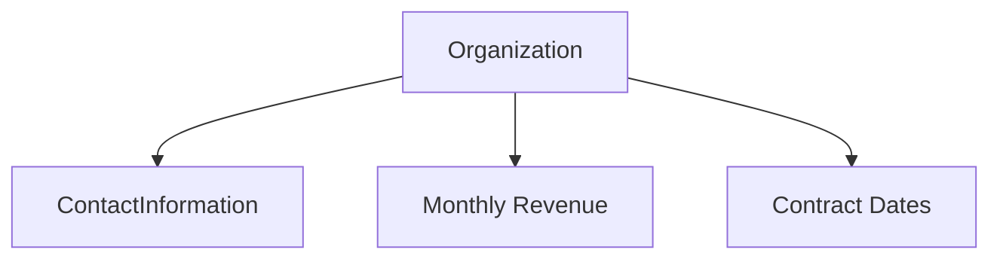
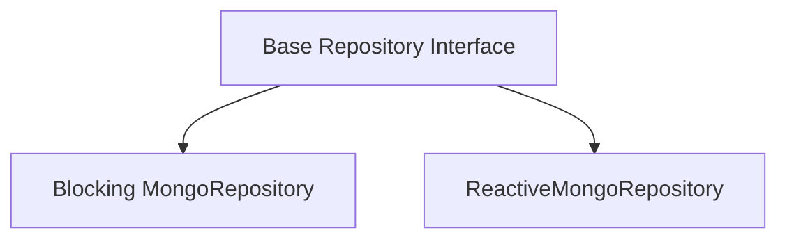
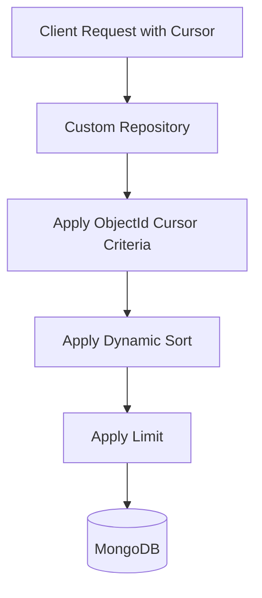
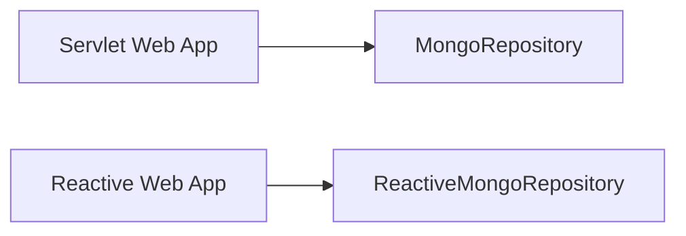

# Data Layer Mongo Documents And Repositories

## Overview

The **Data Layer Mongo Documents And Repositories** module is the primary persistence layer for the OpenFrame platform. It provides:

- MongoDB configuration (blocking and reactive)
- Domain documents mapped to MongoDB collections
- Query filter objects for dynamic search
- Base repository abstractions (technology-agnostic)
- Custom repository implementations using `MongoTemplate`
- Cursor-based pagination and dynamic sorting

This module is consumed by higher-level services such as:

- [API Service Core Rest GraphQL](api_service_core_rest_graphql.md)
- [Authorization Server Core And Tenant Context](authorization_server_core_and_tenant_context.md)
- [Gateway Service Core Edge Security And Ws Proxy](gateway_service_core_edge_security_and_ws_proxy.md)
- [Management Service Core Initialization And Schedulers](management_service_core_initialization_and_schedulers.md)

It acts as the canonical source of truth for users, tenants, organizations, devices, events, OAuth clients, tools, and related metadata.

---

## High-Level Architecture



### Key Layers

1. **Documents** – Annotated MongoDB entities (`@Document`)
2. **Base Repository Interfaces** – Technology-agnostic abstractions
3. **Spring Data Repositories** – CRUD and derived query methods
4. **Custom Implementations** – Advanced filtering, cursor pagination, dynamic sorting
5. **Configuration** – MongoDB bootstrapping and indexing

---

# Configuration Layer

## MongoConfig

`MongoConfig` enables:

- `@EnableMongoRepositories` for blocking repositories
- `@EnableReactiveMongoRepositories` for reactive repositories
- `@EnableMongoAuditing` for `@CreatedDate` and `@LastModifiedDate`

It customizes the `MappingMongoConverter` to:

- Apply custom conversions
- Replace dots in map keys with `__dot__`



### Conditional Behavior

- Blocking repositories enabled when `spring.data.mongodb.enabled=true`
- Reactive repositories enabled only in reactive web applications

---

## MongoIndexConfig

`MongoIndexConfig` ensures indexes at startup using `MongoTemplate`.

Example indexes:

- Compound index on `application_events`:
  - `userId ASC`
  - `timestamp DESC`
- Compound index on:
  - `type ASC`
  - `metadata.tags ASC`

This improves performance for time-range queries and tag-based filtering.

---

# Domain Model (Mongo Documents)

## User Domain

### User

Collection: `users`

Core features:

- Normalized lowercase email
- Roles and status
- Email verification flag
- Auditing timestamps

### AuthUser

Extends `User` and adds:

- `tenantId` (indexed)
- `passwordHash`
- `loginProvider`
- `externalUserId`
- `lastLogin`

Compound unique index:

```text
{'tenantId': 1, 'email': 1}
```

This supports multi-tenant uniqueness per email.

---

## Organization Domain

### Organization

Collection: `organizations`

Key characteristics:

- Unique `organizationId`
- Soft delete via `deleted` flag
- Contract lifecycle fields
- Indexed search fields
- Embedded contact information



### OrganizationQueryFilter

Supports filtering by:

- Category
- Employee range
- Active contract

Implemented in `CustomOrganizationRepositoryImpl` using dynamic `Criteria` composition.

---

## Tenant & SSO Domain

### SSOPerTenantConfig

Extends base SSO configuration with:

- Unique `tenantId`
- Auditing timestamps

Used by the Authorization Server for tenant-scoped SSO.

---

## Device Domain

### Device

Collection: `devices`

Contains:

- Hardware metadata
- OS information
- Status and health
- Configuration
- Last check-in timestamp

### MachineTag

Collection: `machine_tags`

Compound unique index:

```text
{'machineId': 1, 'tagId': 1}
```

Prevents duplicate tag assignments.

### Alert & SecurityAlert

Embedded device-level alerts:

- Severity
- Resolution state
- Timestamps

---

## Event Domain

### CoreEvent

Collection: `events`

Fields:

- `type`
- `payload`
- `timestamp`
- `userId`
- `status`

### ExternalApplicationEvent

Collection: `external_application_events`

Includes nested metadata:

- Source
- Version
- Tags (map)

### EventQueryFilter

Supports:

- User filtering
- Event type filtering
- Date range filtering

---

## OAuth Domain

### MongoRegisteredClient

Collection: `oauth_registered_clients`

Stores:

- Client credentials
- Grant types
- Redirect URIs
- PKCE requirements
- Token TTL settings

### OAuthToken

Collection: `oauth_tokens`

Stores:

- Access token
- Refresh token
- Expiry timestamps
- Scopes

Used by the Authorization Server module.

---

## Tool & Tag Domain

### Tag

Collection: `tags`

- Unique name
- Organization-scoped
- Metadata fields

### ToolQueryFilter

Filters tools by:

- Enabled state
- Type
- Category
- Platform category

### ToolAgentAsset

Embedded tool asset definition:

- Version
- Download configurations
- OS-specific local filenames
- Executable flag

---

# Repository Architecture

## Base Repository Interfaces

Technology-agnostic contracts:

- `BaseUserRepository`
- `BaseTenantRepository`
- `BaseApiKeyRepository`
- `BaseIntegratedToolRepository`

These allow:

- Blocking implementations (`Optional`, `List`, `boolean`)
- Reactive implementations (`Mono`, `Flux`)



---

## Spring Data Repositories

Examples:

- `OAuthTokenRepository`
- `ExternalApplicationEventRepository`
- `TenantRepository`
- `ReactiveUserRepository`
- `ReactiveOAuthClientRepository`

They provide:

- Derived queries
- Custom `@Query` support
- Conditional activation (reactive vs servlet)

---

## Custom Repository Implementations

Custom implementations use `MongoTemplate` for:

- Complex filtering
- Cursor-based pagination
- Dynamic sorting
- Distinct value extraction

### Example: Cursor Pagination



### Implementations

- `CustomMachineRepositoryImpl`
- `CustomEventRepositoryImpl`
- `CustomOrganizationRepositoryImpl`
- `CustomIntegratedToolRepositoryImpl`

Common capabilities:

- Field-level sort validation
- Default sort field fallback
- Regex-based search
- Combined `$and` and `$or` criteria

---

# Reactive vs Blocking Strategy

The module supports both paradigms:



- Blocking repositories enabled in servlet applications
- Reactive repositories enabled in WebFlux environments

This allows different service modules to choose their execution model.

---

# Cross-Module Responsibilities

| Concern | Owned By | Stored In This Module |
|----------|----------|-----------------------|
| Users | Authorization Server | `User`, `AuthUser` |
| Tenants | Authorization Server | `Tenant`, `SSOPerTenantConfig` |
| OAuth Clients | Authorization Server | `MongoRegisteredClient` |
| Devices | API Service | `Device`, `MachineTag` |
| Events | API & Stream Services | `CoreEvent`, `ExternalApplicationEvent` |
| Organizations | API Service | `Organization` |
| Tools | Management Service | `IntegratedTool`, `Tag` |

This module **does not contain business logic**. It focuses exclusively on:

- Persistence modeling
- Efficient querying
- Indexing strategy
- Repository abstraction

---

# Design Principles

1. **Separation of concerns** – No business logic in documents.
2. **Multi-tenancy support** – Indexed tenant-aware entities.
3. **Soft delete strategy** – Especially for organizations.
4. **Cursor-based pagination** – Efficient large dataset navigation.
5. **Dual repository model** – Reactive and blocking coexist.
6. **Database-level filtering** – Performance-first query design.

---

# Summary

The **Data Layer Mongo Documents And Repositories** module is the persistence backbone of OpenFrame. It:

- Defines all MongoDB domain documents
- Enables auditing and indexing
- Provides reusable repository abstractions
- Implements advanced filtering and pagination
- Supports both blocking and reactive stacks

Every higher-level service in the platform depends on this module for consistent, performant, and scalable data access.