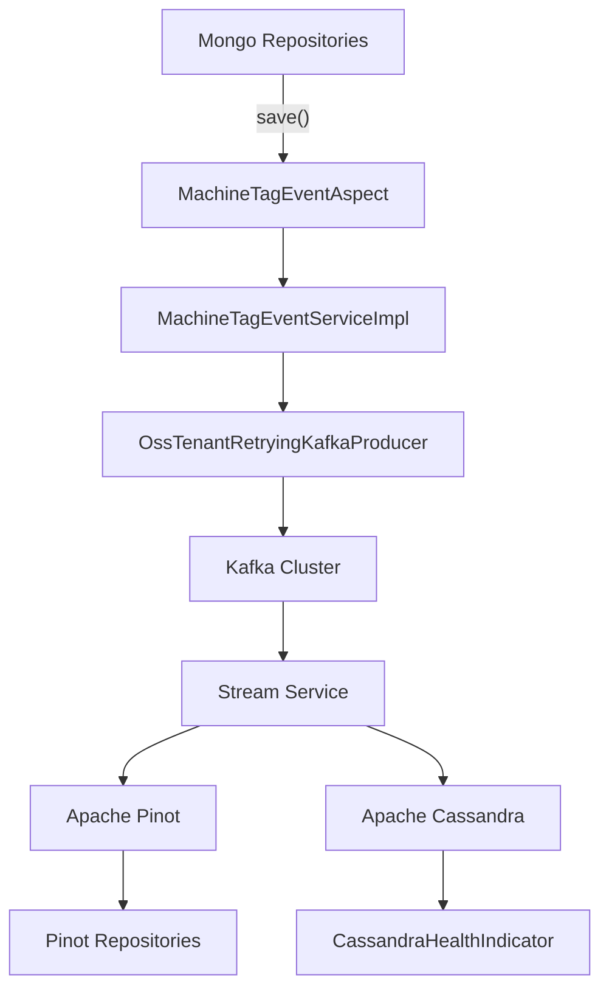
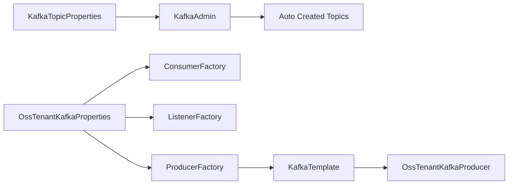
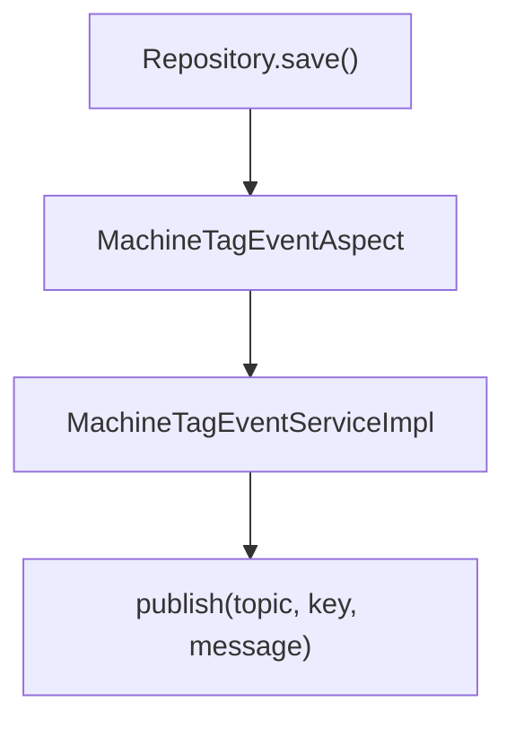
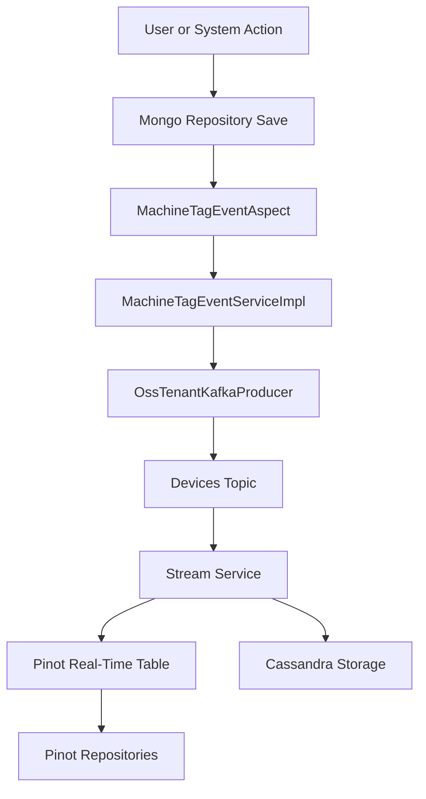

# Data Layer Streaming Kafka Pinot Cassandra

## Overview

The **Data Layer Streaming Kafka Pinot Cassandra** module is the real-time data backbone of the OpenFrame platform. It connects:

- Operational data changes (Mongo repositories, device updates, tag changes)
- Event streaming infrastructure (Kafka)
- Real-time analytics storage (Apache Pinot)
- Distributed persistence (Apache Cassandra)

This module enables:

- Event-driven propagation of device and tag changes
- Real-time filtering and analytics over devices and logs
- Tenant-aware Kafka configuration
- Cassandra keyspace lifecycle management
- Pinot-based query acceleration for high-volume event data

It acts as the bridge between the transactional data layer and the streaming + analytics layer.

---

## High-Level Architecture



### Responsibilities by Layer

| Layer | Responsibility |
|--------|----------------|
| AOP Aspect | Detect repository changes (Machine, MachineTag, Tag) |
| Event Service | Build and publish domain streaming messages |
| Kafka Config | Tenant-aware producer, consumer, topic configuration |
| Cassandra Config | Keyspace management and session initialization |
| Pinot Repositories | Real-time query and analytics over logs/devices |
| Health Monitoring | Cassandra availability checks |

---

# 1. Kafka Integration Layer

This module provides a full Spring Boot auto-configuration for a tenant-scoped Kafka cluster.

## 1.1 Configuration Components

### OssKafkaConfig
- Enables Kafka
- Excludes default `KafkaAutoConfiguration`
- Allows custom cluster wiring

### OssTenantKafkaProperties
- Prefix: `spring.oss-tenant`
- Wraps standard `KafkaProperties`
- Allows enabling/disabling tenant Kafka cluster

### KafkaTopicProperties
- Prefix: `openframe.oss-tenant.kafka.topics`
- Supports auto-creation of inbound topics
- Defines partitions and replication factor

Example configuration structure:

```yaml
spring:
  oss-tenant:
    kafka:
      enabled: true
      kafka:
        bootstrap-servers: localhost:9092

openframe:
  oss-tenant:
    kafka:
      topics:
        inbound:
          devices:
            name: devices-topic
            partitions: 3
            replication-factor: 1
```

---

## 1.2 Kafka Auto Configuration Flow



### Provided Beans

- ProducerFactory
- ConsumerFactory
- KafkaTemplate
- KafkaListenerContainerFactory
- KafkaAdmin (conditional)
- OssTenantKafkaProducer

All beans are conditional on:

- `spring.oss-tenant.kafka.enabled=true`

---

## 1.3 Message Models

### MachinePinotMessage

Used to propagate device state into Kafka for downstream analytics.

Fields:

- machineId
- organizationId
- deviceType
- status
- osType
- tags

This message represents the denormalized device state optimized for Pinot ingestion.

### DebeziumMessage

Generic wrapper for CDC-style events:

- before
- after
- operation
- timestamp
- source metadata

Enables integration with Debezium-based pipelines.

---

## 1.4 Kafka Recovery

### KafkaRecoveryHandlerImpl

Handles failed producer attempts:

- Logs structured error summary
- Captures topic, key, exception class
- Logs payload snapshot

This ensures observability without blocking upstream flows.

---

# 2. Repository Event Streaming (AOP Driven)

## 2.1 MachineTagEventAspect

Intercepts repository operations:

- MachineRepository.save
- MachineRepository.saveAll
- MachineTagRepository.save
- MachineTagRepository.saveAll
- TagRepository.save
- TagRepository.saveAll

This ensures streaming is automatic and transparent to repository consumers.



The aspect is enabled via:

- `openframe.device.aspect.enabled=true`

---

## 2.2 MachineTagEventServiceImpl

This is the core business streaming service.

### Responsibilities

- Fetch related tags
- Fetch related machines
- Build MachinePinotMessage
- Publish via OssTenantRetryingKafkaProducer

### Streaming Triggers

| Entity | Action | Behavior |
|--------|--------|----------|
| Machine | Save | Emit updated machine snapshot |
| MachineTag | Save | Emit updated machine with new tags |
| Tag | Save | Emit updates for all affected machines |

### Denormalization Strategy

When any change occurs:

1. Fetch full machine entity
2. Fetch all associated tags
3. Build full snapshot message
4. Publish to Kafka

This guarantees eventual consistency in Pinot.

---

# 3. Apache Cassandra Integration

## 3.1 CassandraConfig

Activated when:

- `spring.data.cassandra.enabled=true`

Responsibilities:

- Ensure keyspace exists
- Configure replication factor
- Initialize CqlSession
- Configure datacenter routing
- Use server-side timestamp generator

### Keyspace Auto-Creation

Before connecting, it executes:

```text
CREATE KEYSPACE IF NOT EXISTS <keyspace>
WITH replication = {'class': 'SimpleStrategy', 'replication_factor': X}
```

---

## 3.2 CassandraKeyspaceNormalizer

Cassandra does not allow dashes in keyspace names.

This initializer:

- Reads `spring.data.cassandra.keyspace-name`
- Replaces `-` with `_`
- Overrides environment property

This enables tenant IDs with dashes while maintaining Cassandra compatibility.

---

## 3.3 CassandraHealthIndicator

Provides Actuator health integration.

Performs:

```text
SELECT release_version FROM system.local
```

Returns:

- UP if query succeeds
- DOWN if exception occurs

---

# 4. Apache Pinot Integration

Pinot is used for high-performance, real-time analytics queries.

## 4.1 PinotConfig

Provides two connections:

- Broker connection (for queries)
- Controller connection (for management)

Configured via:

- `pinot.broker.url`
- `pinot.controller.url`

---

## 4.2 PinotClientDeviceRepository

Provides real-time filtering for devices.

Supported filter options:

- status
- deviceType
- osType
- organizationId
- tags

### Query Strategy

1. Build dynamic WHERE clause
2. Exclude DELETED devices
3. Execute GROUP BY query
4. Return counts per filter option

This enables dynamic faceted filtering in the UI.

---

## 4.3 PinotClientLogRepository

Handles log querying and analytics.

Capabilities:

- Date range filtering
- Cursor-based pagination
- Sorting validation
- Full-text search
- Distinct filter options
- Organization aggregation

### Supported Sort Fields

- eventTimestamp
- severity
- eventType
- toolType
- organizationId
- deviceId
- ingestDay

All queries are executed through the Pinot broker connection.

---

# 5. NATS and Tool Event Models

Although primarily Kafka-focused, this module defines shared streaming models:

- ClientConnectionEvent
- InstalledAgentMessage
- ToolConnectionMessage

These models support interoperability with:

- Stream Service module
- Client Service module
- Management Service module

---

# 6. Integrated Tool Metadata

## IntegratedToolTypes

Defines infrastructure and tool constants such as:

- KAFKA
- CASSANDRA
- PINOT
- MONGODB
- FLEET

This ensures consistent cross-module identification of integrated tools.

## ToolCredentials

Generic credential container:

- username
- password
- token
- apiKey
- clientId
- clientSecret

Used by management and integration layers.

---

# 7. End-to-End Streaming Flow



This architecture ensures:

- Strong separation of concerns
- Event-driven consistency
- Real-time analytics
- Tenant isolation
- Horizontal scalability

---

# 8. Configuration Flags Summary

| Property | Purpose |
|----------|----------|
| spring.oss-tenant.kafka.enabled | Enable tenant Kafka cluster |
| spring.oss-tenant.kafka.admin.enabled | Enable topic auto-creation |
| openframe.device.aspect.enabled | Enable streaming aspect |
| spring.data.cassandra.enabled | Enable Cassandra integration |

---

# Conclusion

The **Data Layer Streaming Kafka Pinot Cassandra** module is the core streaming and analytics infrastructure of OpenFrame.

It transforms repository-level changes into structured streaming events, ensures reliable Kafka delivery, provides Cassandra persistence with automated keyspace handling, and enables high-performance analytics through Apache Pinot.

This module enables OpenFrame to operate as a real-time, event-driven, multi-tenant platform at scale.