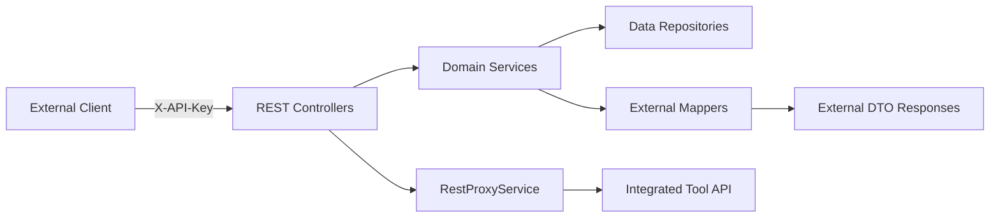
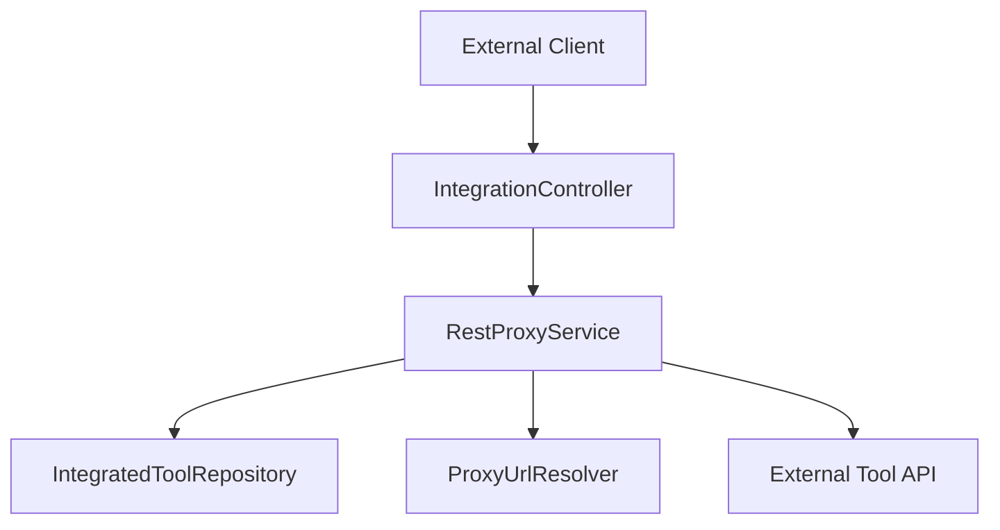
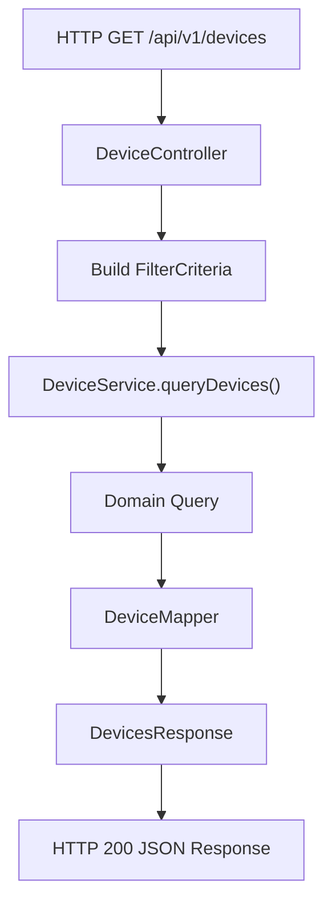
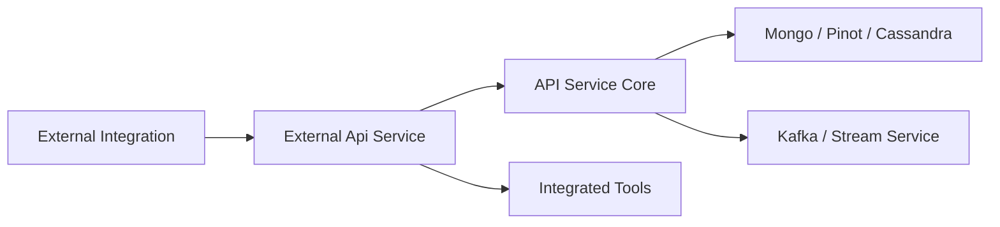

# External Api Service Core Rest And Dto

The **External Api Service Core Rest And Dto** module exposes a public, API-key–secured REST interface for interacting with the OpenFrame platform. It is designed for external integrations, automation systems, and third-party tools that require programmatic access to devices, events, logs, organizations, and integrated tools.

This module acts as a thin, well-documented REST façade over internal domain services, enforcing API key authentication, pagination, filtering, sorting, and structured DTO-based responses.

---

## 1. Purpose and Responsibilities

The External Api Service Core Rest And Dto module is responsible for:

- Exposing versioned REST endpoints under `/api/v1/**`
- Securing endpoints via API key (`X-API-Key`) authentication
- Providing cursor-based pagination and sorting
- Translating domain models into external-facing DTOs
- Supporting advanced filtering for devices, events, logs, organizations, and tools
- Proxying requests to integrated third-party tools
- Publishing OpenAPI (Swagger) documentation

It does **not** implement core business logic itself. Instead, it delegates to domain services from the API, data, and integration layers.

---

## 2. High-Level Architecture



### Key Layers

- **REST Controllers**: Handle HTTP requests and responses.
- **Domain Services**: Provide business logic (devices, events, logs, organizations, tools).
- **Mappers**: Convert internal models to external DTOs.
- **DTOs**: Stable API contracts for external consumers.
- **RestProxyService**: Forwards API requests to integrated tools.

---

## 3. OpenAPI Configuration

### `OpenApiConfig`

The `OpenApiConfig` class configures Swagger/OpenAPI documentation for the external API.

### Key Features

- Title: *OpenFrame External API*
- Security scheme: `ApiKeyAuth`
- Header-based authentication using `X-API-Key`
- Grouped API paths:
  - Included: `/tools/**`, `/test/**`, `/api/v1/**`
  - Excluded: `/actuator/**`, `/api/core/**`

### Authentication Format

```text
X-API-Key: ak_keyId.sk_secretKey
```

All endpoints require a valid API key.

---

## 4. REST Controllers Overview

Each controller exposes a specific functional domain.

### 4.1 DeviceController

**Base Path:** `/api/v1/devices`

Responsibilities:
- List devices with filtering, pagination, sorting
- Fetch single device by machine ID
- Retrieve filter metadata with counts
- Update device status (DELETED, ARCHIVED)

Key features:
- Supports filtering by status, type, OS, organization, tags
- Cursor-based pagination
- Optional tag inclusion
- Delegates to `DeviceService`, `DeviceFilterService`, `TagService`

---

### 4.2 EventController

**Base Path:** `/api/v1/events`

Responsibilities:
- Query events with filters and pagination
- Fetch event by ID
- Create event
- Update event
- Retrieve event filter metadata

Filtering options include:
- User IDs
- Event types
- Date ranges
- Search
- Sorting

---

### 4.3 LogController

**Base Path:** `/api/v1/logs`

Responsibilities:
- Query logs with advanced filtering
- Retrieve log filter options
- Retrieve detailed log entry

Supports filtering by:
- Date range
- Tool type
- Event type
- Severity
- Organization
- Device ID
- Search term

Log details retrieval uses a composite key:
- `ingestDay`
- `toolType`
- `eventType`
- `timestamp`
- `toolEventId`

---

### 4.4 OrganizationController

**Base Path:** `/api/v1/organizations`

Responsibilities:
- List organizations with filtering and pagination
- Fetch by database ID
- Fetch by business `organizationId`
- Create organization
- Update organization
- Delete organization

Deletion safeguards:
- Prevents deletion if organization has associated machines.

---

### 4.5 ToolController

**Base Path:** `/api/v1/tools`

Responsibilities:
- List integrated tools
- Filter by enabled, type, category
- Retrieve tool filter metadata

Delegates to `ToolService` and uses `ToolMapper` to convert domain entities into `ToolResponse` DTOs.

---

### 4.6 IntegrationController

**Base Path:** `/tools/{toolId}/**`

This controller proxies arbitrary HTTP requests to integrated third-party tools via `RestProxyService`.



Capabilities:
- Supports GET, POST, PUT, PATCH, DELETE, OPTIONS
- Validates tool existence and enabled status
- Injects credentials (header or bearer token)
- Applies connection and response timeouts

---

## 5. DTO Layer

The DTO layer defines stable contracts for external clients.

### 5.1 Shared DTOs

- `PaginationCriteria`
- `SortCriteria`
- `PageInfo`

Pagination:
- Cursor-based
- Limit enforced (1–100)
- Default limit: 20

---

### 5.2 Device DTOs

- `DeviceResponse`
- `DevicesResponse`
- `DeviceFilterCriteria`
- `DeviceFilterResponse`

Encapsulates:
- Device identity
- Status and type
- OS metadata
- Timestamps
- Associated tags

---

### 5.3 Event DTOs

- `EventResponse`
- `EventsResponse`
- `EventFilterCriteria`
- `EventFilterResponse`

Encapsulates:
- Event type
- Payload
- Timestamp
- User association

---

### 5.4 Log DTOs

- `LogResponse`
- `LogsResponse`
- `LogDetailsResponse`
- `LogFilterCriteria`
- `LogFilterResponse`

Designed for audit and security event retrieval with detailed metadata.

---

### 5.5 Organization DTOs

- `OrganizationsResponse`

Supports:
- Pagination
- Total count
- Cursor metadata

---

### 5.6 Tool DTOs

- `ToolResponse`
- `ToolsResponse`
- `ToolFilterCriteria`
- `ToolFilterResponse`
- `ToolUrlResponse`

Includes:
- Tool metadata
- URLs
- Credentials (if exposed)
- Platform and category classification

---

## 6. Request Processing Flow

Example: Device query request



Common patterns across controllers:

1. Validate request parameters
2. Build filter/pagination/sort DTO
3. Delegate to domain service
4. Map result to external DTO
5. Return structured JSON response

---

## 7. Error Handling and Status Codes

Standard HTTP status codes are used:

- `200` – Success
- `201` – Created
- `204` – No Content
- `400` – Bad Request
- `401` – Unauthorized (invalid API key)
- `403` – Forbidden
- `404` – Resource not found
- `409` – Conflict
- `429` – Too Many Requests
- `500` – Internal Server Error

Controllers throw domain-specific exceptions such as:
- `DeviceNotFoundException`
- `EventNotFoundException`
- `LogNotFoundException`
- `OrganizationNotFoundException`

These are translated into structured error responses.

---

## 8. Security Model

The External Api Service Core Rest And Dto module relies on:

- API key authentication via `X-API-Key`
- Internal headers injected after validation:
  - `X-User-Id`
  - `X-API-Key-Id`

Rate limiting is applied per API key (configured outside this module).

---

## 9. How This Module Fits in the System



Role in platform:

- Provides public integration surface
- Maintains stable, documented API contracts
- Shields internal domain models from external exposure
- Enables tool proxying without exposing internal topology

---

# Summary

The **External Api Service Core Rest And Dto** module is the external-facing REST gateway for OpenFrame integrations. It:

- Enforces API key–based access
- Exposes structured, paginated REST endpoints
- Delegates business logic to internal services
- Converts domain entities into stable DTO contracts
- Proxies requests to integrated third-party tools
- Publishes OpenAPI documentation for discoverability

It forms a critical boundary between external systems and the internal OpenFrame platform architecture.