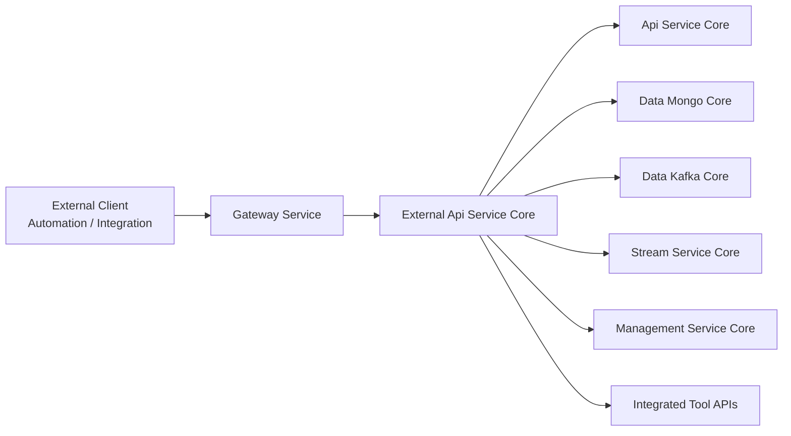
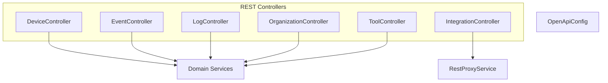
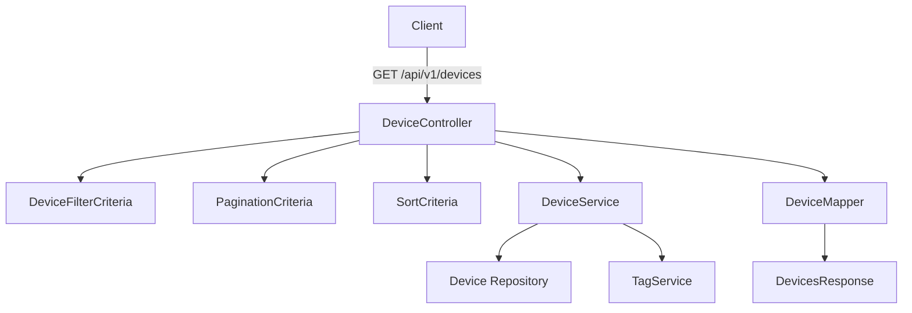
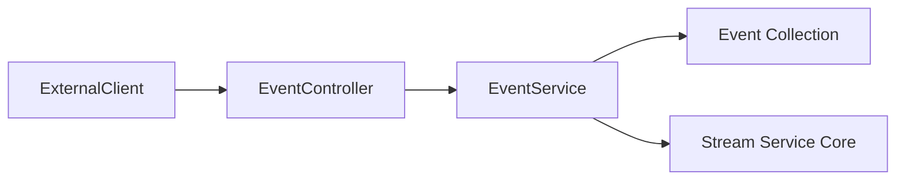
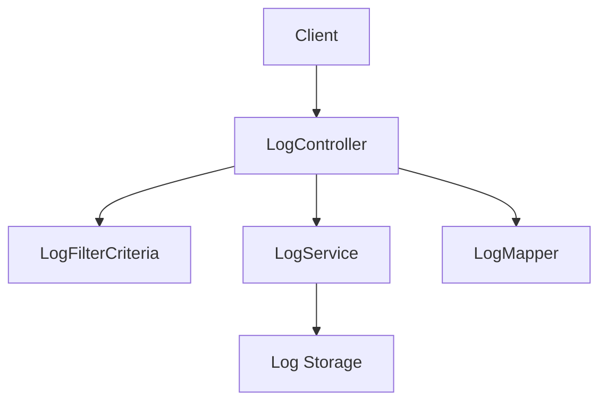
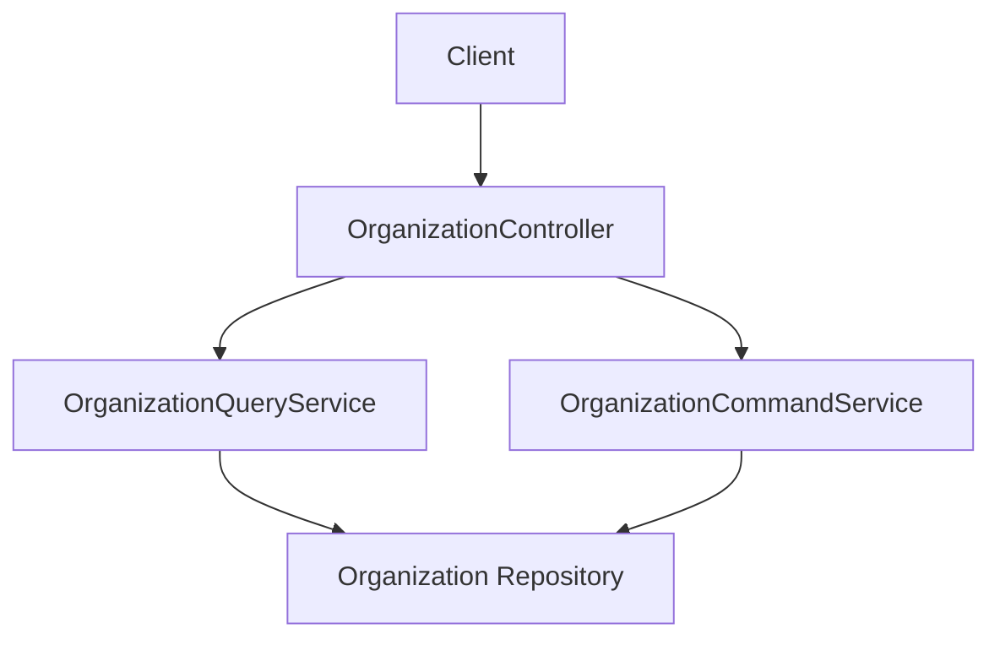
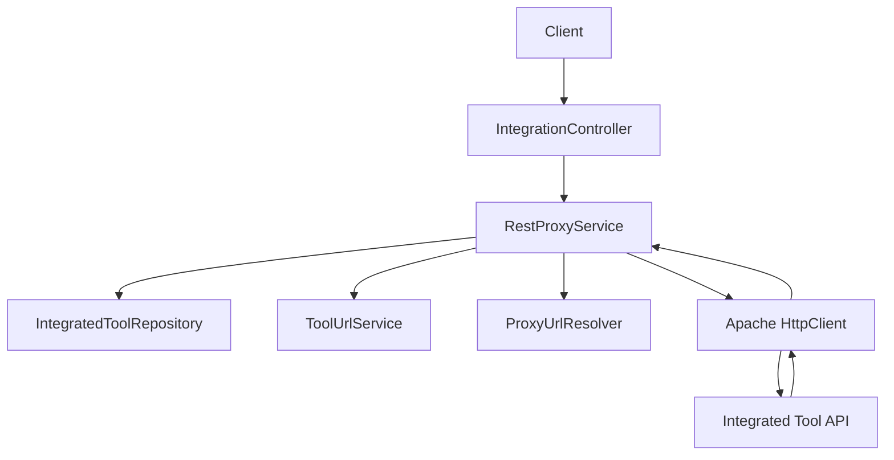
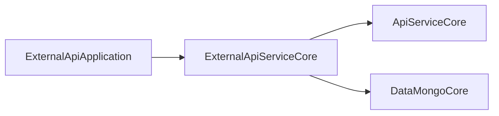

# External Api Service Core

## Overview

The **External Api Service Core** module provides a secure, API key–based REST interface for external systems to interact with the OpenFrame platform.

It exposes curated endpoints for:

- Device management
- Event ingestion and querying
- Log access and filtering
- Organization CRUD operations
- Integrated tool discovery
- Tool API proxying

Unlike the internal API layer, this module is designed specifically for third-party integrations and automation use cases. It enforces API key authentication and rate limiting at the gateway level and presents a stable, versioned REST contract under `/api/v1/**` and `/tools/**`.

---

## Architectural Context

The External Api Service Core sits between external consumers and the internal OpenFrame services.



### Responsibilities in the Stack

| Layer | Responsibility |
|--------|---------------|
| Gateway Service | API key validation, rate limiting, header enrichment (`X-User-Id`, `X-API-Key-Id`) |
| External Api Service Core | Public REST contract, request validation, filtering, sorting, proxying |
| Api Service Core | Domain services and business logic |
| Data Mongo Core | Persistence (devices, events, organizations, tools) |
| Data Kafka Core | Streaming/event infrastructure |
| Stream Service Core | Event processing and enrichment |
| Management Service Core | Tool configuration, versioning, initializers |

---

## Module Structure

The External Api Service Core consists of:

- **OpenApiConfig** – Swagger/OpenAPI configuration
- **Controllers** – Public REST endpoints
- **RestProxyService** – HTTP proxy layer for integrated tools

### Component Overview



---

# OpenAPI Configuration

## OpenApiConfig

The `OpenApiConfig` class configures:

- OpenAPI metadata (title, version, contact, license)
- API key security scheme
- Server base path (`/external-api`)
- Endpoint grouping

### Authentication Scheme

All endpoints require an API key in the `X-API-Key` header.

```text
X-API-Key: ak_keyId.sk_secretKey
```

Security scheme configuration:

- Type: `APIKEY`
- Location: Header
- Header name: `X-API-Key`

### Rate Limiting

Rate limiting is enforced upstream (Gateway Service). Responses include headers such as:

- `X-RateLimit-Limit-Minute`
- `X-RateLimit-Remaining-Minute`
- `X-RateLimit-Limit-Hour`
- `X-RateLimit-Remaining-Hour`

---

# REST Controllers

All REST endpoints are versioned under `/api/v1/**`, except tool proxy endpoints which use `/tools/**`.

---

## DeviceController

**Base Path:** `/api/v1/devices`

Provides device querying and lifecycle management.

### Key Capabilities

- Cursor-based pagination
- Multi-criteria filtering (status, type, OS, organization, tags)
- Search by hostname/display name
- Optional tag enrichment
- Sort field and direction support
- Status updates (ARCHIVED / DELETED)

### Request Flow



### Notable Design Decisions

- Filtering logic is translated into domain-level filter options.
- Tag enrichment is optional and wrapped in a safe fallback.
- Pagination uses cursor-based semantics instead of offset-based paging.

---

## EventController

**Base Path:** `/api/v1/events`

Supports event ingestion and querying.

### Features

- Cursor-based pagination
- Date range filtering
- User ID and event type filtering
- Search support
- Sorting
- Event creation and update

### Event Lifecycle



The controller:

- Validates query parameters
- Maps request DTOs to domain filters
- Delegates to `EventService`
- Maps domain results to API responses

---

## LogController

**Base Path:** `/api/v1/logs`

Provides access to system and integration logs.

### Capabilities

- Date-based filtering
- Tool type and event type filtering
- Severity filtering
- Organization scoping
- Cursor pagination
- Detailed log retrieval

### Log Retrieval Flow



This controller supports:

- Summary listing (`LogsResponse`)
- Filter metadata (`LogFilterResponse`)
- Detailed entry retrieval (`LogDetailsResponse`)

---

## OrganizationController

**Base Path:** `/api/v1/organizations`

Provides full CRUD for organizations.

### Operations

- List with filtering and search
- Get by database ID
- Get by business `organizationId`
- Create
- Update
- Delete (with constraint validation)

### Business Rules

- Cannot delete organization if associated machines exist.
- Validation errors and domain conflicts are translated to HTTP status codes.

### Interaction Model



---

## ToolController

**Base Path:** `/api/v1/tools`

Exposes integrated tool discovery.

### Features

- Filter by enabled status
- Filter by type and category
- Search
- Sorting
- Filter metadata endpoint

The controller delegates entirely to `ToolService` and maps results to API DTOs.

---

## IntegrationController

**Base Path:** `/tools/{toolId}/**`

This controller enables dynamic proxying of API calls to integrated tools.

It supports:

- GET
- POST
- PUT
- PATCH
- DELETE
- OPTIONS

The actual proxy logic is delegated to `RestProxyService`.

---

# RestProxyService

The **RestProxyService** is a generic HTTP reverse proxy for integrated tools.

## Responsibilities

1. Validate tool existence
2. Ensure tool is enabled
3. Resolve tool API base URL
4. Build target URI
5. Inject credentials (header or bearer token)
6. Execute HTTP request via Apache HttpClient
7. Relay status and body to caller

## Proxy Flow



## Credential Injection

Depending on `APIKeyType`, headers are injected as:

- Custom header (e.g., `X-Api-Key`)
- `Authorization: Bearer <token>`
- None

## Timeouts

- Connection request timeout: 10 seconds
- Response timeout: 60 seconds

---

# Cross-Cutting Concerns

## Authentication

Authentication is enforced using API keys provided in the `X-API-Key` header.

The Gateway Service:

- Validates API key format
- Verifies key against stored credentials
- Enforces rate limits
- Injects contextual headers:
  - `X-User-Id`
  - `X-API-Key-Id`

These headers are consumed internally for logging and auditing.

---

## Pagination Model

All list endpoints use cursor-based pagination via:

- `limit`
- `cursor`

This ensures:

- Stable pagination across large datasets
- Better performance than offset-based queries
- Safer concurrent data updates

---

## Sorting Model

Endpoints accept:

- `sortField`
- `sortDirection` (`ASC` or `DESC`)

These are converted into domain-level `SortInput` or equivalent objects.

---

## Error Handling

Controllers translate domain exceptions into HTTP status codes:

- `404` – Not found
- `400` – Validation or invalid parameters
- `409` – Business constraint violations
- `401` – Invalid or missing API key

Error responses use a consistent `ErrorResponse` DTO.

---

# Deployment and Application Binding

The External Api Service Core is used by the `ExternalApiApplication` in the service applications layer.



It is typically deployed behind:

- Kubernetes Gateway
- TLS termination
- Rate limiting infrastructure

---

# Summary

The **External Api Service Core** module is the public-facing REST contract for OpenFrame.

It provides:

- Stable, versioned APIs
- API key–based authentication
- Filtering, sorting, and cursor pagination
- CRUD operations across core domain entities
- Transparent proxying to integrated tool APIs

By separating this module from internal API layers, OpenFrame ensures:

- Clear security boundaries
- Controlled exposure of platform functionality
- Integration-ready REST design
- Extensibility for future external automation scenarios

This module is the primary integration surface for MSP automation, third-party tooling, and platform extensions.