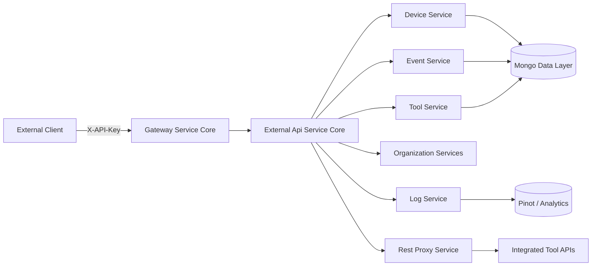
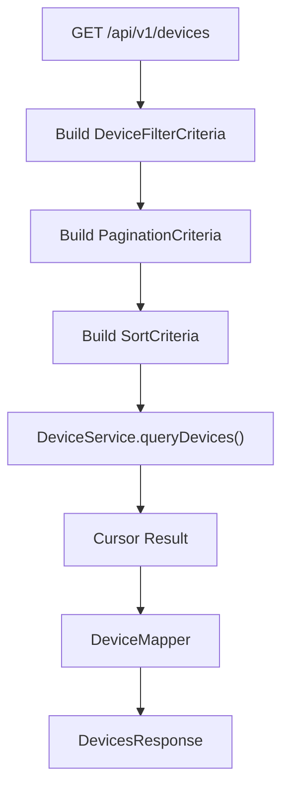
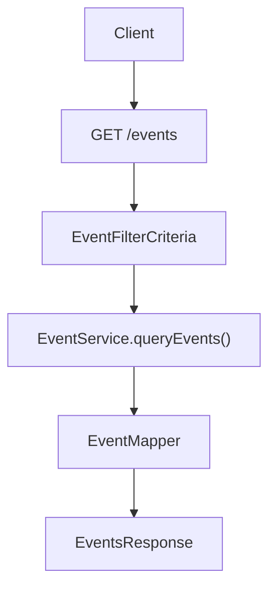
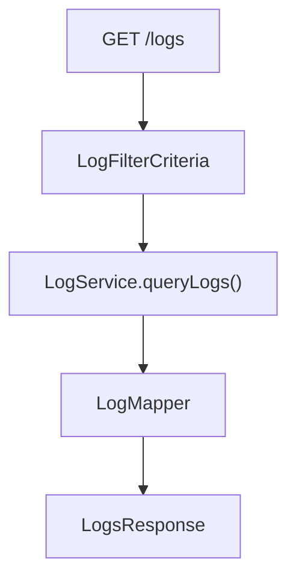
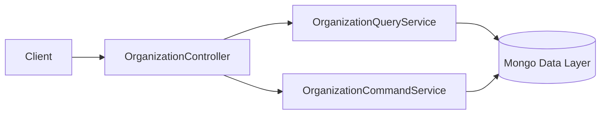
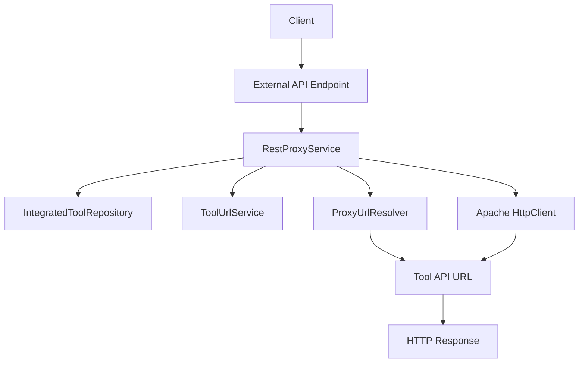
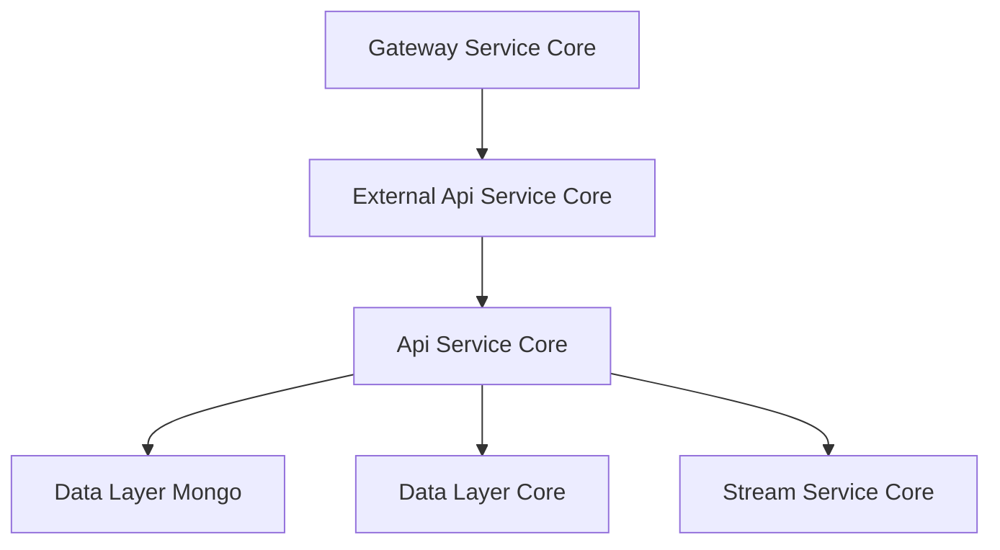

# External Api Service Core

## Overview

The **External Api Service Core** module exposes a secure, API key–based REST interface for external integrations with the OpenFrame platform. It is designed for third-party systems, automation scripts, and partner integrations that require programmatic access to:

- Devices
- Events
- Logs
- Organizations
- Integrated Tools
- Tool API proxying

Unlike the internal API layer (see [Api Service Core](../api-service-core/api-service-core.md)), this module focuses on:

- ✅ API key authentication
- ✅ Rate-limited access
- ✅ Stable REST contracts for external consumers
- ✅ OpenAPI (Swagger) documentation
- ✅ Controlled proxying to integrated tools

It acts as a boundary layer between external consumers and the internal domain services.

---

## High-Level Architecture



### Key Characteristics

- Stateless REST controllers
- Cursor-based pagination
- Structured filtering and sorting
- Centralized mapping layer (DTO ↔ domain)
- Delegation to internal services
- Optional tool-level API proxying

---

## Module Responsibilities

The External Api Service Core module provides:

1. **Public REST Endpoints** under `/api/v1/**`
2. **OpenAPI Documentation Configuration**
3. **Request → Filter → Pagination → Sort Mapping**
4. **Delegation to Domain Services** (from Api Service Core)
5. **Tool API Reverse Proxy Support**

It does **not** implement business logic directly. Instead, it orchestrates calls to:

- [Api Service Core](../api-service-core/api-service-core.md)
- [Data Layer Mongo](../data-layer-mongo/data-layer-mongo.md)
- [Data Layer Core](../data-layer-core/data-layer-core.md)
- [Gateway Service Core](../gateway-service-core/gateway-service-core.md)

---

# OpenAPI & Documentation Configuration

## OpenApiConfig

**Component:**  
`OpenApiConfig`

### Responsibilities

- Defines the OpenAPI metadata (title, version, contact, license)
- Configures API key security scheme (`X-API-Key`)
- Groups endpoints under `external-api`
- Excludes internal endpoints (`/actuator/**`, `/api/core/**`)

### Security Model

All endpoints require:

```text
Header: X-API-Key
Format: ak_keyId.sk_secretKey
```

The OpenAPI configuration registers an API key security scheme:

- Type: `APIKEY`
- In: `HEADER`
- Name: `X-API-Key`

Rate limiting headers are also documented for external consumers.

---

# REST Controllers

All controllers are versioned under:

```text
/api/v1/**
```

Each controller follows a consistent architectural pattern:

1. Accept request parameters
2. Build filter criteria
3. Build pagination criteria
4. Build sort criteria
5. Delegate to service layer
6. Map domain result to external DTO

---

## DeviceController

**Path:** `/api/v1/devices`

### Capabilities

- List devices (filter + search + pagination + sort)
- Get device by machine ID
- Retrieve filter options with counts
- Update device status
- Optional tag inclusion

### Interaction Flow



### Notable Features

- Supports filtering by status, type, OS, organization, tags
- Cursor-based pagination
- Sort by dynamic field
- Optional tag enrichment via `TagService`

Delegates core logic to the Device Service in Api Service Core.

---

## EventController

**Path:** `/api/v1/events`

### Capabilities

- Query events (filter + search + pagination + sort)
- Get event by ID
- Create event
- Update event
- Retrieve filter options

### Data Flow



### Highlights

- Date range filtering
- User and event type filtering
- Cursor-based pagination
- Supports event creation and updates

---

## LogController

**Path:** `/api/v1/logs`

### Capabilities

- Query logs with filtering
- Retrieve log filters
- Fetch detailed log entry

### Backend Integration

Log queries typically involve analytics repositories (e.g., Pinot) through the Log Service layer.

### Flow



---

## OrganizationController

**Path:** `/api/v1/organizations`

### Capabilities

- List organizations
- Get by database ID
- Get by business identifier
- Create organization
- Update organization
- Delete organization

### Delegated Services

- `OrganizationQueryService`
- `OrganizationCommandService`
- `OrganizationService`

### CRUD Flow



### Safeguards

- Prevent deletion if machines exist
- Conflict handling
- Structured validation via DTOs

---

## ToolController

**Path:** `/api/v1/tools`

### Capabilities

- Query integrated tools
- Filter by enabled status, type, category
- Retrieve tool filter options

Delegates to `ToolService` for core logic.

---

# Rest Proxy Service

## RestProxyService

The **RestProxyService** enables secure proxying of external requests to integrated third-party tools.

This allows the External Api Service Core to act as a controlled gateway to tool APIs.

### Responsibilities

- Validate tool existence
- Verify tool is enabled
- Resolve target URL using `ProxyUrlResolver`
- Attach tool credentials (header or bearer token)
- Execute HTTP request via Apache HttpClient
- Return upstream response

### Proxy Flow



### Credential Handling

Supports multiple API key types:

- Header-based API key
- Bearer token
- No authentication

Headers are dynamically attached based on stored tool credentials.

### Timeouts

- Connection request timeout: 10 seconds
- Response timeout: 60 seconds

---

# Authentication & Security Model

Authentication is based on API keys passed in:

```text
X-API-Key: ak_keyId.sk_secretKey
```

The Gateway Service Core typically:

- Validates the API key
- Applies rate limiting
- Injects contextual headers (e.g., user ID, API key ID)

The External Api Service Core consumes those headers but does not perform authentication itself.

---

# Pagination, Filtering & Sorting

Across controllers, a consistent pattern is used:

### 1. Filter Criteria
External DTO → Domain filter options

### 2. Pagination Criteria
Cursor-based pagination:

```text
limit: integer (1-100)
cursor: opaque string
```

### 3. Sorting

```text
sortField: string
sortDirection: ASC or DESC
```

This abstraction ensures:

- Forward-compatible pagination
- Stable sorting behavior
- Efficient database querying

---

# Position in the Platform



### Platform Role

The External Api Service Core is:

- ✅ Public-facing
- ✅ API-key protected
- ✅ Integration-focused
- ✅ Delegation-based (no heavy business logic)
- ✅ Documentation-driven (OpenAPI)

It ensures that external consumers interact with the platform in a stable, secure, and well-documented manner without exposing internal implementation details.

---

# Summary

The **External Api Service Core** module provides:

- A secure REST interface for third-party integrations
- Standardized filtering, pagination, and sorting
- Clean delegation to internal services
- Proxying support for integrated tools
- OpenAPI documentation and API key security

It forms the official integration surface of the OpenFrame platform and is a critical boundary between external systems and internal domain services.
