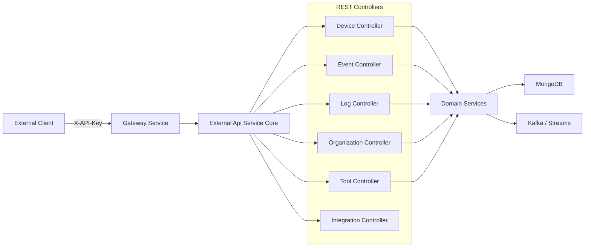
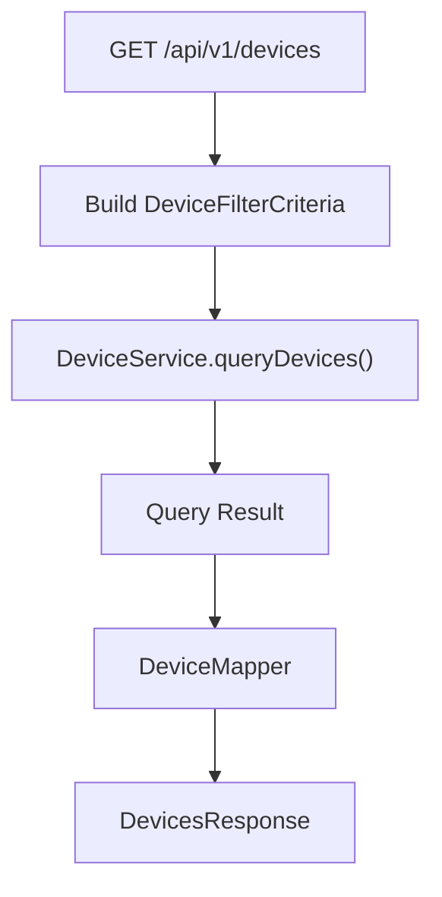
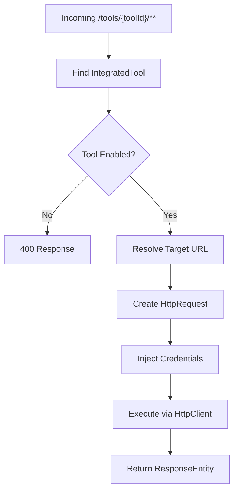

# External Api Service Core

## Overview

The **External Api Service Core** module exposes a public, API key–secured REST interface to the OpenFrame platform. It is designed for third-party systems, integrations, and automation scripts that require programmatic access to devices, events, logs, organizations, and integrated tools.

Unlike the internal API modules, this module is:

- ✅ API key–based (header authentication)
- ✅ Rate-limited per API key
- ✅ Documented via OpenAPI / Swagger
- ✅ Integration-friendly with proxy support for external tools

It is deployed as the `ExternalApiApplication` service in the service layer.

---

## High-Level Architecture

The External Api Service Core acts as a façade over domain services defined in the API and data-access layers.



### Responsibilities

- Expose versioned REST endpoints under `/api/v1/**`
- Enforce API key authentication
- Apply pagination, sorting, and filtering
- Map internal domain models to external DTOs
- Proxy integration requests to external tools
- Provide OpenAPI documentation

---

## OpenAPI Configuration

### `OpenApiConfig`

This configuration defines:

- API metadata (title, version, contact, license)
- Security scheme (`ApiKeyAuth`)
- API key header: `X-API-Key`
- Rate limiting documentation
- Grouped endpoint exposure for Swagger UI

### Security Scheme

All endpoints require the `X-API-Key` header:

```text
X-API-Key: ak_keyId.sk_secretKey
```

OpenAPI defines this as an `APIKEY` security scheme located in the HTTP header.

---

## Core REST Controllers

All endpoints are versioned under `/api/v1` unless otherwise specified.

### 1. Device Controller

**Base Path:** `/api/v1/devices`

Capabilities:

- List devices with advanced filtering
- Cursor-based pagination
- Sorting support
- Optional tag inclusion
- Update device status (ARCHIVED / DELETED)

Supports filtering by:

- Status
- Device type
- OS type
- Organization IDs
- Tags
- Search query

#### Device Query Flow



---

### 2. Event Controller

**Base Path:** `/api/v1/events`

Capabilities:

- Query events with filtering
- Retrieve single event by ID
- Create event
- Update event
- Fetch event filter options

Supports:

- Date range filtering
- Event type filtering
- User filtering
- Search
- Sorting

Uses `EventService` and maps internal `Event` documents to `EventResponse` DTOs.

---

### 3. Log Controller

**Base Path:** `/api/v1/logs`

Capabilities:

- Query logs with filter options
- Cursor-based pagination
- Retrieve detailed log entry
- Retrieve available filter metadata

Supports filtering by:

- Date range
- Tool type
- Event type
- Severity
- Organization
- Device ID

Designed for audit and compliance workflows.

---

### 4. Organization Controller

**Base Path:** `/api/v1/organizations`

Provides full CRUD operations:

- List organizations
- Get by database ID
- Get by business `organizationId`
- Create
- Update
- Delete (blocked if organization has machines)

Internally integrates with:

- `OrganizationQueryService`
- `OrganizationCommandService`
- `OrganizationService`

Implements validation and proper HTTP status mapping.

---

### 5. Tool Controller

**Base Path:** `/api/v1/tools`

Provides:

- List integrated tools
- Filter by enabled status, type, category
- Sorting support
- Retrieve tool filter options

Backed by `ToolService`.

---

### 6. Integration Controller

**Base Path:** `/tools/{toolId}/**`

This controller proxies arbitrary HTTP requests to configured integrated tools.

Example:

```text
POST /tools/jira/api/issues
```

The request is:

1. Authenticated via API key
2. Resolved to the tool’s configured base URL
3. Forwarded with appropriate credentials
4. Returned with original status and body

---

## Rest Proxy Service

### `RestProxyService`

This service performs secure HTTP forwarding to integrated tools.

### Responsibilities

- Validate tool existence
- Ensure tool is enabled
- Resolve tool URL via `ProxyUrlResolver`
- Apply credentials based on `APIKeyType`
- Execute HTTP request with Apache HttpClient
- Return original status code and body

### Credential Handling

Supports:

- `HEADER` – Custom header key/value
- `BEARER_TOKEN` – Authorization header
- `NONE` – No credential injection

### Proxy Execution Flow



Timeouts:

- Connection request timeout: 10 seconds
- Response timeout: 60 seconds

---

## Pagination and Sorting Model

All list endpoints follow a consistent model:

### Cursor-Based Pagination

```text
GET /api/v1/devices?limit=20&cursor=abc123
```

- `limit` (1–100)
- `cursor` (opaque token)

### Sorting

```text
?sortField=hostname&sortDirection=DESC
```

Default sort direction varies by endpoint.

---

## Security Model

The External Api Service Core does **not** perform authentication itself. Instead:

1. API keys are validated upstream
2. Headers injected:
   - `X-User-Id`
   - `X-API-Key-Id`
3. Controllers log these values for traceability

Security enforcement includes:

- API key validation
- Permission checks
- Rate limiting
- Standard HTTP status responses

---

## Error Handling

The module consistently returns:

- `400` – Validation or bad request
- `401` – Missing or invalid API key
- `403` – Insufficient permissions
- `404` – Resource not found
- `409` – Conflict (e.g., organization has machines)
- `429` – Rate limit exceeded
- `500` – Internal server error

Error bodies use a structured `ErrorResponse` model.

---

## Deployment Context

The module is packaged within:

- `ExternalApiApplication`

It integrates with:

- API service core (domain services)
- Data access Mongo
- Kafka / stream services
- Gateway service for routing
- Security core for API key validation

---

## Summary

The **External Api Service Core** module provides:

- A stable, versioned REST API
- API key–secured external access
- Rich filtering and pagination
- Tool integration proxying
- Comprehensive OpenAPI documentation

It is the primary entry point for:

- Third-party integrations
- Automation systems
- MSP tooling
- External reporting and compliance workflows

This module bridges the OpenFrame internal platform capabilities with secure external programmatic access.