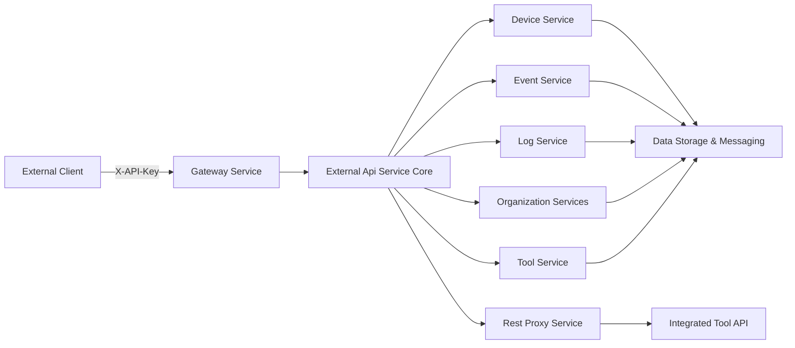
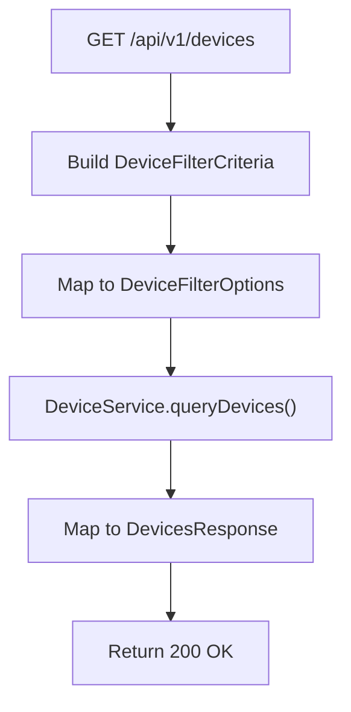
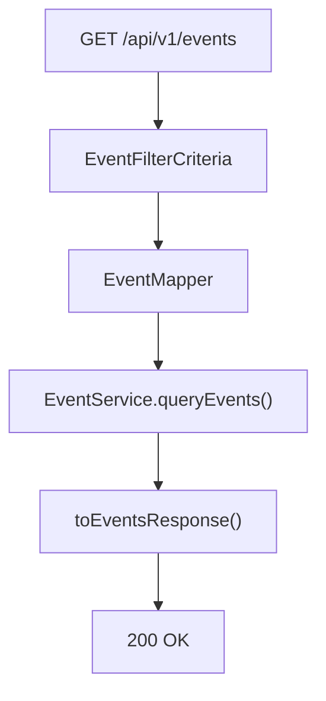
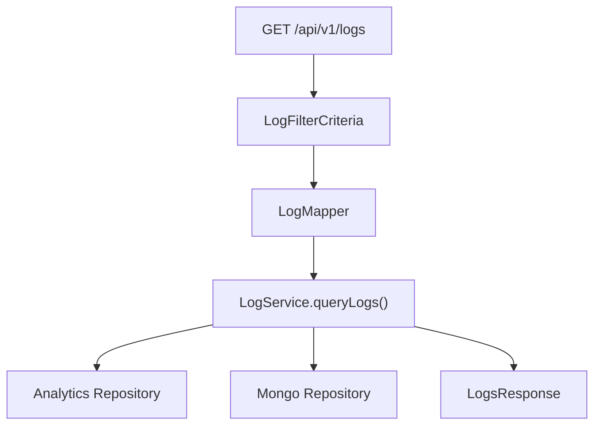
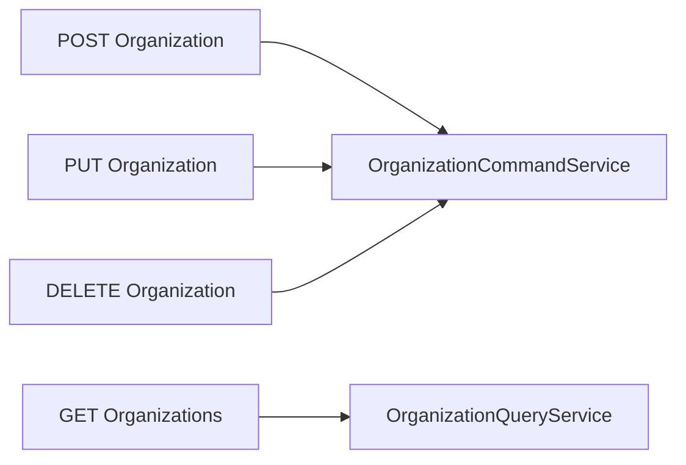
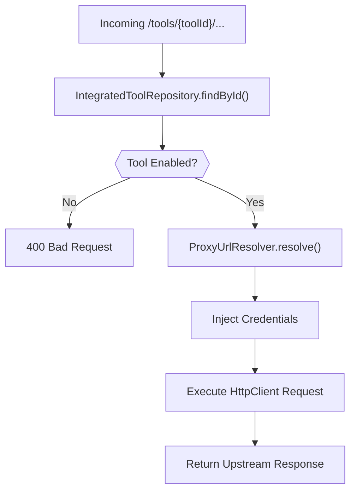
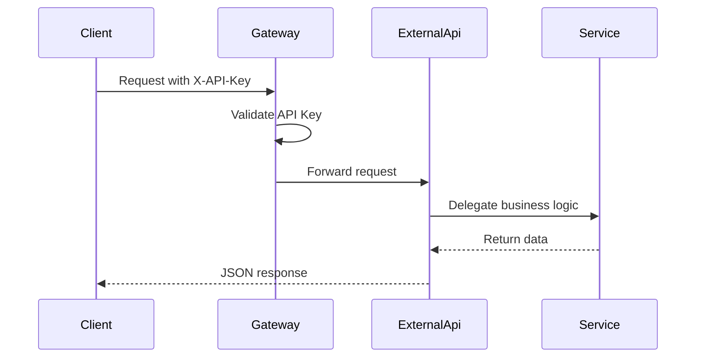

# External Api Service Core

The **External Api Service Core** module exposes a stable, API key–secured REST interface for third-party integrations and external systems to interact with the OpenFrame platform.

It acts as a controlled boundary layer on top of internal services such as device management, events, logs, organizations, and integrated tools. Unlike internal APIs that may be optimized for frontend or service-to-service communication, this module is designed specifically for:

- ✅ External system integrations
- ✅ API key–based authentication
- ✅ Rate-limited access
- ✅ Stable versioned REST endpoints (`/api/v1/...`)
- ✅ Tool-level API proxying

---

## 1. Purpose and Responsibilities

The External Api Service Core is responsible for:

1. Exposing versioned REST endpoints for core domain entities:
   - Devices
   - Events
   - Logs
   - Organizations
   - Tools
2. Translating REST query parameters into internal query/filter models
3. Enforcing API key–based access (via gateway and security layers)
4. Providing consistent pagination, sorting, and filtering semantics
5. Proxying requests to integrated third-party tools
6. Publishing OpenAPI (Swagger) documentation

This module does **not**:

- Implement domain persistence logic (delegated to internal services)
- Manage authentication tokens (handled by gateway + authorization services)
- Handle streaming or ingestion (handled by stream and data modules)

---

## 2. High-Level Architecture

The External Api Service Core sits between external clients and internal platform services.



### Key Layers

| Layer | Responsibility |
|--------|----------------|
| Controllers | REST endpoints under `/api/v1` and `/tools` |
| DTOs | REST-specific filter, pagination, and sort models |
| Mappers | Convert REST DTOs to internal query models |
| Services | Delegate to internal application services |
| Rest Proxy Service | Forward tool API calls to integrated systems |
| OpenAPI Config | Publish Swagger documentation |

---

## 3. API Documentation Configuration

### `OpenApiConfig`

The `OpenApiConfig` class configures:

- OpenAPI metadata (title, version, contact, license)
- API key security scheme (`X-API-Key` header)
- Default server path (`/external-api`)
- API grouping (`external-api` group)

### API Key Authentication

All endpoints require:

```text
Header: X-API-Key: ak_keyId.sk_secretKey
```

The OpenAPI configuration defines an `ApiKeyAuth` security scheme applied globally.

### Rate Limiting (Documented Contract)

Rate limiting is enforced at gateway level. Documented default limits:

- Per minute: 100
- Per hour: 1,000
- Per day: 10,000

Rate limit headers returned:

```text
X-RateLimit-Limit-Minute
X-RateLimit-Remaining-Minute
X-RateLimit-Limit-Hour
X-RateLimit-Remaining-Hour
```

---

## 4. REST Controllers Overview

All controllers follow consistent patterns:

- Versioned path prefix: `/api/v1/...`
- API key authentication via headers
- Cursor-based pagination
- Optional filtering + search
- Optional sorting
- Structured error responses

---

### 4.1 DeviceController

**Base Path:** `/api/v1/devices`

Responsibilities:

- Retrieve paginated devices
- Filter by:
  - Status
  - Device type
  - OS type
  - Organization
  - Tags
- Search by hostname/name
- Include tags optionally
- Update device status (`DELETED`, `ARCHIVED`)
- Retrieve filter metadata

#### Request Processing Flow



The controller:

1. Builds `DeviceFilterCriteria`
2. Converts to internal filter options via `DeviceMapper`
3. Calls `DeviceService`
4. Optionally enriches with tags via `TagService`
5. Returns mapped response DTO

---

### 4.2 EventController

**Base Path:** `/api/v1/events`

Capabilities:

- List events (cursor-based)
- Filter by:
  - User IDs
  - Event types
  - Date range
- Create events
- Update events
- Retrieve event filters

#### Event Query Flow



This controller directly exposes event creation and updates, making it suitable for external ingestion use cases.

---

### 4.3 LogController

**Base Path:** `/api/v1/logs`

Responsibilities:

- Query logs with:
  - Date range
  - Tool type
  - Event type
  - Severity
  - Organization
  - Device ID
- Retrieve filter options
- Retrieve detailed log entry

#### Log Query Architecture



Logs may be backed by analytical stores (e.g., Pinot) and operational data stores.

---

### 4.4 OrganizationController

**Base Path:** `/api/v1/organizations`

Provides full CRUD:

- List organizations
- Get by database ID
- Get by business `organizationId`
- Create
- Update
- Delete (with machine association constraint)

#### Organization Lifecycle



Deletion is blocked if the organization still owns machines.

---

### 4.5 ToolController

**Base Path:** `/api/v1/tools`

Responsibilities:

- List integrated tools
- Filter by:
  - Enabled
  - Type
  - Category
- Retrieve tool filter metadata

Delegates to `ToolService` and maps results to REST DTOs.

---

### 4.6 IntegrationController

**Base Path:** `/tools/{toolId}/**`

This controller provides **dynamic API proxying** to integrated tools.

It forwards:

- GET
- POST
- PUT
- PATCH
- DELETE
- OPTIONS

Requests to the corresponding external tool endpoint.

---

## 5. Rest Proxy Service

### `RestProxyService`

The Rest Proxy Service is the most dynamic component of the module.

Responsibilities:

1. Validate tool existence
2. Ensure tool is enabled
3. Resolve target tool URL
4. Inject credentials (header or bearer token)
5. Forward request using Apache HttpClient
6. Return upstream response transparently

### Proxy Execution Flow



### Credential Injection

Supported API key types:

- `HEADER` → Custom header injection
- `BEARER_TOKEN` → `Authorization: Bearer <token>`
- `NONE` → No credential injection

Timeout configuration:

```text
Connection request timeout: 10 seconds
Response timeout: 60 seconds
```

---

## 6. Shared REST DTO Patterns

### PaginationCriteria

```text
cursor: Base64 encoded position marker
limit: 1–100 (default 20)
```

Cursor-based pagination ensures stable ordering and scalable performance.

---

### SortCriteria

```text
field: Sort field name
direction: ASC or DESC
```

Controllers convert these to internal `SortInput` or service-specific sorting models.

---

### Filter Criteria Classes

Each domain has a REST-specific filter model:

- `DeviceFilterCriteria`
- `EventFilterCriteria`
- `LogFilterCriteria`
- `ToolFilterCriteria`

These are mapped to internal query objects before reaching application services.

---

## 7. Error Handling Strategy

Standard HTTP status codes:

| Code | Meaning |
|------|----------|
| 200 | Success |
| 201 | Created |
| 204 | No Content |
| 400 | Bad Request |
| 401 | Unauthorized |
| 404 | Not Found |
| 409 | Conflict |
| 429 | Rate Limit Exceeded |
| 500 | Internal Server Error |

Domain-specific exceptions (e.g., `DeviceNotFoundException`, `LogNotFoundException`) are translated into appropriate HTTP responses.

---

## 8. Security Model

Authentication is API key–based.

Flow:



Security enforcement typically happens at the gateway layer, while this module assumes:

- Valid API key
- Injected headers such as `X-User-Id`
- Injected `X-API-Key-Id`

---

## 9. Design Characteristics

### ✅ Stable Public Contract
Versioned REST endpoints prevent breaking external integrations.

### ✅ Clear Separation of Concerns
- Controllers → HTTP handling
- DTOs → REST boundary models
- Mappers → Translation layer
- Services → Business logic
- Proxy Service → Tool integration

### ✅ Extensibility
To add a new external entity:

1. Create REST controller
2. Define filter + pagination DTO
3. Map to internal query service
4. Document in OpenAPI

---

## 10. Summary

The **External Api Service Core** module is the official, secure, and stable integration surface for the OpenFrame platform.

It:

- Exposes versioned REST APIs
- Enforces API key security model
- Standardizes filtering, sorting, pagination
- Supports tool API proxying
- Publishes full OpenAPI documentation

By cleanly separating REST concerns from internal services, it ensures that external integrations remain stable even as internal architecture evolves.