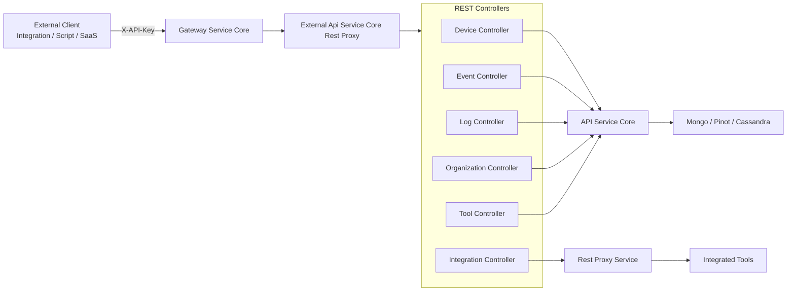
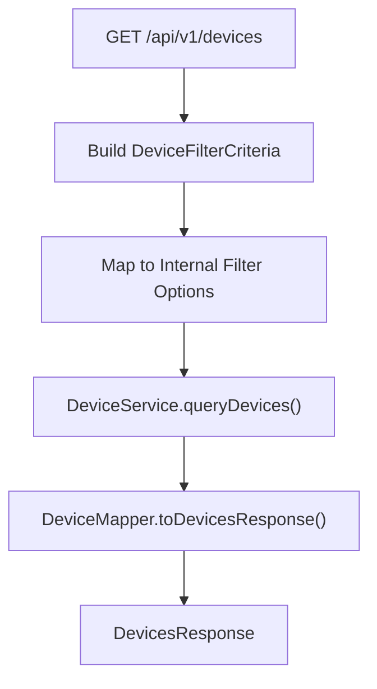
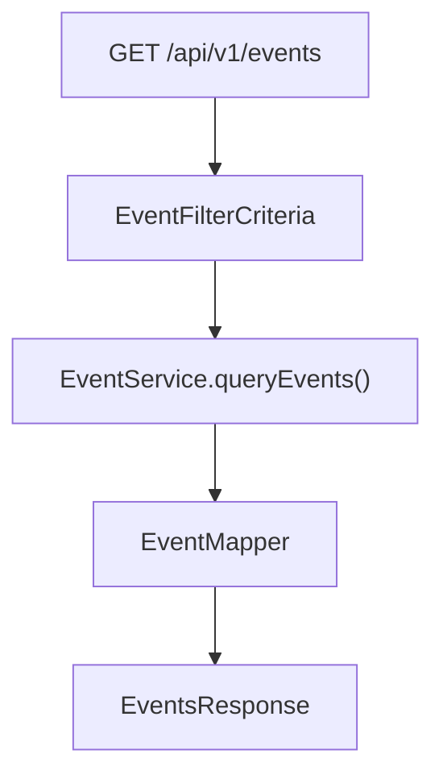
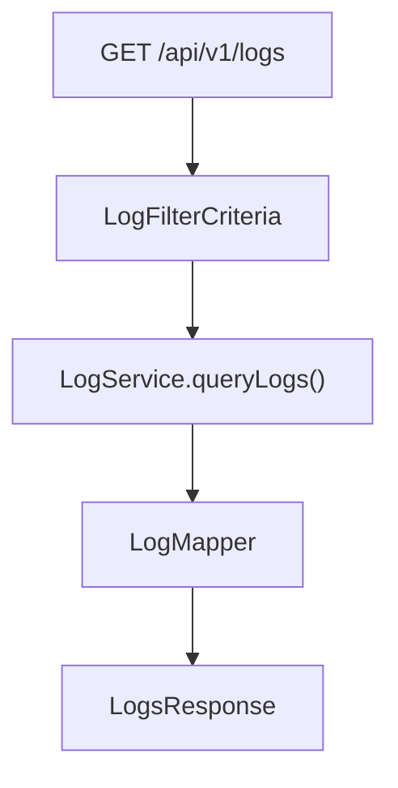
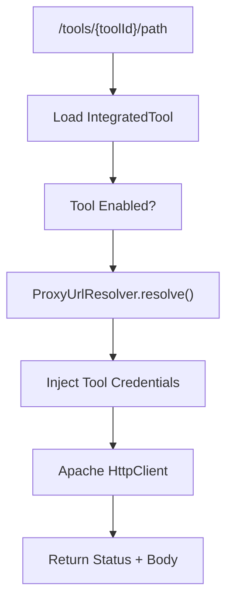

# External Api Service Core Rest Proxy

The **External Api Service Core Rest Proxy** module exposes a secure, API key–protected REST interface for external integrations with the OpenFrame platform. It acts as:

- A **public-facing REST layer** for devices, events, logs, organizations, and tools
- A **filtering, pagination, and sorting facade** over internal core services
- A **reverse proxy** for integrated third-party tools
- A **documented OpenAPI surface** for external developers

This module is the primary entry point for machine-to-machine integrations using API keys.

---

## 1. Architectural Overview

At a high level, the module sits between external consumers and the internal API, data, and tool infrastructure.



### Responsibilities

| Layer | Responsibility |
|--------|---------------|
| Controllers | HTTP contract, validation, headers, response shaping |
| DTOs | Public REST API schema (external-facing contract) |
| Mappers | Translate between internal DTOs and external DTOs |
| Rest Proxy Service | Secure forwarding of tool API calls |
| OpenAPI Config | Swagger/OpenAPI documentation + security scheme |

---

## 2. Authentication & Security Model

Authentication is API key–based.

### API Key Header

All endpoints require:

```text
X-API-Key: ak_keyId.sk_secretKey
```

The Gateway layer validates the key and injects internal headers:

- `X-User-Id`
- `X-API-Key-Id`

Controllers log these values for traceability but do not perform key validation directly.

### Security Scheme (OpenApiConfig)

The module defines:

- `ApiKeyAuth` security scheme
- Default rate limiting description
- Standardized error codes
- Grouped API paths under `/api/v1/**` and `/tools/**`

---

## 3. REST Controllers

The module exposes multiple domain-specific controllers.

---

### 3.1 Device Controller

**Base Path:** `/api/v1/devices`

Supports:

- Cursor-based pagination
- Multi-field filtering
- Tag inclusion
- Sorting
- Status updates



Key features:

- `includeTags=true` triggers additional tag loading via `TagService`
- Graceful fallback if tag loading fails
- Supports `limit` (1–100) with default 20
- Cursor-based pagination

### Device Data Model (External)

The `DeviceResponse` DTO includes:

- Machine metadata
- OS details
- Status and timestamps
- Associated tags

Filtering uses:

- `DeviceFilterCriteria`
- `PaginationCriteria`
- `SortCriteria`

---

### 3.2 Event Controller

**Base Path:** `/api/v1/events`

Capabilities:

- Query events with filters
- Cursor pagination
- Sorting
- Create and update events
- Retrieve filter metadata



Supports filtering by:

- `userIds`
- `eventTypes`
- `startDate` / `endDate`
- `search`

---

### 3.3 Log Controller

**Base Path:** `/api/v1/logs`

Provides:

- Log querying with rich filters
- Filter metadata discovery
- Detailed log retrieval



Filter dimensions include:

- Date range
- Tool types
- Event types
- Severities
- Organization IDs
- Device ID

Detailed log lookup requires composite identifiers:

- `ingestDay`
- `toolType`
- `eventType`
- `timestamp`
- `toolEventId`

---

### 3.4 Organization Controller

**Base Path:** `/api/v1/organizations`

Provides full CRUD for organizations:

- Query with filters and sorting
- Retrieve by ID
- Retrieve by business `organizationId`
- Create
- Update
- Delete (with validation)

Deletion safeguards:

- Throws conflict if organization has associated machines

Pagination includes:

- `hasNextPage`
- `hasPreviousPage`
- Cursor markers

---

### 3.5 Tool Controller

**Base Path:** `/api/v1/tools`

Exposes integrated tool metadata:

- Enabled state
- Category and type
- Platform classification
- Tool URLs
- Credentials metadata (masked)

Filtering supports:

- `enabled`
- `type`
- `category`
- `search`

---

### 3.6 Integration Controller (Proxy Layer)

**Base Path:** `/tools/{toolId}/**`

This controller delegates to the **Rest Proxy Service** and allows dynamic HTTP forwarding.



---

## 4. Rest Proxy Service

The `RestProxyService` is responsible for:

1. Validating tool existence
2. Ensuring tool is enabled
3. Resolving API URL
4. Injecting authentication headers
5. Executing outbound HTTP request
6. Returning raw response

### Credential Injection

Depending on `APIKeyType`:

- `HEADER` → Custom header
- `BEARER_TOKEN` → `Authorization: Bearer token`
- `NONE` → No credential injection

### HTTP Configuration

- Connection timeout: 10 seconds
- Response timeout: 60 seconds
- Uses Apache HttpClient

---

## 5. Pagination and Sorting Model

The module standardizes pagination across resources.


### PaginationCriteria

- `cursor`
- `limit` (default 20, max 100)

### SortCriteria

- `field`
- `direction` (`ASC` or `DESC`)

---

## 6. Data Flow to Internal Services

Controllers do not access the database directly.

They delegate to services from:

- API Service Core (business logic)
- Data Layer (Mongo, Pinot, Cassandra)
- Tool URL and repository services

This keeps the External Api Service Core Rest Proxy strictly as:

- Contract layer
- Translation layer
- Proxy layer

---

## 7. Error Handling Strategy

Standard HTTP status codes are used:

| Code | Meaning |
|------|---------|
| 200 | Success |
| 201 | Created |
| 204 | No Content |
| 400 | Bad Request |
| 401 | Unauthorized |
| 404 | Not Found |
| 409 | Conflict |
| 429 | Rate Limited |
| 500 | Internal Error |

Domain-specific exceptions:

- `DeviceNotFoundException`
- `EventNotFoundException`
- `OrganizationNotFoundException`
- `LogNotFoundException`

---

## 8. How This Module Fits in the Overall Platform

Within the OpenFrame architecture:

- **Gateway Service Core** handles edge security and routing
- **Authorization Server Core** handles identity and OAuth
- **API Service Core** handles internal domain logic
- **Data Layer** handles persistence
- **External Api Service Core Rest Proxy** exposes controlled external REST access

It is intentionally separated from the internal API to:

- Stabilize public contracts
- Prevent internal model leakage
- Enforce API key boundaries
- Provide integration-specific behaviors

---

## 9. Summary

The **External Api Service Core Rest Proxy** module is the public integration surface of the OpenFrame platform.

It provides:

- Secure API key–based REST endpoints
- Unified filtering, sorting, and pagination
- Tool proxy capabilities
- OpenAPI documentation
- Strict separation from internal services

This makes it safe, extensible, and integration-ready for external systems such as:

- MSP automation platforms
- RMM tools
- SIEM pipelines
- Custom enterprise integrations

It is a critical boundary module that bridges external consumers with internal OpenFrame capabilities while maintaining security and architectural integrity.
