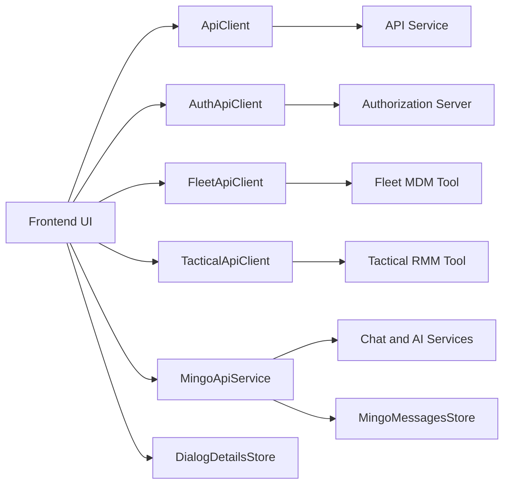
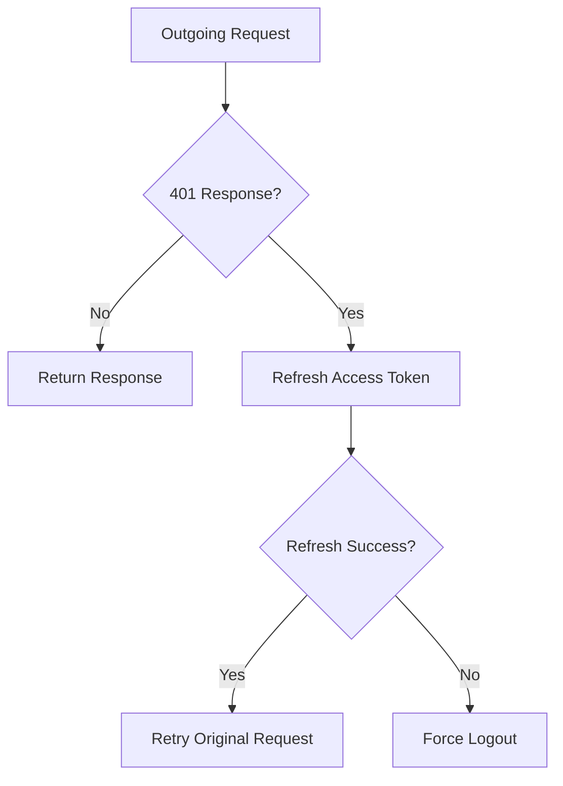
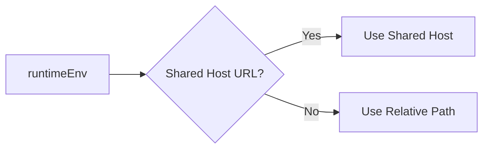
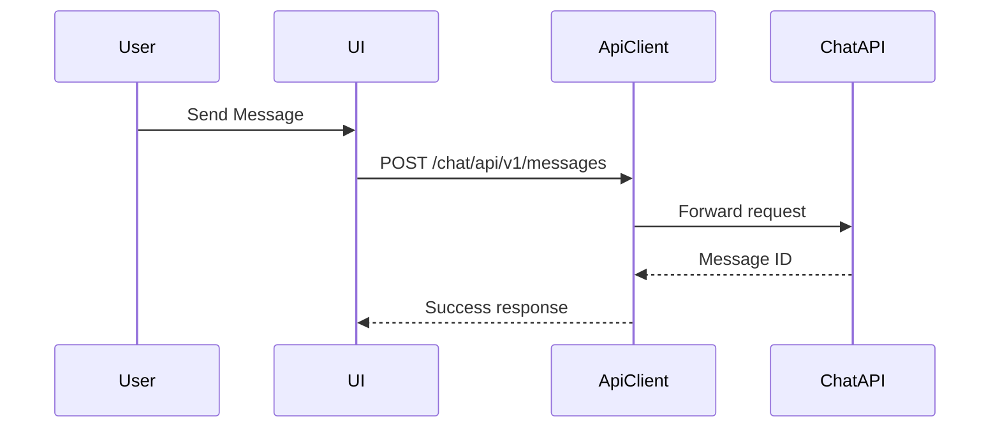
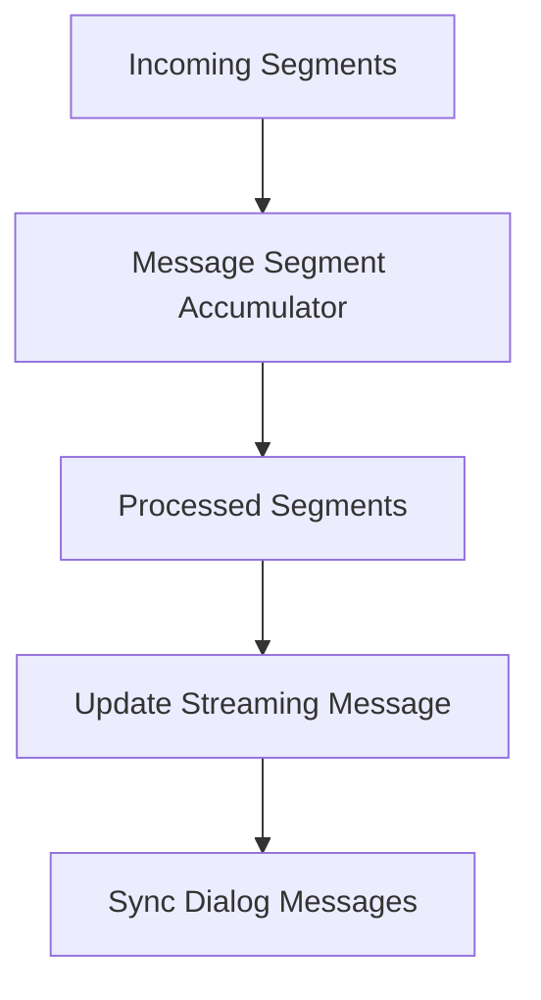
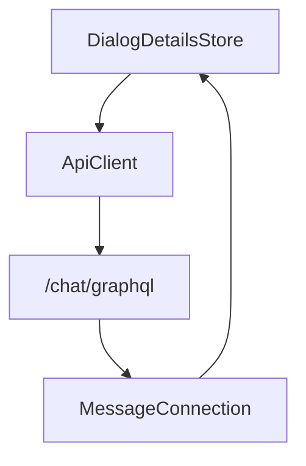
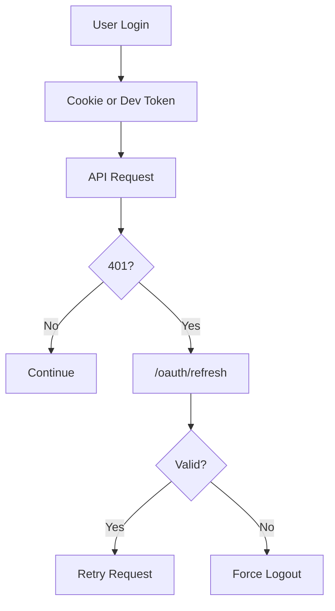

# Frontend Tenant Api Clients And Mingo

The **Frontend Tenant Api Clients And Mingo** module provides the client-side integration layer between the OpenFrame frontend application and backend services. It centralizes:

- Authenticated HTTP communication
- Multi-tenant and SaaS-aware authentication flows
- Tool-specific API integrations (Fleet MDM, Tactical RMM)
- Mingo AI chat orchestration
- Real-time dialog and message state management

This module acts as the frontend gateway to the broader OpenFrame platform, including the API Service, Authorization Server, Gateway, Chat services, and integrated tools.

---

## High-Level Responsibilities

1. **Centralized API communication** via `ApiClient`
2. **Authentication lifecycle handling** via `AuthApiClient`
3. **Tool integrations** via `FleetApiClient` and `TacticalApiClient`
4. **Mingo AI chat operations** via `MingoApiService` and hooks
5. **Dialog and message state orchestration** via Zustand stores

---

## Architecture Overview



The `ApiClient` is the foundational abstraction. All other clients and services either extend or depend on it.

---

# Core Components

## 1. ApiClient

**Component:** `ApiClient`

The `ApiClient` is the central HTTP abstraction layer.

### Key Features

- Automatic JSON handling
- Cookie-based and header-based authentication
- Dev ticket token support via `localStorage`
- Automatic token refresh
- Request retry queue during refresh
- Graceful logout handling on auth failure
- Support for absolute and tenant-based URLs

### Authentication Flow



The client prevents infinite loops by:
- Skipping refresh on `/auth` pages
- Retrying only once per request
- Serializing concurrent refresh attempts

---

## 2. AuthApiClient

**Component:** `AuthApiClient`

Dedicated client for authentication endpoints:

- `/oauth/*`
- `/oauth/refresh`
- SaaS tenant discovery
- Domain availability checks
- Password reset
- Invitation acceptance
- SSO flows (Google, Microsoft)

### Responsibilities

- Refresh token handling
- Dev ticket exchange
- Shared-host SaaS routing
- Public unauthenticated requests
- Redirect-based OAuth login and logout

### SaaS-Aware URL Resolution



This allows the same frontend to operate in:
- Local development
- Tenant-specific deployments
- Shared SaaS environments

---

## 3. FleetApiClient

**Component:** `FleetApiClient`

Specialized client for Fleet MDM tool integration.

### Base URL Strategy

```text
{tenantHost}/tools/fleetmdm-server
```

### Supported Domains

- Policies
- Queries
- Hosts
- Teams
- Labels
- Packs

All methods delegate actual HTTP execution to `ApiClient`, ensuring consistent authentication and retry behavior.

---

## 4. TacticalApiClient

**Component:** `TacticalApiClient`

Specialized client for Tactical RMM tool integration.

### Base URL Strategy

```text
{tenantHost}/tools/tactical-rmm
```

### Supported Capabilities

- Agent management
- Script execution
- Script scheduling
- Task scheduling
- Logs, services, processes
- System diagnostics

Like Fleet, it reuses `ApiClient` for transport and authentication handling.

---

# Mingo AI Chat Layer

The Mingo subsystem provides AI-powered chat interactions within the tenant frontend.

It includes:

- API mutation service
- React hooks
- Dialog and message types
- Real-time state store
- GraphQL integration for chat history

---

## 5. MingoApiService

Provides React Query mutations for:

- Creating dialogs
- Sending messages
- Approving or rejecting AI-triggered approval requests

### Example Flow



All mutations:
- Validate responses
- Throw structured errors
- Integrate with toast notifications on failure

---

## 6. useMingoDialog Hook

Encapsulates:

- Dialog creation
- Message sending
- Toast-based error handling
- Automatic dialog initialization
- Reset logic

It ensures:
- A dialog exists before sending messages
- Empty messages are rejected
- Mutations are serialized per dialog

---

## 7. MingoMessagesStore

**State management engine for chat dialogs.**

Built using Zustand with devtools support.

### Core State

- `messagesByDialog`
- `streamingMessages`
- `segmentAccumulators`
- `typingStates`
- `unreadCounts`
- Pagination cursors

### Streaming Message Processing



The accumulator supports:

- Text streaming
- Tool execution segments
- Approval requests
- Approval state updates

This enables rich AI responses with structured segments.

---

## 8. DialogDetailsStore

Handles GraphQL-based dialog retrieval for ticket views.

### Responsibilities

- Fetch single dialog
- Fetch paginated messages
- Poll for new messages
- Separate client and admin messages
- Merge streaming text chunks
- Maintain typing indicators

### GraphQL Interaction Pattern



The store ensures:

- No duplicate messages
- Cursor-based pagination
- Efficient polling updates

---

# Type System and Message Modeling

### Dialog Types

- `DialogNode`
- `DialogConnection`
- `DialogsResponse`
- `DialogResponse`

### Message Types

- `GraphQLMessage`
- `CoreMessage`
- `MessagesResponse`

These types:
- Normalize backend GraphQL responses
- Support structured AI message segments
- Provide runtime type guards

---

# Authentication and Token Lifecycle Summary



This unified mechanism is shared across:

- Core API requests
- Tool integrations
- Chat requests
- GraphQL queries

---

# How This Module Fits Into OpenFrame

The **Frontend Tenant Api Clients And Mingo** module serves as the frontend integration boundary for:

- API Service (business APIs)
- Authorization Server (OAuth2 + tenant resolution)
- Gateway (proxy and security enforcement)
- Fleet MDM
- Tactical RMM
- Chat and AI services

It ensures:

- Multi-tenant safety
- Consistent authentication
- Centralized error handling
- Tool abstraction
- AI chat orchestration
- Reactive state synchronization

Without this module, the frontend would require duplicated authentication logic, fragmented tool integrations, and inconsistent chat handling.

---

# Summary

The **Frontend Tenant Api Clients And Mingo** module is the frontend’s transport, authentication, and AI orchestration layer.

It provides:

- A resilient, refresh-aware HTTP client
- SaaS-aware auth routing
- Tool-specific API wrappers
- AI dialog lifecycle management
- Streaming message handling
- Structured GraphQL integration
- Centralized state stores

It is foundational to delivering a secure, multi-tenant, AI-enabled OpenFrame frontend experience.