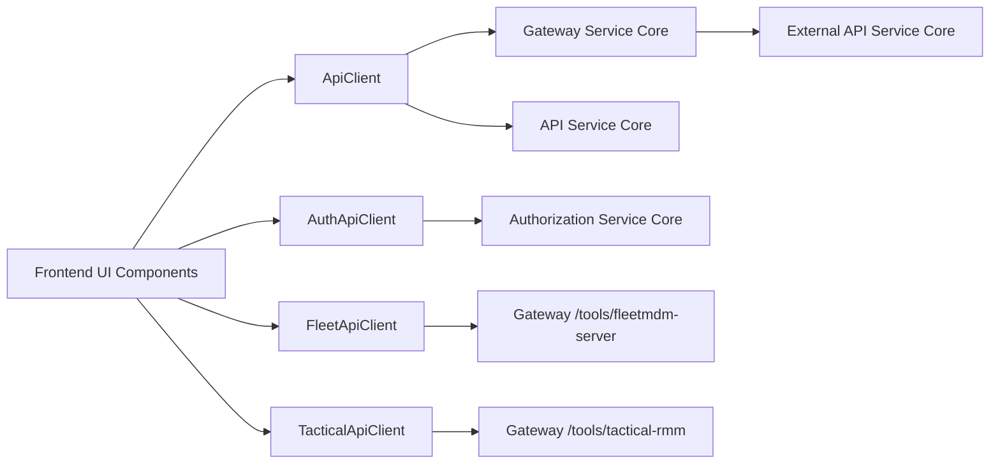
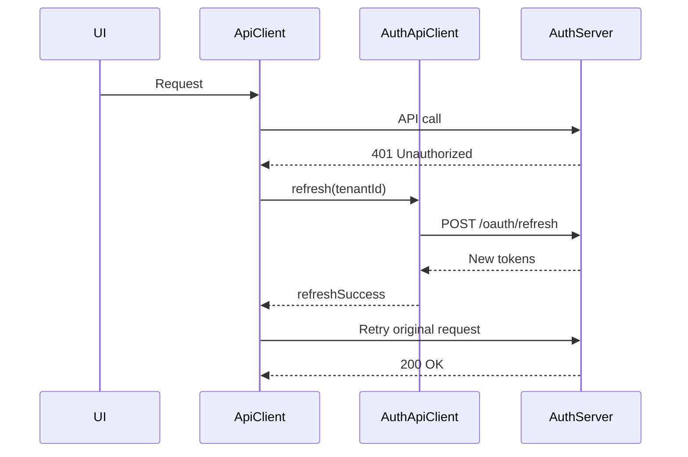
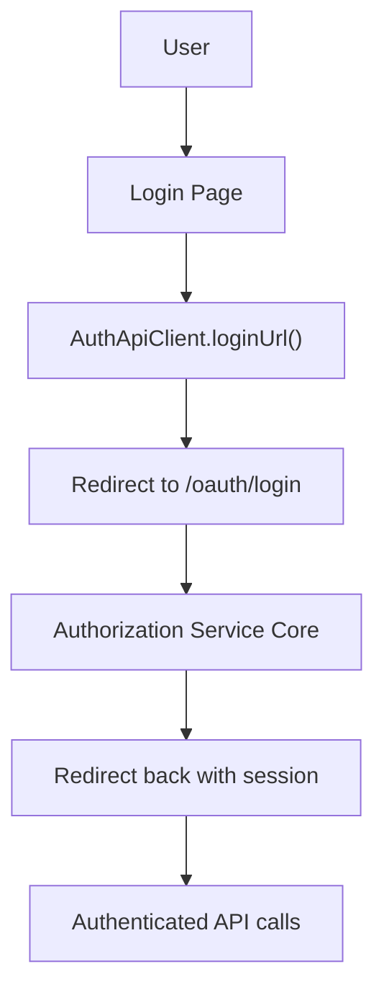
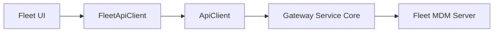
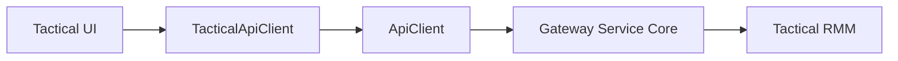
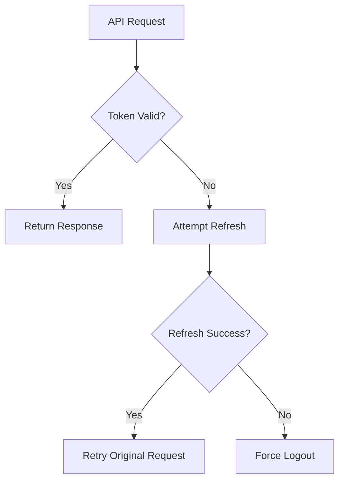

# Frontend Tenant App Core

## Overview

The **Frontend Tenant App Core** module provides the centralized API communication layer for the OpenFrame tenant-facing frontend application. It encapsulates:

- Authentication-aware HTTP communication
- Token refresh and logout orchestration
- Multi-tenant host resolution
- Tool-specific API clients (Fleet MDM and Tactical RMM)
- SaaS and shared-host authentication flows

This module acts as the boundary between the UI layer and the backend service ecosystem, including:

- API Service Core
- Authorization Service Core
- Gateway Service Core
- External API Service Core
- Tool backends (Fleet MDM, Tactical RMM)

It ensures consistent request handling, token lifecycle management, and environment-aware URL resolution across all frontend features.

---

## Architectural Role in the System

The Frontend Tenant App Core sits between UI components and backend microservices.



### Responsibilities

- Centralized `fetch` abstraction
- Automatic inclusion of cookies and/or bearer tokens
- Automatic token refresh handling
- Request queuing during concurrent refresh operations
- Tool-specific endpoint abstraction
- SaaS-aware URL routing

---

## Core Components

The module is composed of four primary clients:

1. **ApiClient** – General-purpose authenticated API client
2. **AuthApiClient** – Dedicated authentication and SaaS flows client
3. **FleetApiClient** – Fleet MDM tool client
4. **TacticalApiClient** – Tactical RMM tool client

---

# ApiClient

**Source:** `src/lib/api-client.ts`

The `ApiClient` is the foundation of all authenticated communication with tenant-scoped backend services.

## Key Features

- Cookie-based auth support (`credentials: include`)
- Header-based bearer token support (Dev Ticket mode)
- Automatic 401 detection
- Single-flight token refresh logic
- Request retry queue
- Unified logout handling

## Authentication Strategy

The client supports two modes:

1. **Cookie-based authentication** (default production mode)
2. **Header-based bearer token authentication** (Dev Ticket mode)

### Dev Ticket Mode

When enabled:

- Access token is read from `localStorage`
- `Authorization: Bearer <token>` header is injected
- Refresh token may be stored in `localStorage`

---

## Token Refresh Flow

The refresh logic prevents race conditions using a single refresh promise and a request queue.



### Concurrency Handling

- `isRefreshing` flag prevents duplicate refresh calls
- `refreshPromise` ensures all callers await the same refresh
- `requestQueue` stores retry callbacks
- All queued requests replay after refresh

If refresh fails:

- Tokens are cleared
- `forceLogout()` is triggered
- UI is redirected to login

---

## URL Resolution

`buildUrl()` behavior:

1. Absolute URLs pass through
2. If `tenantHostUrl()` is defined → prefix host
3. Otherwise → use relative path

This allows:

- Local development
- Multi-tenant SaaS
- Reverse proxy deployments

---

# AuthApiClient

**Source:** `src/lib/auth-api-client.ts`

The `AuthApiClient` is dedicated to authentication, tenant discovery, registration, SSO, and OAuth lifecycle endpoints.

It communicates primarily with the **Authorization Service Core**.

## Responsibilities

- `/oauth/*` flows
- Token refresh
- Tenant discovery
- Tenant availability checks
- Invitation acceptance
- SSO registration
- Password reset
- Login/logout URL generation

---

## SaaS and Shared Host Awareness

`sharedHostUrl()` determines whether requests target:

- Shared authentication host (SaaS mode)
- Current tenant domain

Domain suffix extraction ensures proper subdomain construction for multi-tenant registration.

---

## Public vs Authenticated Requests

The client distinguishes between:

- `request()` → authenticated
- `requestRefresh()` → refresh endpoint with special header handling
- `requestPublic()` → no credentials

---

## OAuth Login Flow



The login URL is dynamically generated based on:

- Tenant ID
- Provider (Google, Microsoft, OpenFrame SSO)
- SaaS shared mode
- Optional redirect target

---

# FleetApiClient

**Source:** `src/lib/fleet-api-client.ts`

The `FleetApiClient` provides a typed abstraction over Fleet MDM endpoints.

All requests are proxied through:

```
/tools/fleetmdm-server
```

via the Gateway Service Core.

## Architecture



## Functional Areas

- Policies (CRUD + run)
- Queries (CRUD + live execution)
- Hosts
- Teams
- Labels
- Packs

Each method maps to Fleet's `/api/latest/fleet/*` structure.

The client delegates authentication and retry behavior entirely to `ApiClient`.

---

# TacticalApiClient

**Source:** `src/lib/tactical-api-client.ts`

The `TacticalApiClient` provides access to Tactical RMM endpoints through:

```
/tools/tactical-rmm
```

## Architecture



## Functional Areas

- Agents
- Scripts
- Script execution
- Bulk actions
- Logs
- Checks
- Services
- Processes
- Event logs
- Scheduled tasks

All authentication and retry logic is inherited from the base `ApiClient`.

---

# End-to-End Authentication Model

The combined behavior of `ApiClient` and `AuthApiClient` produces a resilient auth model:



## Guarantees

- Single refresh in flight
- No infinite refresh loops
- No refresh attempt on auth pages
- Graceful abort handling
- Centralized logout reason propagation

---

# Environment Awareness

The module adapts to:

- Local development
- Reverse proxy deployments
- Shared SaaS host mode
- Tenant-specific subdomains
- Dev Ticket mode (header tokens)

Configuration is derived from:

- `runtimeEnv`
- `tenantHostUrl()`
- `sharedHostUrl()`
- `enableDevTicketObserver()`

---

# Integration with Backend Modules

The Frontend Tenant App Core interacts with the following backend layers:

- Authorization Service Core → OAuth, SSO, token refresh
- API Service Core → Tenant APIs (`/api/*`)
- Gateway Service Core → Routing, CORS, JWT validation, tool proxying
- External API Service Core → Public-facing integrations

It does not implement business logic; it strictly handles:

- Transport
- Authentication lifecycle
- URL resolution
- Retry semantics

---

# Design Principles

1. **Single source of truth for HTTP communication**
2. **Separation of authentication from business APIs**
3. **Tool-specific clients layered on a shared base client**
4. **Race-condition-safe refresh logic**
5. **Environment-driven configuration**
6. **Backend-agnostic UI layer**

---

# Summary

The **Frontend Tenant App Core** module provides the secure, multi-tenant, and tool-aware API abstraction layer that powers all frontend-to-backend communication in OpenFrame.

It ensures:

- Reliable token lifecycle management
- Safe concurrent refresh handling
- SaaS-ready multi-tenant routing
- Unified tool integrations (Fleet & Tactical)
- Clean separation between UI and backend transport logic

This module is foundational to the stability, scalability, and security of the OpenFrame tenant frontend architecture.