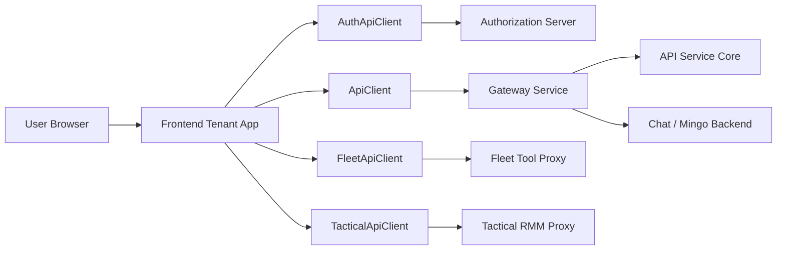
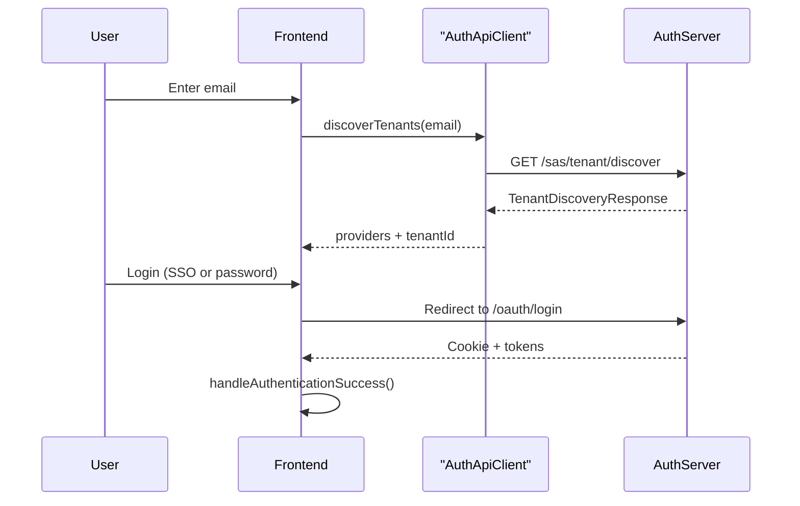
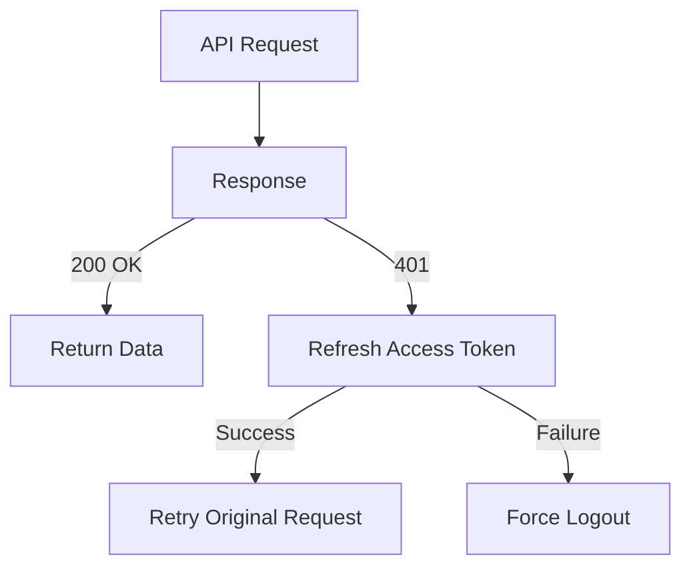
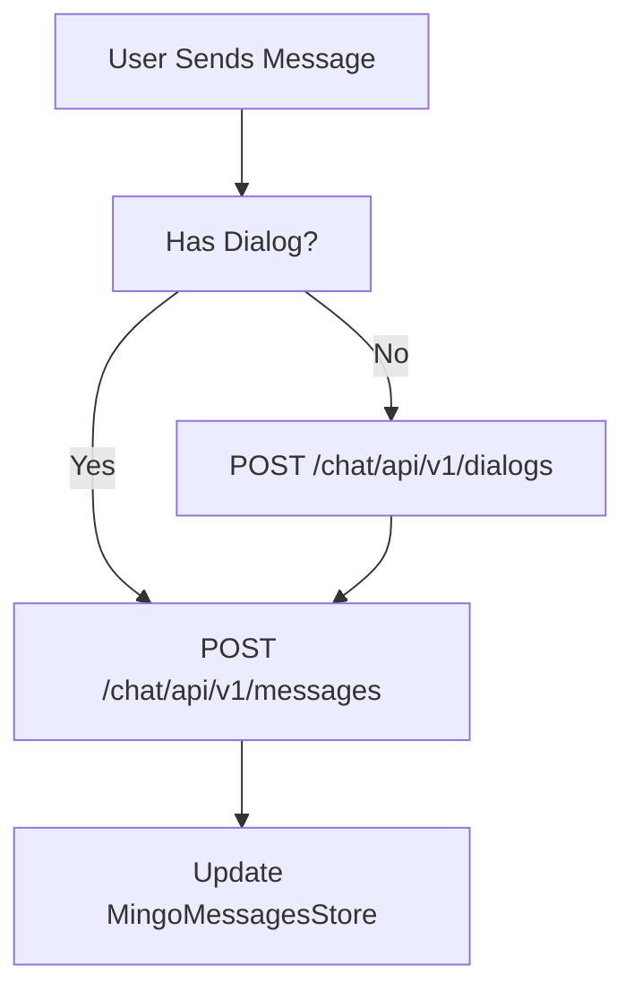
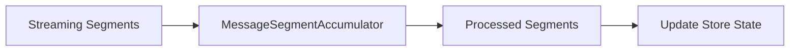

# Frontend Tenant App Api Clients And Mingo

## Overview

The **Frontend Tenant App Api Clients And Mingo** module represents the browser-based tenant application for OpenFrame. It is responsible for:

- Tenant-aware authentication and SSO flows
- Centralized API communication (REST + GraphQL)
- AI chat (Mingo) dialog lifecycle and real-time message handling
- Ticket dialogs and conversation management
- Integration with external tools such as Fleet and Tactical RMM
- Deployment-mode detection (cloud, self-hosted, development)

This module acts as the presentation and interaction layer on top of backend services such as:

- API Service Core (REST + GraphQL)
- Authorization Server Core and Tenant Context
- Gateway Service Core
- External API Service Core

---

## High-Level Architecture



### Key Responsibilities

| Area | Responsibility |
|------|----------------|
| Authentication | Tenant discovery, SSO, token refresh, logout |
| API Communication | Unified REST + GraphQL client with automatic refresh |
| Mingo AI | Dialog creation, message streaming, approvals |
| Tickets | Dialog list, details, pagination, real-time updates |
| Tool Integrations | Fleet and Tactical API wrappers |
| Deployment | Runtime environment detection |

---

# 1. Authentication Layer

Core files:

- `use-auth.ts`
- `use-invite-providers.ts`
- `use-registration-providers.ts`
- `auth-api-client.ts`

## Authentication Flow



## `TenantInfo`

Defined in `use-auth.ts`:

```text
TenantInfo
- tenantId?: string
- tenantName: string
- tenantDomain: string
```

It represents the selected tenant context after discovery.

## `useAuth()` Hook

Responsibilities:

- Tenant discovery (`discoverTenants`)
- Organization registration (password + SSO)
- SSO login redirection
- Token storage (access + refresh)
- Periodic `/api/me` validation
- Automatic logout on expiration

### Token Strategy

The system supports:

1. Cookie-based authentication (default)
2. Header-based token mode (DevTicket observer enabled)

When enabled:

- Access token stored in `localStorage`
- Refresh token used for silent refresh
- `ApiClient` injects `Authorization: Bearer <token>`

---

# 2. Central API Layer

Core files:

- `api-client.ts` → `ApiClient`
- `auth-api-client.ts` → `AuthApiClient`
- `fleet-api-client.ts` → `FleetApiClient`
- `tactical-api-client.ts` → `TacticalApiClient`

## ApiClient

`ApiClient` is the unified HTTP abstraction used by all frontend features.

### Features

- Automatic JSON parsing
- Cookie + header auth support
- 401 interception
- Token refresh queueing
- Request retry after refresh
- Forced logout on refresh failure

### 401 Handling Logic



This guarantees:

- Only one refresh call at a time
- Queued requests replayed after refresh
- No infinite loops on auth pages

## AuthApiClient

Dedicated to:

- `/oauth/*`
- `/sas/*`
- `/api/tenant/availability`
- `/oauth/refresh`

Supports:

- Tenant-aware login URL generation
- Invitation acceptance
- Password reset flows
- Public vs authenticated endpoints

## FleetApiClient

Base path:

```text
/tools/fleetmdm-server
```

Supports:

- Policies CRUD
- Queries CRUD + live run
- Hosts and teams
- Labels and packs

Delegates transport to `ApiClient`.

## TacticalApiClient

Base path:

```text
/tools/tactical-rmm
```

Supports:

- Agents
- Scripts
- Scheduled tasks
- Logs and system info

Also reuses `ApiClient` for auth + refresh.

---

# 3. Mingo AI Chat System

Core files:

- `use-mingo-dialog.ts`
- `mingo-api-service.ts`
- `mingo-messages-store.ts`
- `dialog.types.ts`
- `message.types.ts`

## Dialog Lifecycle



## `useMingoDialog()`

Responsibilities:

- Create dialog
- Send message
- Auto-create dialog if missing
- Toast-based error reporting
- Query invalidation for dialog lists

## `MingoApiService`

Provides React Query mutations for:

- Create dialog
- Send message
- Approve request
- Reject request

Endpoints:

```text
POST /chat/api/v1/dialogs
POST /chat/api/v1/messages
POST /chat/api/v1/approval-requests/{id}/approve
```

## `MingoMessagesStore`

A Zustand store managing:

- `messagesByDialog: Map<string, Message[]>`
- Streaming state
- Typing indicators
- Unread counters
- Pagination cursors
- Approval status updates

### Streaming Model



The accumulator:

- Merges text chunks
- Handles tool executions
- Tracks approval request segments
- Updates approval status dynamically

---

# 4. Ticket Dialog System (GraphQL)

Core files:

- `use-dialogs-query.ts`
- `use-dialog-details.ts`
- `use-dialog-messages.ts`
- `dialog-details-store.ts`

## GraphQL Pattern

All dialog queries use:

```text
POST /chat/graphql
```

With:

- Query string
- Variables

## Dialog List Query

`useDialogsQuery()`:

- Uses React Query
- Supports archived + status filtering
- Cursor-based pagination
- SLA sorting

## Dialog Details + Messages

`useDialogDetails()` → single dialog

`useDialogMessages()` → paginated messages

Supports:

- Full pagination loops
- GraphQL error extraction
- Toast error reporting

## Real-Time Handling

`DialogDetailsStore` adds:

- Realtime message merging
- Assistant text concatenation
- Typing indicators
- Separate client vs admin messages

---

# 5. Deployment Detection

Core file:

- `use-deployment.ts`

## DeploymentState

```text
DeploymentState
- deployment: DeploymentInfo | null
- isInitialized: boolean
- initialize()
- reset()
```

Uses:

- `detectDeployment()` from runtime utilities
- Global Zustand store

Provides convenience flags:

- `isCloud`
- `isSelfHosted`
- `isDevelopment`

This allows UI behavior to change depending on:

- SaaS shared mode
- Local development
- Self-hosted tenant

---

# 6. Cross-Cutting Design Principles

## 1. Tenant-Aware Everywhere

All flows rely on:

- `tenantId`
- Shared host URL
- Runtime environment detection

## 2. Centralized API Control

All HTTP traffic goes through:

- `ApiClient`
- `AuthApiClient`

No direct `fetch()` calls outside those abstractions.

## 3. Strong State Separation

- Auth state → `useAuthStore`
- Deployment state → `useDeploymentStore`
- Mingo state → `useMingoMessagesStore`
- Ticket state → `DialogDetailsStore`

## 4. Progressive Enhancement

- Works with cookie-only auth
- Enhances with header tokens in dev mode
- Refresh is transparent to UI

---

# Conclusion

The **Frontend Tenant App Api Clients And Mingo** module is the orchestration layer of the OpenFrame tenant experience.

It unifies:

- Tenant-aware authentication
- Resilient API communication with refresh logic
- AI-powered Mingo chat
- GraphQL-driven ticket dialogs
- Tool integrations (Fleet + Tactical)
- Deployment-aware runtime behavior

Through centralized clients, structured Zustand stores, and React Query integration, it provides a scalable and maintainable frontend architecture tightly aligned with the OpenFrame backend service ecosystem.
