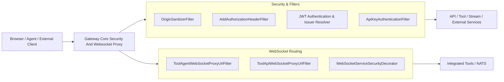
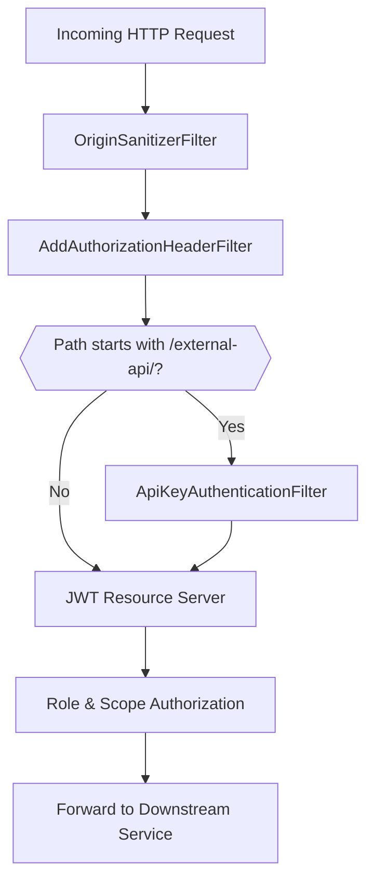
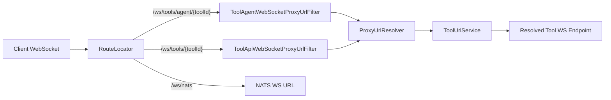
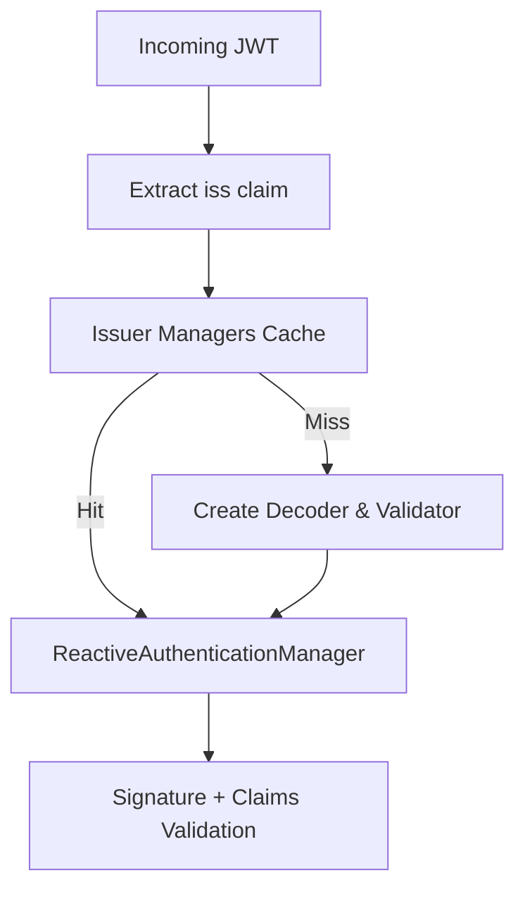
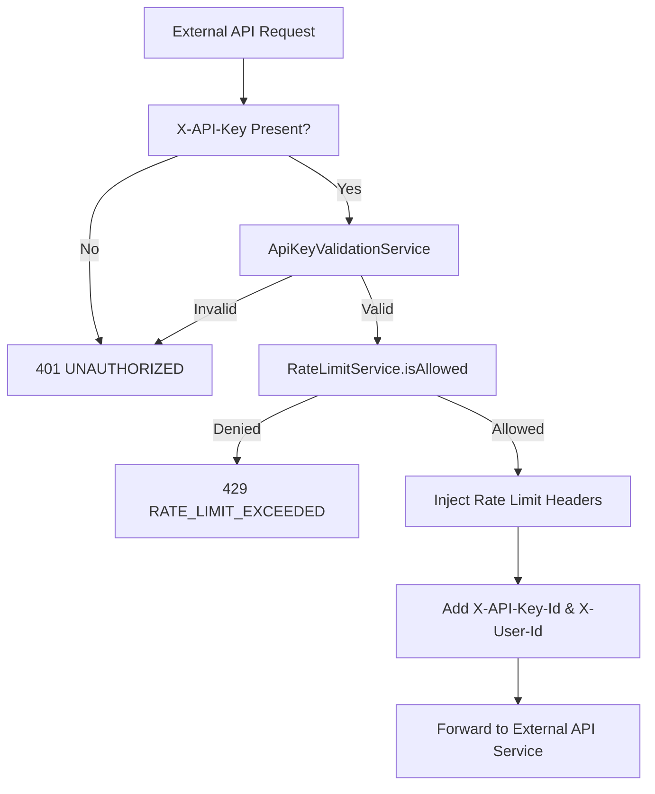

# Gateway Core Security And Websocket Proxy

## Overview

The **Gateway Core Security And Websocket Proxy** module is the reactive edge layer of the OpenFrame platform. It is responsible for:

- Enforcing authentication and authorization (JWT, roles, scopes)
- Validating and rate-limiting API keys for external APIs
- Resolving multi-tenant JWT issuers dynamically
- Normalizing and securing inbound HTTP and WebSocket traffic
- Proxying WebSocket connections to integrated tools and NATS
- Providing a hardened boundary between clients and downstream services

Built on **Spring Cloud Gateway** and **Spring WebFlux Security**, this module acts as a policy enforcement point (PEP) and protocol-aware reverse proxy for both HTTP and WebSocket traffic.

---

## High-Level Architecture



The module is logically divided into:

1. **HTTP Security & Authentication**
2. **API Key Enforcement & Rate Limiting**
3. **Multi-Tenant JWT Issuer Resolution**
4. **WebSocket Proxy & Security Decoration**
5. **Reactive WebClient Configuration**

---

## Request Processing Flow (HTTP)



---

# Core Components

## 1. HTTP Client Configuration

### `WebClientConfig`

Provides a preconfigured `WebClient.Builder` with:

- 30s connect timeout
- 30s response timeout
- Netty read/write timeout handlers

This ensures:

- Consistent outbound HTTP behavior
- Protection against hanging downstream connections
- Reactive, non-blocking integration with internal services

---

## 2. WebSocket Gateway & Proxying

### `WebSocketGatewayConfig`

Defines WebSocket routes using Spring Cloud Gateway:

- `/ws/tools/agent/{toolId}/**` → Agent tool WebSocket proxy
- `/ws/tools/{toolId}/**` → Tool API WebSocket proxy
- `/ws/nats` → NATS WebSocket endpoint

It also decorates the default `WebSocketService` with a security-aware wrapper that injects JWT claim awareness into WebSocket sessions.

### WebSocket Routing Model



### `ToolAgentWebSocketProxyUrlFilter`

- Extracts `toolId` from `/ws/tools/agent/{toolId}/...`
- Resolves the correct backend WebSocket URL
- Proxies traffic dynamically

### `ToolApiWebSocketProxyUrlFilter`

- Extracts `toolId` from `/ws/tools/{toolId}/...`
- Uses shared resolution logic
- Ensures tenant-aware routing

These filters enable dynamic, per-tool routing without hardcoding endpoints.

---

## 3. JWT Authentication & Multi-Tenant Support

### `GatewaySecurityConfig`

Configures the reactive security filter chain:

- Disables CSRF, HTTP Basic, Form Login
- Enables OAuth2 Resource Server (JWT)
- Injects `AddAuthorizationHeaderFilter`
- Defines role-based access rules

### Role Model

- `ROLE_ADMIN`
- `ROLE_AGENT`
- `SCOPE_*` authorities

### Path Authorization

| Path Prefix | Required Role |
|-------------|--------------|
| `/api/**` | ADMIN |
| `/tools/agent/**` | AGENT |
| `/ws/tools/agent/**` | AGENT |
| `/chat/**` | ADMIN or AGENT |
| `/clients/**` | AGENT |

Public paths (e.g., metrics, registration endpoints) are explicitly permitted.

---

### `JwtAuthConfig`

Implements dynamic issuer-based authentication:

- Uses `JwtIssuerReactiveAuthenticationManagerResolver`
- Caches `ReactiveAuthenticationManager` instances per issuer
- Applies strict issuer validation
- Supports platform issuer + tenant issuers



### `IssuerUrlProvider`

- Loads tenant IDs from the reactive tenant repository
- Builds allowed issuer URLs
- Caches issuer list
- Supports optional super-tenant issuer

This enables secure multi-tenant token validation without restarting the gateway.

---

## 4. API Key Authentication & Rate Limiting

### `ApiKeyAuthenticationFilter`

Global filter applied to `/external-api/**`.

### Flow



### Features

- Validates API key
- Increments request statistics
- Applies minute/hour/day limits
- Adds standard rate limit headers
- Records success/failure metrics
- Returns structured JSON error responses

### `RateLimitConstants`

Defines structured log message templates for:

- Rate limit checks
- Rate limit status retrieval

---

## 5. Authorization Header Enrichment

### `AddAuthorizationHeaderFilter`

Ensures a Bearer token is available for secured endpoints by resolving it from:

1. Access token cookie
2. Custom `Access-Token` header
3. `authorization` query parameter

If found, it injects:

```text
Authorization: Bearer <token>
```

This enables consistent JWT processing by the resource server.

---

## 6. Origin Hardening

### `OriginSanitizerFilter`

- Removes `Origin: null` header
- Prevents ambiguous CORS behavior
- Executes at highest precedence

---

## 7. CORS Configuration

### `CorsConfig`

- Conditionally enabled
- Binds to `spring.cloud.gateway.globalcors.cors-configurations.[/**]`
- Registers reactive `CorsWebFilter`

Provides centralized cross-origin configuration at the gateway layer.

---

# WebSocket Security Decoration

The gateway decorates the default `WebSocketService` to:

- Extract JWT claims at handshake
- Enforce authentication before upgrade
- Attach security context to session

This ensures parity between HTTP and WebSocket security enforcement.

---

# Integration with the Platform

The **Gateway Core Security And Websocket Proxy** module sits in front of:

- API services
- External API services
- Tool services
- Chat endpoints
- Stream/WebSocket endpoints

It ensures:

- Centralized authentication
- Multi-tenant isolation
- Consistent authorization model
- Rate limiting for public APIs
- Secure WebSocket proxying

---

# Security Guarantees

1. ✅ Strict JWT issuer validation
2. ✅ Role-based path enforcement
3. ✅ API key validation and quota enforcement
4. ✅ Tenant-aware token resolution
5. ✅ Sanitized origins
6. ✅ WebSocket handshake protection
7. ✅ Reactive, non-blocking execution model

---

# Summary

The **Gateway Core Security And Websocket Proxy** module is the security backbone of the OpenFrame edge layer. It combines:

- Reactive JWT authentication
- Multi-tenant issuer resolution
- API key enforcement with rate limiting
- Dynamic WebSocket routing
- Hardened request filtering

By centralizing these concerns, the gateway enables downstream services to focus purely on business logic while inheriting a consistent, scalable, and secure access model.