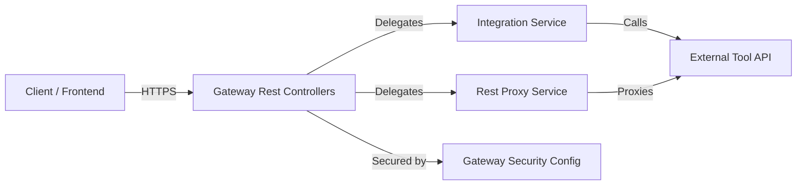
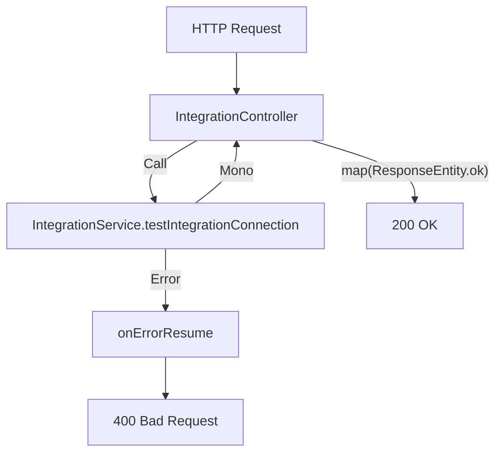
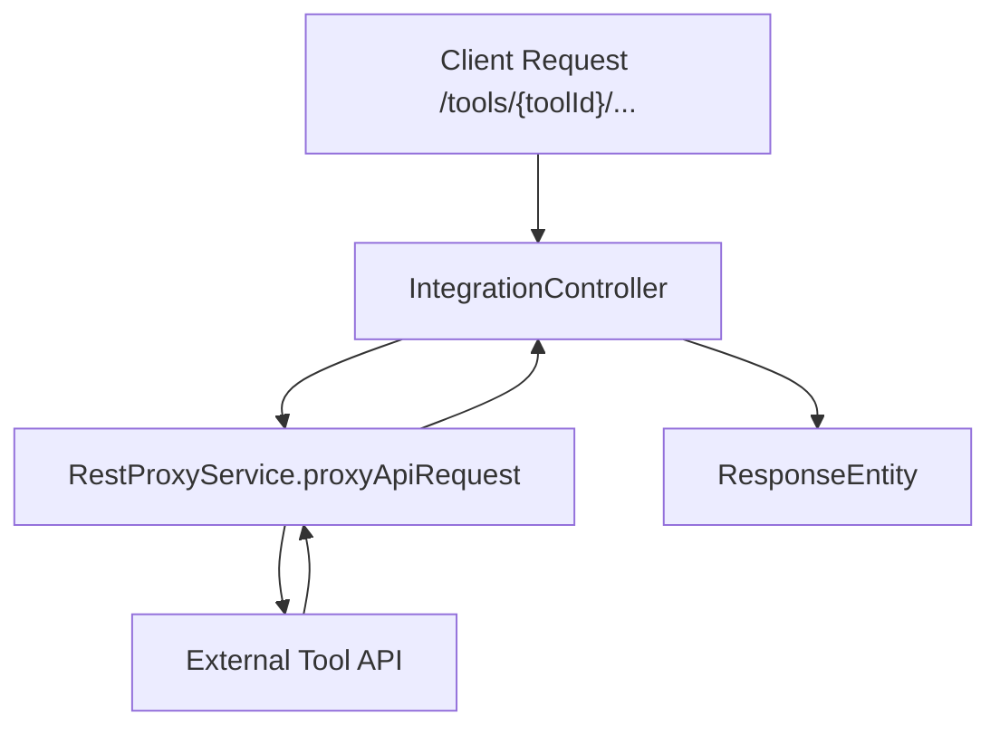
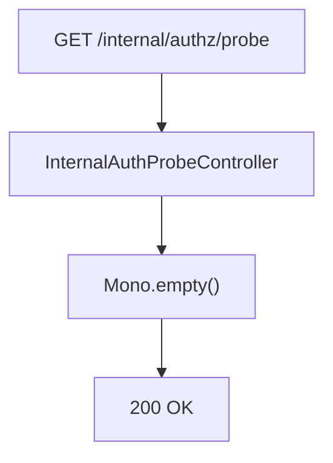

# Gateway Rest Controllers

## Overview

The **Gateway Rest Controllers** module exposes REST endpoints at the API Gateway layer for tool integrations and internal authorization probing. It acts as a thin, reactive HTTP façade that:

- Routes integration health and test requests to downstream integration services
- Proxies tool and agent API traffic to external systems
- Provides an optional internal authorization probe endpoint for platform diagnostics

This module is part of the Gateway Service and works closely with:

- Gateway security and filter configuration (JWT, API key, CORS, rate limiting)
- Integration and proxy services inside the gateway core
- External tool APIs and agent endpoints

All controllers are implemented using **Spring WebFlux** and return `Mono<ResponseEntity<...>>`, ensuring fully non-blocking, reactive request handling.

---

## Architectural Context

At runtime, the Gateway Rest Controllers sit at the edge of the platform and delegate most business logic to services in the gateway core.



### Key Characteristics

- **Reactive stack**: Built on Spring WebFlux (`Mono`-based endpoints)
- **Thin controllers**: No heavy business logic inside controllers
- **Tool-scoped routing**: All integration endpoints are namespaced by `toolId`
- **Security-aware**: Authentication context is available and enforced by upstream security configuration

---

## Core Components

This module contains two primary controllers:

1. **IntegrationController**  
2. **InternalAuthProbeController**

---

# IntegrationController

`IntegrationController` exposes all REST endpoints under the `/tools` base path and is responsible for:

- Health and connectivity checks for integrations
- Test invocation of integrations
- Generic API proxying for tool APIs
- Agent-specific proxy routing

It depends on:

- `IntegrationService` – for validating or testing tool integrations
- `RestProxyService` – for forwarding arbitrary HTTP requests to external tool backends

---

## Endpoint Groups

### 1. Health & Test Endpoints

Base path: `/tools/{toolId}`

- `GET /{toolId}/health`
- `POST /{toolId}/test`

Both endpoints:

- Log the operation
- Delegate to `integrationService.testIntegrationConnection(toolId)`
- Return:
  - `200 OK` with response body on success
  - `400 Bad Request` with error message on failure

### Reactive Flow



The use of `onErrorResume` ensures controlled error handling and consistent HTTP responses.

---

### 2. Tool API Proxy Endpoint

Mapping:

- `/{toolId}/**`
- Supports: `GET`, `POST`, `PUT`, `PATCH`, `DELETE`, `OPTIONS`

This endpoint:

- Extracts the full request path from `ServerHttpRequest`
- Logs the tool and path
- Forwards the request to `restProxyService.proxyApiRequest(toolId, request, body)`

It acts as a **generic reverse proxy** for tool APIs.

#### Request Flow



This design allows the gateway to:

- Inject authentication headers
- Enforce rate limits
- Apply tenant scoping
- Centralize CORS and security policies

without modifying downstream tool APIs.

---

### 3. Agent Proxy Endpoint

Mapping:

- `/agent/{toolId}/**`
- Supports: `GET`, `POST`, `PUT`, `PATCH`, `DELETE`, `OPTIONS`

This endpoint is similar to the general proxy endpoint but explicitly scoped for **agent communication**.

It delegates to:

- `restProxyService.proxyAgentRequest(toolId, request, body)`

This separation enables different routing rules, authentication mechanisms, or header transformations for agent traffic.

---

## Security Model

Although no explicit security annotations are defined inside the controller, it relies on upstream configuration:

- JWT validation
- API key authentication
- CORS configuration
- Rate limiting filters

The `Authentication` parameter in health and test endpoints ensures:

- The request has passed through Spring Security
- User or system identity is available in the security context

Security enforcement occurs before controller invocation.

---

# InternalAuthProbeController

The `InternalAuthProbeController` exposes a minimal internal endpoint used for authorization probing.

Base path:

- `/internal/authz`

Endpoint:

- `GET /internal/authz/probe`

Returns:

- `200 OK`
- Empty body (`Mono<Void>`)

---

## Conditional Activation

This controller is only enabled when the property below is set:

```text
openframe.gateway.internal.enable=true
```

It uses `@ConditionalOnProperty` to ensure the endpoint is not exposed unless explicitly configured.

### Use Cases

- Internal health checks
- Load balancer readiness validation
- Auth pipeline verification
- Platform diagnostics in controlled environments

### Flow



This endpoint contains no business logic and serves purely as a lightweight liveness/auth validation probe.

---

## Reactive Design Principles

Both controllers follow these principles:

- **Non-blocking I/O** using WebFlux
- **Mono-based responses** for single-result async flows
- **Service delegation** to keep controllers thin
- **Centralized error handling** with reactive operators

This ensures the gateway remains scalable under high concurrency, especially when proxying high-volume tool and agent traffic.

---

## Responsibilities Summary

| Component | Responsibility |
|------------|---------------|
| IntegrationController | Tool health checks, integration tests, API proxying |
| InternalAuthProbeController | Internal authorization probe endpoint |
| IntegrationService | Integration connectivity validation |
| RestProxyService | HTTP request forwarding and response handling |

---

## How This Module Fits in the Overall System

Within the OpenFrame platform architecture:

- The **Gateway Rest Controllers** are the HTTP edge layer.
- They rely on gateway security configuration for authentication and authorization.
- They delegate business and integration logic to gateway services.
- They connect external tools and agents to the rest of the platform through controlled proxying.

This modular separation ensures:

- Clear responsibility boundaries
- Strong security enforcement at the edge
- Flexible integration with external systems
- Reactive scalability for multi-tenant environments

---

## Conclusion

The **Gateway Rest Controllers** module is a focused, reactive gateway layer responsible for:

- Tool integration validation
- API and agent proxy routing
- Internal authorization probing

It plays a critical role in securely bridging external integrations and agents with the OpenFrame platform, while keeping the gateway lightweight, reactive, and extensible.