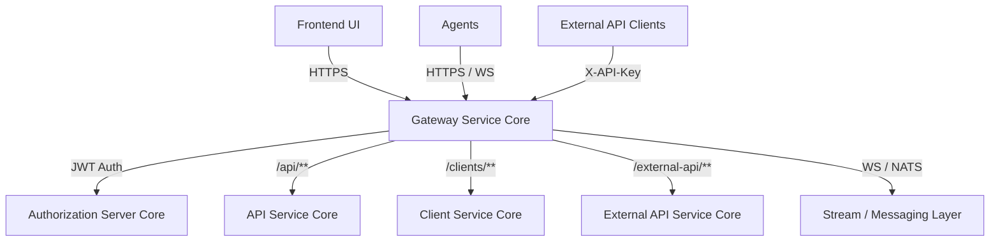
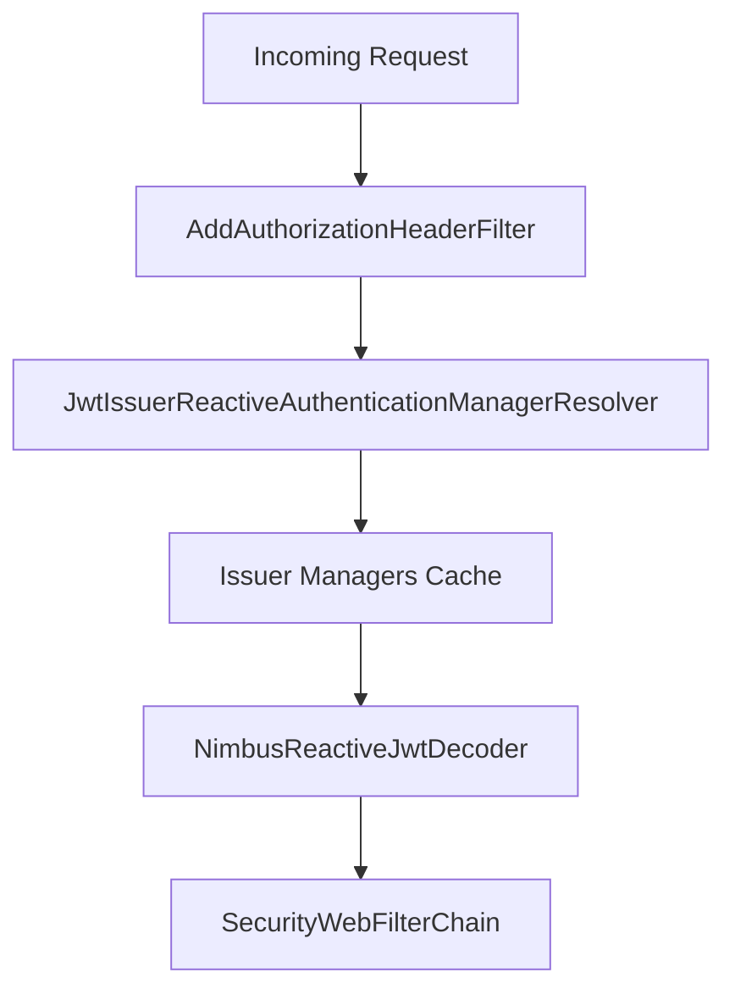
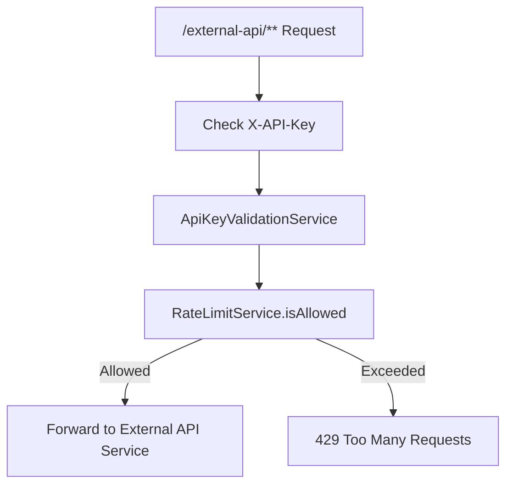
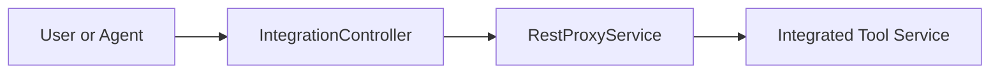
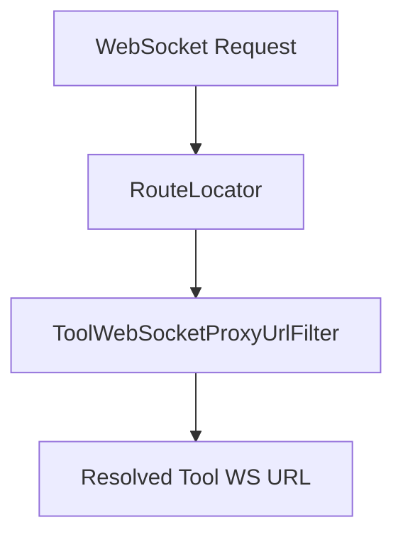
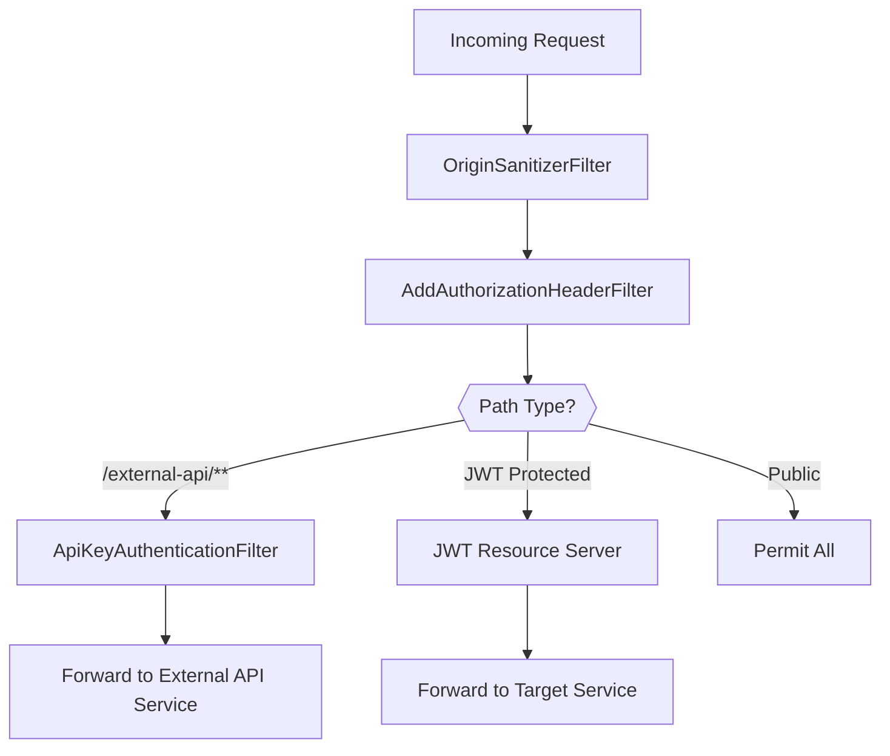

# Gateway Service Core

The **Gateway Service Core** module is the reactive edge layer of the OpenFrame platform. It acts as the unified entry point for:

- Dashboard and UI traffic
- Tool API and agent traffic
- External API consumers (API key based)
- WebSocket connections (tools and NATS)
- Multi-tenant JWT validation

Built on **Spring Cloud Gateway + Spring WebFlux**, this module centralizes authentication, authorization, rate limiting, proxying, and WebSocket routing for the entire platform.

---

## 1. Role in the Overall Architecture

Within the OpenFrame system, the Gateway Service Core sits between clients and internal services such as:

- API Service Core
- Authorization Server Core
- Management Service Core
- Client Service Core
- External API Service Core
- Stream and Messaging layers

It does not implement business logic. Instead, it:

- Authenticates requests (JWT or API key)
- Enforces role-based access
- Applies rate limiting
- Proxies HTTP and WebSocket traffic
- Injects user and tenant context

### High-Level Architecture



---

## 2. Core Responsibilities

### 2.1 Security & Authentication

The Gateway Service Core enforces two authentication strategies:

1. **JWT-based authentication** (OAuth2 Resource Server)
2. **API Key authentication** (for `/external-api/**` endpoints)

Key components:

- `GatewaySecurityConfig`
- `JwtAuthConfig`
- `IssuerUrlProvider`
- `AddAuthorizationHeaderFilter`
- `ApiKeyAuthenticationFilter`

#### JWT Authentication (Multi-Tenant)

`JwtAuthConfig` configures a dynamic, multi-issuer JWT authentication manager:

- Uses `JwtIssuerReactiveAuthenticationManagerResolver`
- Caches issuer-specific authentication managers using Caffeine
- Validates issuer strictly using `IssuerUrlProvider`
- Supports per-tenant issuer URLs



#### Role-Based Access Control

`GatewaySecurityConfig` defines path-based authorization:

- `/api/**` → `ADMIN`
- `/tools/**` → `ADMIN`
- `/tools/agent/**` → `AGENT`
- `/clients/**` → `AGENT`
- `/ws/tools/**` → Role-based
- `/external-api/**` → API key filter (separate flow)

JWT roles are mapped from:

- `roles` claim → `ROLE_*`
- `scope` claim → `SCOPE_*`

---

### 2.2 API Key Authentication & Rate Limiting

`ApiKeyAuthenticationFilter` is a **GlobalFilter** applied to `/external-api/**`.

Flow:

1. Validate `X-API-Key` header
2. Resolve API key via `ApiKeyValidationService`
3. Check rate limits via `RateLimitService`
4. Add context headers (`X-API-KEY-ID`, `X-USER-ID`)
5. Attach rate limit headers
6. Record success/failure statistics



Rate limiting headers (optional via properties):

- `X-Rate-Limit-Limit-Minute`
- `X-Rate-Limit-Remaining-Minute`
- `X-Rate-Limit-Limit-Hour`
- `X-Rate-Limit-Remaining-Hour`
- `X-Rate-Limit-Limit-Day`
- `X-Rate-Limit-Remaining-Day`

Constants are centralized in `RateLimitConstants`.

---

### 2.3 HTTP Proxying for Tools

The `IntegrationController` handles dynamic proxying for tool APIs:

Endpoints:

- `GET /tools/{toolId}/health`
- `POST /tools/{toolId}/test`
- `/tools/{toolId}/**` → Proxy to tool API
- `/tools/agent/{toolId}/**` → Proxy to tool agent endpoint

It delegates to:

- `IntegrationService`
- `RestProxyService`



The Gateway does not know tool internals. It resolves tool base URLs via repository and URL services and forwards requests transparently.

---

### 2.4 WebSocket Routing

`WebSocketGatewayConfig` configures reactive WebSocket routes:

Supported endpoints:

- `/ws/tools/{toolId}/**` → Tool API WebSocket
- `/ws/tools/agent/{toolId}/**` → Tool Agent WebSocket
- `/ws/nats` → NATS WebSocket bridge

Filters:

- `ToolApiWebSocketProxyUrlFilter`
- `ToolAgentWebSocketProxyUrlFilter`

These filters:

- Extract `toolId` from the path
- Resolve target URL dynamically
- Forward WebSocket traffic via Spring Cloud Gateway



Additionally, a `WebSocketService` decorator applies JWT-based security during WebSocket handshakes.

---

### 2.5 Authorization Header Enrichment

`AddAuthorizationHeaderFilter` ensures an `Authorization` header is present for secured endpoints.

Token resolution order:

1. Access token from cookies
2. Custom `Access-Token` header
3. `authorization` query parameter

If found, it injects:

```text
Authorization: Bearer <token>
```

This enables:

- Browser cookie-based auth
- WebSocket query param auth
- Non-standard header compatibility

---

### 2.6 CORS & Origin Sanitization

- `CorsConfig` configures global CORS via `CorsWebFilter`
- `OriginSanitizerFilter` removes invalid `Origin: null` headers

This protects against malformed or insecure cross-origin requests.

---

### 2.7 Internal Auth Probe

`InternalAuthProbeController` exposes:

```text
GET /internal/authz/probe
```

Enabled via property:

```text
openframe.gateway.internal.enable=true
```

Used for internal health and authentication validation checks.

---

## 3. Configuration Components Overview

| Component | Responsibility |
|------------|----------------|
| `WebClientConfig` | Configures reactive `WebClient` with timeouts |
| `GatewaySecurityConfig` | SecurityWebFilterChain and RBAC rules |
| `JwtAuthConfig` | Multi-issuer JWT resolution and caching |
| `IssuerUrlProvider` | Resolves allowed issuer URLs per tenant |
| `CorsConfig` | Global CORS setup |
| `AddAuthorizationHeaderFilter` | Injects Bearer token when missing |
| `ApiKeyAuthenticationFilter` | API key validation + rate limiting |
| `WebSocketGatewayConfig` | WebSocket route definitions |
| `IntegrationController` | HTTP proxy to tools |
| `InternalAuthProbeController` | Internal auth probe endpoint |

---

## 4. Request Processing Pipeline



---

## 5. Design Principles

The Gateway Service Core follows these principles:

- **Reactive-first**: Built entirely on WebFlux and Reactor
- **Stateless**: No session storage; relies on JWT and API keys
- **Multi-tenant aware**: Dynamic issuer resolution
- **Pluggable security**: Separate JWT and API key flows
- **Transparent proxying**: No business logic duplication
- **Centralized enforcement**: Security and rate limiting at the edge

---

## 6. Summary

The **Gateway Service Core** is the security and routing backbone of OpenFrame. It:

- Secures all inbound traffic
- Enforces RBAC and API key policies
- Dynamically resolves tenant issuers
- Proxies HTTP and WebSocket traffic
- Provides rate limiting and observability hooks

By centralizing authentication, authorization, and routing logic, it keeps downstream services focused purely on domain and business functionality while maintaining a secure, scalable edge layer.