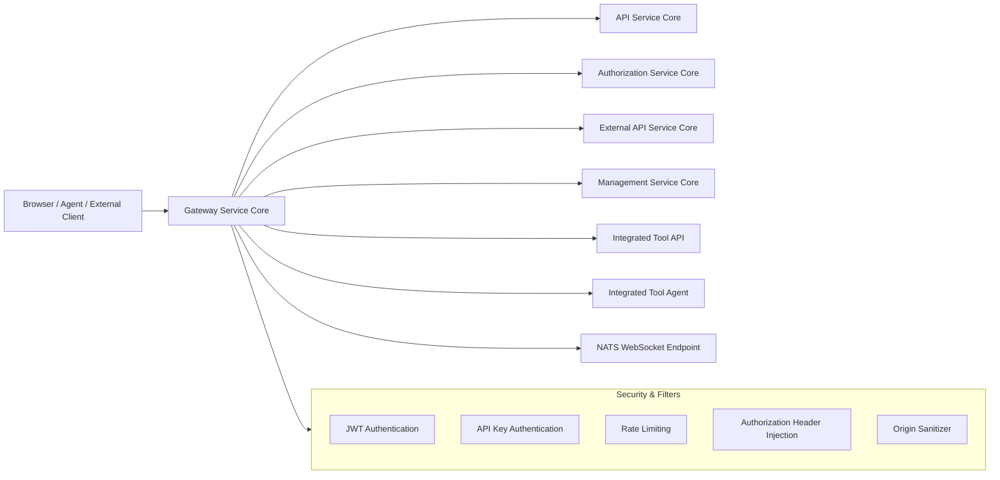
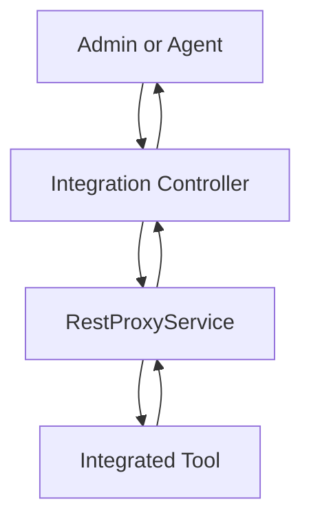
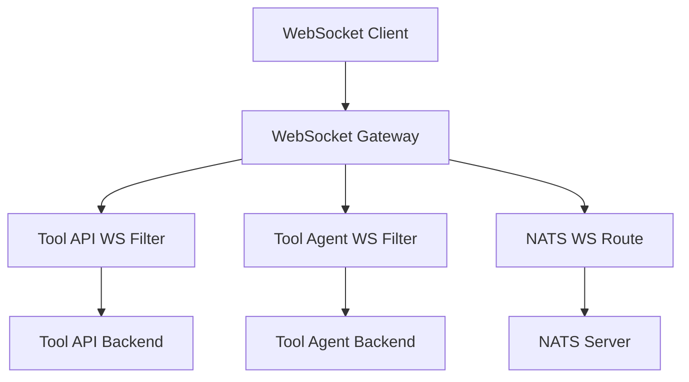
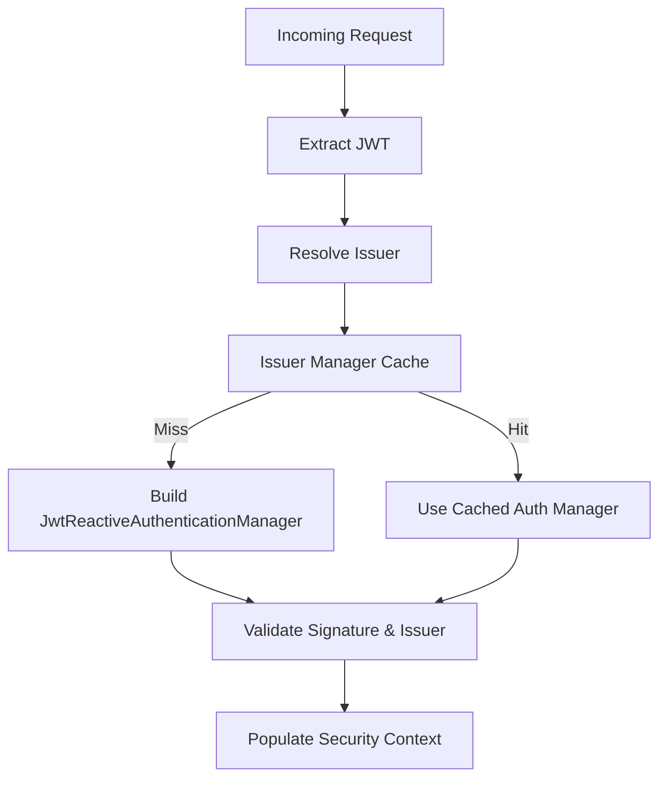
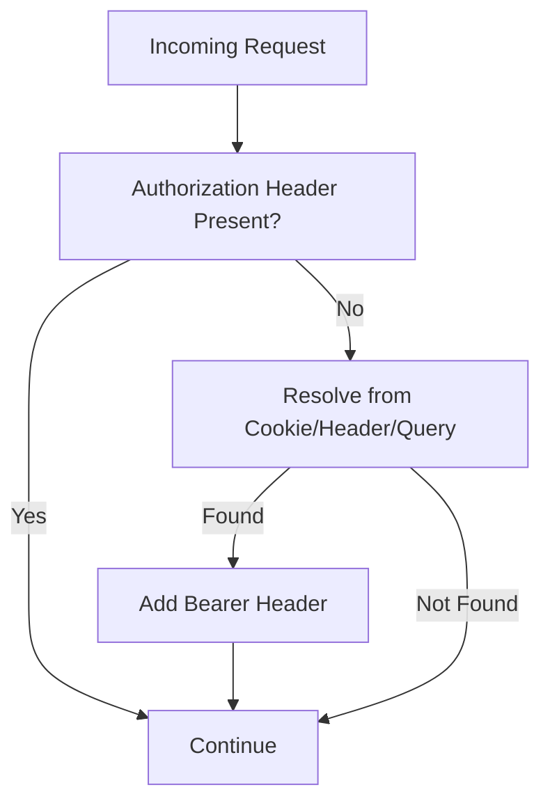
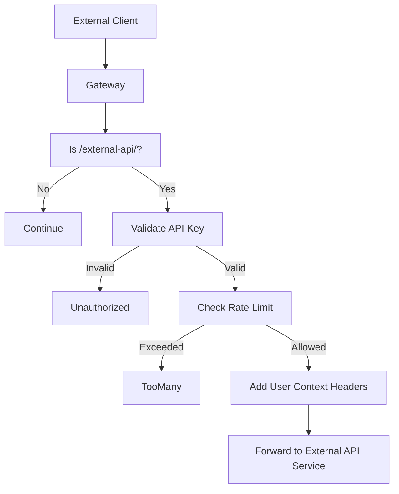
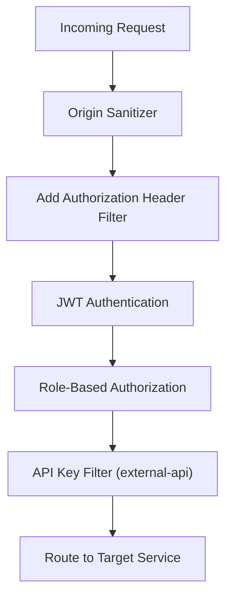

# Gateway Service Core

## Overview

The **Gateway Service Core** module is the reactive API gateway layer of the OpenFrame platform. It is responsible for:

- Routing HTTP and WebSocket traffic to downstream services and integrated tools
- Enforcing authentication and authorization (JWT, API keys)
- Applying multi-tenant issuer validation
- Handling rate limiting for external APIs
- Proxying tool REST and WebSocket traffic
- Applying CORS, header mutation, and origin sanitization

Built on **Spring Cloud Gateway** and **Spring WebFlux**, the Gateway Service Core operates as a fully reactive, non-blocking edge service in front of:

- API Service Core
- Authorization Service Core
- External API Service Core
- Management Service Core
- Stream Service Core
- Integrated tools (agent + API endpoints)

It acts as the unified entry point for both browser-based dashboard traffic and machine-to-machine integrations.

---

## High-Level Architecture

The Gateway Service Core is responsible for:

1. Authenticating requests (JWT or API key)
2. Resolving tenant-specific issuer validation
3. Enforcing role-based access control
4. Proxying REST and WebSocket traffic
5. Applying rate limits and request mutation

---

## Core Responsibilities

### 1. Reactive HTTP Client Configuration

**Component:** `WebClientConfig`

Provides a configured `WebClient.Builder` bean backed by a tuned Reactor Netty `HttpClient`.

Features:

- 30-second connect timeout
- 30-second response timeout
- Read/Write timeout handlers
- Non-blocking, reactive communication

This client is used internally for downstream REST calls and integration proxying.

---

### 2. Tool REST Proxying

**Component:** `IntegrationController`

The Integration Controller exposes tool-facing endpoints under:

- `/tools/{toolId}/**`
- `/tools/agent/{toolId}/**`

It supports:

- Health checks
- Integration testing
- Full REST proxying to tool APIs and agents

### REST Proxy Flow

The gateway extracts `toolId` from the path and forwards the request via `RestProxyService`.

---

### 3. WebSocket Gateway Routing

**Components:**

- `WebSocketGatewayConfig`
- `ToolApiWebSocketProxyUrlFilter`
- `ToolAgentWebSocketProxyUrlFilter`

The Gateway Service Core configures dynamic WebSocket routing for:

- `/ws/tools/{toolId}/**`
- `/ws/tools/agent/{toolId}/**`
- `/ws/nats`

### WebSocket Routing Architecture

The WebSocket filters:

- Extract `toolId` from the request path
- Resolve tool URL dynamically
- Rewrite and forward the WebSocket request

A `WebSocketServiceSecurityDecorator` (configured via `webSocketServiceDecorator`) ensures JWT claims are validated for WebSocket connections.

---

### 4. JWT-Based Authentication

**Components:**

- `GatewaySecurityConfig`
- `JwtAuthConfig`
- `IssuerUrlProvider`

The Gateway operates as a **Reactive OAuth2 Resource Server**.

#### Multi-Issuer Authentication

The system supports:

- Primary issuer (platform)
- Tenant-specific issuers
- Optional super-tenant issuer

Authentication managers are cached per issuer using Caffeine.

#### Strict Issuer Validation

`IssuerUrlProvider`:

- Queries tenant repository
- Builds allowed issuer URLs
- Caches issuer list
- Ensures JWT issuer matches expected tenant issuer

---

### 5. Role-Based Authorization

**Configured in:** `GatewaySecurityConfig`

Roles:

- `ROLE_ADMIN`
- `ROLE_AGENT`

Authorization rules include:

- `/api/**` → ADMIN
- `/tools/**` → ADMIN
- `/tools/agent/**` → AGENT
- `/ws/tools/agent/**` → AGENT
- `/ws/nats` → ADMIN or AGENT
- `/clients/**` → AGENT

Public endpoints include:

- Health endpoints
- Management endpoints
- Agent registration
- Metrics

---

### 6. Authorization Header Injection

**Component:** `AddAuthorizationHeaderFilter`

This pre-authentication filter ensures a standard `Authorization: Bearer <token>` header exists.

Token resolution order:

1. Access token cookie
2. Custom `Access-Token` header
3. Query parameter

If found, it injects a proper Authorization header before Spring Security executes.

This enables browser-based authentication while maintaining OAuth2 standards internally.

---

### 7. API Key Authentication for External APIs

**Component:** `ApiKeyAuthenticationFilter`

This global filter applies only to:

`/external-api/**`

Flow:

1. Require `X-API-Key` header
2. Validate API key
3. Enforce rate limits
4. Inject user context headers
5. Forward request

### API Key Flow

Injected headers:

- `X-API-Key-Id`
- `X-User-Id`

Rate limit headers include:

- Minute
- Hour
- Day quotas

If exceeded, HTTP `429 Too Many Requests` is returned with `Retry-After`.

---

### 8. Rate Limiting

**Components:**

- `RateLimitService`
- `RateLimitConstants`
- `RateLimitStatus`

Rate limiting tracks usage per API key and exposes:

- Remaining requests per minute
- Remaining requests per hour
- Remaining requests per day

Headers are conditionally included based on configuration.

---

### 9. CORS and Origin Sanitization

**Components:**

- `CorsConfig`
- `OriginSanitizerFilter`

Features:

- Configurable global CORS
- Removes `Origin: null` header to prevent CORS issues
- Enabled by default unless explicitly disabled

---

### 10. Internal Authorization Probe

**Component:** `InternalAuthProbeController`

Exposes:

`/internal/authz/probe`

Conditionally enabled via configuration. Used for internal health checks or readiness validation between gateway and authorization components.

---

## Security Layer Summary

The order of operations ensures:

- Header normalization first
- JWT validation next
- API key validation only for external endpoints
- Proper role enforcement before routing

---

## How Gateway Service Core Fits in the Platform

The Gateway Service Core is the **entry point** for the OpenFrame platform.

It integrates with:

- Authorization Service Core for JWT issuance
- API Service Core for dashboard APIs
- External API Service Core for public integrations
- Management Service Core for administrative workflows
- Stream Service Core via WebSocket/NATS
- Integrated tools via REST and WebSocket proxying

It centralizes:

- Multi-tenant authentication
- Role-based authorization
- External API monetization and rate limiting
- Tool connectivity

---

## Key Design Principles

- Reactive, non-blocking architecture
- Strict multi-tenant issuer validation
- Clear separation between JWT and API key authentication
- Centralized rate limiting
- Transparent REST and WebSocket proxying
- Edge-level security enforcement

---

## Conclusion

The **Gateway Service Core** module is the security and routing backbone of OpenFrame.

It provides:

- Authentication (JWT + API keys)
- Authorization (role-based rules)
- Multi-tenant issuer resolution
- Rate limiting and API key metrics
- Tool REST and WebSocket proxying
- CORS and origin sanitization

By consolidating these concerns at the edge, the Gateway Service Core ensures downstream services remain focused on business logic while the gateway enforces platform-wide security, routing, and policy control.