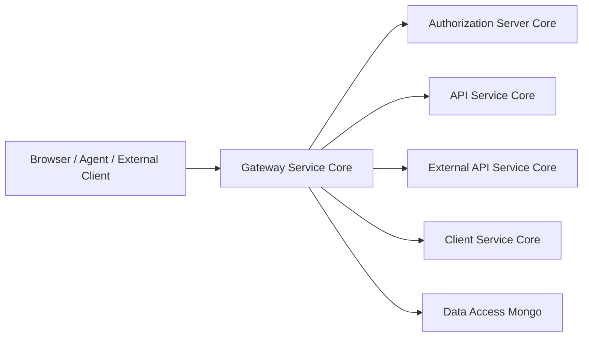
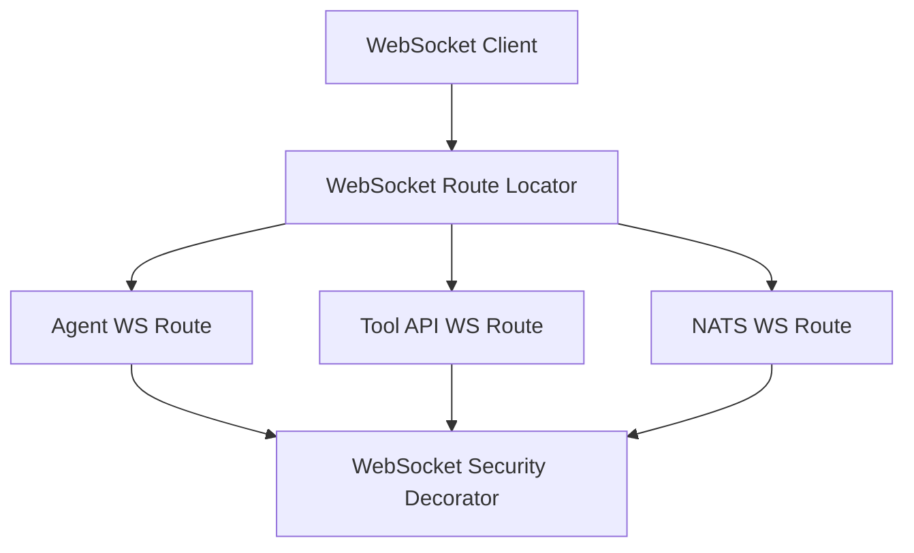
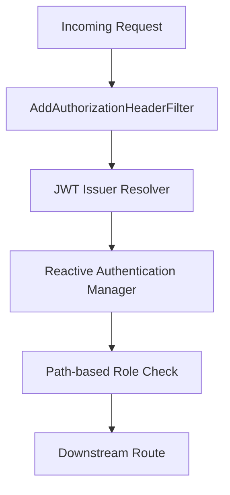
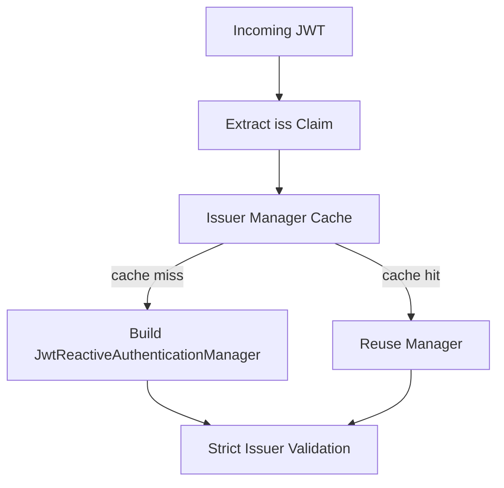
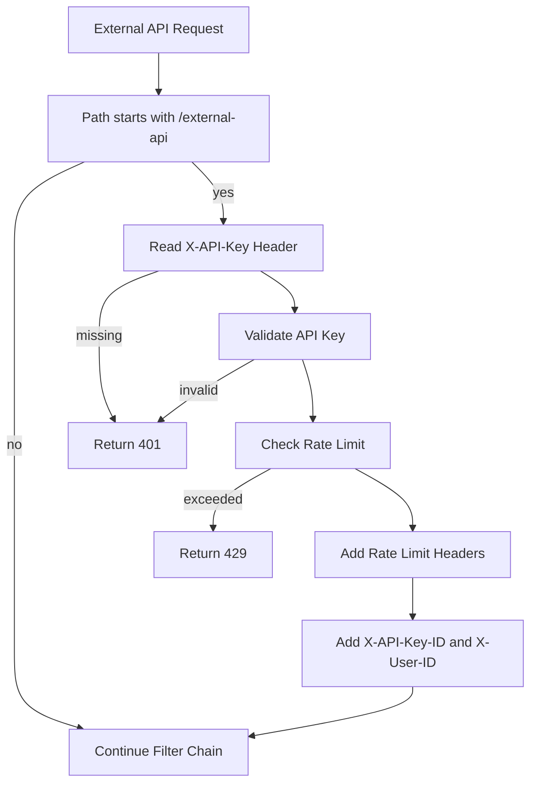
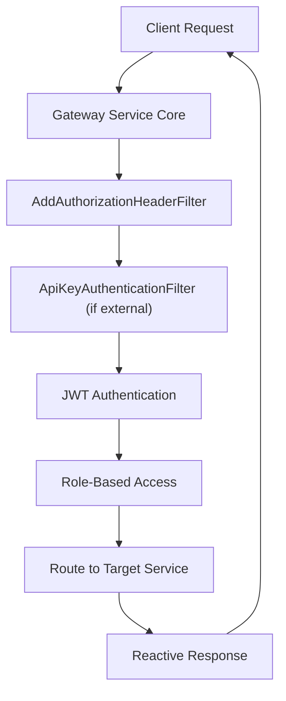

# Gateway Service Core

The **Gateway Service Core** module is the reactive edge layer of the OpenFrame platform. It acts as the single entry point for HTTP and WebSocket traffic, enforcing security, routing requests to downstream services, and handling cross-cutting concerns such as authentication, API key validation, CORS, and rate limiting.

Built on **Spring Cloud Gateway** and **Spring WebFlux**, this module is fully reactive and designed for multi-tenant, token-based security environments.

---

## 1. Purpose and Responsibilities

The Gateway Service Core is responsible for:

- Acting as the **API gateway** for internal and external traffic
- Enforcing **JWT-based authentication** (multi-issuer, multi-tenant)
- Validating and rate-limiting **API keys** for external APIs
- Routing **REST** and **WebSocket** traffic
- Injecting and normalizing authorization headers
- Supporting CORS and security filters
- Integrating with the Authorization Server and tenant-aware issuer resolution

It is bootstrapped by the `GatewayApplication` in the Service Applications module and typically deployed as the public-facing service.

---

## 2. High-Level Architecture

### Key Flows

- **JWT validation** is delegated to dynamically resolved authentication managers.
- **API key validation and rate limiting** protect `/external-api/**` endpoints.
- **WebSocket traffic** is proxied for tools and NATS endpoints.
- **Tenant-aware issuer validation** ensures strict multi-tenant isolation.

---

## 3. Core Configuration Components

### 3.1 WebClient Configuration

**Component:** `WebClientConfig`

Provides a tuned `WebClient.Builder` with:

- 30-second connect timeout
- 30-second read/write timeout
- Reactor Netty configuration

This builder is used for outbound HTTP calls (e.g., proxying, integration calls).

---

### 3.2 WebSocket Gateway Configuration

**Component:** `WebSocketGatewayConfig`

Defines:

- `/ws/tools/agent/{toolId}/**` → Agent WebSocket proxy
- `/ws/tools/{toolId}/**` → Tool API WebSocket proxy
- `/ws/nats` → NATS WebSocket endpoint

Also decorates the `WebSocketService` to enforce JWT claim validation during WebSocket handshakes.

---

## 4. Security Architecture

Security is implemented using **Spring Security WebFlux** with OAuth2 Resource Server support.

### 4.1 Gateway Security Configuration

**Component:** `GatewaySecurityConfig`

Defines:

- Stateless security (CSRF, form login, HTTP basic disabled)
- OAuth2 Resource Server configuration
- Role-based route authorization
- Custom `ReactiveJwtAuthenticationConverter`
- `AddAuthorizationHeaderFilter` integration

#### Role Mapping

- `ROLE_ADMIN` → Dashboard and tool APIs
- `ROLE_AGENT` → Agent and client endpoints

---

### 4.2 Multi-Issuer JWT Authentication

**Components:**

- `JwtAuthConfig`
- `IssuerUrlProvider`

#### Dynamic Issuer Resolution

The gateway supports multiple issuers:

- Default issuer (platform)
- Tenant-specific issuers
- Optional super-tenant issuer

`IssuerUrlProvider` resolves valid issuer URLs from the tenant repository and caches them.

`JwtAuthConfig`:

- Uses a Caffeine cache for issuer-based authentication managers
- Builds `NimbusReactiveJwtDecoder` per issuer
- Applies strict issuer validation
- Uses `JwtIssuerReactiveAuthenticationManagerResolver`

---

### 4.3 Authorization Header Normalization

**Component:** `AddAuthorizationHeaderFilter`

Ensures an `Authorization: Bearer <token>` header is present by resolving tokens from:

- Access token cookie
- Custom header
- Query parameter

Only applied to private paths such as:

- `/api/**`
- `/tools/**`
- `/clients/**`
- `/ws/tools/**`
- `/internal/authz/probe`

This allows flexible token transport while keeping downstream resource server logic standard.

---

## 5. API Key Authentication and Rate Limiting

**Component:** `ApiKeyAuthenticationFilter`

This is a `GlobalFilter` applied to `/external-api/**` endpoints.

### Flow

### Features

- Validates `X-API-Key`
- Tracks successful/failed requests
- Enforces minute/hour/day limits
- Adds standard rate limit headers
- Returns JSON error responses in reactive context

Swagger and documentation paths are excluded from API key enforcement.

---

## 6. Controllers

### 6.1 Integration Controller

**Component:** `IntegrationController`

Base path: `/tools`

Provides:

- `GET /tools/{toolId}/health`
- `POST /tools/{toolId}/test`
- Proxying of:
  - `/tools/{toolId}/**`
  - `/tools/agent/{toolId}/**`

Delegates to:

- `IntegrationService`
- `RestProxyService`

This enables tool integrations to be accessed through a single gateway entry point.

---

### 6.2 Internal Auth Probe Controller

**Component:** `InternalAuthProbeController`

Endpoint: `/internal/authz/probe`

Enabled only when `openframe.gateway.internal.enable=true`.

Used for:

- Internal liveness checks
- Authorization verification in private network environments

---

## 7. CORS Configuration

**Component:** `CorsConfig`

- Enabled by default
- Controlled via `openframe.gateway.disable-cors`
- Uses `spring.cloud.gateway.globalcors.cors-configurations.[/**]`
- Registers a `CorsWebFilter`

Designed to allow flexible frontend integration without compromising security defaults.

---

## 8. Path Constants

**Component:** `PathConstants`

Defines standardized route prefixes:

- `/clients`
- `/api`
- `/tools`
- `/ws/tools`

These constants ensure consistent security rule definitions and routing logic.

---

## 9. End-to-End Request Lifecycle

---

## 10. How It Fits into the Platform

The Gateway Service Core:

- Protects all downstream services
- Centralizes authentication and authorization
- Enforces tenant-aware JWT validation
- Enables secure tool integration routing
- Provides WebSocket and NATS routing support
- Acts as the secure boundary between frontend, agents, and backend services

It is a critical infrastructure component ensuring:

- Multi-tenant isolation
- Strict issuer validation
- Standardized security enforcement
- Reactive, high-throughput edge processing

---

## Summary

The **Gateway Service Core** module is the secure, reactive entry point of the OpenFrame ecosystem. By combining Spring Cloud Gateway, OAuth2 resource server capabilities, dynamic issuer resolution, API key validation, and WebSocket routing, it provides a robust and extensible foundation for multi-tenant API traffic management.