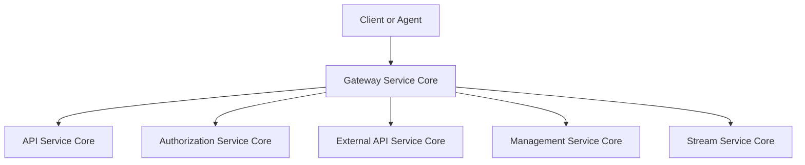
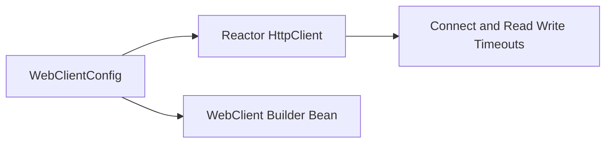
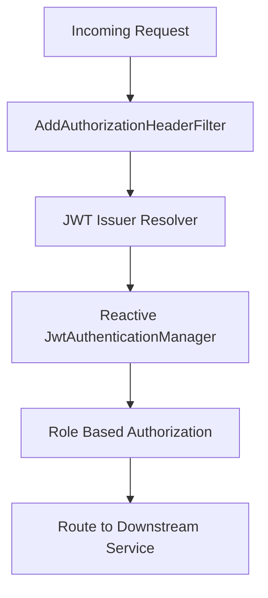
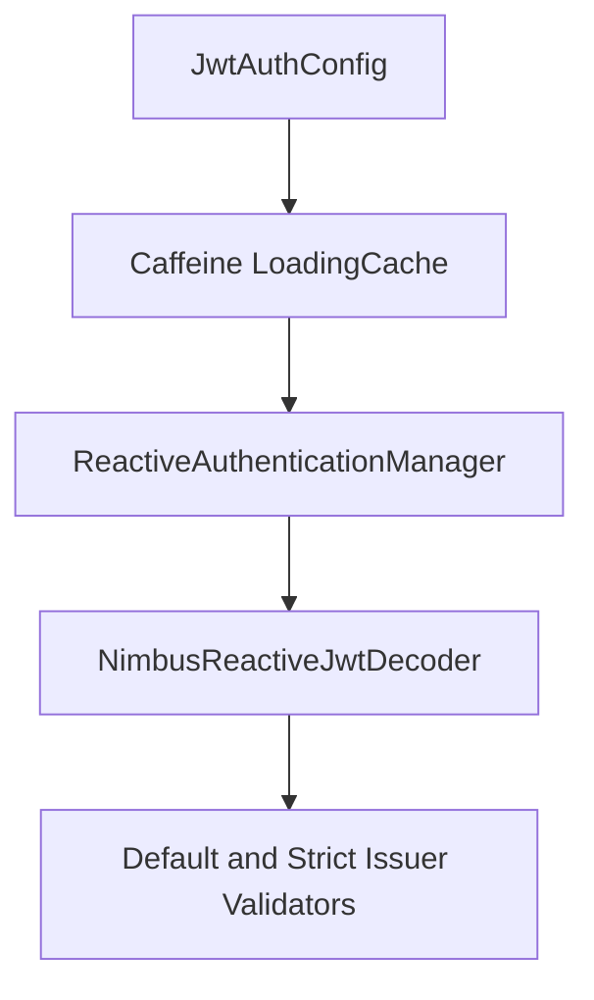
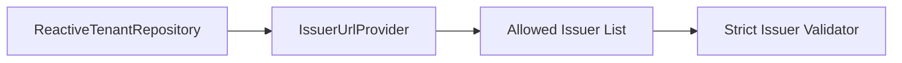
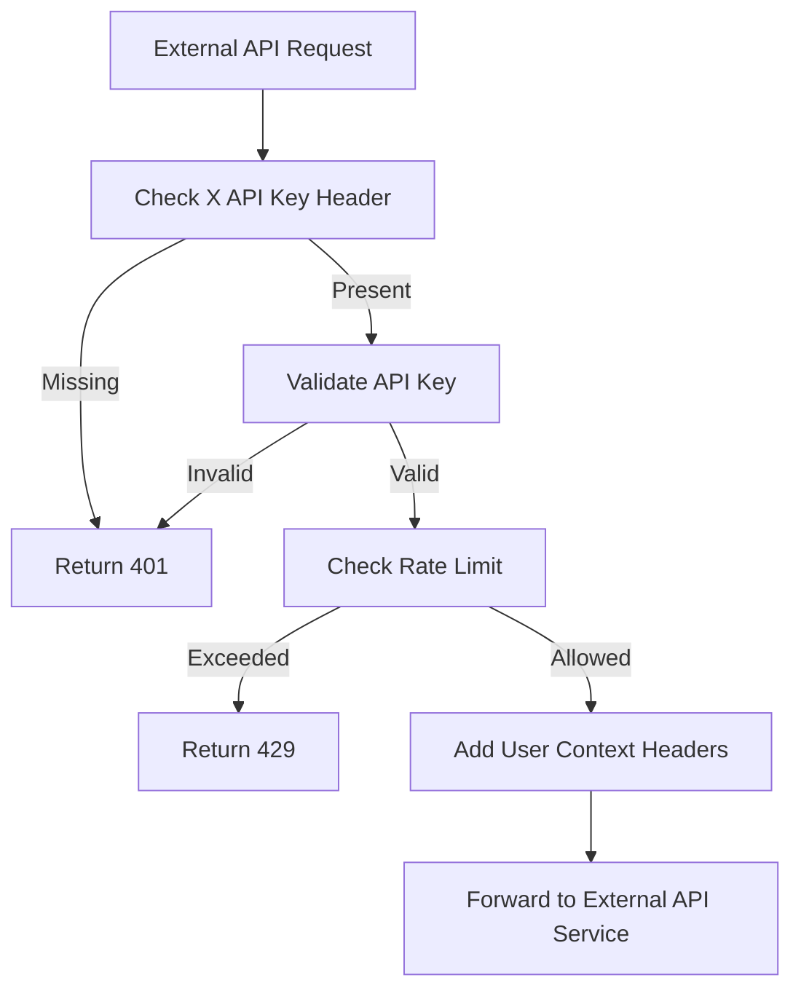
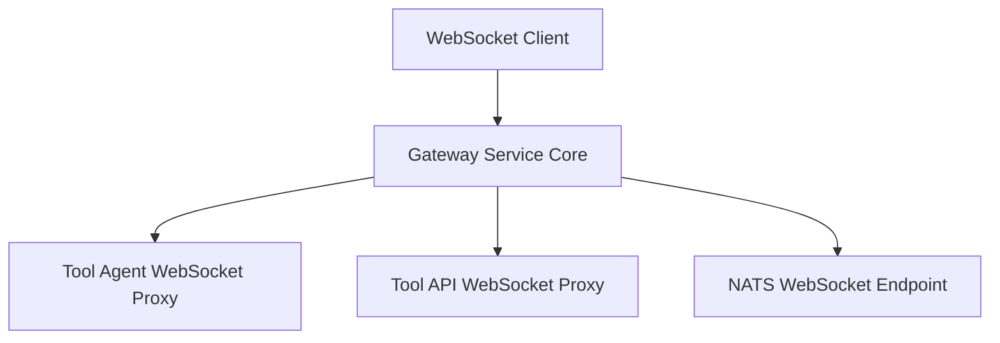
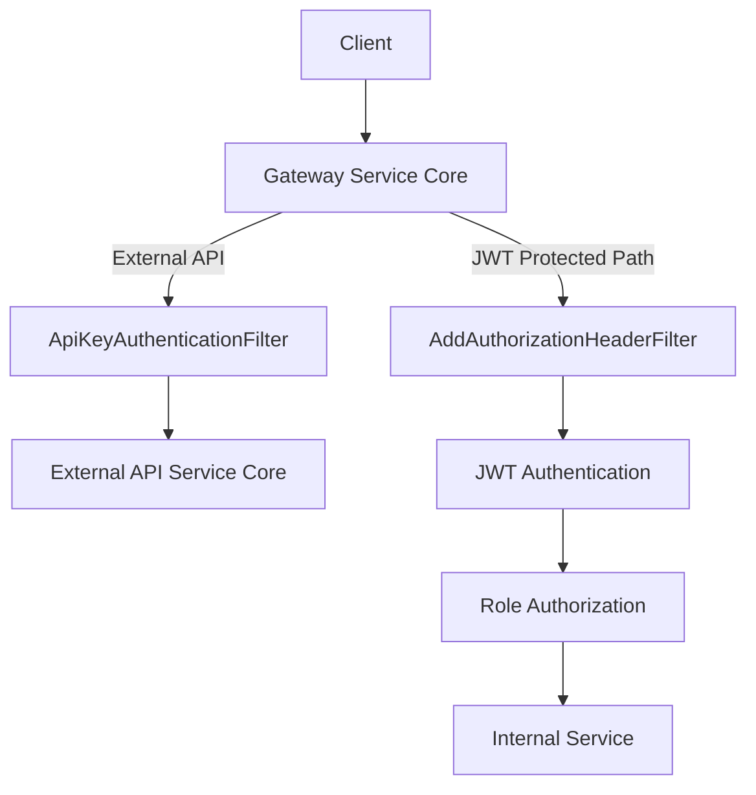

# Gateway Service Core

## Overview

The **Gateway Service Core** module is the reactive edge layer of the OpenFrame platform. It is responsible for:

- Acting as the single entry point for HTTP and WebSocket traffic
- Enforcing authentication and authorization policies
- Performing API key validation and rate limiting for external APIs
- Resolving multi-tenant JWT issuers dynamically
- Routing traffic to downstream services (API, Management, Stream, External API, etc.)

Built on **Spring Cloud Gateway** and **Spring WebFlux**, this module provides a non-blocking, reactive security and routing layer that protects and orchestrates the rest of the system.

---

## High-Level Architecture

The Gateway Service Core sits between clients and internal services.



### Responsibilities at the Edge

1. **Authentication**
   - JWT validation (multi-issuer, multi-tenant)
   - API key authentication for `/external-api/**`
2. **Authorization**
   - Role-based access control (ADMIN, AGENT)
3. **Rate Limiting**
   - Per-API key minute, hour, and day limits
4. **Header Enrichment**
   - Adds `Authorization` header when resolved from alternative sources
   - Adds user context headers for external APIs
5. **WebSocket Routing and Security**
   - Tool WebSocket proxying
   - NATS WebSocket endpoint routing

---

# Core Configuration Components

## 1. Reactive HTTP Client Configuration

### `WebClientConfig`

Defines a shared `WebClient.Builder` bean configured with:

- 30 second connect timeout
- 30 second response timeout
- Read and write timeout handlers
- Reactor Netty HTTP client

This ensures consistent outbound HTTP behavior when the gateway calls other services.



---

## 2. Security Architecture

The security model is layered and reactive.



### 2.1 AddAuthorizationHeaderFilter

This pre-authentication filter ensures an `Authorization` header exists.

If missing, it attempts to resolve a bearer token from:

- Access token cookie
- Custom `Access-Token` header
- `authorization` query parameter

If found, it mutates the request and injects:

```text
Authorization: Bearer <token>
```

This enables standard OAuth2 resource server validation while supporting multiple token delivery strategies.

---

### 2.2 GatewaySecurityConfig

Defines the `SecurityWebFilterChain`.

Key features:

- Disables CSRF, CORS, HTTP Basic, Form Login
- Configures OAuth2 Resource Server
- Uses dynamic `ReactiveAuthenticationManagerResolver`
- Injects `AddAuthorizationHeaderFilter` before authentication

### Role-Based Access Rules

| Path Category | Required Role |
|--------------|--------------|
| `/dashboard/**` | ADMIN |
| `/tools/**` | ADMIN |
| `/tools/agent/**` | AGENT |
| `/ws/tools/**` | ADMIN |
| `/ws/tools/agent/**` | AGENT |
| `/ws/nats` | AGENT or ADMIN |
| `/clients/**` | AGENT |

Public paths include health checks, metrics, OAuth token endpoints, and management endpoints.

---

## 3. Multi-Tenant JWT Validation

### JwtAuthConfig

The gateway supports dynamic issuer resolution using a Caffeine cache of authentication managers.



### Key Concepts

- Each issuer gets its own `ReactiveAuthenticationManager`
- Managers are cached with:
  - Expiration
  - Refresh policy
  - Maximum size
- Strict issuer validation ensures only allowed tenant issuers are accepted

---

### IssuerUrlProvider

Responsible for resolving allowed issuer URLs dynamically from tenant data.

Behavior:

1. Queries `ReactiveTenantRepository`
2. Builds issuer URLs using `allowed-issuer-base`
3. Optionally includes a super tenant issuer
4. Caches the result reactively



This enables true multi-tenant security at the gateway layer.

---

# API Key Authentication for External APIs

## ApiKeyAuthenticationFilter

A global filter that applies only to:

```text
/external-api/**
```

### Processing Flow



### Key Responsibilities

- Requires `X-API-Key` header
- Validates key via `ApiKeyValidationService`
- Enforces rate limits via `RateLimitService`
- Adds context headers:

```text
X-API-Key-Id
X-User-Id
```

- Removes the raw API key header before forwarding
- Records successful and failed request statistics

### Rate Limiting

Supports per-key limits at:

- Minute
- Hour
- Day

When enabled, the gateway adds standard headers:

```text
X-Rate-Limit-Limit-Minute
X-Rate-Limit-Remaining-Minute
X-Rate-Limit-Limit-Hour
X-Rate-Limit-Remaining-Hour
X-Rate-Limit-Limit-Day
X-Rate-Limit-Remaining-Day
```

On limit exhaustion:

- Returns HTTP 429
- Adds `Retry-After` header

---

# WebSocket Routing and Security

## WebSocketGatewayConfig

Defines custom WebSocket routes using Spring Cloud Gateway.

### Supported Endpoints

- `/ws/tools/agent{toolId}/**`
- `/ws/tools{toolId}/**`
- `/ws/nats`



A `WebSocketServiceSecurityDecorator` wraps the default WebSocket service to enforce JWT-based security during WebSocket handshakes.

---

# Request Lifecycle Summary



---

# Design Principles

- **Reactive and Non-Blocking**: Built on WebFlux and Reactor Netty
- **Edge Security Enforcement**: Centralized authentication and authorization
- **Multi-Tenant Aware**: Dynamic issuer resolution
- **Zero Trust Forwarding**: No downstream service trusts inbound headers blindly
- **Observability Ready**: Integrated with management endpoints

---

# How It Fits into the Platform

The Gateway Service Core is deployed as the `GatewayApplication` in the service applications layer. It serves as the primary ingress component for:

- Dashboard UI
- Agents
- External API consumers
- WebSocket tool integrations

All traffic flows through this module before reaching:

- API Service Core
- Authorization Service Core
- Management Service Core
- External API Service Core
- Stream Service Core

By consolidating routing and security here, the platform ensures consistent authentication, authorization, and rate limiting across all services.

---

# Conclusion

The **Gateway Service Core** is the security and routing backbone of the OpenFrame architecture. It combines:

- Reactive routing
- Multi-tenant JWT validation
- API key enforcement
- Rate limiting
- WebSocket security

into a single, scalable, edge-layer service that protects and orchestrates the entire distributed system.