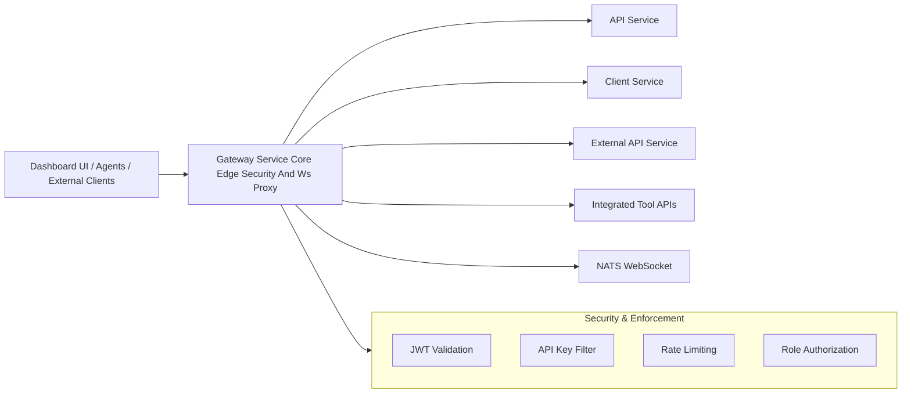
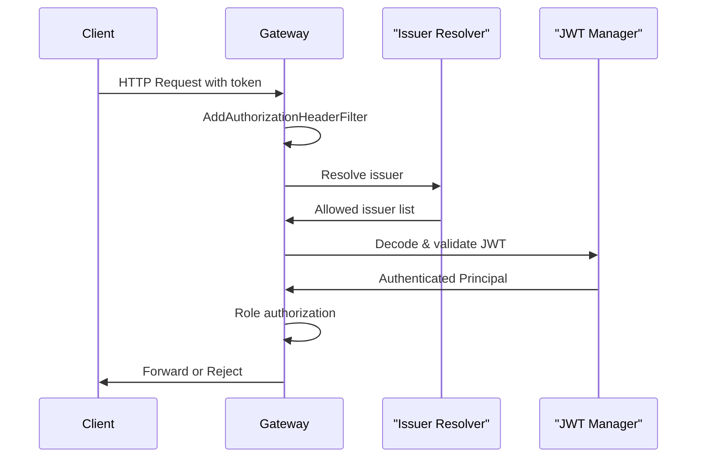
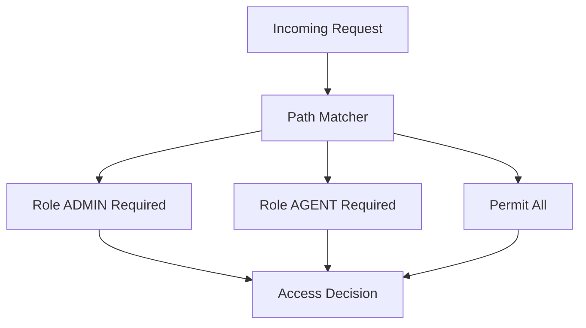
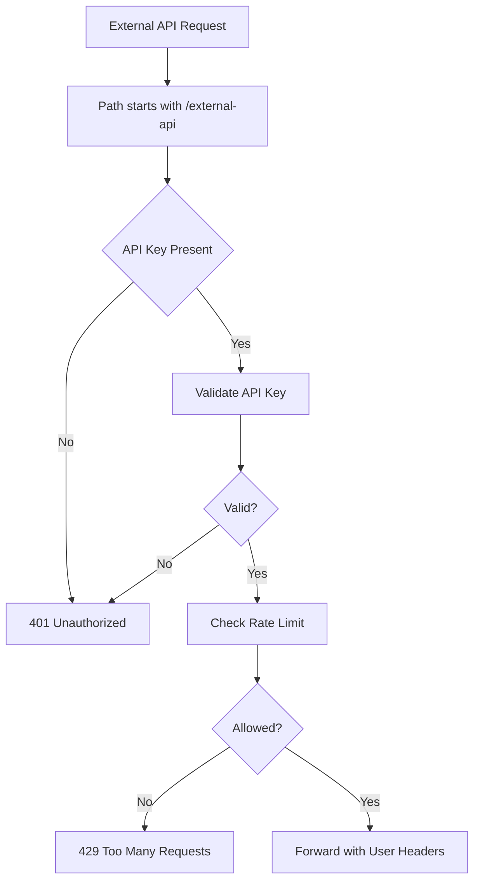
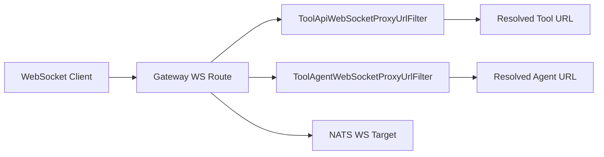
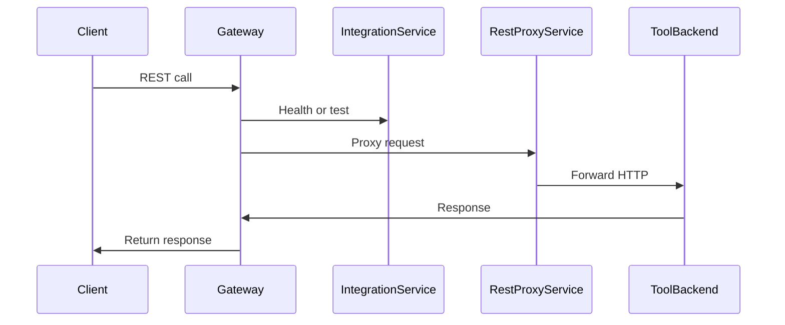
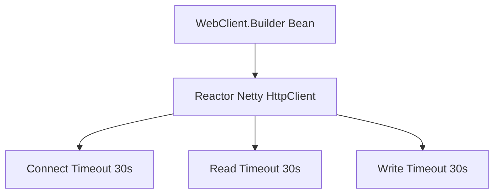
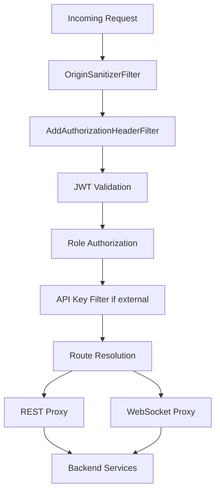

# Gateway Service Core Edge Security And Ws Proxy

## Overview

The **Gateway Service Core Edge Security And Ws Proxy** module is the reactive edge layer of the OpenFrame platform. It acts as:

- ✅ API Gateway (Spring Cloud Gateway)
- ✅ Security enforcement point (JWT, roles, issuer validation)
- ✅ API Key authentication and rate limiting layer
- ✅ WebSocket proxy for tools and agents
- ✅ Multi-tenant JWT issuer resolver
- ✅ CORS and request sanitization boundary

This module is the first entry point for:

- Dashboard UI requests
- Agent requests
- Tool REST and WebSocket calls
- External API consumers using API keys
- NATS WebSocket connections

It ensures that **all traffic entering the platform is authenticated, authorized, rate-limited, and properly routed**.

---

## High-Level Architecture



The gateway is fully reactive and built on:

- Spring WebFlux
- Spring Cloud Gateway
- Spring Security (OAuth2 Resource Server)
- Reactor Netty

---

# Core Responsibilities

## 1. JWT Authentication & Multi-Tenant Issuer Resolution

### Key Components

- `GatewaySecurityConfig`
- `JwtAuthConfig`
- `IssuerUrlProvider`
- `AddAuthorizationHeaderFilter`

### Authentication Flow



### Multi-Tenant JWT Design

`JwtAuthConfig` uses:

- `JwtIssuerReactiveAuthenticationManagerResolver`
- Caffeine-based cache for issuer-specific managers
- Strict issuer validation using `IssuerUrlProvider`

Issuer resolution rules:

- Default platform issuer
- Per-tenant issuer (constructed from allowed base + tenant ID)
- Optional super-tenant issuer

This ensures:

- ✅ Secure multi-tenant validation
- ✅ Isolation between tenants
- ✅ Runtime issuer discovery from database

---

## 2. Role-Based Authorization

### Path-Based Authorization Rules

Defined in `GatewaySecurityConfig` using `SecurityWebFilterChain`.



### Role Mapping

JWT claims:

- `roles` → converted to `ROLE_*`
- `scope` → converted to `SCOPE_*`

Examples:

- `/api/**` → `ADMIN`
- `/tools/agent/**` → `AGENT`
- `/ws/tools/agent/**` → `AGENT`
- `/ws/nats` → `ADMIN` or `AGENT`

---

## 3. API Key Authentication & Rate Limiting

### Key Component

- `ApiKeyAuthenticationFilter`

This is a **GlobalFilter** applied to `/external-api/**` endpoints.

### Authentication Flow



### What It Does

1. Requires `X-API-Key` header
2. Validates key via `ApiKeyValidationService`
3. Increments usage counters
4. Applies rate limiting via `RateLimitService`
5. Adds headers:
   - `X-API-Key-Id`
   - `X-User-Id`
6. Removes raw API key from request

### Rate Limiting Model

Headers added when enabled:

```text
X-Rate-Limit-Limit-Minute
X-Rate-Limit-Remaining-Minute
X-Rate-Limit-Limit-Hour
X-Rate-Limit-Remaining-Hour
X-Rate-Limit-Limit-Day
X-Rate-Limit-Remaining-Day
```

This provides fine-grained quota enforcement for external integrations.

---

## 4. WebSocket Proxy Routing

### Key Components

- `WebSocketGatewayConfig`
- `ToolApiWebSocketProxyUrlFilter`
- `ToolAgentWebSocketProxyUrlFilter`

### Supported WebSocket Endpoints

```text
/ws/tools/{toolId}/**
/ws/tools/agent/{toolId}/**
/ws/nats
```

### Routing Model



### Dynamic URL Resolution

Each WebSocket filter:

- Extracts `toolId` from path
- Loads tool configuration from repository
- Resolves final proxy URL via `ProxyUrlResolver`
- Forwards WebSocket connection dynamically

This enables:

- ✅ Multi-tool dynamic routing
- ✅ Tenant-aware tool resolution
- ✅ Secure WebSocket proxying

---

## 5. REST Proxy for Integrated Tools

### Key Component

- `IntegrationController`

Handles:

```text
/tools/{toolId}/health
/tools/{toolId}/test
/tools/{toolId}/**
/tools/agent/{toolId}/**
```

### Proxy Flow



The gateway does not contain tool logic — it only:

- Validates security
- Resolves tool URL
- Forwards request
- Streams back response

---

## 6. CORS Management

### Configurations

- `CorsConfig`
- `CorsDisableConfig`

Two modes:

| Mode | Property | Behavior |
|------|----------|----------|
| Default | `disable-cors=false` | Uses configured CORS rules |
| SaaS | `disable-cors=true` | Allows all origins with credentials |

SaaS mode is safe when frontend and backend share the same domain.

---

## 7. Request Sanitization

### OriginSanitizerFilter

Removes invalid header values:

```text
Origin: null
```

Prevents CORS misbehavior and invalid browser-origin artifacts.

---

## 8. WebClient Configuration

### WebClientConfig

Provides a tuned `WebClient.Builder` with:

- 30s connect timeout
- 30s response timeout
- Read and write timeout handlers



Used for:

- Tool proxy calls
- Health checks
- Internal gateway-to-service calls

---

# Complete Request Lifecycle



The gateway guarantees that:

- ✅ Every private endpoint is authenticated
- ✅ Role-based restrictions are enforced
- ✅ External APIs are rate limited
- ✅ WebSockets are secured
- ✅ Multi-tenant JWT validation is enforced

---

# Security Model Summary

| Layer | Mechanism |
|--------|------------|
| Authentication | JWT (OAuth2 Resource Server) |
| Multi-Tenant | Issuer-based validation |
| Role Control | Path-based RBAC |
| API Access | API Key + Rate Limiting |
| WebSockets | Secured via JWT + route filters |
| Token Sources | Cookie, Header, Query Param |

---

# Why This Module Is Critical

The **Gateway Service Core Edge Security And Ws Proxy** module is the enforcement boundary of the OpenFrame platform.

Without it:

- Services would be directly exposed
- Multi-tenant JWT validation would not be centralized
- API key rate limiting would not be enforced
- WebSocket routing would be insecure
- Tool integration routing would be fragmented

It ensures the system remains:

- Secure
- Scalable
- Multi-tenant aware
- Protocol-flexible (HTTP + WebSocket)
- Fully reactive

---

# Conclusion

The **Gateway Service Core Edge Security And Ws Proxy** module provides:

- Reactive API gateway capabilities
- Multi-tenant JWT validation with issuer caching
- Role-based authorization enforcement
- API key authentication and quota control
- Dynamic REST and WebSocket proxying
- CORS and header sanitization

It is the central edge security layer that protects and orchestrates all downstream OpenFrame services.
