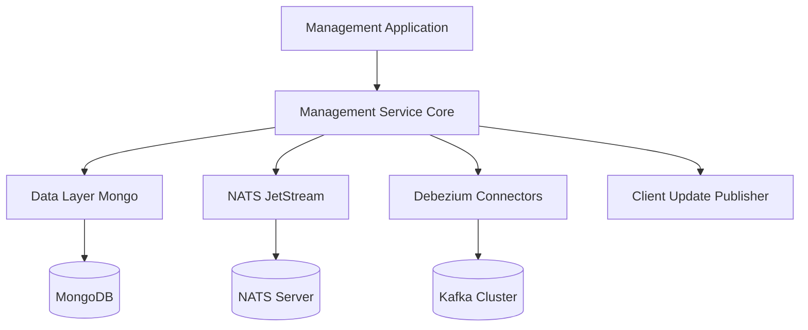
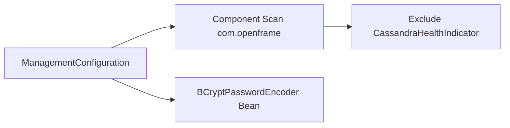
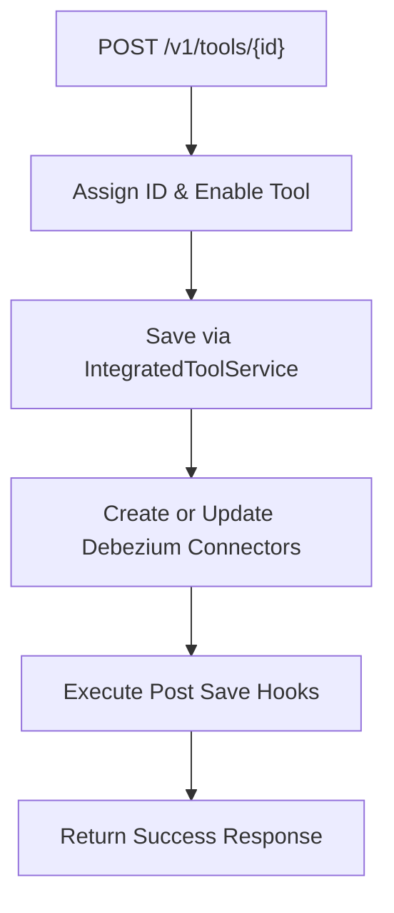
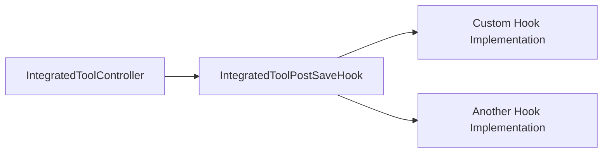
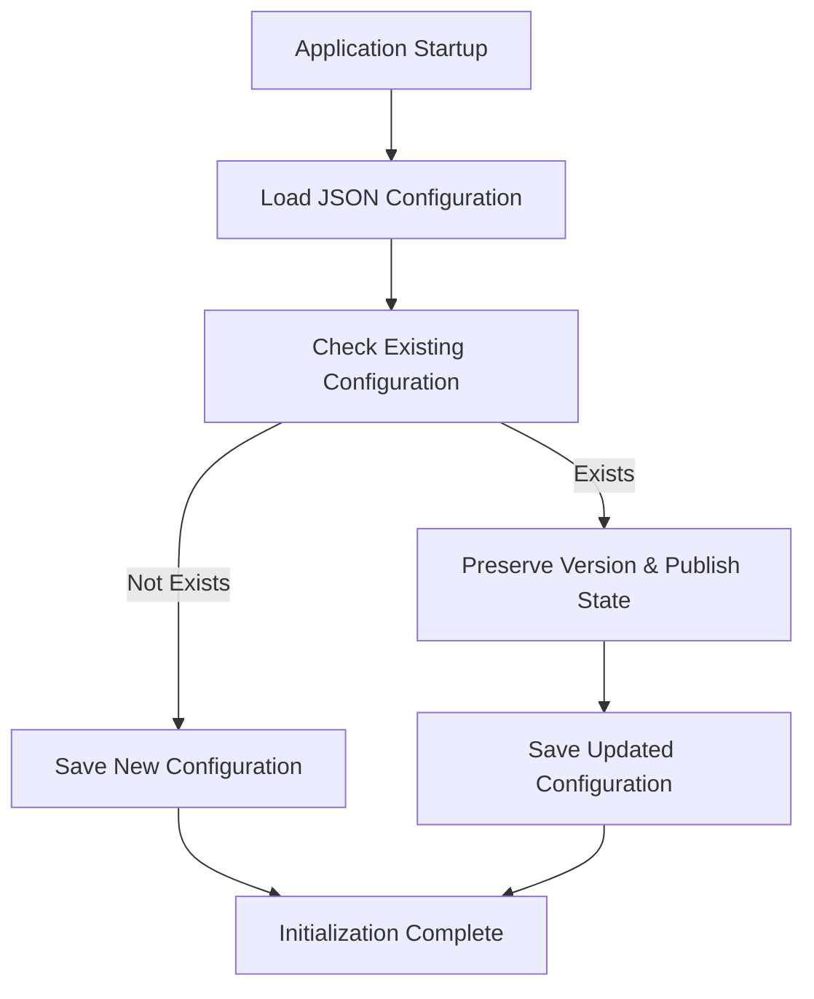
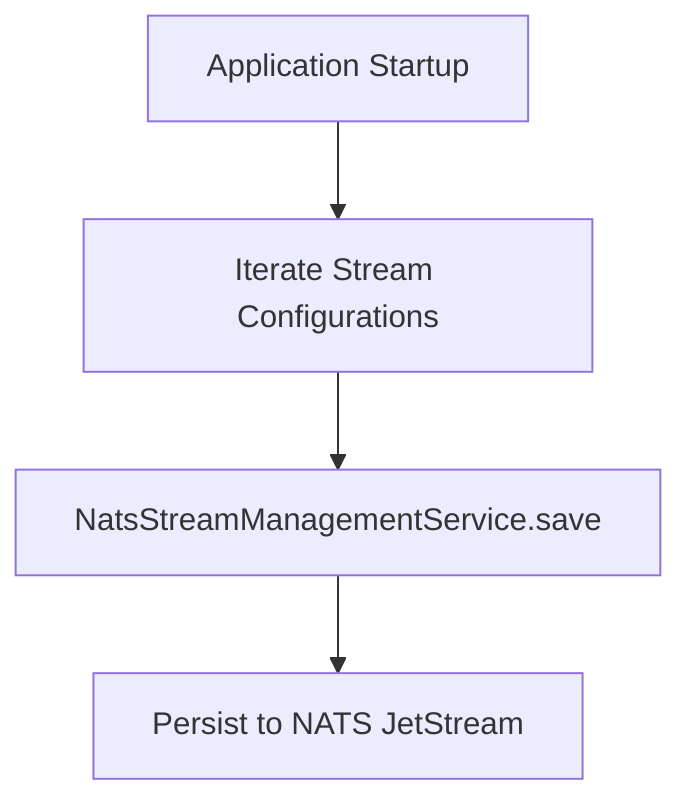
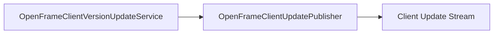
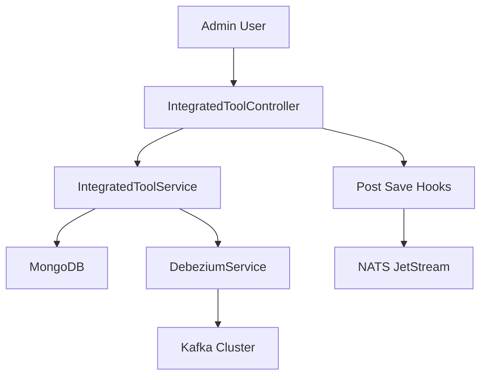

# Management Service Core

## Overview

The **Management Service Core** module is responsible for operational configuration and lifecycle management within the OpenFrame platform. It provides:

- Integrated tool configuration management
- Post-save extension hooks for tool lifecycle events
- Initialization of default client configurations
- Initialization and management of NATS JetStream streams
- Client version update orchestration
- Core Spring configuration for the Management service

This module acts as the operational control layer for tenant-aware tool integrations and client-side orchestration.

It is typically bootstrapped by the `ManagementApplication` in the Service Applications module and interacts with:

- Data Layer (Mongo, Kafka, Core)
- Stream infrastructure (NATS JetStream)
- Debezium connectors for CDC
- Tool and client configuration services

---

## Architectural Position in the Platform

The Management Service Core sits between persistent storage, streaming infrastructure, and higher-level orchestration logic.



### Key Responsibilities

1. Configure and expose REST endpoints for tool management
2. Trigger Debezium connector provisioning for integrated tools
3. Initialize and maintain required NATS streams
4. Bootstrap default OpenFrame client configuration
5. Provide extension points via post-save hooks
6. Support client version update publication

---

## Module Structure

The Management Service Core consists of the following primary components:

- `ManagementConfiguration`
- `IntegratedToolController`
- `IntegratedToolPostSaveHook`
- `OpenFrameClientConfigurationInitializer`
- `NatsStreamConfigurationInitializer`
- `OpenFrameClientVersionUpdateService`

---

# 1. Configuration Layer

## ManagementConfiguration

**Class:** `ManagementConfiguration`

This class defines the Spring configuration for the Management Service.

### Responsibilities

- Enables component scanning for `com.openframe`
- Excludes `CassandraHealthIndicator` from auto-scanning
- Provides a `PasswordEncoder` bean using `BCryptPasswordEncoder`

### Design Considerations

- The exclusion of `CassandraHealthIndicator` ensures that Cassandra health checks are not auto-wired into this service when not required.
- BCrypt ensures secure password hashing if password handling is required within management flows.



---

# 2. Integrated Tool Management

## IntegratedToolController

**Base Path:** `/v1/tools`

The `IntegratedToolController` exposes REST endpoints for managing integrated tools within the platform.

### Dependencies

- `IntegratedToolService`
- `DebeziumService`
- `List<IntegratedToolPostSaveHook>`

### Endpoints

#### Get All Tools

```text
GET /v1/tools
```

Returns:

- status
- tools list

#### Get Tool by ID

```text
GET /v1/tools/{id}
```

Returns:

- status
- tool (if found)
- error message (if not found)

#### Save Tool Configuration

```text
POST /v1/tools/{id}
```

Request Body:

```json
{
  "tool": { ... }
}
```

### Save Flow

When saving a tool:

1. ID is enforced from the path variable
2. Tool is enabled
3. Tool is persisted via `IntegratedToolService`
4. Debezium connectors are created or updated
5. All registered post-save hooks are executed
6. Response is returned to the client



### Resilience Strategy

- Post-save hooks are executed individually.
- Exceptions in hooks are logged but do not break the main save flow.
- Core persistence and Debezium configuration remain the critical path.

---

## IntegratedToolPostSaveHook

This interface defines a lightweight extension point invoked after a tool is saved.

```java
void onToolSaved(String toolId, IntegratedTool tool);
```

### Purpose

- Allows service-specific side effects
- Avoids full Spring event infrastructure
- Keeps tool lifecycle extensible

### Typical Use Cases

- Provisioning additional infrastructure
- Emitting domain events
- Synchronizing configuration with external systems



---

# 3. Client Configuration Initialization

## OpenFrameClientConfigurationInitializer

This component ensures that a default OpenFrame client configuration exists at startup.

### Trigger

Executed automatically via `@PostConstruct`.

### Configuration Source

```text
agent-configurations/client-configuration.json
```

### Initialization Logic

1. Load configuration from classpath JSON
2. Assign default ID
3. Check if configuration already exists
4. If exists:
   - Preserve version
   - Preserve publish state
   - Update remaining fields
5. If not exists:
   - Save as new configuration



### Design Goals

- Idempotent initialization
- Version preservation to prevent unintended downgrade
- Controlled update of publish state

---

# 4. NATS Stream Initialization

## NatsStreamConfigurationInitializer

This component ensures required NATS JetStream streams are created at startup.

### Trigger

Executed automatically via `@PostConstruct`.

### Streams Created

- `TOOL_INSTALLATION`
- `CLIENT_UPDATE`
- `TOOL_UPDATE`
- `TOOL_CONNECTIONS`
- `INSTALLED_AGENTS`

Each stream:

- Uses `StorageType.File`
- Uses `RetentionPolicy.Limits`
- Is subject-based (e.g., `machine.*.tool-installation`)



### Messaging Domains

- Tool lifecycle events
- Client update propagation
- Installed agent tracking
- Tool connection events

This initializer guarantees required infrastructure is present before runtime operations begin.

---

# 5. Client Version Update Service

## OpenFrameClientVersionUpdateService

This component is responsible for processing client release version updates.

### Dependency

- `OpenFrameClientUpdatePublisher`

Although the `process` method is currently empty, it is intended to:

- Accept a new release version
- Publish update events to connected clients
- Potentially trigger NATS or Kafka events



### Intended Use Case

- Rolling out new agent versions
- Broadcasting upgrade notifications
- Coordinating tenant-aware client updates

---

# End-to-End Tool Lifecycle Flow

The following diagram summarizes the interaction between controller, persistence, CDC, and streaming layers.



---

# Design Principles

### 1. Idempotent Initialization

Both configuration and stream initializers are safe to run multiple times.

### 2. Extensibility via Hooks

Post-save hooks allow new behaviors without modifying controller logic.

### 3. Infrastructure as Code

Streams and configurations are declared in code and provisioned automatically.

### 4. Clear Separation of Concerns

- Controller: HTTP interaction
- Service: Domain logic
- Initializers: Infrastructure bootstrap
- Hooks: Extensibility layer

---

# Summary

The **Management Service Core** module provides the operational backbone for:

- Tool configuration lifecycle
- Debezium-based change data capture integration
- NATS stream provisioning
- Client configuration bootstrapping
- Future client version orchestration

It ensures that both infrastructure and configuration layers are correctly initialized and maintained, enabling stable, extensible, and tenant-aware management operations across the OpenFrame platform.
