# Management Service Core

The **Management Service Core** module is responsible for platform-level orchestration, configuration bootstrapping, lifecycle automation, and operational maintenance tasks across the OpenFrame ecosystem.

It acts as the operational backbone of the platform by:

- Initializing critical infrastructure components (Pinot, NATS, Debezium)
- Managing integrated tools and their connectors
- Publishing agent and client version updates
- Running distributed scheduled jobs with locking
- Maintaining API key statistics and connector health

This module is packaged and started by the `ManagementApplication` in the service layer and integrates with MongoDB, Redis, NATS, Debezium, and Pinot.

---

## 1. Architectural Overview

The Management Service Core sits at the intersection of configuration, infrastructure automation, and distributed coordination.

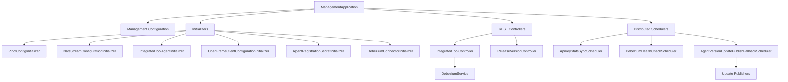

### Core Responsibilities

| Domain | Responsibility |
|--------|---------------|
| Configuration | Bootstraps platform components on startup |
| Tool Management | Manages integrated tool definitions and Debezium connectors |
| Versioning | Publishes client and tool agent version updates |
| Scheduling | Executes distributed background jobs using Redis locks |
| Observability | Ensures Debezium connectors remain healthy |

---

# 2. Configuration Layer

## 2.1 Management Configuration

**Class:** `ManagementConfiguration`

Responsibilities:

- Enables component scanning across the `com.openframe` namespace
- Excludes `CassandraHealthIndicator`
- Provides a `BCryptPasswordEncoder` bean

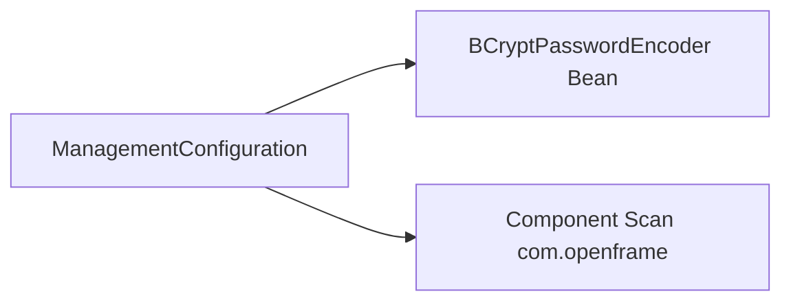

This ensures secure password hashing for any management-layer credential operations.

---

## 2.2 ShedLock Configuration

**Class:** `ShedLockConfig`

Enables distributed locking for scheduled tasks using Redis.

Key characteristics:

- `@EnableScheduling`
- `@EnableSchedulerLock`
- Redis-based `LockProvider`
- Tenant-scoped lock keys

Lock key structure:

```text
of:{tenantId}:job-lock:{environment}:{lockName}
```

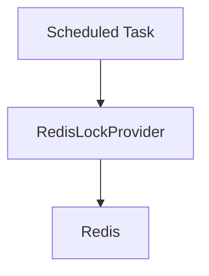

This guarantees that in multi-instance deployments, scheduled jobs execute only once per tenant.

---

# 3. Infrastructure Bootstrapping

The Management Service Core automatically initializes infrastructure at startup.

## 3.1 Pinot Configuration Initializer

**Class:** `PinotConfigInitializer`

Triggered on `ApplicationReadyEvent`.

Responsibilities:

- Deploys schemas
- Deploys REALTIME and OFFLINE table configs
- Retries failed deployments
- Resolves environment placeholders

Configured tables:

- devices
- logs

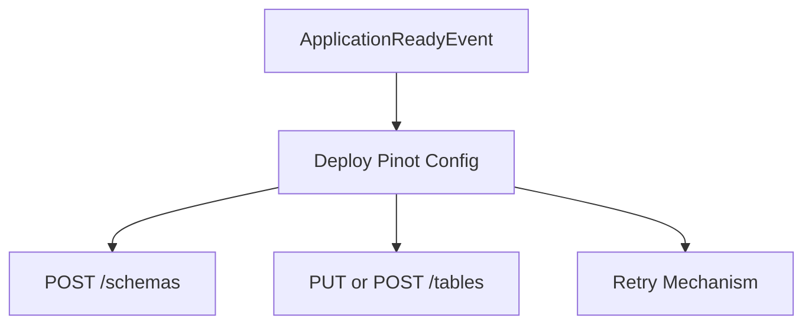

It ensures analytical infrastructure is correctly provisioned without manual intervention.

---

## 3.2 NATS Stream Configuration Initializer

**Class:** `NatsStreamConfigurationInitializer`

Creates required JetStream streams:

- TOOL_INSTALLATION
- CLIENT_UPDATE
- TOOL_UPDATE
- TOOL_CONNECTIONS
- INSTALLED_AGENTS

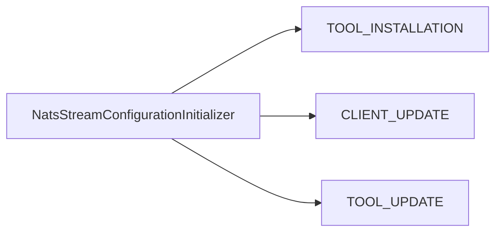

Ensures event-driven messaging infrastructure is ready before runtime operations begin.

---

## 3.3 Debezium Connector Initialization

**Class:** `DebeziumConnectorInitializer`

Activated if health-check property is enabled.

Behavior:

1. Checks existing connectors
2. If empty → loads IntegratedTools from MongoDB
3. Creates connectors dynamically

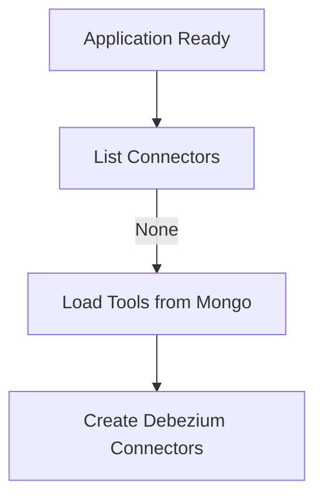

This guarantees CDC pipelines are restored automatically.

---

# 4. Integrated Tool Management

## 4.1 Integrated Tool Controller

**Class:** `IntegratedToolController`

Endpoint base path:

```
/v1/tools
```

Capabilities:

- List tools
- Retrieve tool by ID
- Save tool configuration
- Trigger Debezium connector updates
- Execute post-save hooks

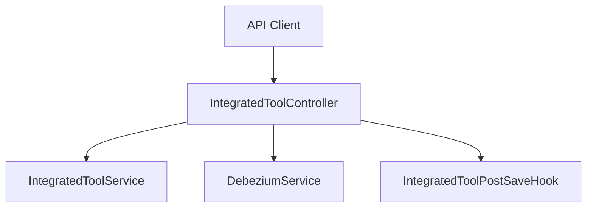

### Post Save Hooks

`IntegratedToolPostSaveHook` provides a lightweight extension mechanism invoked after a tool is saved.

This allows decoupled service-specific side effects without Spring event plumbing.

---

# 5. Agent & Client Configuration Lifecycle

## 5.1 Agent Registration Secret Initialization

**Class:** `AgentRegistrationSecretInitializer`

- Runs at startup
- Creates initial agent registration secret

Ensures agents can securely onboard to the platform.

---

## 5.2 Integrated Tool Agent Initializer

**Class:** `IntegratedToolAgentInitializer`

Responsibilities:

- Loads agent configuration JSON files
- Creates or updates agents
- Preserves release versions
- Publishes version updates when changed

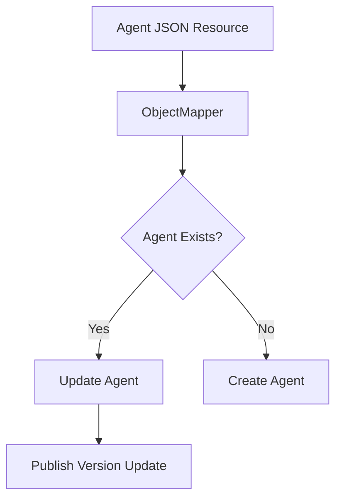

---

## 5.3 OpenFrame Client Configuration Initializer

**Class:** `OpenFrameClientConfigurationInitializer`

- Loads default client configuration
- Preserves existing version
- Maintains publish state

Guarantees consistent client update configuration across environments.

---

# 6. Version Update Handling

## 6.1 Release Version Controller

**Class:** `ReleaseVersionController`

Endpoint:

```
/v1/cluster-registrations
```

Accepts:

- `ReleaseVersionRequest`

Delegates to `ReleaseVersionService` to process new image tag versions.

---

## 6.2 OpenFrame Client Version Update Service

**Class:** `OpenFrameClientVersionUpdateService`

Intended to trigger publishing of new client versions through:

- `OpenFrameClientUpdatePublisher`

This forms part of the version propagation pipeline.

---

# 7. Distributed Schedulers

All schedulers use ShedLock + Redis for distributed execution.

## 7.1 API Key Stats Sync Scheduler

**Class:** `ApiKeyStatsSyncScheduler`

- Periodically syncs Redis stats to MongoDB
- Protected by `@SchedulerLock`

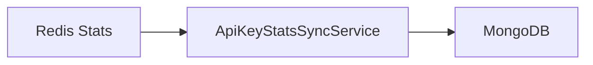

---

## 7.2 Debezium Health Check Scheduler

**Class:** `DebeziumHealthCheckScheduler`

- Periodically checks connectors
- Restarts failed tasks

Ensures CDC pipelines remain healthy.

---

## 7.3 Agent Version Update Publish Fallback Scheduler

**Class:** `AgentVersionUpdatePublishFallbackScheduler`

Purpose:

- Detect unpublished client or agent versions
- Retry publish up to configured max attempts

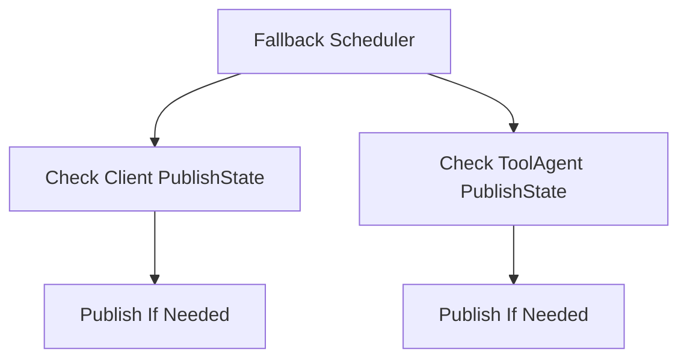

This ensures eventual consistency even if initial publish attempts fail.

---

# 8. Cross-Cutting Patterns

## 8.1 Multi-Tenancy

- Tenant-scoped Redis lock keys
- Tenant-aware infrastructure initialization

## 8.2 Idempotent Startup

All initializers follow safe patterns:

- Create-if-missing
- Update-if-exists
- Preserve release versions
- Retry with backoff

## 8.3 Event-Driven Architecture

The module integrates with:

- Debezium (CDC)
- NATS (JetStream)
- Version update publishers

---

# 9. Runtime Lifecycle

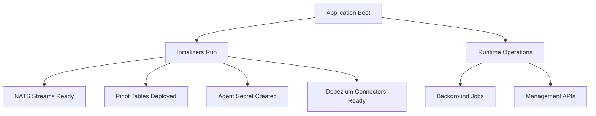

---

# 10. Summary

The **Management Service Core** is the operational control plane of OpenFrame.

It:

- Automates infrastructure provisioning
- Manages integrated tools and CDC connectors
- Orchestrates agent and client version propagation
- Ensures distributed job safety with Redis locks
- Maintains platform health through scheduled monitoring

Without this module, the platform would require significant manual infrastructure coordination and would lose resiliency in distributed environments.

The Management Service Core transforms OpenFrame into a self-healing, self-initializing, and operationally autonomous platform component.
