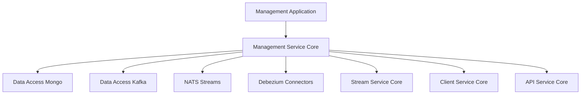
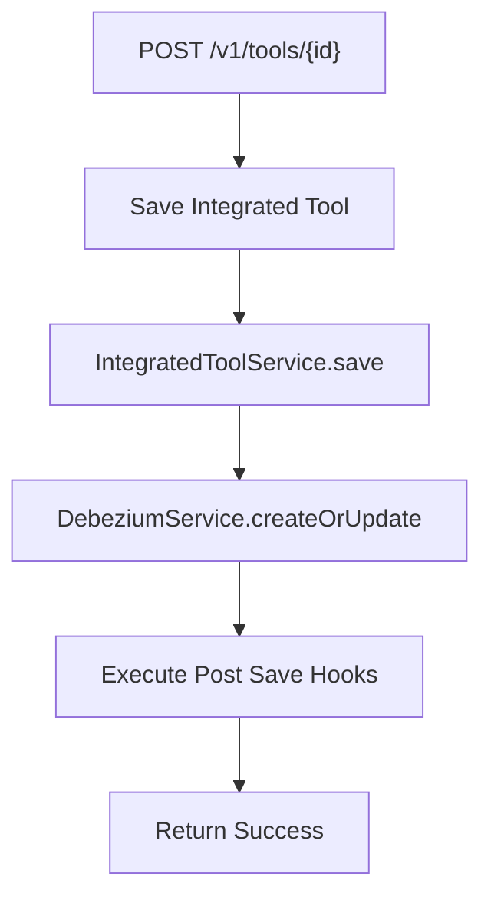
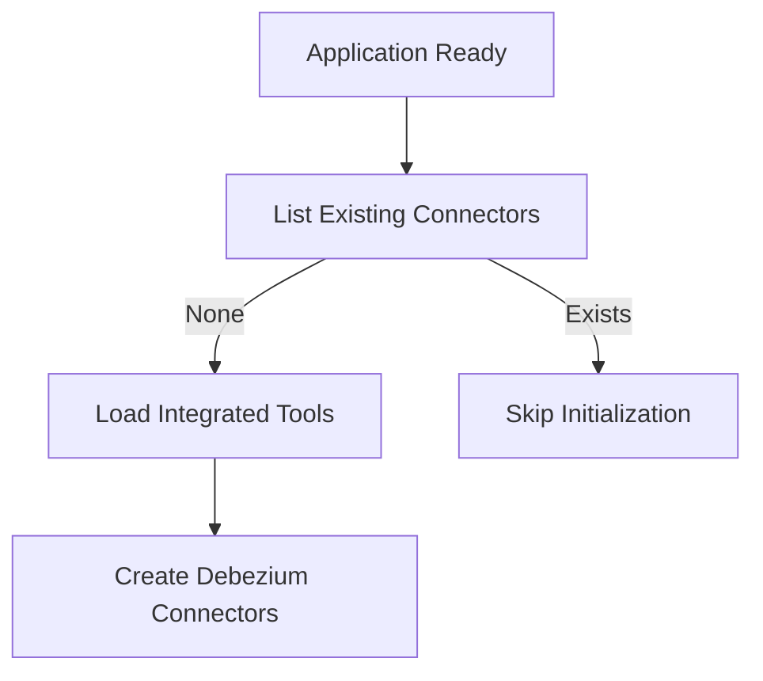
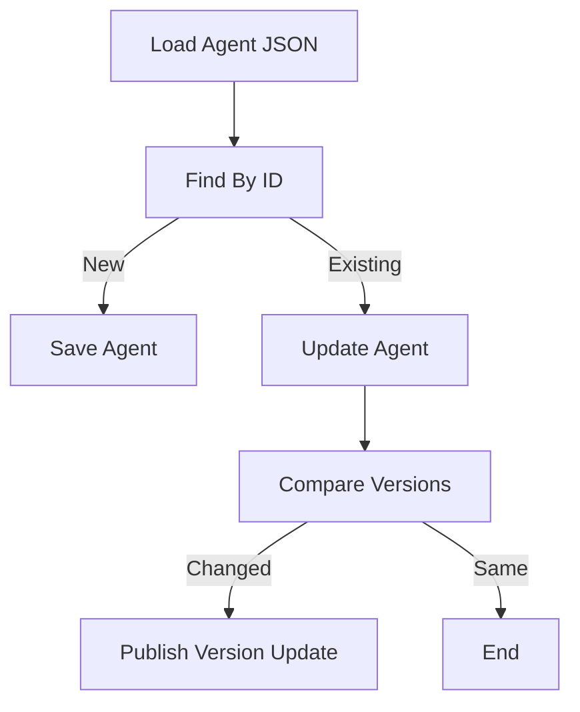
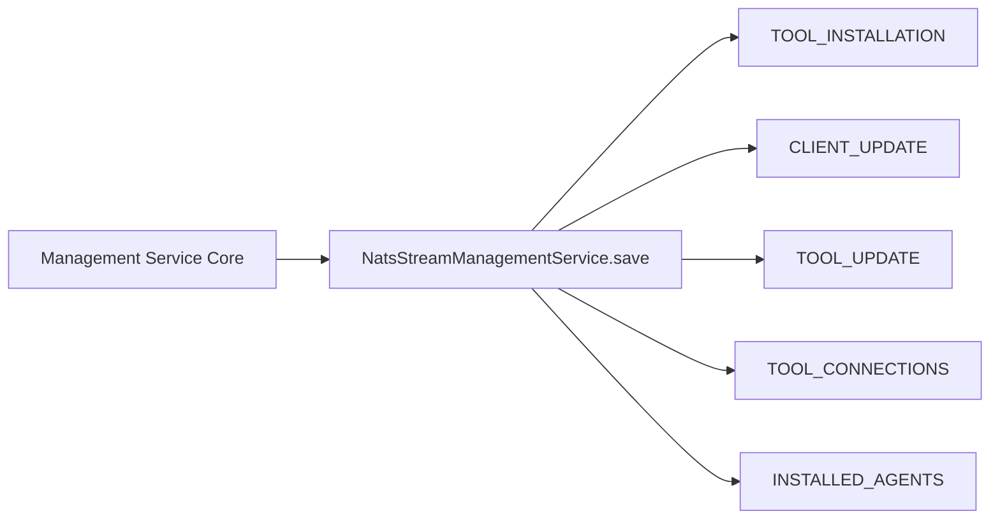
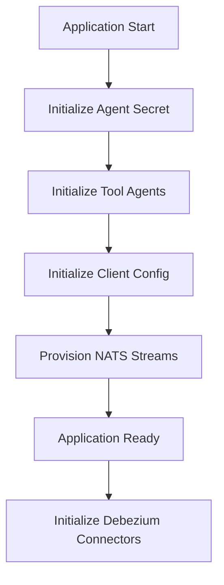

# Management Service Core

The **Management Service Core** module is responsible for cluster-level orchestration, tool lifecycle management, agent configuration bootstrapping, and messaging infrastructure initialization within the OpenFrame platform.

It acts as the operational control plane for:

- Integrated tool configuration and lifecycle
- Agent configuration and version propagation
- Debezium connector orchestration
- NATS stream provisioning
- Client configuration initialization
- Cluster release coordination

This module is packaged into the `ManagementApplication` service and integrates with multiple platform components including the API Service Core, Stream Service Core, Data Access layers, and Gateway.

---

## Architectural Role in the Platform

At runtime, the Management Service Core sits between persistence, messaging infrastructure, and operational services.



### Key Responsibilities

| Area | Responsibility |
|------|----------------|
| Tool Management | Persist and activate Integrated Tools |
| CDC Management | Create and validate Debezium connectors |
| Agent Bootstrapping | Load and update integrated tool agents |
| Client Configuration | Initialize default OpenFrame client configuration |
| Messaging | Provision NATS streams |
| Cluster Lifecycle | Process release version updates |
| Security | Provide password encoding and secure initialization |

---

# Core Components Overview

## 1. Management Configuration

**Component:** `ManagementConfiguration`

Provides foundational Spring configuration:

- Component scanning across `com.openframe`
- Excludes Cassandra health indicator
- Registers a `BCryptPasswordEncoder` bean

This enables secure hashing for internal secrets and management workflows.

---

## 2. Integrated Tool Management

**Component:** `IntegratedToolController`

**Endpoint Base:** `/v1/tools`

### Responsibilities

- Retrieve all integrated tools
- Retrieve single tool configuration
- Save and activate tool configuration
- Trigger Debezium connector updates
- Execute post-save hooks

### Tool Save Flow



### Key Integrations

- **IntegratedToolService** (Mongo persistence)
- **DebeziumService** (CDC connector lifecycle)
- **IntegratedToolPostSaveHook** (extensibility mechanism)

This controller is the primary administrative interface for enabling and updating external integrations.

---

## 3. Debezium Connector Initialization

**Component:** `DebeziumConnectorInitializer`

Triggered on `ApplicationReadyEvent` when property:

```text
openframe.debezium.health-check.enabled=true
```

### Behavior

- Checks if connectors already exist
- If none exist:
  - Fetches all Integrated Tools
  - Extracts Debezium connector definitions
  - Creates connectors in Debezium



This guarantees CDC consistency after deployments or clean infrastructure startups.

---

## 4. Agent Configuration Bootstrapping

### 4.1 Agent Registration Secret

**Component:** `AgentRegistrationSecretInitializer`

- Runs at startup via `ApplicationRunner`
- Calls `AgentRegistrationSecretManagementService.createInitialSecret()`
- Ensures secure agent onboarding

This secret is required by the Client Service Core during agent registration.

---

### 4.2 Integrated Tool Agent Initialization

**Component:** `IntegratedToolAgentInitializer`

Loads agent configuration files from classpath.

### Responsibilities

- Read JSON configuration files
- Create or update `IntegratedToolAgent`
- Preserve release versions
- Detect version changes
- Publish update events via `ToolAgentUpdateUpdatePublisher`

### Version Update Flow



Release agents are protected from accidental version overrides.

---

## 5. OpenFrame Client Configuration Initialization

**Component:** `OpenFrameClientConfigurationInitializer`

Loads default client configuration from:

```text
agent-configurations/client-configuration.json
```

### Behavior

- Sets default ID
- Preserves existing version
- Updates publish state
- Saves configuration

This ensures consistent default client behavior across clusters.

---

## 6. NATS Stream Provisioning

**Component:** `NatsStreamConfigurationInitializer`

Creates predefined NATS streams at startup.

### Configured Streams

| Stream | Subject Pattern |
|--------|-----------------|
| TOOL_INSTALLATION | machine.*.tool-installation |
| CLIENT_UPDATE | machine.*.client-update |
| TOOL_UPDATE | machine.*.tool.*.update |
| TOOL_CONNECTIONS | machine.*.tool-connection |
| INSTALLED_AGENTS | machine.*.installed-agent |



These streams power event-driven updates consumed by the Stream Service Core and Client Service Core.

---

## 7. Release Version Processing

**Component:** `ReleaseVersionController`

**Endpoint Base:** `/v1/cluster-registrations`

Receives release version updates and delegates to `ReleaseVersionService`.

Additionally, the module includes:

- `OpenFrameClientVersionUpdateService`

This service is intended to:

- Process new release versions
- Publish update notifications via `OpenFrameClientUpdatePublisher`
- Trigger client-side updates across machines

---

# Startup Lifecycle Overview

The Management Service Core performs multiple initialization stages.



This layered initialization ensures:

- Secure agent onboarding
- Stable configuration
- Messaging readiness
- CDC synchronization

---

# Interactions with Other Modules

The Management Service Core coordinates with multiple platform modules:

- [API Service Core](../api-service-core/api-service-core.md)
- [Client Service Core](../client-service-core/client-service-core.md)
- [Stream Service Core](../stream-service-core/stream-service-core.md)
- [Data Access Mongo](../data-access-mongo/data-access-mongo.md)
- [Data Access Kafka](../data-access-kafka/data-access-kafka.md)
- [Gateway Service Core](../gateway-service-core/gateway-service-core.md)
- [Authorization Server Core](../authorization-server-core/authorization-server-core.md)

### Integration Patterns

| Integration | Purpose |
|-------------|----------|
| Mongo Repositories | Persist tools and configurations |
| Kafka / NATS | Publish update events |
| Debezium | CDC connector management |
| Client Service | Agent lifecycle updates |
| Stream Service | Event enrichment and propagation |

---

# Design Characteristics

## Idempotent Initialization

Most initializers:

- Check existing state
- Preserve release versions
- Avoid overwriting production data

## Event-Driven Architecture

Updates are propagated using publishers such as:

- `ToolAgentUpdateUpdatePublisher`
- `OpenFrameClientUpdatePublisher`

## Extensibility via Hooks

`IntegratedToolPostSaveHook` allows custom behavior without modifying core logic.

---

# Summary

The **Management Service Core** is the operational backbone of OpenFrame’s control plane.

It ensures:

- Tools are configured and activated
- Debezium connectors remain synchronized
- Agents receive version updates
- Client configurations are initialized safely
- Messaging infrastructure is provisioned
- Release versions propagate across the cluster

By combining idempotent initialization, event-driven updates, and CDC orchestration, this module guarantees stable and consistent cluster management across deployments.