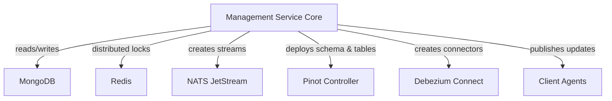
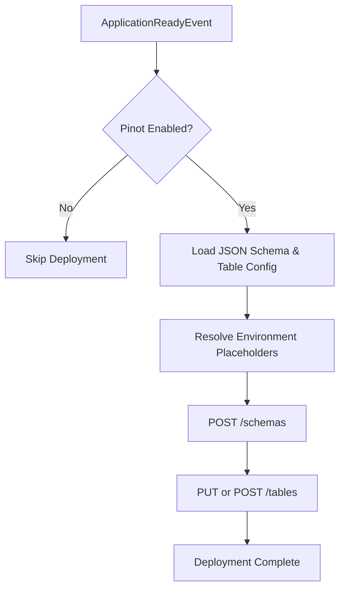
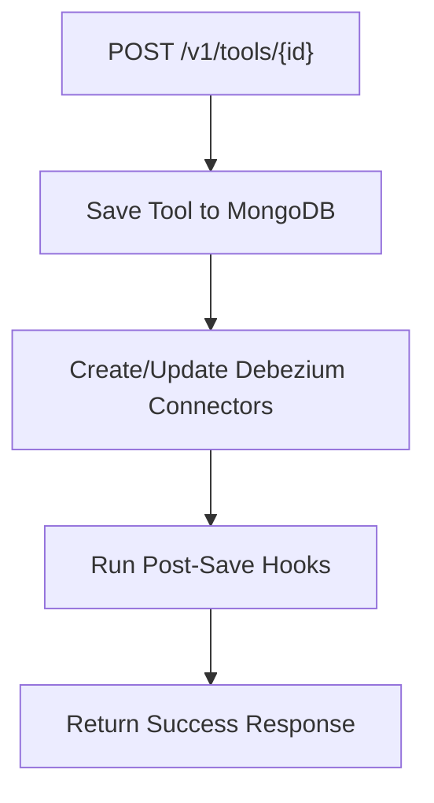
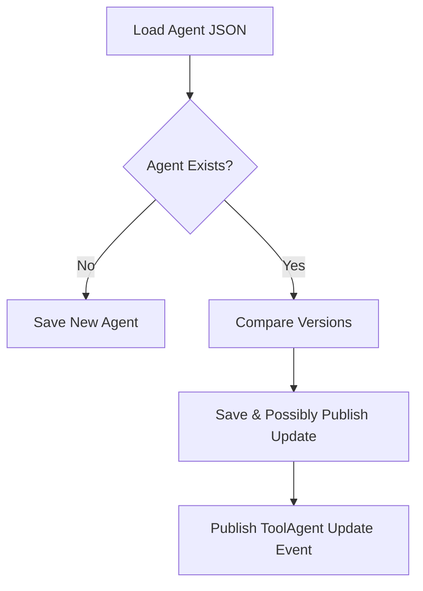
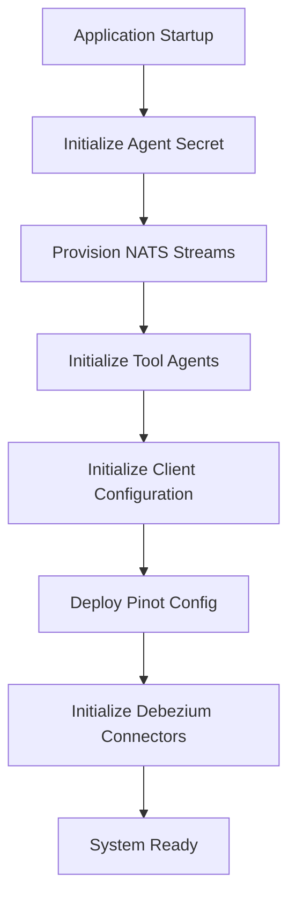

# Management Service Core

The **Management Service Core** module is the operational backbone of the OpenFrame platform. It is responsible for system-level initialization, integrated tool lifecycle management, stream and connector bootstrapping, client configuration management, and cluster release coordination.

Unlike request-driven API services, this module focuses on:

- Platform bootstrapping and environment initialization
- Integrated tool configuration and Debezium connector orchestration
- NATS stream provisioning
- Pinot schema and table deployment
- Client configuration and version lifecycle support
- Cluster registration and release version handling

It plays a central role in ensuring that the OpenFrame ecosystem is correctly configured and synchronized at startup and during operational changes.

---

## Architectural Context

The Management Service Core interacts with multiple foundational modules:

- **Data Storage and Messaging Core** (MongoDB, Redis, Kafka, Pinot)
- **Stream Service Core** (event processing)
- **Client Service Core** (agents and client configuration)
- **Gateway and API Services** (tool exposure and orchestration)

It primarily acts as a control-plane service rather than a high-throughput data-plane service.



---

# Core Responsibilities

## 1. Application Bootstrapping & Core Configuration

### Management Configuration

The `ManagementConfiguration` class:

- Enables component scanning across `com.openframe`
- Excludes `CassandraHealthIndicator` (avoiding unintended health checks)
- Defines a `BCryptPasswordEncoder` bean for secure password hashing

This ensures the Management Service has:

- Secure password encoding support
- Controlled Spring context loading

---

## 2. Distributed Scheduling & Locking

### ShedLock Configuration

The `ShedLockConfig` configures distributed locks using Redis.

Key characteristics:

- Uses `RedisLockProvider`
- Enables `@EnableScheduling`
- Applies tenant-scoped lock prefixes via `OpenframeRedisKeyBuilder`
- Supports environment-specific isolation

Lock key structure:

```text
of:{tenantId}:job-lock:<environment>:<lockName>
```

This guarantees:

- No duplicate scheduled job execution
- Tenant isolation
- Safe horizontal scaling

---

## 3. Pinot Analytics Configuration Deployment

### Pinot Config Initializer

The `PinotConfigInitializer` automatically deploys:

- Device schema
- Logs schema
- Realtime table configuration
- Optional offline table configuration

Deployment lifecycle:



Key features:

- Retry mechanism with configurable backoff
- Idempotent table creation (update or create)
- JSON validation before submission
- Environment placeholder resolution

This ensures analytics infrastructure is always aligned with the deployed version.

---

## 4. Integrated Tool Lifecycle Management

### Integrated Tool Controller

The `IntegratedToolController` exposes REST endpoints under:

```text
/v1/tools
```

Supported operations:

- Retrieve all tools
- Retrieve tool by ID
- Save or update tool configuration

When a tool is saved:

1. Tool is persisted via `IntegratedToolService`
2. Debezium connectors are created or updated
3. All registered `IntegratedToolPostSaveHook` implementations are executed



### Post-Save Hook Extension Point

The `IntegratedToolPostSaveHook` interface allows service-specific side effects without Spring event complexity.

This makes tool lifecycle extensible while remaining lightweight.

---

## 5. Debezium Connector Initialization

### Debezium Connector Initializer

Activated via property:

```text
openframe.debezium.health-check.enabled=true
```

On `ApplicationReadyEvent`:

- Checks if Debezium connectors already exist
- If none exist:
  - Reads all `IntegratedTool` documents
  - Creates connectors for those with Debezium configuration

This ensures CDC pipelines are restored automatically after infrastructure resets.

---

## 6. Integrated Tool Agent Configuration

### Integrated Tool Agent Initializer

On startup (`@PostConstruct`):

- Loads agent configuration JSON files from classpath
- Deserializes into `IntegratedToolAgent`
- Upserts into MongoDB
- Preserves release versions
- Publishes version updates if changed

Version update flow:



This ensures agent definitions are:

- Declarative
- Version-controlled
- Upgrade-aware

---

## 7. Agent Registration Secret Initialization

The `AgentRegistrationSecretInitializer` runs at startup and:

- Creates the initial agent registration secret
- Ensures secure onboarding for agents

This guarantees that agents cannot register without a controlled secret.

---

## 8. NATS Stream Provisioning

### NATS Stream Configuration Initializer

At startup, predefined JetStream configurations are created:

- `TOOL_INSTALLATION`
- `CLIENT_UPDATE`
- `TOOL_UPDATE`
- `TOOL_CONNECTIONS`
- `INSTALLED_AGENTS`

Each stream defines:

- Subject patterns (e.g., `machine.*.tool-update`)
- Storage type
- Retention policy

This guarantees that messaging infrastructure exists before publishers begin emitting events.

---

## 9. OpenFrame Client Configuration Management

### OpenFrame Client Configuration Initializer

On startup:

- Loads `client-configuration.json`
- Upserts default configuration
- Preserves version and publish state

This ensures client defaults remain synchronized and version-safe.

---

## 10. Release Version & Cluster Registration

### Release Version Controller

Endpoint:

```text
/v1/cluster-registrations
```

Accepts:

```text
ReleaseVersionRequest
  imageTagVersion: String
```

Delegates processing to `ReleaseVersionService`.

### OpenFrame Client Version Update Service

`OpenFrameClientVersionUpdateService` is designed to:

- Process new release versions
- Publish client update events
- Coordinate fleet-wide version upgrades

This enables centralized control of distributed client deployments.

---

# Initialization Lifecycle Overview

The Management Service Core performs multiple startup-phase operations.



This ordered orchestration ensures that:

- Secrets exist before agents connect
- Streams exist before events are published
- Schemas exist before analytics data arrives
- Connectors exist before CDC pipelines run

---

# Design Principles

The Management Service Core follows several architectural principles:

### 1. Idempotent Bootstrapping
All initializers are safe to run multiple times.

### 2. Declarative Infrastructure
JSON-based configuration for:

- Agents
- Pinot
- Client configuration

### 3. Tenant-Aware Isolation
Redis lock prefixes and key strategies enforce tenant scoping.

### 4. Extensibility
Hook interfaces (e.g., `IntegratedToolPostSaveHook`) enable modular behavior.

### 5. Safe Distributed Operation
- Redis-based distributed locks
- Retry logic for external systems
- Conditional initialization for connectors

---

# Summary

The **Management Service Core** is the operational control layer of the OpenFrame ecosystem.

It ensures that:

- Infrastructure dependencies are provisioned
- Tools and agents are configured and version-controlled
- Messaging streams are available
- Analytics schemas are deployed
- Release versions are coordinated
- Secrets and client configurations are initialized safely

Without this module, the system would lack automated infrastructure synchronization and lifecycle governance.

It transforms OpenFrame from a collection of services into a self-initializing, self-healing platform.