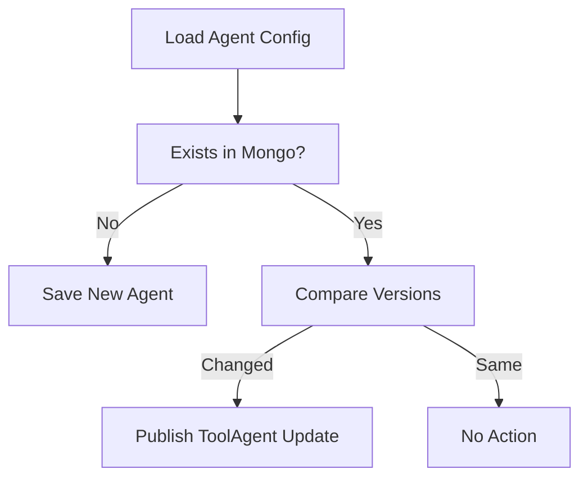
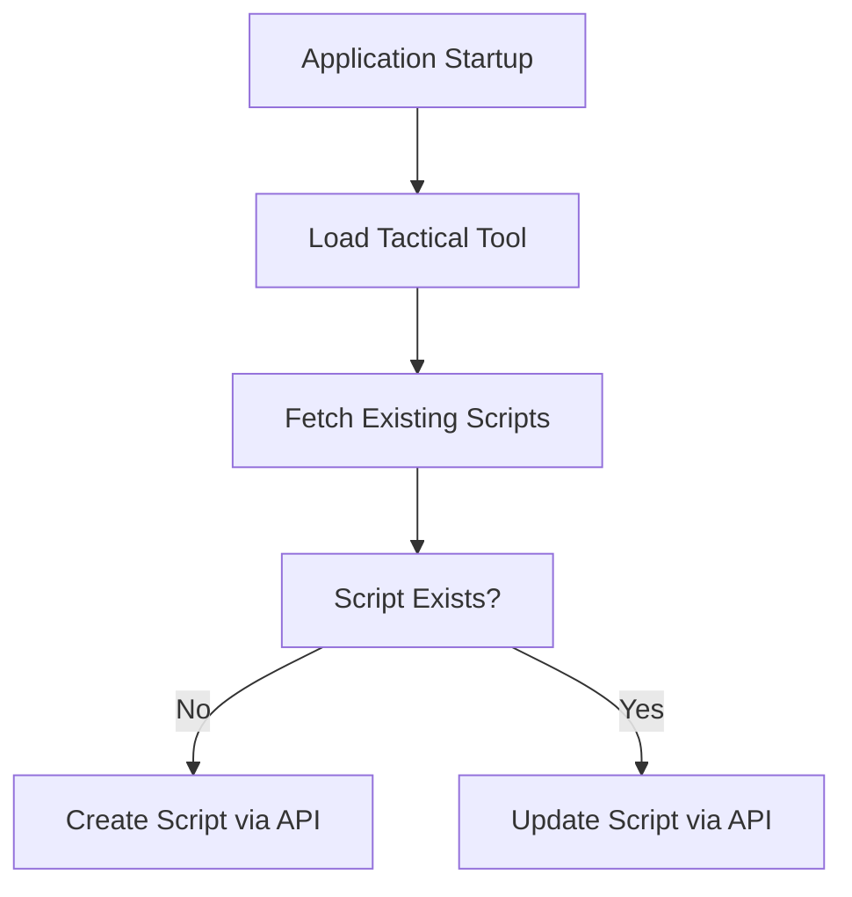
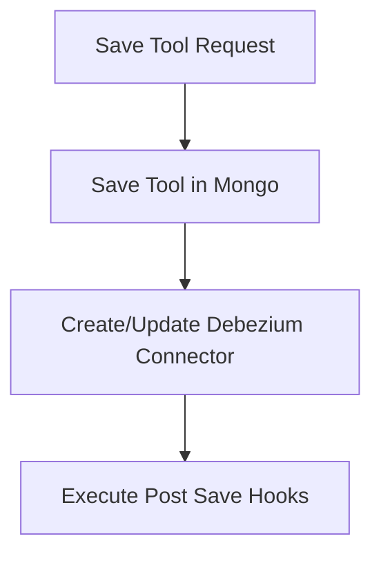
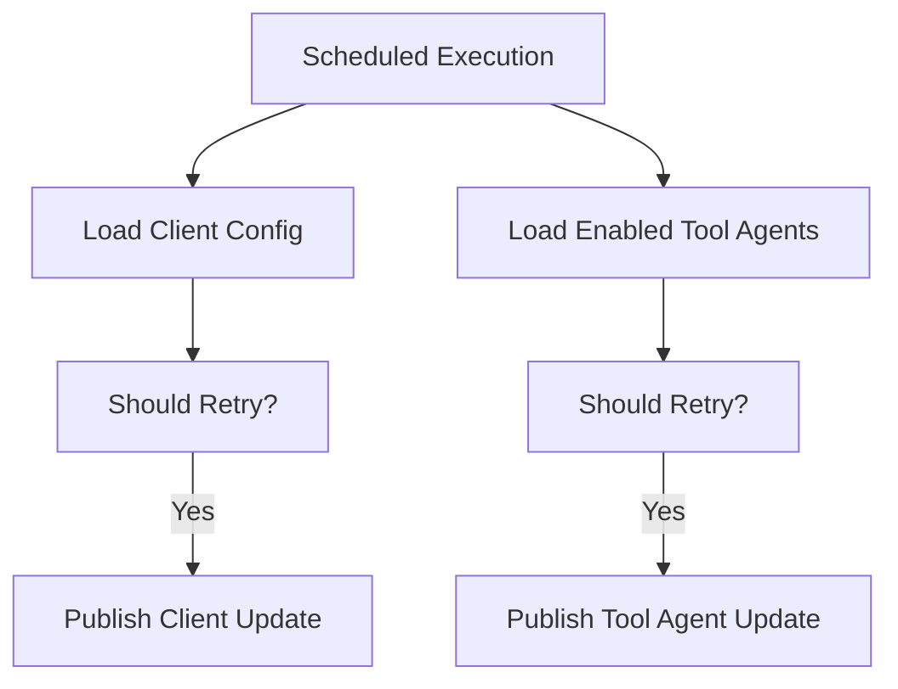

# Management Service Core Initialization And Schedulers

## Overview

The **Management Service Core Initialization And Schedulers** module is responsible for:

- Bootstrapping platform configuration at application startup
- Provisioning infrastructure-level resources (Pinot, NATS, Debezium, Tactical RMM, agents)
- Managing integrated tool lifecycle hooks
- Coordinating distributed scheduled jobs with tenant-aware locking
- Publishing version updates for OpenFrame clients and tool agents

This module acts as the **operational control plane** for the OpenFrame tenant runtime. While other services handle API, streaming, authorization, and data persistence, this module ensures the system is correctly initialized and continuously maintained.

It is used by the `ManagementApplication` entrypoint and integrates with:

- Data Layer (Mongo, Redis, Cassandra, Pinot)
- Stream Layer (Kafka, Debezium, NATS)
- Integrated Tool infrastructure
- Client and Tool Agent update publishers

---

## Architectural Role

### High-Level Responsibilities

1. **Application Bootstrap Initialization**
   - Seed agent secrets
   - Initialize IntegratedToolAgent configurations
   - Deploy Pinot schemas and table configs
   - Create NATS streams
   - Initialize Tactical RMM scripts
   - Ensure Debezium connectors exist

2. **Operational Schedulers**
   - API key statistics sync
   - Debezium health monitoring
   - Fallback publishing of client/agent updates

3. **Management APIs**
   - Integrated tool configuration endpoints
   - Cluster release version registration

---

## Runtime Architecture

```mermaid
flowchart TD
    ManagementApp["Management Application"] --> Config["ManagementConfiguration"]
    ManagementApp --> Initializers["Startup Initializers"]
    ManagementApp --> Schedulers["Distributed Schedulers"]
    ManagementApp --> Controllers["Management Controllers"]

    subgraph init_layer["Initialization Layer"]
        Initializers --> AgentSecretInit["AgentRegistrationSecretInitializer"]
        Initializers --> ToolAgentInit["IntegratedToolAgentInitializer"]
        Initializers --> PinotInit["PinotConfigInitializer"]
        Initializers --> NatsInit["NatsStreamConfigurationInitializer"]
        Initializers --> ClientConfigInit["OpenFrameClientConfigurationInitializer"]
        Initializers --> TacticalInit["TacticalRmmScriptsInitializer"]
        Initializers --> DebeziumInit["DebeziumConnectorInitializer"]
    end

    subgraph sched_layer["Scheduler Layer"]
        Schedulers --> ApiKeySync["ApiKeyStatsSyncScheduler"]
        Schedulers --> DebeziumHealth["DebeziumHealthCheckScheduler"]
        Schedulers --> AgentFallback["AgentVersionUpdatePublishFallbackScheduler"]
    end

    Controllers --> ToolController["IntegratedToolController"]
    Controllers --> ReleaseController["ReleaseVersionController"]
```



---

# Core Configuration Layer

## ManagementConfiguration

- Enables component scanning across `com.openframe`
- Explicitly excludes `CassandraHealthIndicator` to avoid cross-service health conflicts
- Provides a `BCryptPasswordEncoder` bean for secure password hashing

This ensures the Management service can independently operate without inheriting unwanted health checks from the data layer.

---

## ShedLockConfig

This configuration enables:

- Spring scheduling (`@EnableScheduling`)
- Distributed scheduler locking (`@EnableSchedulerLock`)
- Redis-backed `LockProvider`

### Tenant-Aware Locking Strategy

Locks are generated using a tenant-scoped Redis key prefix:

```text
of:{tenantId}:job-lock:{environment}:{lockName}
```

This guarantees:

- No duplicate scheduler execution in clustered environments
- Isolation across tenants
- Safety during horizontal scaling

---

# Initialization Layer

Initialization components execute at application startup using either:

- `@PostConstruct`
- `ApplicationRunner`
- `ApplicationReadyEvent`

---

## AgentRegistrationSecretInitializer

Ensures an agent registration secret exists at startup.

- Delegates to `AgentRegistrationSecretManagementService`
- Idempotent behavior
- Prevents agent registration failures due to missing secrets

---

## IntegratedToolAgentInitializer

Loads tool agent configurations from classpath JSON resources defined in `AgentConfigurationProperties`.

### Behavior

For each configured file:

1. Load JSON → `IntegratedToolAgent`
2. If agent exists:
   - Preserve release version if flagged
   - Preserve publish state
   - Detect version changes
   - Publish update if necessary
3. If agent does not exist:
   - Persist new agent

### Version Update Flow



---

## OpenFrameClientConfigurationInitializer

Initializes default OpenFrame client configuration from:

```text
agent-configurations/client-configuration.json
```

### Behavior

- Enforces default ID
- Preserves existing version
- Preserves publish state
- Updates or creates configuration

This prevents accidental downgrade of client release versions.

---

## NatsStreamConfigurationInitializer

Ensures required NATS streams exist:

- TOOL_INSTALLATION
- CLIENT_UPDATE
- TOOL_UPDATE
- TOOL_CONNECTIONS
- INSTALLED_AGENTS

Each stream:

- Uses File storage
- Uses Limits retention
- Is created idempotently

This guarantees message infrastructure exists before publishers begin emitting events.

---

## PinotConfigInitializer

Deploys Pinot schemas and table configurations at startup.

### Managed Tables

- devices
- logs

### Deployment Strategy

1. Load schema JSON
2. Load table config JSON
3. Resolve Spring placeholders
4. POST schema
5. PUT table config (fallback to POST if not found)
6. Retry on network failures

### Retry Mechanism

- Configurable max attempts
- Configurable retry delay
- Retries only on `ResourceAccessException`

This makes Pinot schema deployment resilient to controller startup race conditions.

---

## DebeziumConnectorInitializer

Triggered on `ApplicationReadyEvent` (conditional on property).

### Logic

1. Query Debezium for existing connectors
2. If connectors exist → skip
3. If none exist → load all IntegratedTools
4. For each tool with `debeziumConnectors` defined:
   - Create connector

Ensures streaming replication is restored automatically after cluster restart.

---

## TacticalRmmScriptsInitializer

Provisioning integration scripts for Tactical RMM.

### Flow



Scripts are:

- Loaded from classpath resources
- Compared by name
- Created or updated via `TacticalRmmClient`

This keeps remote RMM script definitions aligned with OpenFrame expectations.

---

# Management Controllers

## IntegratedToolController

Base path:

```text
/v1/tools
```

### Endpoints

- `GET /v1/tools` → List tools
- `GET /v1/tools/{id}` → Get tool
- `POST /v1/tools/{id}` → Save tool

### Save Flow



After persistence:

- Debezium connectors are updated
- All `IntegratedToolPostSaveHook` implementations execute
- Hook failures do not break request

This allows extension behavior without heavy Spring event infrastructure.

---

## ReleaseVersionController

Base path:

```text
/v1/cluster-registrations
```

Accepts:

```text
ReleaseVersionRequest
```

Fields:

```text
imageTagVersion
```

Delegates to `ReleaseVersionService`.

Used by cluster orchestration systems to register deployed image versions.

---

# Scheduler Layer

All schedulers use:

- `@Scheduled`
- `@SchedulerLock` (ShedLock)
- Property-based enablement

---

## ApiKeyStatsSyncScheduler

Purpose:

Synchronizes API key usage statistics from Redis to MongoDB.

### Characteristics

- Distributed lock: `apiKeyStatsSync`
- Configurable lock durations
- Configurable interval

Guarantees consistency across horizontally scaled instances.

---

## DebeziumHealthCheckScheduler

Purpose:

- Monitor Debezium connectors
- Restart failed tasks

### Lock

`debeziumHealthCheck`

Prevents concurrent connector management across instances.

---

## AgentVersionUpdatePublishFallbackScheduler

Fallback mechanism to ensure version updates are published.

### Monitored Entities

- OpenFrameClientConfiguration
- IntegratedToolAgent

### Retry Logic

Entity is republished if:

- `publishState` is null
- Not marked as published
- Attempt count < maxAttempts

### Flow



This protects against transient messaging failures.

---

# Debezium and Connector Status Model

## ConnectorStatus DTO

Maps Debezium REST API response:

- Connector state
- Worker ID
- Task statuses
- Failure traces

Used for monitoring and restart decisions.

---

# Cross-Module Integration

The Management Service Core interacts with:

- Data Layer (Mongo documents and repositories)
- Redis (distributed locking)
- NATS (stream provisioning)
- Kafka / Debezium (CDC replication)
- Pinot (analytics tables)
- Integrated Tool services
- Client update publishers

It does **not** serve user-facing APIs; instead it operates as:

- Infrastructure bootstrapper
- System consistency enforcer
- Background maintenance coordinator

---

# Design Principles

1. **Idempotent Initialization**
   - Safe to run on every restart
   - No duplicate infrastructure

2. **Distributed Safety**
   - ShedLock-based scheduling
   - Tenant-scoped lock keys

3. **Graceful Failure Handling**
   - Retry on transient network failures
   - Log but do not crash on initializer errors

4. **Extension-Oriented Architecture**
   - Post-save hooks
   - Pluggable schedulers

---

# Summary

The **Management Service Core Initialization And Schedulers** module ensures:

- All infrastructure dependencies are provisioned correctly
- All runtime agents and client configurations are consistent
- Streaming connectors are operational
- Distributed jobs execute safely
- Version updates are eventually published

It is the operational backbone of OpenFrame’s tenant runtime and guarantees that all other services start and continue functioning in a consistent and resilient manner.
