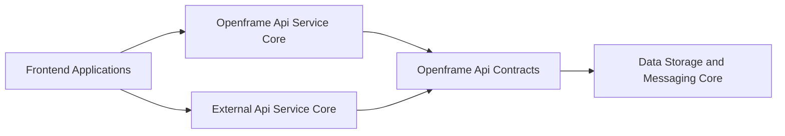
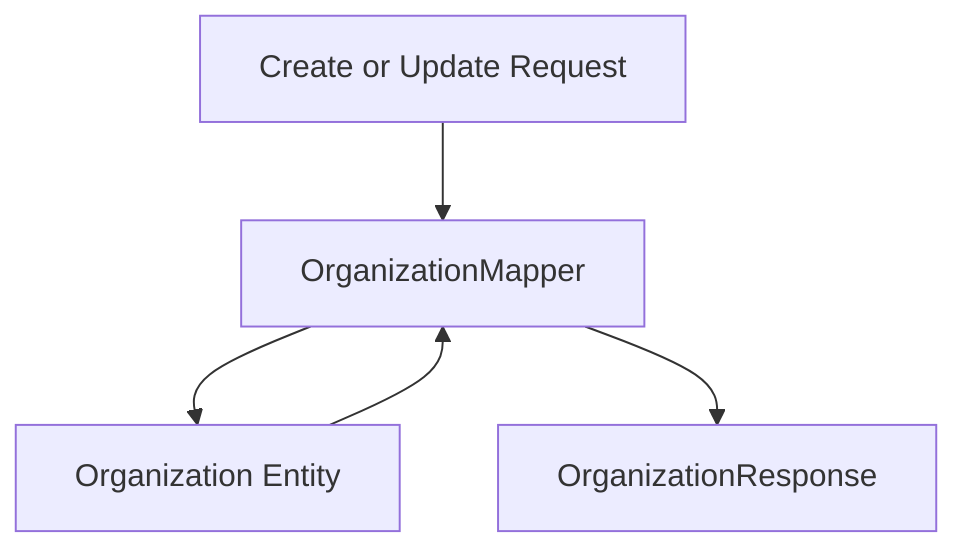
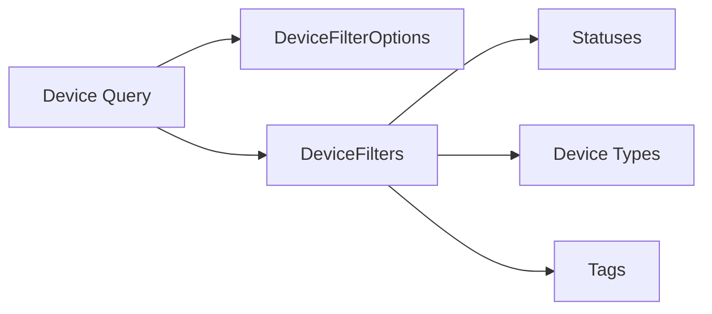
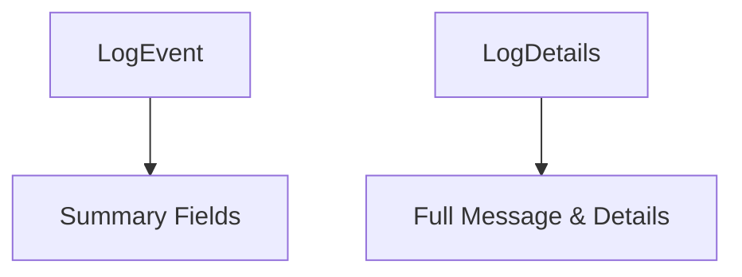
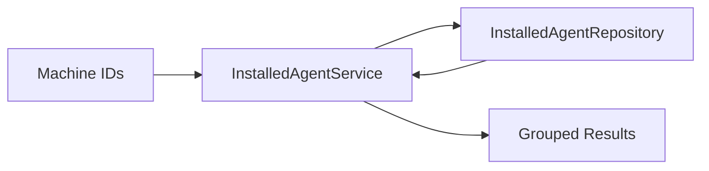
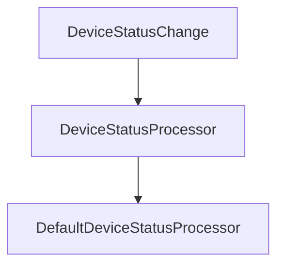
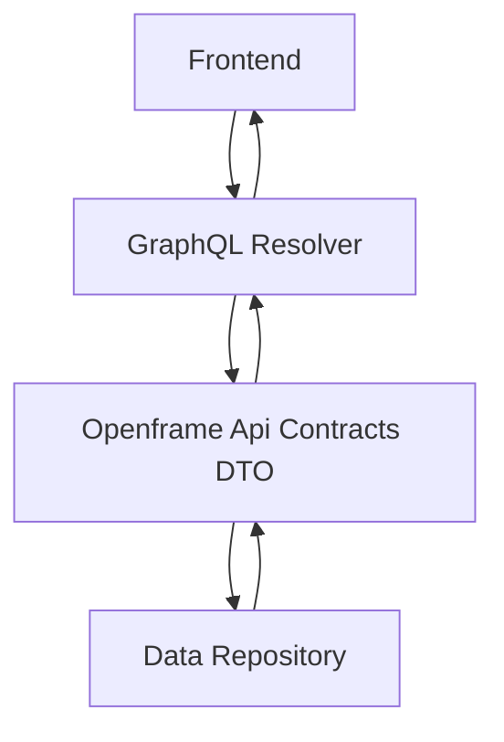

# Openframe Api Contracts

## Overview

The **Openframe Api Contracts** module defines the shared data transfer objects (DTOs), filter models, mappers, and lightweight domain services that form the canonical API contract across the OpenFrame platform.

It acts as the **contract boundary layer** between:

- GraphQL APIs in [Openframe Api Service Core](../openframe-api-service-core/openframe-api-service-core.md)
- REST APIs in [External Api Service Core](../external-api-service-core/external-api-service-core.md)
- Persistence models in Data Storage and Messaging Core
- Frontend consumers (Tenant Frontend + Chat Frontend)

This module ensures that all services speak the same language when exchanging:

- Organizations
- Devices
- Logs and events
- Tools and tool connections
- Pagination and filtering models

---

## Architectural Role in the Platform



### Responsibilities

The Openframe Api Contracts module is responsible for:

1. ✅ Defining stable DTOs used by both GraphQL and REST
2. ✅ Providing filter input and filter option models
3. ✅ Defining pagination contracts
4. ✅ Mapping between persistence entities and API responses
5. ✅ Providing shared domain-level services used by API layers

It **does not**:

- Expose controllers
- Define HTTP routes
- Implement business orchestration logic
- Access infrastructure directly (except via repositories in shared services)

---

# Core Design Principles

## 1. Shared Contract Layer

All DTOs in this module are intentionally reusable across:

- GraphQL resolvers
- REST controllers
- Internal service communication

Example: `OrganizationResponse` is used by both GraphQL and REST APIs.

---

## 2. Separation of Filters vs Filter Options

Each domain follows a consistent pattern:

| Concept | Purpose |
|----------|----------|
| `*FilterOptions` | Defines what filters are allowed as input |
| `*Filters` | Represents available filter values (for UI dropdowns) |
| `*FilterOption` | Individual filter item with value/label/count |

This clean separation supports advanced UI filtering capabilities.

---

## 3. Pagination as a First-Class Contract

Cursor-based pagination is standardized using:

```text
CursorPaginationInput
    limit (1–100)
    cursor (opaque string)
```

This enforces consistent pagination behavior across all services.

---

# Domain Contract Areas

---

# 1. Organization Contracts

### Core DTOs

- `OrganizationResponse`
- `OrganizationList`
- `OrganizationFilterOptions`

### Mapping Layer

- `OrganizationMapper`

### Architecture



### Key Characteristics

- `organizationId` is immutable once created
- UUID generated internally
- Supports partial updates
- Nested contact information mapping
- Mailing address copy logic when flag enabled

The mapper isolates persistence model evolution from API contracts.

---

# 2. Device Contracts

### Core DTOs

- `DeviceFilterOptions`
- `DeviceFilters`
- `DeviceFilterOption`
- `TagFilterOption`

### Filter Architecture



### Design Notes

- Supports filtering by status, type, OS, organization, and tags
- Includes aggregated counts for UI
- Designed for multi-tenant filtering scenarios

---

# 3. Log & Audit Contracts

### Core DTOs

- `LogEvent`
- `LogDetails`
- `LogFilterOptions`
- `LogFilters`
- `OrganizationFilterOption`

### Event Model



### Key Capabilities

- Time-based filtering (startDate / endDate)
- Multi-select filters (event types, tool types, severities)
- Organization-scoped filtering
- Device-level filtering

`LogDetails` extends `LogEvent` conceptually with message and details payload.

---

# 4. Event Contracts

### Core DTOs

- `EventFilterOptions`
- `EventFilters`

Supports:

- Filtering by user
- Filtering by event type
- Date boundaries

Used by analytics and activity streams.

---

# 5. Tool Contracts

### Core DTOs

- `ToolFilterOptions`
- `ToolFilters`
- `ToolList`

### Responsibilities

- Filtering by tool type, category, platform category
- Representing enabled/disabled tools
- Returning lists of integrated tools

These contracts integrate with:

- Management Service Core
- Stream Service Core
- External API Service

---

# 6. Generic Query & Pagination Models

### `CountedGenericQueryResult<T>`

Extends base query results by adding:

```text
filteredCount: int
```

Used when:

- Returning paginated data
- Returning filtered results
- Providing UI summary counts

---

# Shared Domain Services

This module contains lightweight services used by API layers.

---

## Installed Agent Service

Handles installed agent retrieval logic.

### Core Capabilities

- Batch loading by machine IDs
- Optimized grouping for DataLoader
- Single machine lookup



Designed specifically to support GraphQL DataLoader batching.

---

## Tool Connection Service

Provides batched access to tool connections per machine.

Supports:

- Multi-machine lookup
- Efficient grouping
- Read-only transactional access

---

## Default Device Status Processor

A default implementation of `DeviceStatusProcessor`.

### Purpose

- Provides a safe fallback bean
- Logs device status updates
- Allows override via custom implementation



This supports extensibility without forcing API layer coupling.

---

# Integration with Other Modules

The Openframe Api Contracts module integrates closely with:

- [Openframe Api Service Core](../openframe-api-service-core/openframe-api-service-core.md) — GraphQL layer
- [External Api Service Core](../external-api-service-core/external-api-service-core.md) — REST layer
- Data Storage and Messaging Core — persistence models
- Stream Service Core — event streaming

It is the **contract spine** connecting API surfaces to domain data.

---

# Cross-Service Data Flow Example



The same DTO may also be reused by REST controllers.

---

# Why This Module Matters

Without this module:

- DTO duplication would exist between REST and GraphQL
- Filter logic would become inconsistent
- Pagination models would diverge
- Mapping logic would be repeated

With this module:

✅ Single source of API truth  
✅ Consistent filtering behavior  
✅ Strong separation of concerns  
✅ Easier versioning of API contracts  
✅ Clear contract boundary for frontend teams  

---

# Summary

The **Openframe Api Contracts** module defines the stable, reusable API contract layer across OpenFrame.

It standardizes:

- DTOs
- Filter models
- Pagination
- Entity-to-response mapping
- Shared domain service helpers

This module is foundational to maintaining a clean architecture across:

- API service
- External API
- Authorization server
- Management services
- Frontend clients

It represents the canonical definition of how OpenFrame data is shaped and exchanged across the platform.
