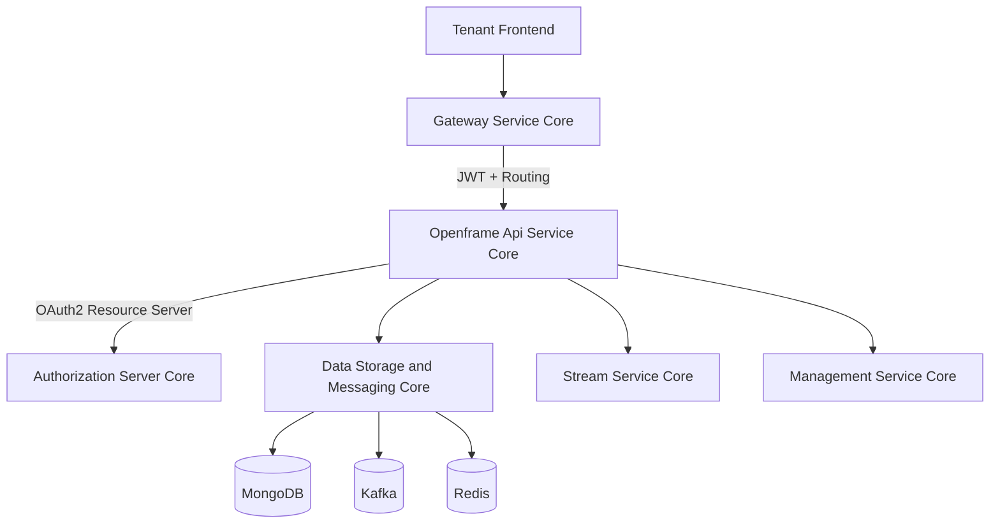
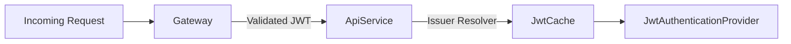
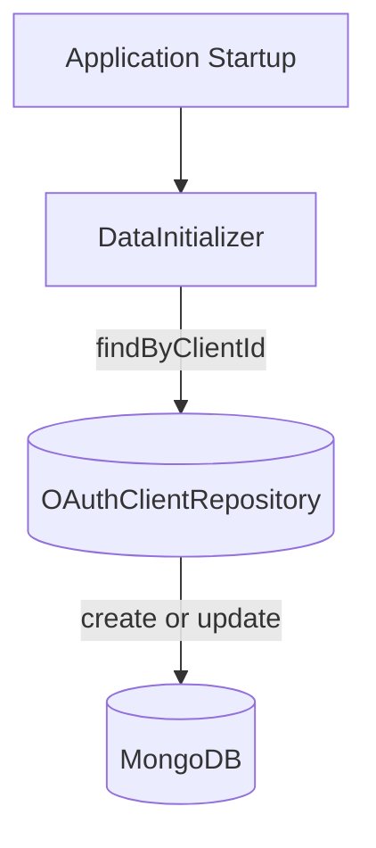
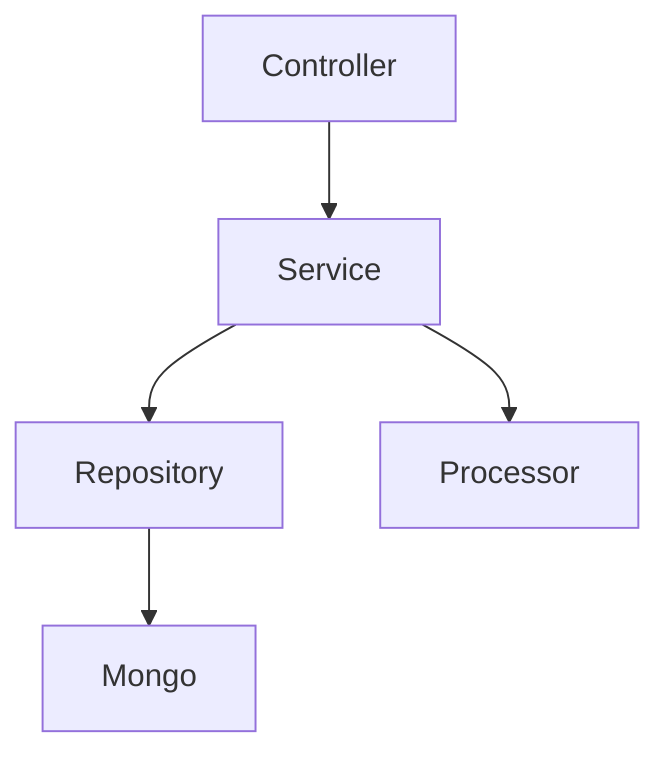
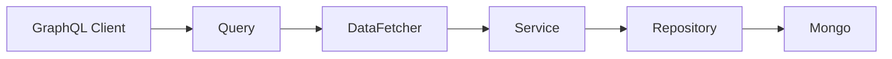
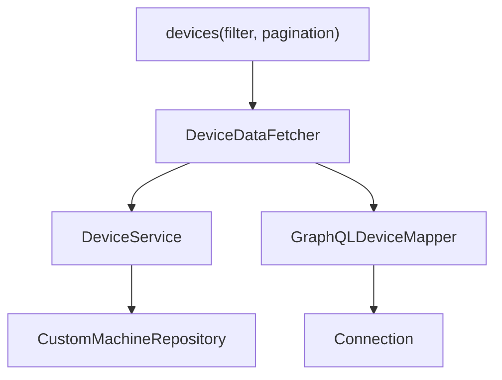
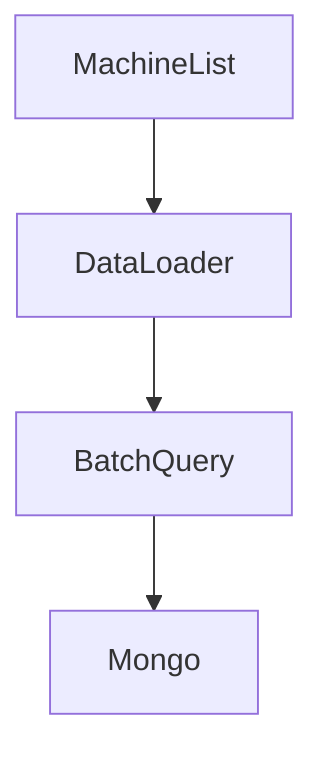
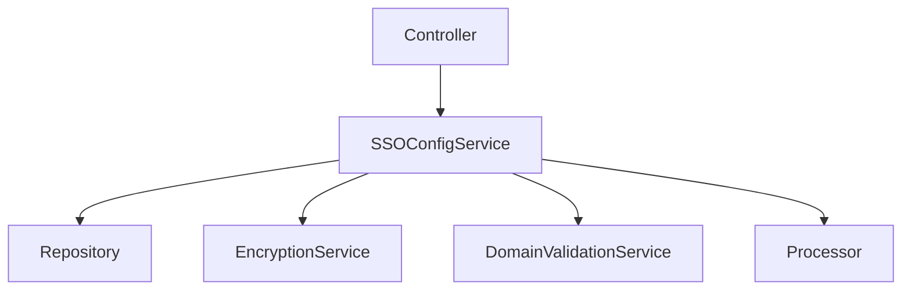

# Openframe Api Service Core

## Overview

Openframe Api Service Core is the central business API layer of the OpenFrame platform. It exposes internal REST endpoints and GraphQL APIs that power the tenant UI, gateway layer, and automation services.

This module acts as the orchestration layer between:

- The **Gateway Service Core** (edge security, routing, JWT validation)
- The **Authorization Server Core** (OAuth2 / OIDC provider)
- The **Data Storage and Messaging Core** (MongoDB, Kafka, Redis, Cassandra, Pinot)
- The **Stream Service Core** (event ingestion and enrichment)
- The **Management Service Core** (tool lifecycle and system configuration)

It provides:

- REST endpoints for internal system operations
- GraphQL APIs for rich UI queries (devices, events, logs, organizations, tools)
- User and invitation management
- SSO configuration management
- API key management
- Client and agent control operations

---

## High-Level Architecture



### Responsibility Split

- **Gateway**: Authentication, token validation, header enrichment, rate limiting.
- **Openframe Api Service Core**: Business logic, domain orchestration, GraphQL execution.
- **Authorization Server**: Token issuance, SSO flows, client registration.
- **Data Core**: Persistence and messaging infrastructure.

The API service is intentionally configured as a **resource server only**, relying on the Gateway for primary security enforcement.

---

## Security Model

### SecurityConfig

`SecurityConfig` enables OAuth2 Resource Server support to allow `@AuthenticationPrincipal` resolution.

Key characteristics:

- CSRF disabled (handled upstream)
- `anyRequest().permitAll()` (Gateway enforces access control)
- Dynamic JWT issuer resolution via `JwtIssuerAuthenticationManagerResolver`
- Caffeine-based cache for `JwtAuthenticationProvider`



### AuthenticationConfig

Registers `AuthPrincipalArgumentResolver` so controllers can inject:

```java
@AuthenticationPrincipal AuthPrincipal principal
```

This enables consistent access to:

- `id`
- `email`
- `roles`
- `tenantId`

---

## Configuration Layer

### ApiApplicationConfig
Provides a `PasswordEncoder` (BCrypt).

### RestTemplateConfig
Exposes a shared `RestTemplate` bean for internal service-to-service calls.

### DataInitializer
Boot-time initializer that ensures a default OAuth client exists:

- Reads `oauth.client.default.id`
- Reads `oauth.client.default.secret`
- Creates or updates the client in MongoDB



### GraphQL Scalars

Custom DGS scalars:

- `DateScalarConfig` → `LocalDate` (yyyy-MM-dd)
- `InstantScalarConfig` → `Instant` (ISO-8601)

These ensure strict type validation and serialization across GraphQL operations.

---

## API Surface Overview

Openframe Api Service Core exposes two main API styles:

1. **REST Controllers** (internal system APIs)
2. **GraphQL DataFetchers** (UI-driven query layer)

---

## REST Controllers

### HealthController
- `GET /health`
- Liveness probe

### MeController
- `GET /me`
- Returns authenticated user context

### ApiKeyController
Manages user API keys:

- `GET /api-keys`
- `POST /api-keys`
- `PUT /api-keys/{keyId}`
- `DELETE /api-keys/{keyId}`
- `POST /api-keys/{keyId}/regenerate`

### InvitationController
Manages user invitations:

- Create invitation
- List paginated invitations
- Revoke
- Resend

Uses pluggable `InvitationProcessor` with default implementation `DefaultInvitationProcessor`.

### UserController
Handles:

- Paginated listing
- Update
- Soft delete

Business rules enforced in `UserService`:

- Prevent self-deletion
- Prevent deleting OWNER role
- Soft-delete via status change



### OrganizationController
Internal mutation endpoints:

- Create organization
- Update organization
- Delete organization

Prevents deletion when machines exist.

### SSOConfigController
Manages SSO provider configuration:

- Enabled providers
- Available providers
- Create/update/delete provider configs
- Toggle enablement

Delegates to `SSOConfigService`.

### AgentRegistrationSecretController
Manages secrets used by agent registration.

### DeviceController
Internal endpoint to update device status.

### ForceAgentController
Forces:

- Tool installation
- Tool update
- Client update
- Reinstallation

Used for orchestration of remote agents.

### ReleaseVersionController
Returns latest release metadata.

### OpenFrameClientConfigurationController
Exposes client configuration used by OpenFrame clients.

---

## GraphQL Layer (DGS)

The module uses Netflix DGS for GraphQL.

### Core DataFetchers

- `DeviceDataFetcher`
- `EventDataFetcher`
- `LogDataFetcher`
- `OrganizationDataFetcher`
- `ToolsDataFetcher`

Each:

- Accepts strongly typed `*FilterInput`
- Maps to domain filter options
- Applies cursor-based pagination
- Returns `GenericConnection` or `CountedGenericConnection`



### Example: Device Query Flow



### DataLoader Strategy (N+1 Prevention)

DataLoaders:

- `InstalledAgentDataLoader`
- `OrganizationDataLoader`
- `TagDataLoader`
- `ToolConnectionDataLoader`



This ensures batched, asynchronous loading of related entities.

---

## SSO Configuration Domain

`SSOConfigService` is a central orchestration service.

Responsibilities:

- Persist encrypted client secrets
- Validate allowed domains
- Enforce Microsoft single-tenant constraint
- Trigger post-processing via `SSOConfigProcessor`



Default processor (`DefaultSSOConfigProcessor`) logs lifecycle events but can be overridden.

---

## User Domain

`UserService` encapsulates user lifecycle rules:

- Paginated listing
- Update profile fields
- Soft deletion
- Role protection (OWNER)

Hooks via `UserProcessor` allow extensibility without modifying core logic.

---

## Extensibility Points

The module is designed for multi-tenant and SaaS overrides via conditional beans:

- `DefaultDomainExistenceValidator`
- `DefaultInvitationProcessor`
- `DefaultSSOConfigProcessor`
- `DefaultUserProcessor`

These can be replaced by defining alternative beans.

---

## Data Integration

Openframe Api Service Core integrates heavily with:

- MongoDB repositories (users, organizations, SSO, devices)
- Kafka-backed streams (indirectly via services)
- Redis caching (through shared infrastructure)
- Pinot/Cassandra for analytical queries (via repositories in Data Core)

It remains a pure orchestration layer without embedding infrastructure logic.

---

## Key Design Principles

1. Gateway-first security
2. Clear separation between REST (mutations/internal) and GraphQL (queries/UI)
3. Cursor-based pagination for scalability
4. Batch loading to eliminate N+1 problems
5. Pluggable processors for SaaS overrides
6. Resource-server only JWT validation

---

## Summary

Openframe Api Service Core is the business API backbone of OpenFrame. It:

- Orchestrates domain logic
- Exposes REST and GraphQL endpoints
- Integrates security context via JWT resource server
- Coordinates persistence and streaming layers
- Provides extensibility hooks for tenant-specific behavior

It sits directly behind the Gateway and in front of all persistence and streaming infrastructure, forming the core domain API of the platform.
