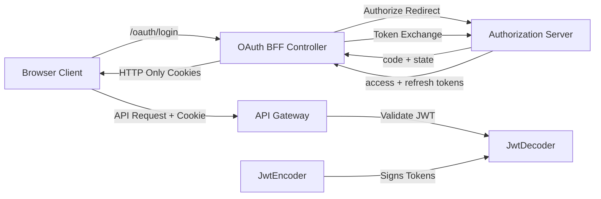
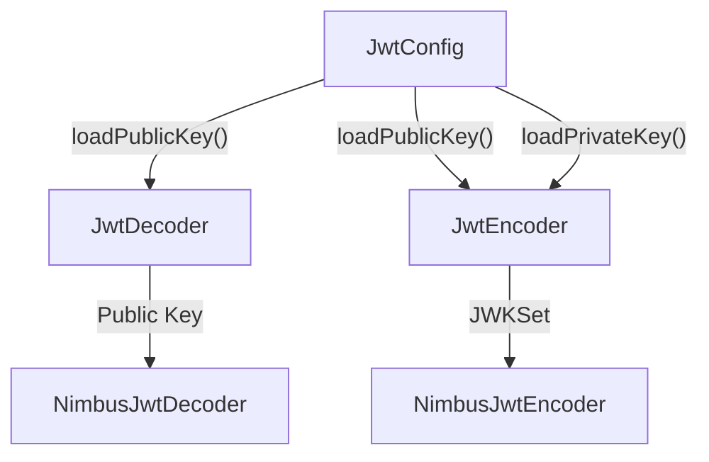
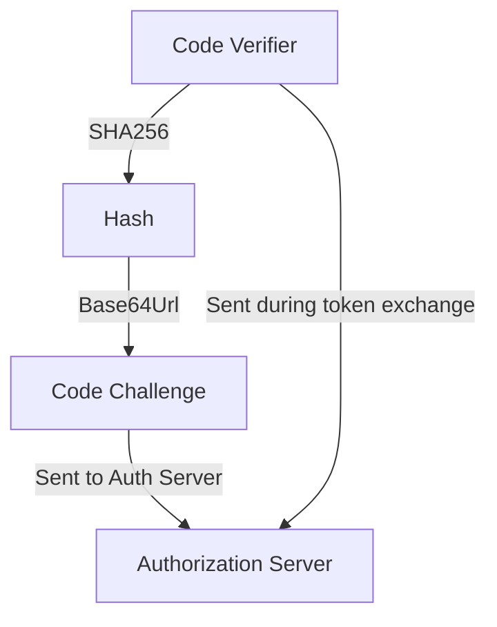
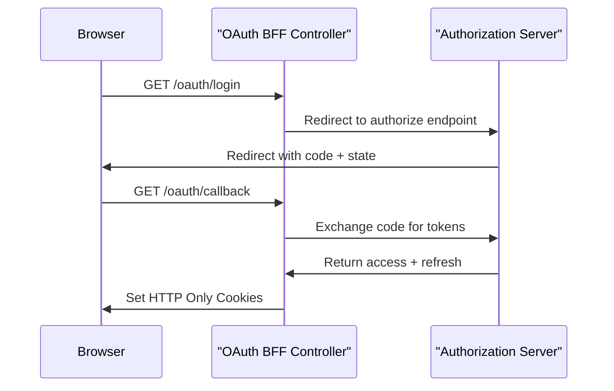
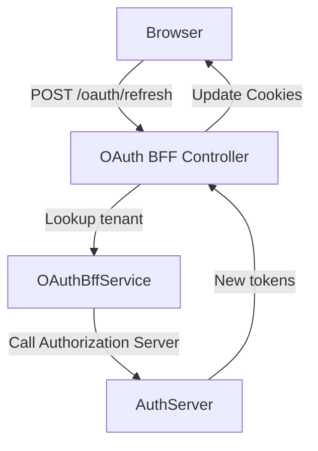
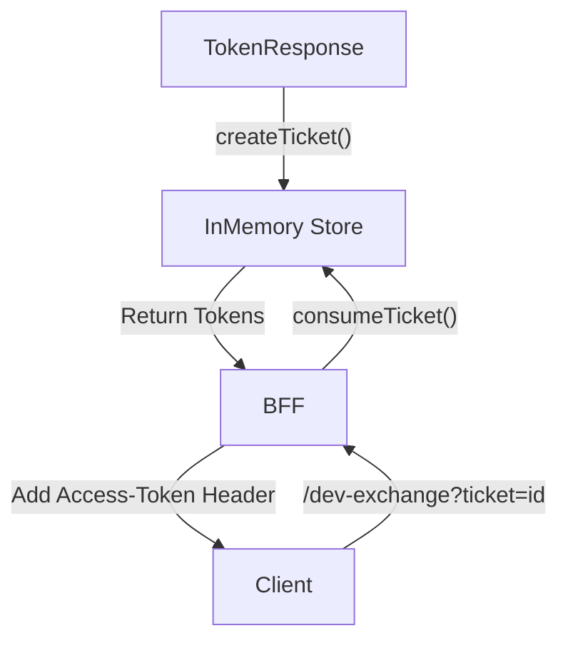
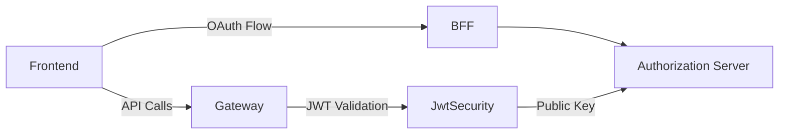

# Security Oauth Bff And Shared Jwt

## Overview

The **Security Oauth Bff And Shared Jwt** module provides the foundational security building blocks for the OpenFrame platform. It combines:

- Shared JWT configuration and key management
- OAuth2 BFF (Backend For Frontend) login flows
- PKCE support for secure public clients
- Cookie-based token handling
- Development ticket exchange utilities

This module acts as the glue between:

- The Authorization Server (token issuer)
- The Gateway (token validator and proxy)
- Frontend clients (browser-based applications)

It standardizes how JWTs are issued, validated, refreshed, and transported across services.

---

## High-Level Architecture



### Responsibilities

- **OAuth BFF Controller**: Handles login, callback, refresh, logout
- **JwtSecurityConfig**: Defines JWT encoder and decoder beans
- **JwtConfig**: Loads RSA keys and JWT properties
- **PKCEUtils**: Generates state, verifier, and challenge values
- **Dev Ticket Store**: Enables development token header exchange

---

## Core Components

### JwtSecurityConfig

Class: `JwtSecurityConfig`

Defines Spring beans for:

- `JwtEncoder` (RSA private key based signing)
- `JwtDecoder` (RSA public key verification)

### Internal Flow



This ensures:

- Tokens are signed using the private key
- Tokens are verified using the public key
- All services share consistent JWT behavior

---

### JwtConfig

Class: `JwtConfig`

Bound to configuration prefix:

```text
jwt.publicKey
jwt.privateKey
jwt.issuer
jwt.audience
```

Responsibilities:

- Load and decode RSA private key (PKCS8)
- Load RSA public key
- Expose issuer and audience properties

This configuration ensures consistent JWT validation across services.

---

### SecurityConstants

Class: `SecurityConstants`

Defines shared constant values used across gateway and OAuth flows:

- `ACCESS_TOKEN`
- `REFRESH_TOKEN`
- `ACCESS_TOKEN_HEADER`
- `REFRESH_TOKEN_HEADER`
- `AUTHORIZATION_QUERY_PARAM`

This prevents duplication and mismatch across modules.

---

### PKCEUtils

Utility class for OAuth2 PKCE support.

#### Generates:

- `generateState()` → CSRF protection (128-bit random)
- `generateCodeVerifier()` → PKCE verifier (256-bit random)
- `generateCodeChallenge()` → SHA256 based challenge

### PKCE Flow



This protects public browser clients from authorization code interception attacks.

---

## OAuth BFF Controller

Class: `OAuthBffController`

Base path:

```text
/oauth
```

Enabled only when:

```text
openframe.gateway.oauth.enable=true
```

### Endpoints

| Endpoint | Method | Purpose |
|----------|--------|----------|
| `/login` | GET | Start OAuth authorization flow |
| `/continue` | GET | Continue OAuth flow without clearing cookies |
| `/callback` | GET | Handle authorization code callback |
| `/refresh` | POST | Refresh access token |
| `/logout` | GET | Revoke refresh token and clear cookies |
| `/dev-exchange` | GET | Development token exchange |

---

## OAuth Login Flow



### Cookie Strategy

- Access token stored in HTTP-only cookie
- Refresh token stored in HTTP-only cookie
- State stored temporarily to validate callback

This design:

- Prevents token exposure to JavaScript
- Protects against XSS token theft
- Supports seamless browser refresh

---

## Refresh Flow



If refresh token is missing → returns `401`.

---

## Logout Flow

- Clears authentication cookies
- Revokes refresh token
- Returns HTTP 204

This ensures server-side token invalidation.

---

## Development Ticket Store

Class: `InMemoryOAuthDevTicketStore`

Used only in development environments.

### Purpose

- Exchange tokens for temporary dev headers
- Useful for debugging non-browser clients

### Behavior



This is disabled if:

```text
openframe.gateway.oauth.dev-ticket-enabled=false
```

---

## Redirect Target Resolution

Class: `DefaultRedirectTargetResolver`

Resolves final redirect destination using:

1. Explicit `redirectTo` parameter
2. HTTP Referer header
3. Fallback to `/`

Ensures safe and deterministic redirect handling.

---

## Security Design Principles

### 1. Private Key Isolation

- Only signing service loads private key
- Public key used for verification

### 2. Stateless Access Tokens

- JWT-based
- Self-contained claims

### 3. Cookie-Based Token Storage

- HTTP-only
- Secure flag (in production)
- Short-lived state cookie

### 4. PKCE Enforcement

- Required for browser-based flows
- Prevents intercepted code attacks

### 5. Multi-Tenant Ready

- Tenant ID required in login flow
- Tokens scoped per tenant

---

## How This Module Fits Into The Platform



- Authorization Server issues tokens
- Security Oauth Bff And Shared Jwt manages browser-safe exchange
- Gateway validates JWTs using shared configuration
- Downstream services trust validated JWT

---

## Configuration Summary

```text
jwt.publicKey
jwt.privateKey
jwt.issuer
jwt.audience

openframe.gateway.oauth.enable
openframe.gateway.oauth.state-cookie-ttl-seconds
openframe.gateway.oauth.dev-ticket-enabled
```

---

## Summary

The **Security Oauth Bff And Shared Jwt** module provides:

- Centralized JWT configuration
- OAuth2 BFF implementation
- Secure PKCE support
- Cookie-based token lifecycle management
- Development-friendly token exchange

It is the foundation of authentication and token trust across the OpenFrame platform.