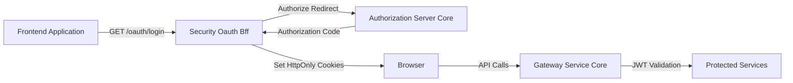
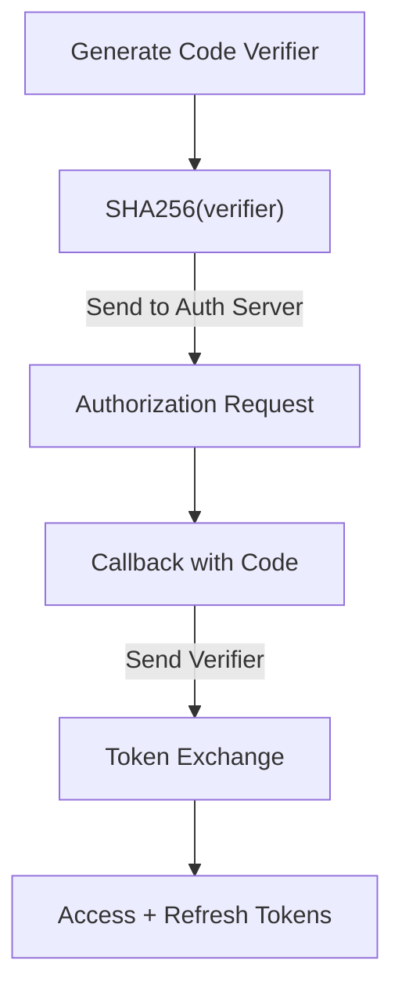
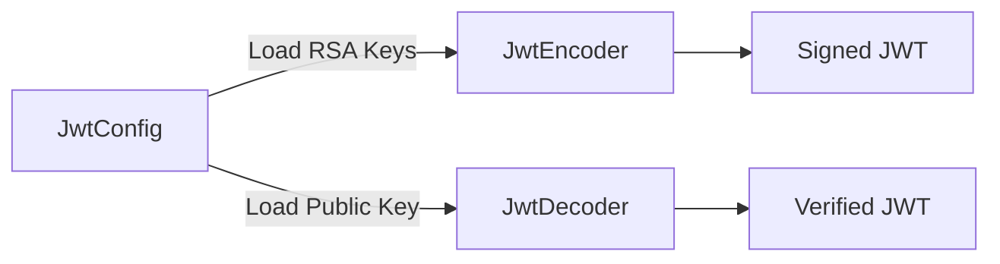
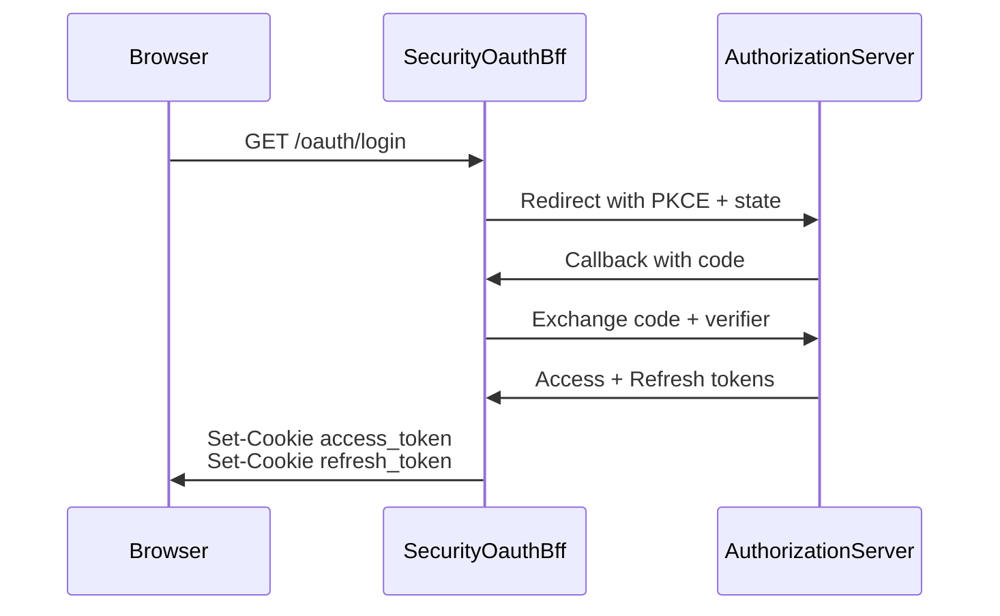
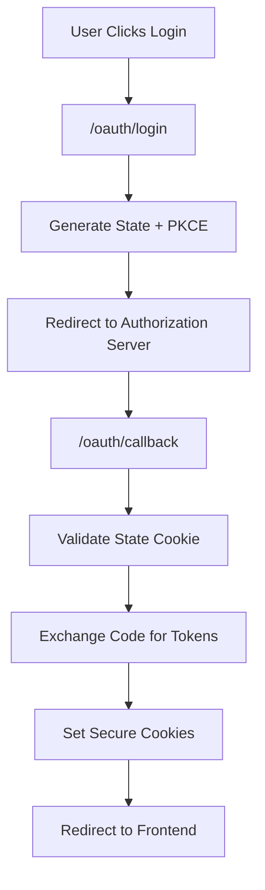

# Security Oauth Bff

The **Security Oauth Bff** module implements the OAuth 2.1 / OpenID Connect Backend-for-Frontend (BFF) pattern for OpenFrame. It is responsible for:

- Orchestrating OAuth login, callback, refresh, and logout flows
- Managing PKCE and state protection
- Issuing and validating JWTs
- Handling secure cookie-based token storage
- Bridging frontend applications with the Authorization Server

This module acts as the **security boundary between frontend clients and the Authorization Server**, ensuring tokens are never directly exposed to browser JavaScript in production scenarios.

---

## Architectural Context

Security Oauth Bff sits between:

- **Frontend applications** (Tenant UI, Chat Frontend, etc.)
- **Gateway Service Core** (API routing & security enforcement)
- **Authorization Server Core** (OAuth2 / OIDC provider)
- **Data Storage and Messaging Core** (Mongo persistence for tokens & clients)

### High-Level Flow



---

## Core Responsibilities

### 1. OAuth Flow Orchestration

Handled primarily by:

- `OAuthBffController`
- `OAuthBffService` (external dependency)
- `DefaultRedirectTargetResolver`

Endpoints exposed under `/oauth`:

- `GET /oauth/login`
- `GET /oauth/continue`
- `GET /oauth/callback`
- `POST /oauth/refresh`
- `GET /oauth/logout`
- `GET /oauth/dev-exchange`

These endpoints coordinate:

- PKCE generation
- State validation
- Token exchange
- Cookie handling
- Safe redirect logic

---

### 2. PKCE and CSRF Protection

The `PKCEUtils` utility provides:

- Secure state generation (128-bit entropy)
- Code verifier generation (256-bit entropy)
- SHA-256 code challenge computation
- Base64URL encoding without padding

PKCE protects the authorization code exchange from interception attacks.



---

### 3. JWT Configuration and Key Management

JWT infrastructure is defined in:

- `JwtSecurityConfig`
- `JwtConfig`

#### JwtConfig

- Loads RSA public/private keys from configuration
- Supports PEM-based private key decoding
- Provides issuer and audience configuration

#### JwtSecurityConfig

- Exposes `JwtEncoder` using `NimbusJwtEncoder`
- Exposes `JwtDecoder` using `NimbusJwtDecoder`
- Builds JWKSet for signing support



This ensures:

- Strong asymmetric signing
- Stateless JWT validation
- Compatibility with Authorization Server Core

---

### 4. Token & Cookie Handling

Token management relies on:

- `SecurityConstants`
- `CookieService` (external dependency)
- `TokenResponse` (external dependency)

Defined constants include:

- `access_token`
- `refresh_token`
- `Access-Token` header
- `Refresh-Token` header

The BFF enforces:

- HttpOnly secure cookies for access & refresh tokens
- State cookies for CSRF protection
- Automatic cookie clearing on logout
- Optional development headers for debugging



---

## Detailed Component Overview

### OAuthBffController

Primary reactive controller managing OAuth endpoints.

Key features:

- Reactive (`Mono<ResponseEntity<?>>`) design
- Conditional activation via property:
  - `openframe.gateway.oauth.enable=true`
- Safe redirect handling
- Dev ticket support for local development
- Graceful error redirection

Security measures:

- Clears stale cookies before login
- Validates state before token exchange
- Sanitizes redirect targets
- Revokes refresh tokens on logout

---

### DefaultRedirectTargetResolver

Provides redirect fallback logic:

1. Use requested `redirectTo` parameter
2. Fallback to HTTP `Referer` header
3. Default to `/`

This component is replaceable via Spring bean override.

---

### PKCEUtils

Pure utility class offering:

- Cryptographically secure randomness via `SecureRandom`
- SHA-256 digest generation
- URL-safe encoding

Design principles:

- No mutable state
- Static utility methods only
- Fail-fast on algorithm errors

---

### JwtSecurityConfig & JwtConfig

Responsible for:

- RSA key loading
- JWKSet creation
- JWT encoding/decoding
- Centralized configuration binding (`jwt.*` properties)

This aligns with Spring Security OAuth2 Resource Server patterns.

---

## End-to-End Login Flow



---

## Integration With Other Modules

Security Oauth Bff integrates with:

- Authorization Server Core (OAuth endpoints, token issuance)
- Gateway Service Core (JWT validation and protected route enforcement)
- Data Storage and Messaging Core (OAuth clients, tokens in Mongo)
- Tenant Frontend API Clients and Hooks (login + refresh flows)

The BFF pattern ensures:

- Tokens are not stored in localStorage
- CSRF is mitigated using state cookies
- PKCE protects public clients
- Backend retains control over token lifecycle

---

## Security Model Summary

| Concern | Mechanism |
|----------|------------|
| CSRF | State parameter + HttpOnly cookie |
| Code Interception | PKCE (S256) |
| Token Theft | HttpOnly secure cookies |
| Token Replay | Short-lived access tokens |
| Key Compromise | RSA asymmetric signing |
| Open Redirect | Redirect target validation |

---

## Configuration Properties

Typical configuration includes:

```yaml
openframe:
  gateway:
    oauth:
      enable: true
      state-cookie-ttl-seconds: 180
      dev-ticket-enabled: true

jwt:
  issuer: https://auth.openframe.ai
  audience: openframe-api
```

---

## Why Backend-for-Frontend?

Security Oauth Bff implements the BFF pattern to:

- Eliminate token exposure in browser JavaScript
- Centralize OAuth complexity
- Simplify frontend code
- Provide consistent multi-tenant OAuth handling
- Support development-mode token exchange safely

---

## Summary

The **Security Oauth Bff** module is the OAuth orchestration layer of OpenFrame. It provides:

- Secure PKCE-based login
- JWT configuration and validation
- Cookie-based token lifecycle management
- Safe redirect resolution
- Reactive, scalable OAuth handling

It forms the backbone of secure authentication across the OpenFrame platform.