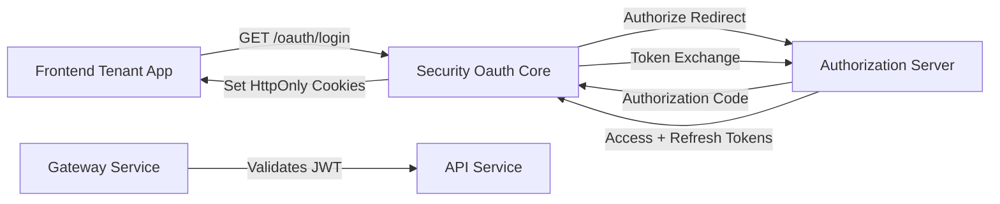
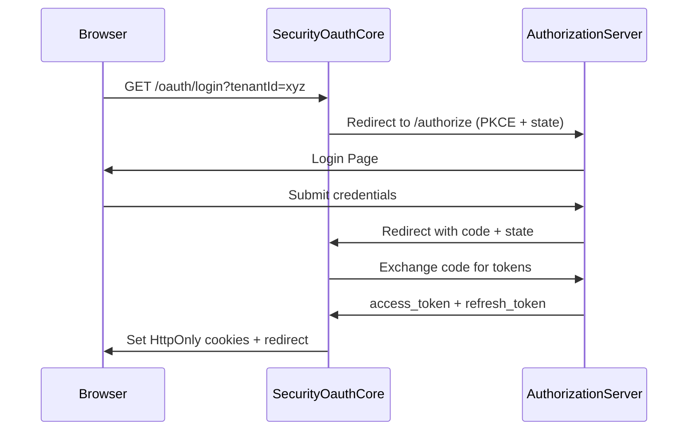
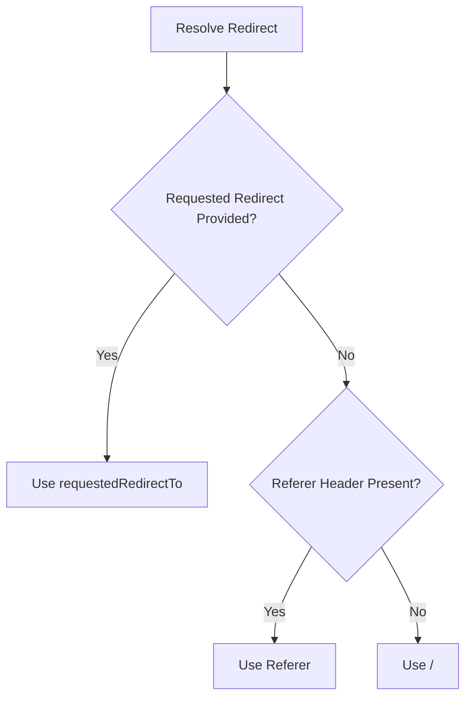
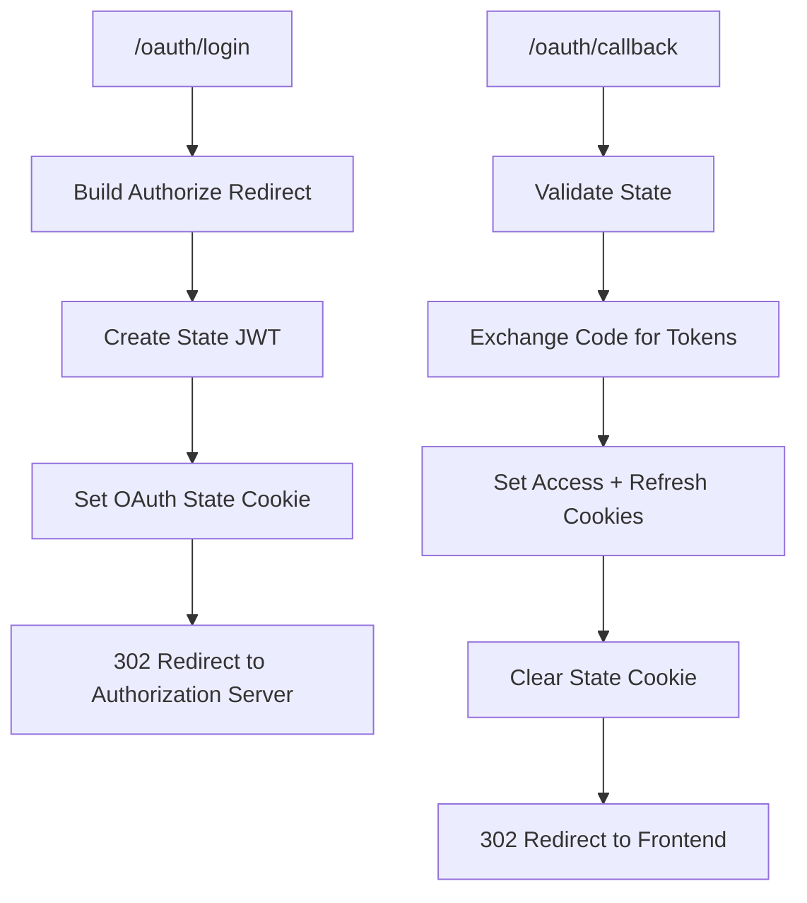

# Security Oauth Core

## Overview

The **Security Oauth Core** module provides the Backend-for-Frontend (BFF) OAuth2 integration layer for OpenFrame tenant applications. It is responsible for:

- Initiating OAuth2 / OIDC login flows
- Managing PKCE and state handling
- Exchanging authorization codes for tokens
- Setting and clearing authentication cookies
- Handling token refresh and logout
- Supporting development ticket exchange flows

This module acts as the bridge between the **Gateway layer**, the **Authorization Server**, and frontend tenant applications. It encapsulates OAuth-specific mechanics so that higher-level services remain clean and protocol-agnostic.

Core components:

- `OAuthBffController`
- `DefaultRedirectTargetResolver`

---

## Architectural Context

Security Oauth Core sits between the frontend client and the Authorization Server. It coordinates browser redirects, token exchange, and secure cookie management.



### Responsibilities by Layer

- **Frontend Tenant App**: Initiates login, handles final redirect.
- **Security Oauth Core**: Manages OAuth protocol, cookies, and redirect safety.
- **Authorization Server**: Issues tokens and manages identity.
- **Gateway Service**: Validates JWT and enforces access control.
- **API Services**: Operate behind validated authentication.

---

## Component Overview

### 1. OAuthBffController

The `OAuthBffController` exposes reactive REST endpoints under `/oauth` and orchestrates the full OAuth lifecycle.

It is enabled conditionally via:

```text
openframe.gateway.oauth.enable=true
```

#### Endpoints

| Endpoint | Method | Purpose |
|----------|--------|----------|
| `/oauth/login` | GET | Initiates login redirect |
| `/oauth/continue` | GET | Continues flow without clearing session |
| `/oauth/callback` | GET | Handles authorization code exchange |
| `/oauth/refresh` | POST | Refreshes access token |
| `/oauth/logout` | GET | Clears cookies and revokes refresh token |
| `/oauth/dev-exchange` | GET | Exchanges development ticket for tokens |

---

### Login Flow



#### Key Security Mechanisms

- **State JWT Cookie**
  - Built using `buildStateJwt(...)`
  - Stored temporarily
  - TTL configurable via:

```text
openframe.gateway.oauth.state-cookie-ttl-seconds=180
```

- **PKCE Support**
  - Prevents authorization code interception attacks.

- **Cookie Isolation**
  - Uses `CookieService` to:
    - Add authentication cookies
    - Clear state cookies
    - Clear auth cookies on logout

---

### Callback Handling

The `/oauth/callback` endpoint:

1. Validates `state`
2. Exchanges `code` for tokens
3. Resolves safe redirect target
4. Sets secure authentication cookies
5. Clears state cookie
6. Redirects user

Error handling appends:

```text
?error=oauth_failed&message=<encoded_message>
```

Redirect target safety is enforced using:

- Absolute URL validation
- Referer fallback
- Default `/` fallback

---

### Token Refresh

The `/oauth/refresh` endpoint:

- Extracts refresh token from:
  - `REFRESH_TOKEN` cookie
  - Or request header
- Supports two strategies:
  - `refreshTokensPublic(tenantId, token)`
  - `refreshTokensByLookup(token)`
- Re-issues cookies on success
- Returns `401` if invalid

This ensures silent session renewal without full reauthentication.

---

### Logout

The `/oauth/logout` endpoint:

- Clears authentication cookies
- Revokes refresh token
- Returns `204 No Content`

This prevents reuse of stolen or cached refresh tokens.

---

### Development Ticket Flow

Enabled via:

```text
openframe.gateway.oauth.dev-ticket-enabled=true
```

When enabled:

- Tokens are converted into temporary dev tickets
- `/oauth/dev-exchange` allows ticket-to-token exchange
- Tokens may also be returned in headers:

```text
ACCESS_TOKEN_HEADER
REFRESH_TOKEN_HEADER
```

This flow is designed strictly for development and debugging environments.

---

### 2. DefaultRedirectTargetResolver

The `DefaultRedirectTargetResolver` determines where users are redirected after authentication.

Resolution logic:

1. Use `requestedRedirectTo` if present
2. Else use `Referer` header
3. Else fallback to `/`



The component is annotated with:

```text
@ConditionalOnMissingBean(RedirectTargetResolver)
```

This allows integrators to override redirect logic safely.

---

## Internal Flow Coordination



---

## Configuration Properties

| Property | Description | Default |
|-----------|-------------|----------|
| `openframe.gateway.oauth.enable` | Enables controller | false |
| `openframe.gateway.oauth.state-cookie-ttl-seconds` | State cookie TTL | 180 |
| `openframe.gateway.oauth.dev-ticket-enabled` | Enables dev ticket flow | true |

---

## Security Considerations

Security Oauth Core enforces multiple best practices:

- Short-lived state tokens
- HttpOnly secure cookies
- PKCE verification
- Refresh token revocation
- Absolute redirect validation
- Optional development-only token exposure

### Threats Mitigated

- CSRF via state validation
- Token leakage via secure cookies
- Code interception via PKCE
- Open redirect attacks
- Stolen refresh token reuse

---

## Integration in the OpenFrame Platform

Security Oauth Core integrates with:

- Authorization Server (token issuance)
- Gateway Service (JWT validation)
- Data Mongo Core (token persistence)
- Frontend Tenant App (authentication entry point)

It remains focused solely on OAuth orchestration and does not implement:

- Identity storage
- Policy evaluation
- API authorization rules

Those responsibilities belong to other platform modules.

---

## Summary

The **Security Oauth Core** module provides a clean, secure, and extensible OAuth BFF implementation for OpenFrame.

It:

- Encapsulates OAuth2 protocol complexity
- Secures browser-based authentication flows
- Enables multi-tenant redirect handling
- Supports extensibility via conditional beans
- Provides development-mode conveniences without polluting production flows

By isolating OAuth orchestration in this module, the platform maintains clear separation between identity management, API authorization, and gateway enforcement.
