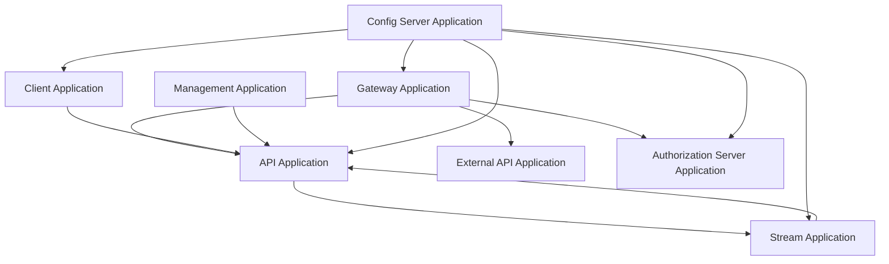
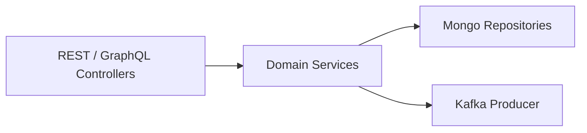
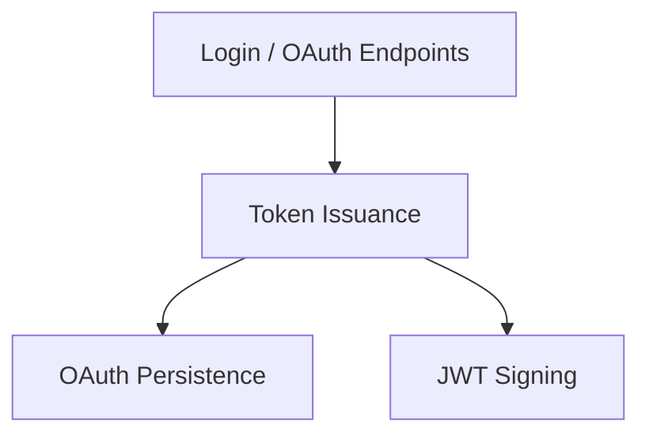
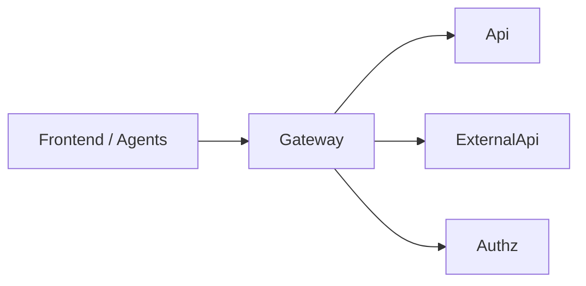
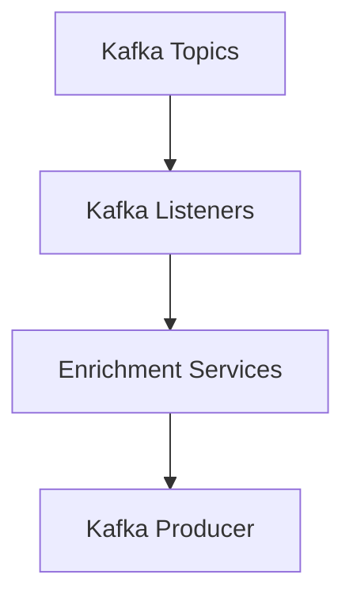
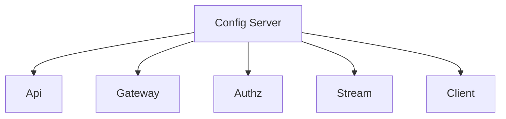
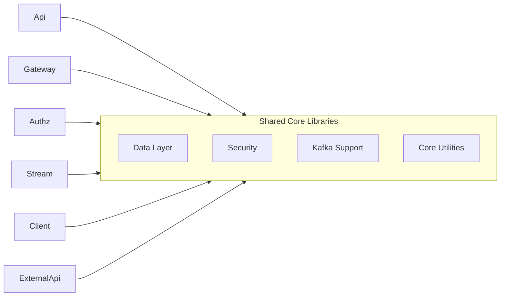

# Service Applications Entrypoints

## Overview

The **Service Applications Entrypoints** module defines the runtime entry points for all major OpenFrame microservices. Each class in this module is a Spring Boot `@SpringBootApplication` responsible for:

- Bootstrapping a specific service
- Defining its component scanning boundaries
- Enabling service-specific infrastructure (Kafka, discovery, etc.)
- Acting as the executable boundary of a deployable unit

This module does **not** implement business logic itself. Instead, it wires together functionality from lower-level modules such as API Core, Authorization Server, Data (Mongo, Kafka, Pinot), Gateway, Client Core, and Stream Processing.

---

## Architectural Context

At runtime, OpenFrame is composed of multiple independently deployable services. The Service Applications Entrypoints module defines the main classes that start each of them.



### Key Characteristics

- **Microservice-based**: Each application is independently bootstrapped.
- **Shared Core Libraries**: Services reuse shared modules (`com.openframe.data`, `com.openframe.core`, `com.openframe.security`, etc.).
- **Component Isolation via `@ComponentScan`**: Each entrypoint controls which packages are active in that runtime.
- **Environment-driven Configuration**: Typically integrated with centralized configuration (via the Config Server Application).

---

# Applications

Each of the following classes represents a deployable service.

---

## API Application

**Class:** `ApiApplication`  
**Package:** `com.openframe.api`

### Responsibility

Primary internal API service. Exposes REST and GraphQL endpoints used by the frontend and internal services.

### Component Scan Scope

```text
com.openframe.api
com.openframe.data
com.openframe.core
com.openframe.notification
com.openframe.kafka
```

### Responsibilities at Runtime

- Loads REST controllers and GraphQL fetchers
- Connects to Mongo and other data stores
- Publishes/consumes Kafka events
- Integrates domain services and DTO mappings



---

## OpenFrame Authorization Server Application

**Class:** `OpenFrameAuthorizationServerApplication`  
**Package:** `com.openframe.authz`

### Responsibility

OAuth2 / OIDC Authorization Server responsible for:

- Token issuance
- Tenant-aware authentication
- SSO flows (Google, Microsoft)
- Client registration

### Special Features

- `@EnableDiscoveryClient`
- Multi-tenant context support
- Mongo-backed OAuth persistence

### Component Scan Scope

```text
com.openframe.authz
com.openframe.core
com.openframe.data
com.openframe.notification
```



---

## Gateway Application

**Class:** `GatewayApplication`  
**Package:** `com.openframe.gateway`

### Responsibility

Acts as the edge service for:

- JWT validation
- API key authentication
- CORS handling
- WebSocket proxying
- Rate limiting

### Component Scan Scope

```text
com.openframe.gateway
com.openframe.core
com.openframe.data
com.openframe.security
```

### Role in Architecture



The Gateway centralizes security enforcement and traffic routing.

---

## External API Application

**Class:** `ExternalApiApplication`  
**Package:** `com.openframe.external`

### Responsibility

Public-facing API surface intended for:

- Third-party integrations
- External tool connectivity
- Read-only or integration-safe operations

### Component Scan Scope

```text
com.openframe.external
com.openframe.data
com.openframe.core
com.openframe.api
com.openframe.kafka
```

This service reuses internal API components but exposes a curated interface.

---

## Stream Application

**Class:** `StreamApplication`  
**Package:** `com.openframe.stream`

### Responsibility

Event-driven processing service.

### Key Annotations

- `@EnableKafka`

### Component Scan Scope

```text
com.openframe.stream
com.openframe.data
com.openframe.kafka.producer
```

### Responsibilities

- Kafka listeners
- Event deserialization
- Message enrichment
- Emitting normalized domain events



---

## Client Application

**Class:** `ClientApplication`  
**Package:** `com.openframe.client`

### Responsibility

Handles agent communication and machine-level interactions.

### Notable Configuration

- Excludes `CassandraHealthIndicator`
- Integrates client controllers and Kafka producers

### Component Scan Scope

```text
com.openframe.data
com.openframe.client
com.openframe.core
com.openframe.security
com.openframe.kafka.producer
```

### Responsibilities

- Agent registration
- Agent authentication
- Tool agent file handling
- Metrics ingestion

---

## Management Application

**Class:** `ManagementApplication`  
**Package:** `com.openframe.management`

### Responsibility

Operational and management endpoints.

### Notable Behavior

- Excludes `CassandraHealthIndicator`

### Component Scan Scope

```text
com.openframe.management
com.openframe.data
com.openframe.core
```

Used for:

- Health endpoints
- Operational diagnostics
- Administrative tasks

---

## Config Server Application

**Class:** `ConfigServerApplication`  
**Package:** `com.openframe.config`

### Responsibility

Central configuration service for distributed environment.



Provides:

- Centralized configuration
- Environment-specific property resolution
- Runtime configuration consistency

---

# Cross-Service Dependency Model

The entrypoint classes define **bounded runtime contexts**. Each service chooses which lower-level modules to activate via `@ComponentScan`.



This ensures:

- Reuse without tight coupling
- Service isolation
- Independent scaling
- Clear separation of runtime concerns

---

# Design Principles

1. **Single Responsibility per Service**  
   Each application entrypoint represents one deployable concern.

2. **Explicit Component Boundaries**  
   Controlled via `@ComponentScan`.

3. **Infrastructure Isolation**  
   Kafka, Mongo, Security, and Gateway concerns are activated only where needed.

4. **Multi-Tenancy Support**  
   The Authorization Server and Gateway enforce tenant-aware security.

5. **Event-Driven Core**  
   The Stream Application processes asynchronous data flows across services.

---

# Summary

The **Service Applications Entrypoints** module is the orchestration layer that turns reusable libraries into deployable microservices.

It defines:

- The API surface (internal and external)
- The authentication and authorization boundary
- The edge gateway
- The event processing engine
- The client-facing agent service
- The operational management layer
- The configuration backbone

Together, these entrypoints form the executable topology of the OpenFrame platform.