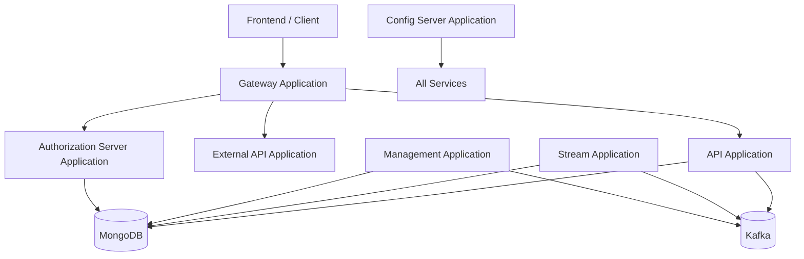
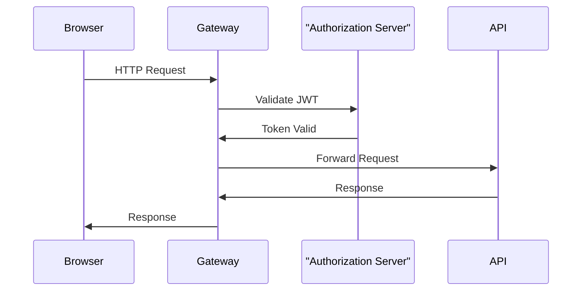
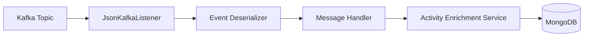
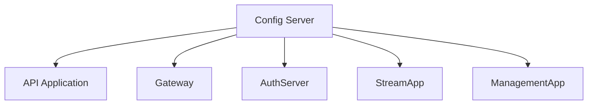
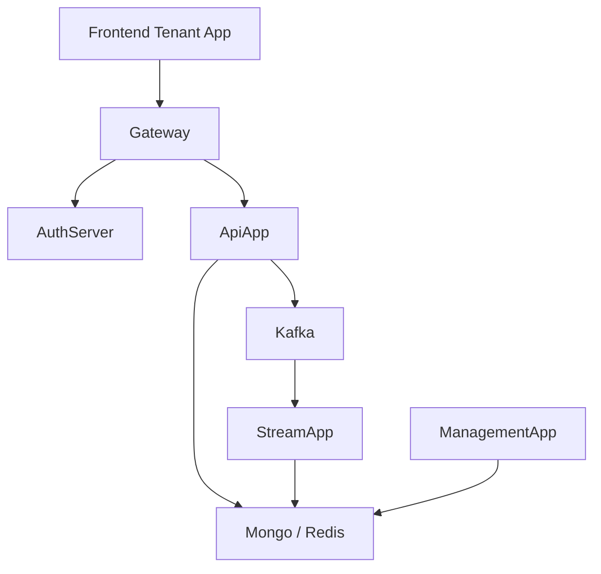

# Service Applications

## Overview

The **Service Applications** module represents the executable entry points of the OpenFrame platform. While the core business logic, domain models, security, and data access layers live in shared core modules (such as API Service Core, Authorization Service Core, Data Mongo Core, and others), this module wires them together into deployable Spring Boot services.

Each application in this module:

- Boots a dedicated Spring Boot context
- Defines its component scan boundaries
- Composes shared core modules into a runnable service
- Acts as a deployment unit in a microservices architecture

This module is therefore the **runtime layer** of the system.

---

## Microservices Landscape

The Service Applications module contains the following Spring Boot applications:

- API Application
- Authorization Server Application
- Gateway Application
- External API Application
- Stream Application
- Management Application
- Client Application
- Config Server Application

Each of these applications corresponds to a distinct runtime responsibility.

---

## High-Level Architecture



### Architectural Characteristics

- **Microservices-based**: Each application is independently deployable.
- **Shared Core Libraries**: Business logic is centralized in core modules and reused across applications.
- **Event-driven Backbone**: Kafka is used for streaming and asynchronous processing.
- **Multi-tenant Aware**: Authorization and data layers support tenant isolation.
- **Reactive + REST Mix**: REST controllers, reactive repositories, and stream processors coexist.

---

# Applications Breakdown

## API Application

**Entry Class:** `ApiApplication`

```java
@SpringBootApplication
@ComponentScan(basePackages = {
    "com.openframe.api",
    "com.openframe.data",
    "com.openframe.core",
    "com.openframe.notification",
    "com.openframe.kafka"
})
```

### Purpose

The API Application exposes the primary internal REST and GraphQL APIs used by the frontend and internal platform services.

### Responsibilities

- Device management
- Organization management
- User management
- Invitations and SSO configuration
- API key management
- Health endpoints
- Data fetchers and DataLoaders for query optimization

### Dependencies

- Data Mongo Core (documents + repositories)
- API Service Core (controllers, processors, services)
- Kafka (event publication)
- Core domain services

---

## Authorization Server Application

**Entry Class:** `OpenFrameAuthorizationServerApplication`

```java
@SpringBootApplication
@EnableDiscoveryClient
@ComponentScan(basePackages = {
    "com.openframe.authz",
    "com.openframe.core",
    "com.openframe.data",
    "com.openframe.notification"
})
```

### Purpose

Implements OAuth2 / OIDC-based authentication and authorization for the platform.

### Responsibilities

- Login flows
- Tenant discovery
- Tenant registration
- Invitation registration
- Password reset flows
- SSO integrations (Google, Microsoft)
- JWT issuance
- Tenant-specific key management

### Architectural Role

The Authorization Server acts as the identity provider (IdP) for:

- Gateway Application
- API Application
- External API Application

---

## Gateway Application

**Entry Class:** `GatewayApplication`

```java
@SpringBootApplication
@ComponentScan(basePackages = {
    "com.openframe.gateway",
    "com.openframe.core",
    "com.openframe.data",
    "com.openframe.security"
})
```

### Purpose

Acts as the unified ingress layer for all client traffic.

### Responsibilities

- Request routing
- JWT validation
- API key authentication
- CORS configuration
- WebSocket proxying
- Rate limiting
- Authorization header propagation

### Request Flow



---

## External API Application

**Entry Class:** `ExternalApiApplication`

```java
@SpringBootApplication
@ComponentScan(basePackages = {
    "com.openframe.external",
    "com.openframe.data",
    "com.openframe.core",
    "com.openframe.api",
    "com.openframe.kafka"
})
```

### Purpose

Provides externally consumable REST APIs for third-party integrations and external systems.

### Responsibilities

- Device APIs
- Event APIs
- Log APIs
- Tool APIs
- Organization APIs
- REST proxy services
- OpenAPI documentation exposure

This layer is intentionally separated from the internal API to allow stricter boundary enforcement.

---

## Stream Application

**Entry Class:** `StreamApplication`

```java
@SpringBootApplication
@EnableKafka
@ComponentScan(basePackages = {
    "com.openframe.stream",
    "com.openframe.data",
    "com.openframe.kafka.producer"
})
```

### Purpose

Handles event ingestion, transformation, enrichment, and persistence using Kafka.

### Responsibilities

- Kafka listeners
- Debezium message handling
- Event deserialization
- Activity enrichment
- Tool data enrichment
- Timestamp parsing and normalization

### Event Processing Flow



---

## Management Application

**Entry Class:** `ManagementApplication`

```java
@SpringBootApplication
@ComponentScan(basePackages = {
    "com.openframe.management",
    "com.openframe.data",
    "com.openframe.core"
})
```

### Purpose

Performs system-level orchestration, initialization, and scheduled maintenance tasks.

### Responsibilities

- Integrated tool initialization
- Agent registration secret initialization
- NATS stream configuration
- Debezium connector initialization
- Scheduled synchronization jobs
- Release version management
- Client version update publishing

This service ensures the platform remains operational and consistent over time.

---

## Client Application

**Entry Class:** `ClientApplication`

```java
@SpringBootApplication
@ComponentScan(basePackages = {
    "com.openframe.data",
    "com.openframe.client",
    "com.openframe.core",
    "com.openframe.security",
    "com.openframe.kafka.producer"
})
```

### Purpose

Provides backend functionality for OpenFrame client-specific operations.

### Characteristics

- Integrates with Kafka producers
- Uses shared data layer
- Excludes Cassandra health indicators
- Shares core domain logic

---

## Config Server Application

**Entry Class:** `ConfigServerApplication`

```java
@SpringBootApplication
```

### Purpose

Acts as a centralized configuration service for all other microservices.

### Responsibilities

- Centralized configuration distribution
- Environment-based configuration resolution
- Boot-time property provisioning

### Configuration Flow



---

# Component Scan Strategy

Each application defines explicit `@ComponentScan` boundaries to:

- Include required shared modules
- Exclude unnecessary components
- Maintain separation of concerns
- Reduce startup overhead

This pattern allows the platform to reuse:

- Data Mongo Core
- Data Kafka Core
- Security OAuth Core
- API Lib Contracts
- Shared core services

without duplicating runtime configuration.

---

# Deployment Model

The Service Applications module enables independent deployment of:

- Identity layer (Authorization Server)
- Ingress layer (Gateway)
- Internal API layer (API Application)
- External API layer
- Event processing layer (Stream)
- Operational layer (Management)
- Configuration layer (Config Server)

This separation supports:

- Horizontal scaling
- Fault isolation
- Independent release cycles
- Multi-tenant SaaS operation

---

# How Service Applications Fit Into the Overall System

At a conceptual level:



The Service Applications module is therefore:

- The **execution boundary** of the platform
- The **integration layer** between shared libraries
- The **deployment unit** for cloud-native infrastructure

All business logic resides in core modules, while this module wires and runs them as scalable, distributed services.

---

# Summary

The **Service Applications** module is the operational backbone of OpenFrame. It:

- Boots every microservice
- Defines runtime boundaries
- Integrates shared domain and infrastructure modules
- Enables scalable, event-driven, multi-tenant SaaS deployments

By keeping entry points thin and delegating logic to reusable core modules, the architecture ensures:

- Clear separation of concerns
- High maintainability
- Testable shared components
- Flexible deployment topologies
