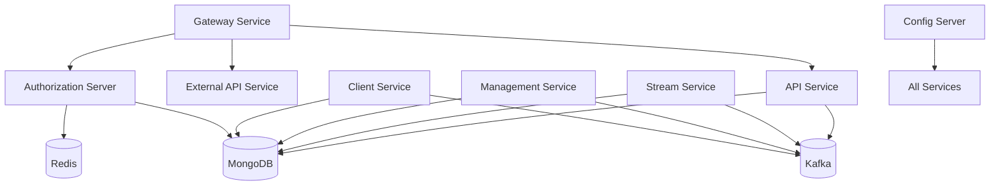
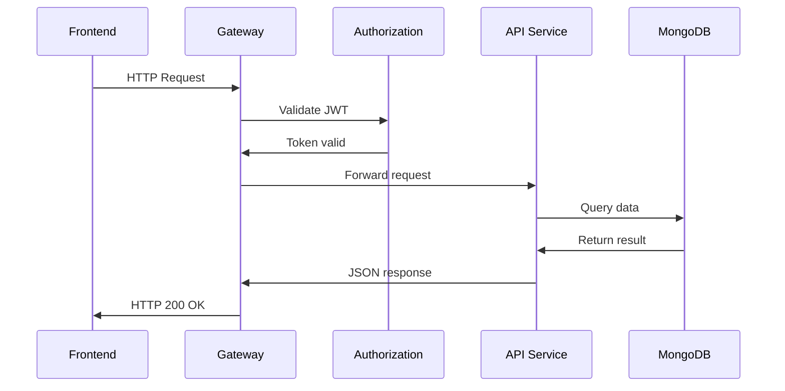

# Service Applications

The **Service Applications** module represents the runnable Spring Boot services that compose the OpenFrame platform. Each application is a thin bootstrap layer that wires together domain libraries (API, Authorization, Data, Gateway, Stream, etc.) into independently deployable microservices.

This module does not implement business logic directly. Instead, it:

- Defines service entry points (`main` classes)
- Configures component scanning boundaries
- Enables infrastructure capabilities (Kafka, Discovery, Security)
- Assembles shared libraries into cohesive runtime services

---

## Architectural Overview

The Service Applications module brings together multiple core libraries into a distributed microservice architecture.



### Key Characteristics

- **Microservice-based**: Each application runs independently.
- **Shared Core Libraries**: Business logic lives in reusable core modules.
- **Event-Driven Backbone**: Kafka connects services asynchronously.
- **Multi-Tenant Ready**: Authorization and data layers support tenant isolation.
- **Gateway-First Access**: All external traffic flows through the Gateway.

---

# Service Inventory

Below are the services defined in this module and their responsibilities.

---

## API Service

**Main Class:** `ApiApplication`

### Purpose

The API Service provides the primary internal application API for the OpenFrame platform. It exposes REST and GraphQL endpoints for managing:

- Devices
- Organizations
- Users
- Tools
- Logs and events
- Invitations and SSO configuration

### Component Scan Scope

```text
com.openframe.api
com.openframe.data
com.openframe.core
com.openframe.notification
com.openframe.kafka
```

### Responsibilities

- Business API orchestration
- DTO mapping and validation
- Device and event querying
- Coordination with data and messaging layers

---

## Authorization Server

**Main Class:** `OpenFrameAuthorizationServerApplication`

### Purpose

The Authorization Server implements OAuth2 and OpenID Connect flows, multi-tenant authentication, SSO integration, and token issuance.

### Key Features

- OAuth2 Authorization Server
- Dynamic client registration
- Tenant-aware authentication
- SSO (Google, Microsoft) support
- Token persistence

### Component Scan Scope

```text
com.openframe.authz
com.openframe.core
com.openframe.data
com.openframe.notification
```

### Infrastructure

- MongoDB for client and token storage
- Redis for caching (if enabled)
- Spring Security OAuth2 stack

---

## Gateway Service

**Main Class:** `GatewayApplication`

### Purpose

The Gateway Service is the entry point for frontend and external clients. It handles:

- Routing
- Authentication enforcement
- API key validation
- JWT validation
- CORS
- WebSocket proxying

### Component Scan Scope

```text
com.openframe.gateway
com.openframe.core
com.openframe.data
com.openframe.security
```

### Responsibilities

- Request filtering and enrichment
- Authorization header injection
- Tenant-aware issuer resolution
- Rate limiting

---

## External API Service

**Main Class:** `ExternalApiApplication`

### Purpose

The External API Service exposes public-facing REST endpoints for integrations and third-party tools.

It reuses core API logic but provides:

- OpenAPI documentation
- Integration-specific DTOs
- Filter and pagination criteria models

### Component Scan Scope

```text
com.openframe.external
com.openframe.data
com.openframe.core
com.openframe.api
com.openframe.kafka
```

---

## Management Service

**Main Class:** `ManagementApplication`

### Purpose

The Management Service handles administrative and infrastructure-level tasks.

### Responsibilities

- Release version management
- Integrated tool lifecycle
- Agent registration secret initialization
- NATS/Kafka stream initialization
- Pinot configuration
- Scheduled tasks (via ShedLock)

### Component Scan Scope

```text
com.openframe.management
com.openframe.data
com.openframe.core
```

Note: Cassandra health indicators are excluded from component scanning.

---

## Stream Service

**Main Class:** `StreamApplication`

### Purpose

The Stream Service processes asynchronous events using Kafka and Kafka Streams.

### Features

- Kafka listeners
- Debezium change stream handlers
- Event enrichment
- Tool data enrichment
- Activity aggregation

### Annotations

- `@EnableKafka`

### Component Scan Scope

```text
com.openframe.stream
com.openframe.data
com.openframe.kafka.producer
```

---

## Client Service

**Main Class:** `ClientApplication`

### Purpose

The Client Service manages agent and tool client interactions.

### Responsibilities

- Agent registration
- Agent authentication
- File exchange with tool agents
- Client connection listeners
- Machine heartbeat handling

### Component Scan Scope

```text
com.openframe.data
com.openframe.client
com.openframe.core
com.openframe.security
com.openframe.kafka.producer
```

Note: Cassandra health indicators are excluded from scanning.

---

## Config Server

**Main Class:** `ConfigServerApplication`

### Purpose

The Config Server centralizes configuration for all services.

### Responsibilities

- Environment configuration distribution
- Centralized property management
- Profile-specific configuration handling

This service enables consistent configuration across distributed deployments.

---

# Service Interaction Flow

The following diagram illustrates a typical request lifecycle.



---

# Deployment Model

Each service in the Service Applications module:

- Is packaged as an independent Spring Boot application
- Can be deployed as a container
- Registers independently (if discovery enabled)
- Connects to shared infrastructure (Kafka, MongoDB, Redis)

This enables:

- Horizontal scaling per service
- Independent deployments
- Fault isolation
- Environment-specific scaling strategies

---

# Design Principles

1. **Thin Application Layer**  
   Application classes only bootstrap and wire components.

2. **Library-Centric Architecture**  
   Business logic lives in reusable core modules.

3. **Separation of Concerns**  
   - Gateway → Routing & Security
   - Authorization → Identity & OAuth
   - API → Business Logic
   - Stream → Event Processing
   - Management → Administrative Operations
   - Client → Agent Integration

4. **Event-Driven Extensibility**  
   Kafka enables cross-service communication without tight coupling.

---

# Summary

The **Service Applications** module is the executable layer of OpenFrame. It composes reusable libraries into independent, scalable microservices that together provide:

- Secure authentication and authorization
- Multi-tenant API access
- Event-driven processing
- Agent and tool integration
- Administrative management
- Public and private API exposure

This modular architecture ensures scalability, maintainability, and flexibility across the OpenFrame platform.