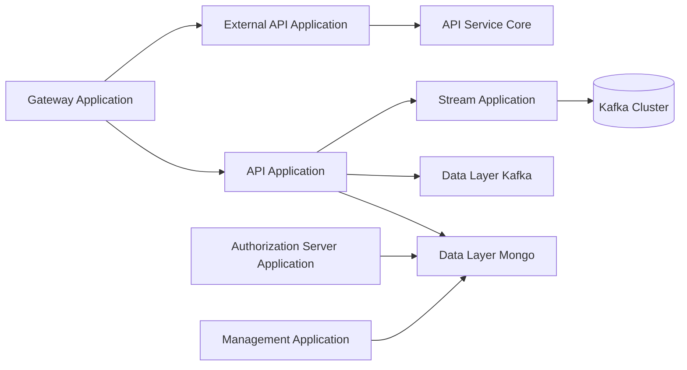
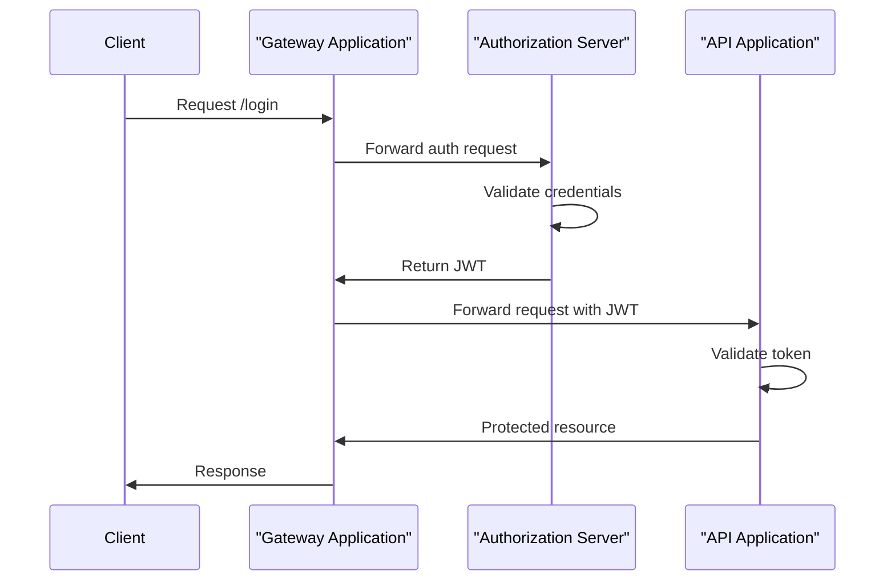
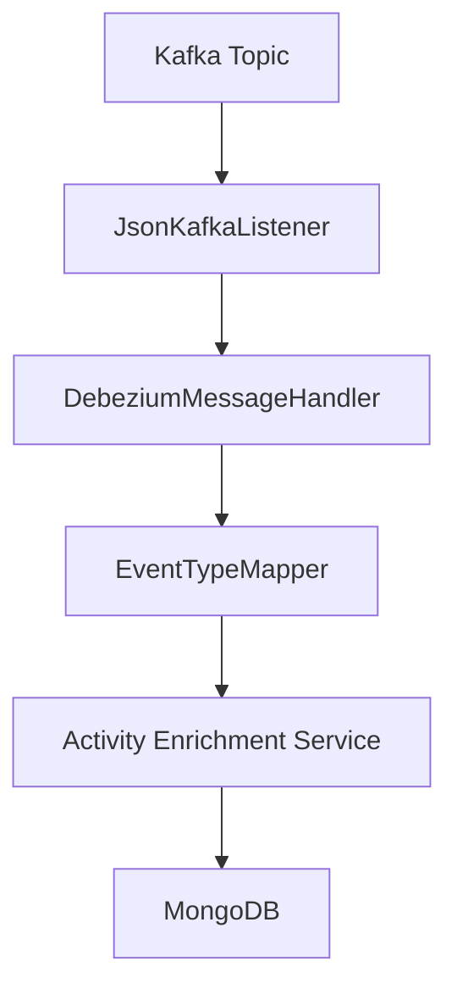
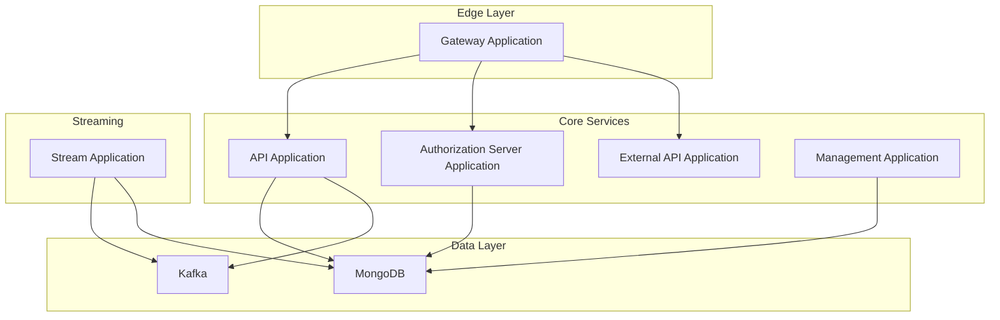

# Service Applications

The **Service Applications** module represents the runnable Spring Boot entry points of the OpenFrame platform. Each application wires together core libraries (API, authorization, data, streaming, gateway, management, and external APIs) into independently deployable microservices.

This module does not implement business logic directly. Instead, it bootstraps and composes functionality provided by sibling modules such as API Service Core, Authorization Service Core, Gateway Service Core, Stream Service Core, and the Data Layer modules.

---

## Architectural Overview

At a high level, Service Applications define the runtime boundaries of the OpenFrame platform. Each application corresponds to a deployable service.

Each node above corresponds to a Spring Boot application defined in this module and composed from lower-level service core modules.

---

## Applications in This Module

The following applications are defined in the Service Applications module:

| Application | Main Class | Responsibility |
|-------------|------------|----------------|
| API Application | `ApiApplication` | Internal API for devices, organizations, users, logs, and events |
| Authorization Server Application | `OpenFrameAuthorizationServerApplication` | OAuth2 / multi-tenant authorization server |
| Gateway Application | `GatewayApplication` | Edge routing, authentication, and request forwarding |
| External API Application | `ExternalApiApplication` | Public-facing REST APIs and OpenAPI exposure |
| Management Application | `ManagementApplication` | Integrated tool lifecycle and configuration |
| Stream Application | `StreamApplication` | Kafka-based event ingestion and enrichment |
| Client Application | `ClientApplication` | Tenant/client-side runtime services |
| Config Server Application | `ConfigServerApplication` | Centralized configuration server |

Each application is described in more detail below.

---

## API Application

**Main Class:** `ApiApplication`  
**Package:** `com.openframe.api`

The API Application is the primary internal REST and GraphQL API layer. It composes:

- `com.openframe.api` (controllers, data fetchers, processors)
- `com.openframe.data` (Mongo repositories, domain documents)
- `com.openframe.core` (shared domain logic)
- `com.openframe.notification`
- `com.openframe.kafka`

It acts as the central orchestration layer for:

- Device management
- Organization management
- Event and log retrieval
- Tool integration metadata
- User and invitation processing

See:  
- [API Service Core](../api-service-core/api-service-core.md)  
- [API Lib Contracts And Services](../api-lib-contracts-and-services/api-lib-contracts-and-services.md)

---

## Authorization Server Application

**Main Class:** `OpenFrameAuthorizationServerApplication`  
**Package:** `com.openframe.authz`

The Authorization Server Application provides:

- OAuth2 authorization flows
- Multi-tenant registration
- Login and password reset
- Invitation-based onboarding
- Tenant key management

It enables service discovery via `@EnableDiscoveryClient` and scans:

- `com.openframe.authz`
- `com.openframe.core`
- `com.openframe.data`
- `com.openframe.notification`

See:  
- [Authorization Service Core](../authorization-service-core/authorization-service-core.md)

### Authentication Flow (High-Level)

---

## Gateway Application

**Main Class:** `GatewayApplication`  
**Package:** `com.openframe.gateway`

The Gateway Application is the platform entry point. It:

- Performs JWT validation
- Supports API key authentication
- Resolves tenant issuers
- Adds authorization headers for downstream services
- Routes traffic to API, External API, and Authorization services

It composes:

- `com.openframe.gateway`
- `com.openframe.core`
- `com.openframe.data`
- `com.openframe.security`

See:  
- [Gateway Service Core](../gateway-service-core/gateway-service-core.md)

---

## External API Application

**Main Class:** `ExternalApiApplication`  
**Package:** `com.openframe.external`

The External API Application exposes publicly consumable REST APIs with OpenAPI documentation.

It scans:

- `com.openframe.external`
- `com.openframe.data`
- `com.openframe.core`
- `com.openframe.api`
- `com.openframe.kafka`

Responsibilities include:

- Device access for external consumers
- Event and log exposure
- Organization and tool endpoints
- REST proxying

See:  
- [External API Service Core](../external-api-service-core/external-api-service-core.md)

---

## Stream Application

**Main Class:** `StreamApplication`  
**Annotations:** `@EnableKafka`

The Stream Application is responsible for event-driven processing.

It composes:

- `com.openframe.stream`
- `com.openframe.data`
- `com.openframe.kafka.producer`

Responsibilities:

- Kafka listener configuration
- Debezium message handling
- Event type mapping
- Activity enrichment
- Integrated tool data enrichment

See:  
- [Stream Service Core](../stream-service-core/stream-service-core.md)
- [Data Layer Kafka](../data-layer-kafka/data-layer-kafka.md)

### Event Processing Flow

---

## Management Application

**Main Class:** `ManagementApplication`

The Management Application manages integrated tools and runtime configuration.

It scans:

- `com.openframe.management`
- `com.openframe.data`
- `com.openframe.core`

Responsibilities include:

- Integrated tool CRUD operations
- Post-save hooks
- Client configuration initialization
- Version update orchestration

See:  
- [Management Service Core](../management-service-core/management-service-core.md)

---

## Client Application

**Main Class:** `ClientApplication`

The Client Application is a tenant-facing runtime service. It integrates:

- `com.openframe.data`
- `com.openframe.client`
- `com.openframe.core`
- `com.openframe.security`
- `com.openframe.kafka.producer`

It excludes `CassandraHealthIndicator`, allowing selective infrastructure health behavior.

This service is typically deployed per tenant or per environment boundary.

---

## Config Server Application

**Main Class:** `ConfigServerApplication`

The Config Server Application provides centralized configuration management across all services.

It is a lightweight Spring Boot application responsible for:

- Serving configuration properties
- Supporting environment-specific overrides
- Enabling consistent service configuration across deployments

---

## Dependency Relationships Across Applications

---

## How Service Applications Fit Into the Overall System

Service Applications define:

- Deployment boundaries
- Runtime configuration scopes
- Component scanning boundaries
- Infrastructure integration (Kafka, Mongo, discovery)

They rely heavily on the following modules for actual business and domain logic:

- [API Service Core](../api-service-core/api-service-core.md)
- [Authorization Service Core](../authorization-service-core/authorization-service-core.md)
- [Gateway Service Core](../gateway-service-core/gateway-service-core.md)
- [Stream Service Core](../stream-service-core/stream-service-core.md)
- [Data Layer Mongo](../data-layer-mongo/data-layer-mongo.md)
- [Data Layer Kafka](../data-layer-kafka/data-layer-kafka.md)
- [Data Layer Core](../data-layer-core/data-layer-core.md)
- [Management Service Core](../management-service-core/management-service-core.md)
- [External API Service Core](../external-api-service-core/external-api-service-core.md)

In summary, the Service Applications module provides the executable microservice layer of OpenFrame, assembling reusable core modules into cohesive, production-ready services.