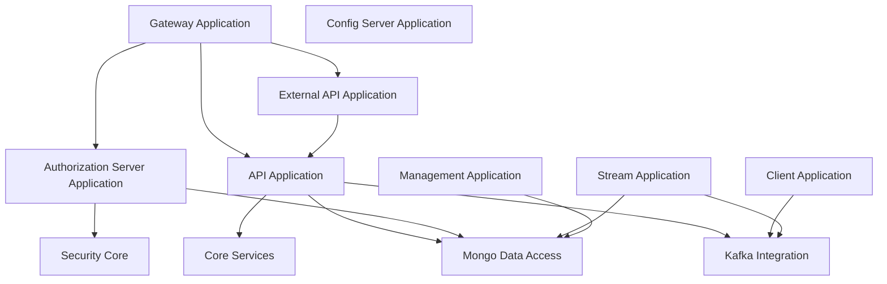
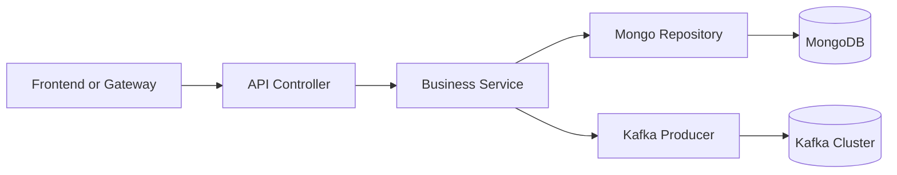
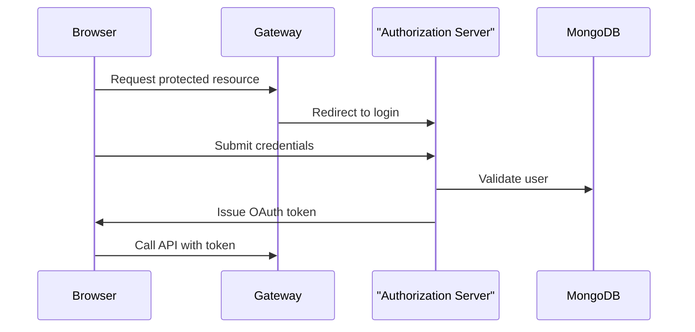
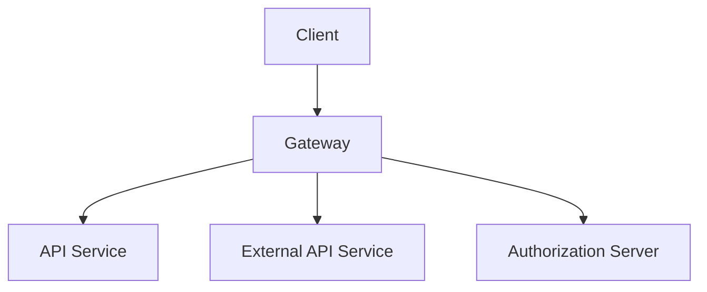
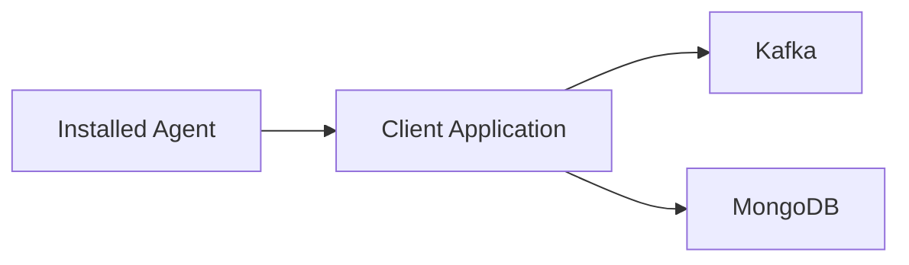
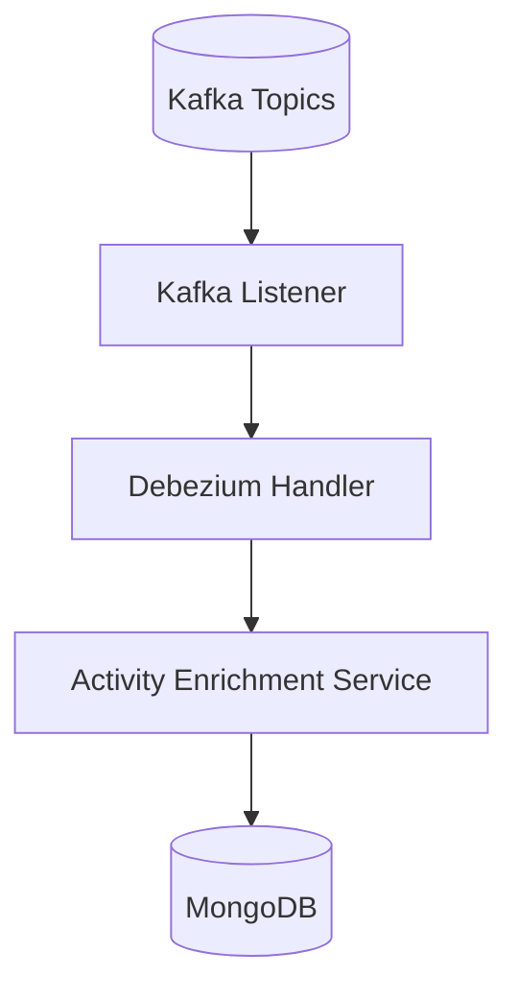
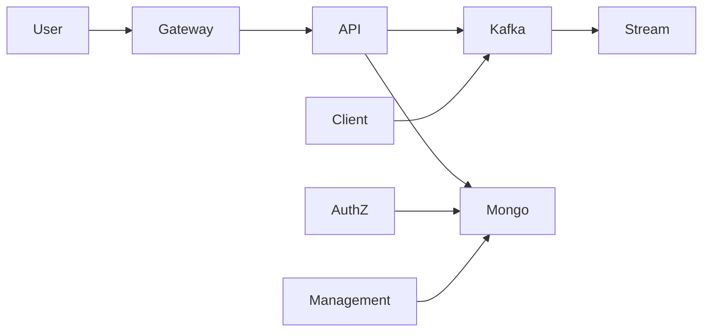

# Service Applications

The **Service Applications** module represents the deployable runtime layer of the OpenFrame platform. It aggregates and boots all core backend services that power API access, authentication, streaming, management, client connectivity, and configuration.

Each application in this module is a standalone Spring Boot service that composes functionality from lower-level modules such as API libraries, data access layers, security components, Kafka integrations, and core business services.

At a high level, Service Applications:

- Provide executable entry points for all backend services
- Wire together domain modules via `@ComponentScan`
- Enable service discovery, messaging, and security
- Define the runtime boundaries of the platform

---

## Architectural Overview

The Service Applications layer sits at the top of the backend stack and orchestrates multiple domain modules.



Each box represents a deployable service with its own Spring Boot lifecycle.

---

# Applications in the Module

The Service Applications module contains the following runtime services:

1. API Application  
2. Authorization Server Application  
3. Gateway Application  
4. External API Application  
5. Client Application  
6. Management Application  
7. Stream Application  
8. Config Server Application  

Each application is described below.

---

## API Application

**Entry point:** `ApiApplication`

The API Application is the primary backend service responsible for exposing core platform APIs for devices, users, organizations, logs, tools, and events.

### Responsibilities

- Expose REST and/or GraphQL endpoints
- Coordinate business logic services
- Integrate with Mongo repositories
- Publish and consume Kafka events
- Interact with notification and core services

### Component Scan Scope

```java
@ComponentScan(basePackages = {
    "com.openframe.api",
    "com.openframe.data",
    "com.openframe.core",
    "com.openframe.notification",
    "com.openframe.kafka"
})
```

This shows the API service composes:

- API controllers and data fetchers
- Data access layer (Mongo)
- Core business logic
- Kafka integration
- Notification mechanisms

### Runtime Flow



---

## Authorization Server Application

**Entry point:** `OpenFrameAuthorizationServerApplication`

This service acts as the OAuth2 / OIDC authorization server for the platform.

### Responsibilities

- User authentication (username/password, SSO)
- Tenant-aware identity handling
- OAuth2 token issuance
- Client registration
- Password reset and invitation flows

### Key Features

- `@EnableDiscoveryClient` for service discovery
- Multi-tenant context resolution
- RSA key generation and token signing
- Mongo-backed authorization storage

### Component Scan Scope

```java
@ComponentScan(basePackages = {
    "com.openframe.authz",
    "com.openframe.core",
    "com.openframe.data",
    "com.openframe.notification"
})
```

### Authentication Flow



---

## Gateway Application

**Entry point:** `GatewayApplication`

The Gateway Application acts as the unified ingress point for client requests.

### Responsibilities

- Route external requests to internal services
- Validate JWT tokens
- Apply API key authentication
- Enforce CORS and security policies
- Add authorization headers for downstream services

### Component Scan Scope

```java
@ComponentScan(basePackages = {
    "com.openframe.gateway",
    "com.openframe.core",
    "com.openframe.data",
    "com.openframe.security"
})
```

### Request Routing Model



The Gateway centralizes cross-cutting concerns such as authentication and request transformation.

---

## External API Application

**Entry point:** `ExternalApiApplication`

This service exposes a partner-facing or integration-facing API surface.

### Responsibilities

- Provide stable external REST endpoints
- Proxy or transform internal API calls
- Integrate with Kafka and data layer
- Publish OpenAPI documentation

### Component Scan Scope

```java
@ComponentScan(basePackages = {
    "com.openframe.external",
    "com.openframe.data",
    "com.openframe.core",
    "com.openframe.api",
    "com.openframe.kafka"
})
```

The inclusion of `com.openframe.api` allows reuse of shared business logic.

---

## Client Application

**Entry point:** `ClientApplication`

The Client Application manages machine agents and platform-connected clients.

### Responsibilities

- Agent authentication
- Agent registration
- Heartbeat handling
- Tool connection tracking
- Kafka event publishing

### Notable Configuration

Excludes `CassandraHealthIndicator`, demonstrating selective component filtering.

```java
excludeFilters = {
    @ComponentScan.Filter(
        type = FilterType.ASSIGNABLE_TYPE,
        classes = CassandraHealthIndicator.class
    )
}
```

### Interaction Model



---

## Management Application

**Entry point:** `ManagementApplication`

This service provides administrative and lifecycle management capabilities.

### Responsibilities

- Integrated tool management
- Release version management
- Agent secret initialization
- Debezium connector setup
- Client configuration initialization

### Component Scope

- Management controllers
- Data access layer
- Core utilities

It acts as the operational control plane for the platform.

---

## Stream Application

**Entry point:** `StreamApplication`

The Stream Application handles real-time event processing and enrichment.

### Responsibilities

- Consume Kafka topics
- Process Debezium CDC events
- Enrich activity data
- Transform integrated tool events

### Configuration Highlights

- `@EnableKafka` enables Kafka listener support
- Integrates with data layer for persistence and lookup

### Streaming Flow



---

## Config Server Application

**Entry point:** `ConfigServerApplication`

The Config Server Application provides centralized configuration management.

### Responsibilities

- Centralized configuration distribution
- Environment-specific property resolution
- Bootstrapping configuration for all services

All other Service Applications rely on it for environment configuration and service-level properties.

---

# Cross-Service Communication Patterns

The Service Applications interact through:

1. **HTTP (via Gateway)**  
2. **Kafka (event-driven communication)**  
3. **MongoDB (shared persistence layer, tenant-scoped)**  
4. **OAuth2 / JWT (security propagation)**  



---

# Design Principles

The Service Applications module reflects several architectural principles:

- **Modular composition**: Each service assembles lower-level modules via component scanning.
- **Separation of concerns**: API, auth, gateway, streaming, and management are isolated.
- **Event-driven integration**: Kafka enables decoupled inter-service communication.
- **Tenant awareness**: Services integrate with tenant-aware data and security layers.
- **Scalability**: Each application can be independently scaled and deployed.

---

# Conclusion

The **Service Applications** module defines the operational backbone of the OpenFrame platform. It transforms reusable domain modules into independently deployable services, enabling:

- Secure multi-tenant authentication
- Unified API access
- Real-time streaming and enrichment
- Agent and integration management
- Centralized configuration control

Together, these applications form the runtime foundation upon which the Flamingo / OpenFrame ecosystem operates.