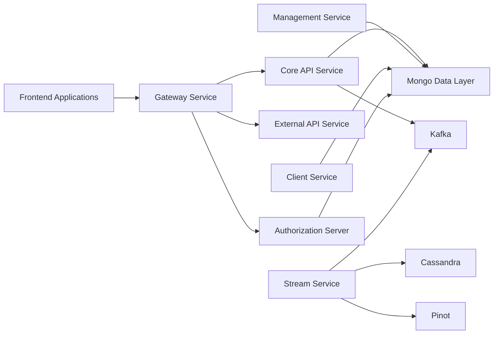
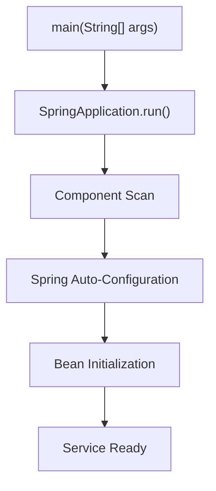
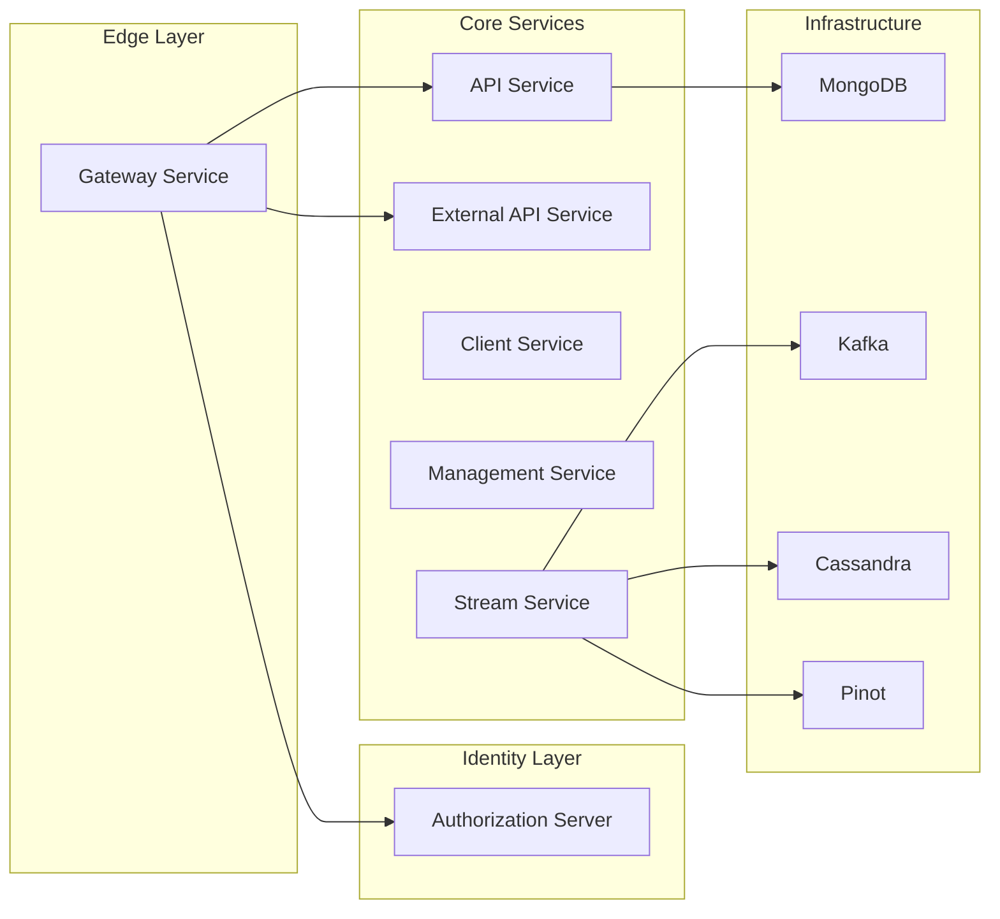

# Services App Entrypoints

## Overview

The **Services App Entrypoints** module defines the executable entry points for all major backend services in the OpenFrame tenant stack. Each entry point is a Spring Boot application responsible for bootstrapping a specific bounded context (API, Gateway, Authorization, Stream processing, etc.) and wiring together its required component packages.

These classes are intentionally lightweight. Their primary responsibility is:

- Declaring the application as a `@SpringBootApplication`
- Defining `@ComponentScan` boundaries
- Enabling optional infrastructure (Kafka, Discovery, etc.)
- Launching the service via `SpringApplication.run(...)`

They serve as the **runtime roots** of the system.

---

## Architectural Position

Each entrypoint corresponds to a deployable microservice. Together, they form the distributed OpenFrame backend architecture.



Each box above is bootstrapped by a dedicated application class inside this module.

---

## Service Entrypoints

### 1. API Service

**Class:** `ApiApplication`

```java
@SpringBootApplication
@ComponentScan(basePackages = {
    "com.openframe.api",
    "com.openframe.data",
    "com.openframe.core",
    "com.openframe.notification",
    "com.openframe.kafka"
})
```

**Responsibilities:**

- Exposes REST and GraphQL endpoints
- Coordinates domain services
- Integrates Mongo repositories
- Publishes events to Kafka
- Handles core business logic

**Key Characteristics:**

- Broad component scan across API, Data, Core, Notification, and Kafka packages
- Primary internal backend service

---

### 2. Authorization Server

**Class:** `OpenFrameAuthorizationServerApplication`

```java
@SpringBootApplication
@EnableDiscoveryClient
@ComponentScan(basePackages = {
    "com.openframe.authz",
    "com.openframe.core",
    "com.openframe.data",
    "com.openframe.notification"
})
```

**Responsibilities:**

- OAuth2 / OIDC flows
- Tenant-aware authentication
- SSO provider integration
- Token issuance and validation

**Key Characteristics:**

- Service discovery enabled
- Multi-tenant aware
- Integrates with Mongo for client and user storage

---

### 3. Gateway Service

**Class:** `GatewayApplication`

```java
@SpringBootApplication
@ComponentScan(basePackages = {
    "com.openframe.gateway",
    "com.openframe.core",
    "com.openframe.data",
    "com.openframe.security"
})
```

**Responsibilities:**

- Edge routing
- JWT validation
- API key enforcement
- CORS handling
- WebSocket proxying

Acts as the **single entry point** for frontend and external traffic.

---

### 4. External API Service

**Class:** `ExternalApiApplication`

```java
@SpringBootApplication
@ComponentScan(basePackages = {
    "com.openframe.external",
    "com.openframe.data",
    "com.openframe.core",
    "com.openframe.api",
    "com.openframe.kafka"
})
```

**Responsibilities:**

- Public REST endpoints
- API contract enforcement
- DTO transformation layer
- Controlled access to internal API logic

Provides a stable public interface separate from internal API concerns.

---

### 5. Client Service

**Class:** `ClientApplication`

```java
@SpringBootApplication
@ComponentScan(
    basePackages = {
        "com.openframe.data",
        "com.openframe.client",
        "com.openframe.core",
        "com.openframe.security",
        "com.openframe.kafka.producer"
    },
    excludeFilters = {
        @ComponentScan.Filter(
            type = FilterType.ASSIGNABLE_TYPE,
            classes = CassandraHealthIndicator.class
        )
    }
)
```

**Responsibilities:**

- Agent communication endpoints
- Client registration
- Heartbeat listeners
- Tool connection management

**Notable Detail:**

- Explicitly excludes `CassandraHealthIndicator`, preventing Cassandra dependency in this service.

---

### 6. Stream Service

**Class:** `StreamApplication`

```java
@SpringBootApplication
@EnableKafka
@ComponentScan(basePackages = {
    "com.openframe.stream",
    "com.openframe.data",
    "com.openframe.kafka.producer"
})
```

**Responsibilities:**

- Kafka consumers
- Event deserialization
- Event enrichment
- Debezium change stream processing
- Streaming to Pinot and Cassandra

This service powers real-time analytics and event-driven workflows.

---

### 7. Management Service

**Class:** `ManagementApplication`

```java
@SpringBootApplication
@ComponentScan(
    basePackages = {
        "com.openframe.management",
        "com.openframe.data",
        "com.openframe.core"
    },
    excludeFilters = {
        @ComponentScan.Filter(
            type = FilterType.ASSIGNABLE_TYPE,
            classes = CassandraHealthIndicator.class
        )
    }
)
```

**Responsibilities:**

- System initialization
- Tool bootstrap
- Scheduler jobs
- Debezium monitoring
- Version synchronization

**Design Note:**

Like the Client Service, Cassandra health checks are excluded.

---

### 8. Config Server

**Class:** `ConfigServerApplication`

```java
@SpringBootApplication
public class ConfigServerApplication
```

**Responsibilities:**

- Centralized configuration management
- Environment-specific property distribution
- Service configuration coordination

This service typically runs early in the deployment lifecycle.

---

## Bootstrapping Pattern

All services follow the same structural pattern:



This consistent approach ensures:

- Predictable startup behavior
- Clear separation of bounded contexts
- Independent scaling and deployment

---

## Multi-Service Runtime Model

At runtime, each application class becomes a **separate deployable artifact**.



---

## Design Principles

The Services App Entrypoints module follows these principles:

1. **Single Responsibility per Service**  
   Each application class owns one bounded context.

2. **Explicit Package Boundaries**  
   `@ComponentScan` defines architectural boundaries.

3. **Infrastructure Isolation**  
   Services selectively include or exclude infrastructure (e.g., Cassandra health checks).

4. **Independent Deployment**  
   Each entrypoint maps to its own container image and runtime process.

5. **Event-Driven Extension**  
   Stream and Kafka-enabled services integrate seamlessly into the platform’s reactive architecture.

---

## Summary

The **Services App Entrypoints** module is the orchestration layer of deployable Spring Boot services within OpenFrame.

It does not implement business logic directly. Instead, it:

- Defines service boundaries
- Wires infrastructure dependencies
- Boots the application context
- Establishes runtime composition

Every backend service in the platform begins execution here.