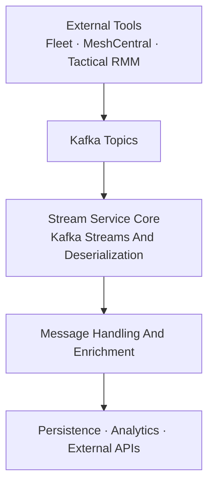
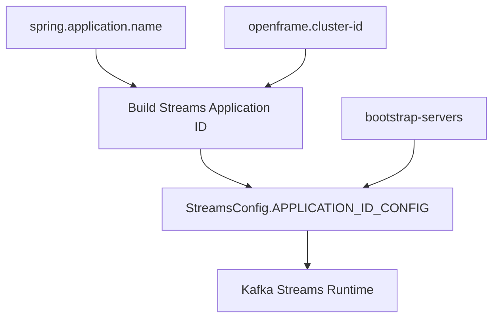
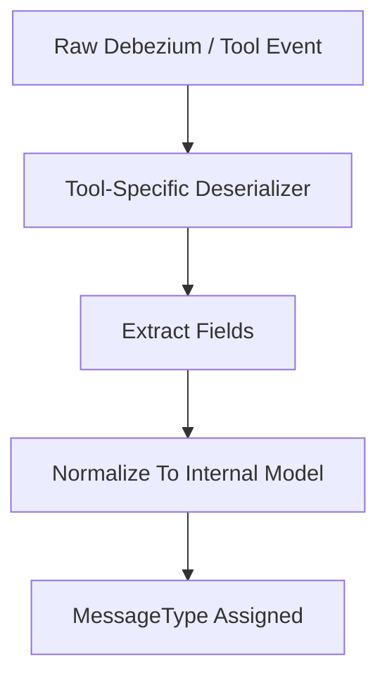
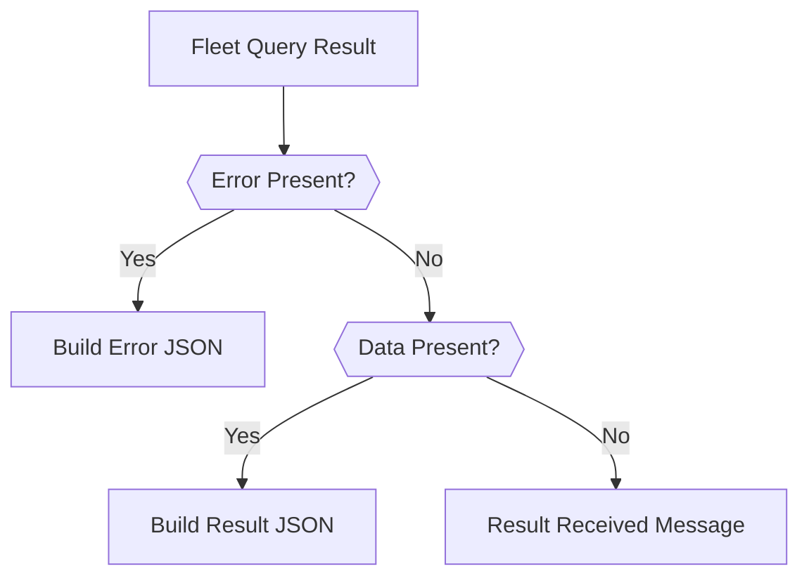
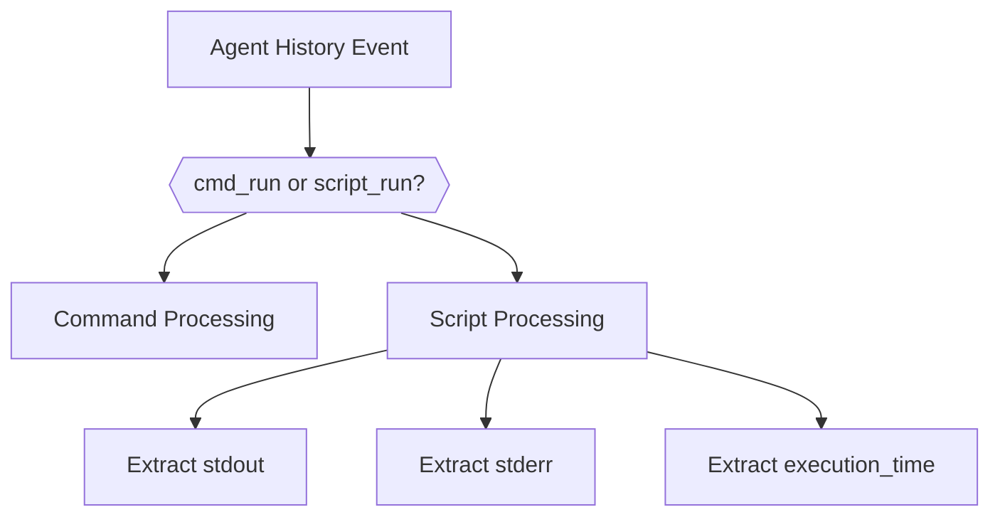
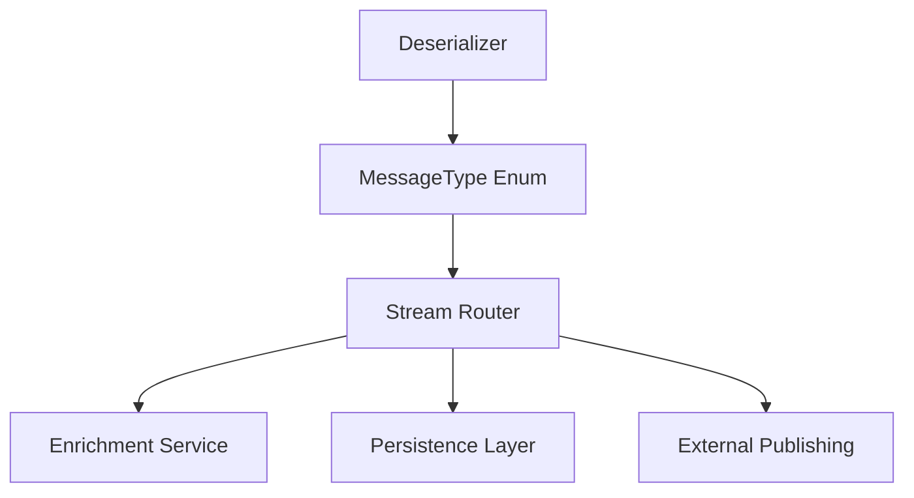

# Stream Service Core Kafka Streams And Deserialization

## Overview

The **Stream Service Core Kafka Streams And Deserialization** module is the foundational streaming layer of the OpenFrame Stream Service. It is responsible for:

- Configuring Kafka and Kafka Streams infrastructure
- Defining serialization and deserialization (Serde) strategies
- Transforming raw integration events into normalized internal message models
- Assigning consistent `MessageType` values for downstream processing

This module acts as the **ingestion and normalization boundary** between external tool event sources (Fleet MDM, MeshCentral, Tactical RMM, Debezium-based CDC streams) and the internal stream processing pipeline.

It is consumed by higher-level streaming logic (message handling, enrichment, persistence, and publishing) but remains focused strictly on:

- Stream configuration
- Message typing
- Event deserialization

---

## Architectural Context

Within the overall OpenFrame platform, the Stream Service sits between data producers (tools, CDC pipelines) and downstream consumers (enrichment services, storage layers, analytics systems).



This module specifically implements the **StreamCore** box in the diagram above.

---

# 1. Kafka Infrastructure Configuration

## 1.1 KafkaConfig

**Component:** `KafkaConfig`

This configuration class defines supporting Kafka infrastructure beans.

### Message Type Header Conversion

A critical bean in this module is:

```java
Converter<byte[], MessageType>
```

This converter:

- Reads a Kafka header as UTF-8 bytes
- Converts it into a `MessageType` enum
- Safely handles invalid values

This enables:

- Strong typing of events at the consumer layer
- Routing and processing decisions based on `MessageType`

---

## 1.2 KafkaStreamsConfig

**Component:** `KafkaStreamsConfig`

This class enables and configures Kafka Streams processing.

### Core Responsibilities

- Enables Kafka Streams (`@EnableKafkaStreams`)
- Defines application-level stream configuration
- Registers JSON Serdes for internal models
- Namespaces stream applications per tenant/cluster

### Kafka Streams Topology Configuration



### Multi-Tenant Application ID Strategy

The method `buildStreamsApplicationId()` ensures:

- If `clusterId` is defined → `applicationName-clusterId`
- Otherwise → `applicationName`

This prevents state store collisions across tenants in SaaS deployments.

---

## 1.3 Serde Definitions

The module defines explicit Serdes for:

- `ActivityMessage`
- `HostActivityMessage`

Two variants exist:

- Standard JSON Serde
- Outgoing Serde without type info headers

This allows:

- Internal stream processing with type-safe models
- Clean external publishing without Jackson type metadata

---

# 2. Event Deserialization Layer

All deserializers extend a common base:

```text
IntegratedToolEventDeserializer
```

Each implementation:

- Extracts `agentId`
- Extracts tool-specific event identifiers
- Determines `sourceEventType`
- Generates a human-readable message
- Parses timestamps
- Produces normalized internal event structures



---

# 3. Fleet MDM Deserializers

## 3.1 FleetEventDeserializer

**MessageType:** `FLEET_MDM_EVENT`

### Responsibilities

- Extracts `agentId` (with fallback strategy)
- Reads `activity_type`
- Maps activity types to human-readable messages
- Parses ISO-8601 timestamps
- Uses `FleetActivityTypeMapping`

If a mapping is not found:

- Falls back to the `details` field
- Logs a warning

This ensures:

- Consistent UI-friendly event messages
- Minimal data loss

---

## 3.2 FleetQueryResultEventDeserializer

**MessageType:** `FLEET_MDM_QUERY_RESULT_EVENT`

This deserializer handles scheduled query execution results.

### Advanced Features

- Uses `FleetMdmCacheService`
- Resolves query metadata by `query_id`
- Differentiates between:
  - Success
  - Error
  - Result received

### Result & Error Handling

It constructs structured JSON for:

- `error`
- `result`

If output is valid JSON → parsed and embedded.
If not → stored as plain text.



---

# 4. MeshCentral Deserializer

## MeshCentralEventDeserializer

**MessageType:** `MESHCENTRAL_EVENT`

### Key Characteristics

- Parses nested JSON payloads
- Extracts:
  - `nodeid`
  - `etype`
  - `action`
  - `_id`
  - `msg`
- Handles Mongo-style `$oid` IDs
- Extracts timestamps from `$date`

### Event Type Composition

If both `etype` and `action` exist:

```text
etype.action
```

This provides a consistent event taxonomy across systems.

---

# 5. Tactical RMM Deserializers

## 5.1 TrmmAgentHistoryEventDeserializer

**MessageType:** `TACTICAL_RMM_AGENT_HISTORY_EVENT`

### Responsibilities

- Resolves internal agent ID via `TacticalRmmCacheService`
- Distinguishes between:
  - `cmd_run`
  - `script_run`
- Detects start vs completion state

### Result Extraction

- Extracts `stdout`
- Extracts `stderr`
- Captures execution time
- Wraps output in structured JSON



---

## 5.2 TrmmAuditEventDeserializer

**MessageType:** `TACTICAL_RMM_AUDIT_EVENT`

### Responsibilities

- Extracts:
  - `agentid`
  - `object_type`
  - `action`
  - `message`
  - `after_value`
- Generates event type as:

```text
object_type.action
```

- Parses ISO-8601 timestamps

This supports:

- Audit logging
- Policy tracking
- Script execution monitoring

---

# 6. MessageType as Routing Contract

All deserializers implement:

```java
public MessageType getType()
```

This enum value becomes the **routing contract** for downstream stream processors.



By centralizing typing here, the system ensures:

- Deterministic routing
- Decoupled enrichment logic
- Consistent cross-tool behavior

---

# 7. Stream Processing Guarantees

The Kafka Streams configuration includes:

- `AT_LEAST_ONCE` processing
- Controlled `MAX_TASK_IDLE_MS`
- Fixed stream threads
- Tuned producer batching

These settings balance:

- Reliability
- Latency
- Deterministic window closure

---

# 8. Design Principles

The **Stream Service Core Kafka Streams And Deserialization** module follows these principles:

### 1. Clear Separation of Concerns

- Infrastructure configuration
- Deserialization logic
- Message typing

### 2. Tool Isolation

Each tool has its own deserializer:

- Fleet
- MeshCentral
- Tactical RMM

This prevents cross-tool coupling.

### 3. Normalization First

Raw events are:

- Parsed
- Validated
- Normalized
- Typed

Before any enrichment occurs.

### 4. Safe Degradation

When:

- JSON is malformed
- Cache misses occur
- Fields are missing

The system logs and falls back gracefully.

---

# 9. Summary

The **Stream Service Core Kafka Streams And Deserialization** module is the ingestion and normalization backbone of the Stream Service.

It provides:

- Kafka Streams configuration
- Tenant-safe application IDs
- Strongly typed Serdes
- Tool-specific deserializers
- Structured error and result extraction
- Consistent `MessageType` routing

By enforcing strict normalization at this boundary, the platform guarantees that downstream enrichment and persistence layers operate on clean, predictable, and tool-agnostic event models.