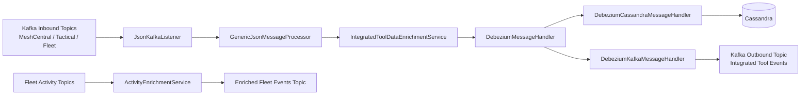
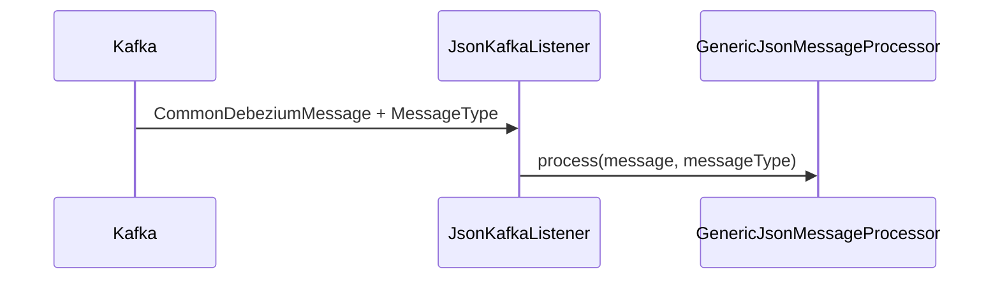
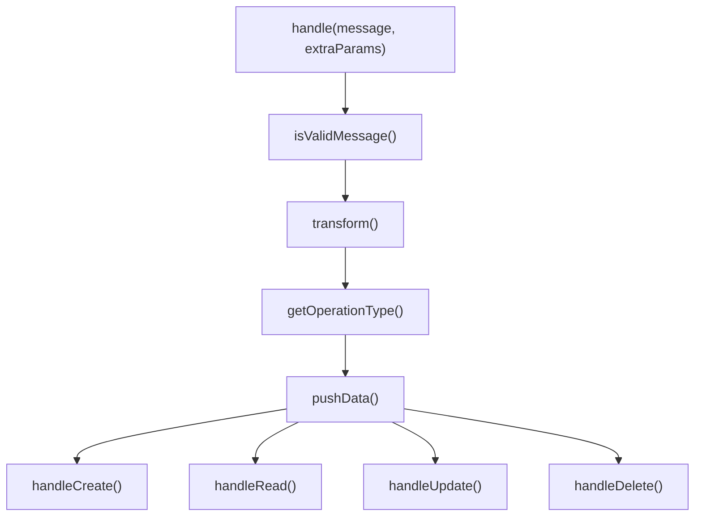
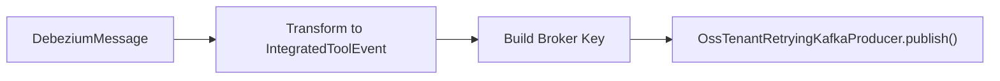
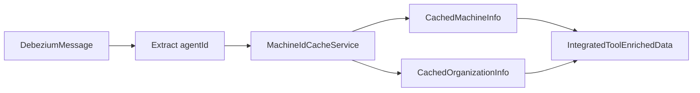
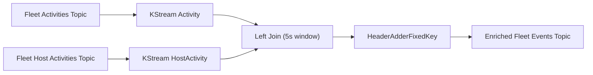
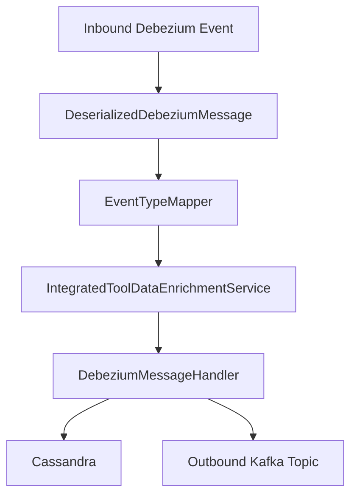

# Stream Service Core Message Handling And Enrichment

## Overview

The **Stream Service Core Message Handling And Enrichment** module is responsible for:

- Consuming CDC and integrated tool events from Kafka
- Enriching events with organization and machine context
- Mapping source-specific event types into a unified event model
- Routing transformed events to downstream systems such as **Cassandra** and **Kafka**

This module sits at the heart of the streaming pipeline in the `openframe-stream` service and bridges raw Debezium events with normalized, enriched domain events used across the platform.

It works closely with:

- Kafka configuration and deserialization (see `stream-service-core-kafka-streams-and-deserialization` module)
- Redis-based machine/organization cache services
- Cassandra and Kafka producers

---

## High-Level Architecture



The module contains three major responsibilities:

1. **Message Consumption & Routing** – via Kafka listeners and generic handlers
2. **Event Normalization & Type Mapping** – mapping tool-specific events to `UnifiedEventType`
3. **Context Enrichment** – enriching events with machine and organization metadata

---

## Core Components

### 1. JsonKafkaListener

**Class:** `JsonKafkaListener`

This is the Kafka entry point for integrated tool Debezium events.

It listens to inbound topics:

- MeshCentral events
- Tactical RMM events
- Fleet MDM events
- Fleet MDM query results



The listener delegates processing to a `GenericJsonMessageProcessor`, which then triggers the appropriate enrichment and message handler pipeline.

---

### 2. GenericMessageHandler (Processing Template)

**Class:** `GenericMessageHandler<T, U, V>`

This abstract class implements a reusable template for message handling:



Key features:

- Centralized lifecycle: `CREATE`, `READ`, `UPDATE`, `DELETE`
- Automatic operation mapping via `OperationType`
- Configured `ObjectMapper` with Java time support
- Pluggable validation and transformation logic

This template ensures consistent behavior across Cassandra and Kafka handlers.

---

### 3. DebeziumMessageHandler

**Class:** `DebeziumMessageHandler<T, U extends DeserializedDebeziumMessage>`

Extends `GenericMessageHandler` and adds:

- Debezium operation mapping (`c`, `r`, `u`, `d` → `OperationType`)
- Specialization for `DeserializedDebeziumMessage`

It acts as the base for destination-specific implementations.

---

### 4. Destination-Specific Handlers

#### DebeziumCassandraMessageHandler

- Destination: `CASSANDRA`
- Target model: `UnifiedLogEvent`
- Repository: `CassandraRepository`

Responsibilities:

- Transform enriched Debezium events into `UnifiedLogEvent`
- Construct composite primary key
- Persist to Cassandra

Key transformation fields:

- Machine ID
- Hostname
- Organization ID & name
- Unified event type & severity
- Event timestamp

All `CREATE`, `READ`, and `UPDATE` operations result in a `save()`.

---

#### DebeziumKafkaMessageHandler

- Destination: `KAFKA`
- Target model: `IntegratedToolEvent`
- Producer: `OssTenantRetryingKafkaProducer`

Responsibilities:

- Transform Debezium events into normalized outbound events
- Publish to configured outbound topic
- Generate partition key using device or user ID



Validation rule:

- Only publishes events where `isVisible == true`

---

## Event Type Normalization

### EventTypeMapper

This class maps tool-specific source event types to a unified domain enum `UnifiedEventType`.

Mapping key format:

```text
<tool_db_name>:<source_event_type>
```

Supported integrated tools:

- MeshCentral
- Tactical RMM
- Fleet MDM

If no mapping is found, the event is mapped to:

```text
UnifiedEventType.UNKNOWN
```

This abstraction ensures downstream systems operate on consistent event semantics regardless of source tool.

---

### SourceEventTypes

Defines structured constants for:

- `MeshCentral`
- `Tactical`
- `Fleet`

This avoids string duplication and centralizes event type definitions.

---

### FleetActivityTypeMapping

Provides a mapping between Fleet MDM activity types and human-readable messages.

Used to:

- Generate user-friendly summaries
- Standardize activity descriptions

Example mapping:

```text
enabled_activity_automations -> Enabled activity automations
created_policy -> Created policy
installed_software -> Installed software
```

---

## Data Enrichment

### IntegratedToolDataEnrichmentService

Implements `DataEnrichmentService<DeserializedDebeziumMessage>`.

Purpose:

- Enrich events using Redis-backed cache
- Resolve:
  - Machine ID
  - Hostname
  - Organization ID
  - Organization name



If no machine is found, enrichment returns partial or empty metadata but does not fail the pipeline.

---

## Fleet Activity Stream Enrichment

### ActivityEnrichmentService

This component builds a Kafka Streams topology that joins:

- Fleet `activities` topic
- Fleet `host_activities` topic

It enriches `ActivityMessage` with host information.



Key details:

- Join window: 5 seconds
- Enriches `Activity` with:
  - `hostId`
  - `agentId`
- Adds headers:
  - `MESSAGE_TYPE_HEADER = FLEET_MDM_EVENT`
  - `__TypeId__ = CommonDebeziumMessage`

This ensures downstream processors treat enriched Fleet events consistently with other Debezium-based events.

---

## Supporting Models

### ActivityMessage

Typed Debezium message wrapper for Fleet `Activity` entities.

### HostActivityMessage

Typed Debezium message wrapper for Fleet `HostActivity` entities.

### HostActivity

Represents association between:

- `host_id`
- `activity_id`

---

## Timestamp Handling

### TimestampParser

Utility class for parsing ISO 8601 timestamps into epoch milliseconds.

Behavior:

- Uses `Instant.parse()`
- Returns `Optional<Long>`
- Logs warnings on parse failures

Ensures consistent timestamp normalization across integrated tools.

---

## End-to-End Flow Summary



The **Stream Service Core Message Handling And Enrichment** module guarantees:

- Unified event semantics across integrated tools
- Tenant-aware enrichment
- Idempotent handling of CDC operations
- Multi-destination routing (Kafka + Cassandra)
- Consistent event lifecycle processing

It is the normalization and distribution backbone of the streaming architecture in OpenFrame.