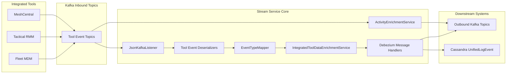
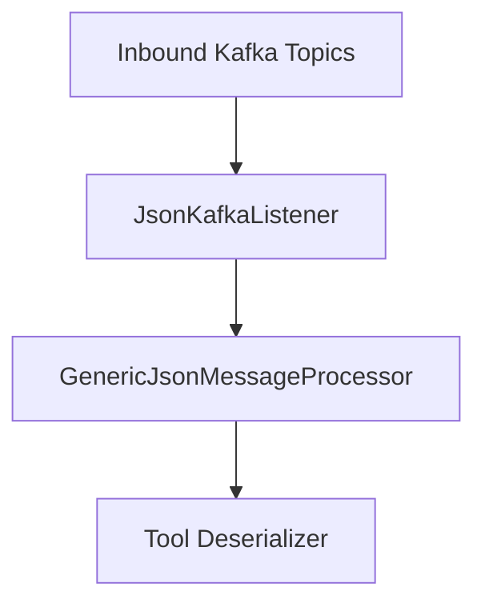
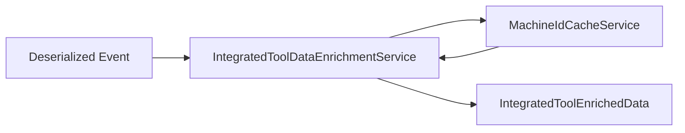
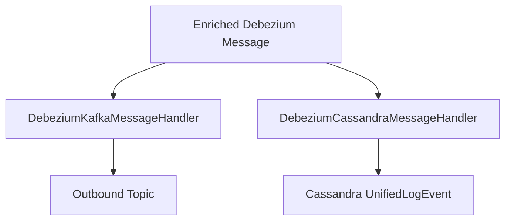
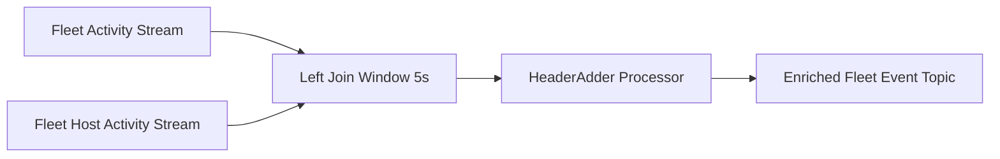
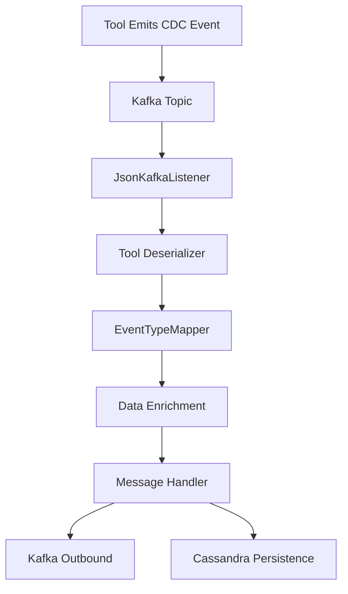

# Stream Service Core

The **Stream Service Core** module is the event ingestion, normalization, enrichment, and distribution engine of the OpenFrame platform. It processes change data capture (CDC) events from integrated tools (Fleet MDM, Tactical RMM, MeshCentral), transforms them into unified domain events, enriches them with contextual metadata, and routes them to downstream systems such as Kafka and Cassandra.

This module plays a critical role in maintaining a real-time, normalized activity stream across tenants in a multi-tenant SaaS deployment.

---

## 1. Architectural Role in the Platform

The Stream Service Core sits between external tool event sources and internal consumers such as analytics, logging, alerting, and API layers.



### Responsibilities

- Consume CDC events via Kafka
- Deserialize tool-specific payloads
- Map source event types to unified event taxonomy
- Enrich events with machine and organization metadata
- Persist to Cassandra (audit/event store)
- Republish normalized events to Kafka
- Perform stream joins for Fleet activity enrichment

---

## 2. Kafka Configuration Layer

### KafkaConfig

Provides core Spring Kafka configuration, including:

- A `Converter<byte[], MessageType>` to extract `MessageType` from Kafka headers.
- Safe handling of unknown or invalid message type values.

This enables the listener layer to route events based on tool-specific message types.

### KafkaStreamsConfig

Configures Kafka Streams processing for activity enrichment:

- Custom SerDes for:
  - `ActivityMessage`
  - `HostActivityMessage`
- Tenant-aware `application.id` generation
- At-least-once processing guarantee
- Controlled thread count
- Tuned consumer and producer properties

The application ID is constructed as:

```text
applicationName-clusterId
```

This ensures tenant isolation in multi-cluster SaaS environments.

---

## 3. Event Ingestion Pipeline

### JsonKafkaListener

Consumes inbound topics:

- MeshCentral events
- Tactical RMM events
- Fleet MDM events
- Fleet query result events

It extracts the `MessageType` header and delegates processing to `GenericJsonMessageProcessor`.



---

## 4. Tool-Specific Deserialization

All deserializers extend `IntegratedToolEventDeserializer` and convert tool-native schemas into a normalized internal model.

### Supported Tools

| Tool | Deserializer | MessageType |
|------|--------------|-------------|
| Fleet MDM | FleetEventDeserializer | FLEET_MDM_EVENT |
| Fleet Query Result | FleetQueryResultEventDeserializer | FLEET_MDM_QUERY_RESULT_EVENT |
| MeshCentral | MeshCentralEventDeserializer | MESHCENTRAL_EVENT |
| Tactical RMM Agent History | TrmmAgentHistoryEventDeserializer | TACTICAL_RMM_AGENT_HISTORY_EVENT |
| Tactical RMM Audit | TrmmAuditEventDeserializer | TACTICAL_RMM_AUDIT_EVENT |

### Deserialization Responsibilities

Each deserializer extracts:

- Agent ID
- Source Event Type
- Tool Event ID
- Message summary
- Error details
- Result payload
- Event timestamp

Fleet and Tactical implementations also use cache services to resolve:

- Script names
- Query metadata
- Agent primary keys

---

## 5. Event Type Normalization

### EventTypeMapper

Maps tool-specific source event types to `UnifiedEventType`.

Mapping key format:

```text
toolDbName:sourceEventType
```

If no mapping is found, the system defaults to:

```text
UnifiedEventType.UNKNOWN
```

This abstraction ensures:

- Cross-tool consistency
- Unified severity model
- Downstream compatibility

---

## 6. Data Enrichment Layer

### IntegratedToolDataEnrichmentService

Enriches events with:

- Machine ID
- Hostname
- Organization ID
- Organization Name

It uses `MachineIdCacheService` (Redis-backed) to:

1. Resolve agentId → machine
2. Resolve machine → organization



This enrichment allows downstream systems to operate without direct dependency on integrated tool schemas.

---

## 7. Generic Message Handling Framework

### GenericMessageHandler

Abstract template for:

- Validation
- Transformation
- Operation routing (CREATE, READ, UPDATE, DELETE)

Operation types are derived from Debezium payload operations:

| Operation | Meaning |
|------------|----------|
| c | CREATE |
| r | READ |
| u | UPDATE |
| d | DELETE |

### DebeziumMessageHandler

Extends `GenericMessageHandler` and provides:

- Operation type extraction
- Debezium-specific logic

---

## 8. Destination Handlers

### DebeziumKafkaMessageHandler

Publishes normalized events to outbound Kafka topics.

- Uses `OssTenantRetryingKafkaProducer`
- Filters invisible messages
- Builds deterministic partition keys:

```text
deviceId-toolType
userId-toolType
```

Destination:

```text
Destination.KAFKA
```

### DebeziumCassandraMessageHandler

Persists events into Cassandra as `UnifiedLogEvent`.

Key structure:

- ingestDay
- toolType
- eventType
- eventTimestamp
- toolEventId

Destination:

```text
Destination.CASSANDRA
```



---

## 9. Fleet Activity Stream Enrichment

### ActivityEnrichmentService

Implements a Kafka Streams topology that joins:

- Fleet Activity topic
- Fleet Host Activity topic

Join configuration:

- Left join
- 5-second window
- No grace period

The service:

1. Re-keys streams by activityId
2. Joins host information
3. Adds Kafka headers
4. Publishes enriched event



This ensures Fleet host context is attached before unified processing.

---

## 10. Timestamp Handling

### TimestampParser

Utility for parsing ISO 8601 timestamps (Debezium standard).

Returns:

- `Optional<Long>` (epoch millis)
- Logs warning if invalid format

This guarantees safe timestamp normalization across all tools.

---

## 11. Multi-Tenant Considerations

The Stream Service Core is tenant-aware via:

- Tenant-scoped Kafka topics
- Tenant-aware Streams `application.id`
- Redis cache isolation
- Partitioned outbound Kafka publishing

This ensures:

- Logical isolation
- Independent scaling
- No cross-tenant data leakage

---

## 12. End-to-End Flow Summary



---

# Conclusion

The **Stream Service Core** module is the backbone of OpenFrame’s event-driven architecture. It:

- Normalizes heterogeneous tool events
- Enriches with tenant-aware metadata
- Guarantees consistent unified taxonomy
- Routes events reliably to storage and messaging systems
- Supports real-time processing via Kafka Streams

It enables a scalable, multi-tenant, observable event pipeline powering analytics, auditing, automation, and API consumption across the platform.
