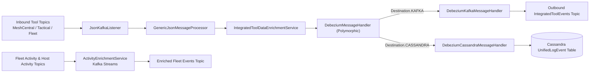
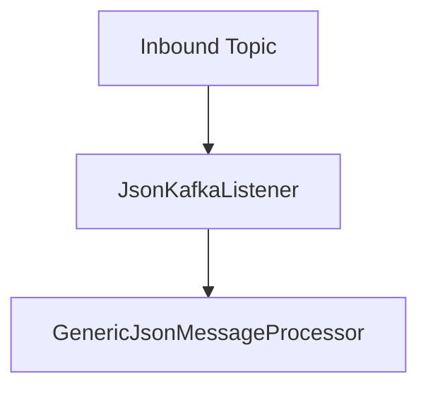
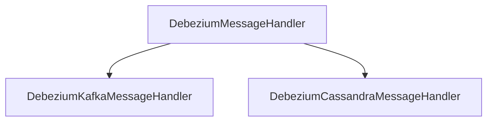
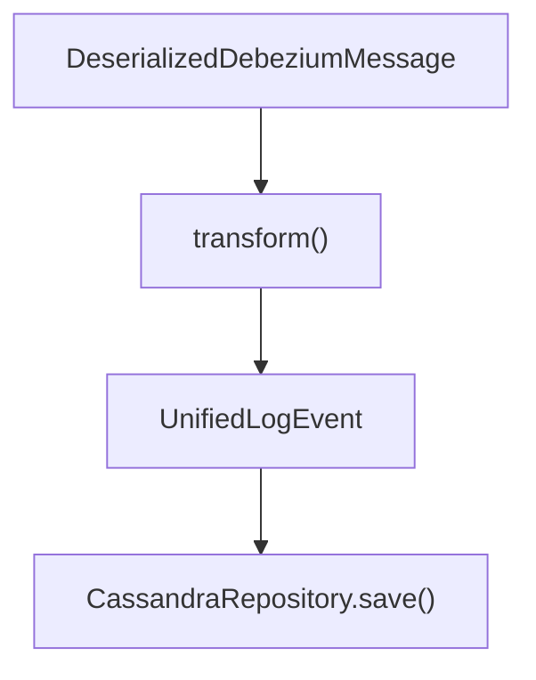
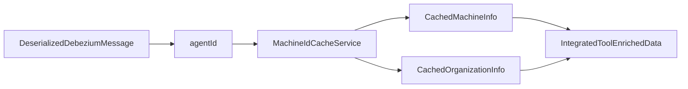
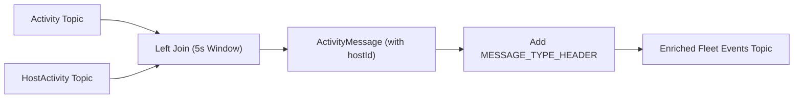
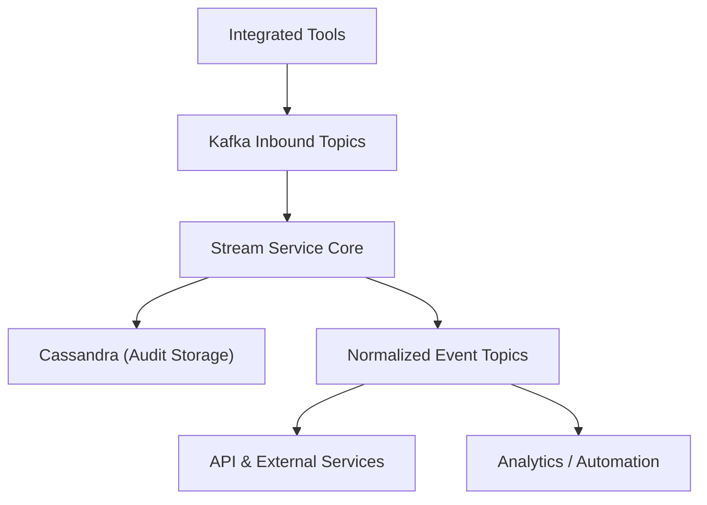

# Stream Service Core

The **Stream Service Core** module is the event-driven backbone of the OpenFrame platform. It ingests, enriches, transforms, and routes high-volume event streams from integrated tools (MeshCentral, Tactical RMM, Fleet MDM, etc.) into unified, normalized events for downstream systems.

This module is responsible for:

- Consuming Debezium-based change events from Kafka
- Enriching events with tenant, organization, and device metadata
- Mapping heterogeneous source event types into unified domain event types
- Persisting events to Cassandra
- Republishing normalized events to Kafka
- Performing stream joins and enrichment using Kafka Streams

It enables a consistent, multi-tenant event processing pipeline across the OpenFrame ecosystem.

---

## Architectural Overview

At a high level, the Stream Service Core sits between inbound tool event topics and downstream consumers (datastores, services, analytics, and external APIs).



The processing pipeline consists of three main layers:

1. **Consumption Layer** – Kafka listeners ingest raw Debezium events.
2. **Enrichment & Mapping Layer** – Events are enriched with Redis-backed metadata and mapped to unified types.
3. **Destination Layer** – Events are routed to Kafka or Cassandra depending on handler type.

---

## Core Responsibilities

### 1. Kafka Configuration

#### KafkaConfig

The `KafkaConfig` class provides infrastructure-level configuration for Kafka consumers.

Key responsibility:

- Defines a `Converter<byte[], MessageType>` that converts Kafka header bytes into the internal `MessageType` enum.

This allows headers such as `MESSAGE_TYPE_HEADER` to be automatically mapped and injected into listener methods.

---

### 2. Kafka Streams Processing

#### KafkaStreamsConfig

Enables Kafka Streams processing using Spring’s `@EnableKafkaStreams`.

Key features:

- Dynamically builds the `application.id` using `spring.application.name` and optional `cluster-id`
- Configures:
  - `AT_LEAST_ONCE` processing guarantee
  - State directory
  - Stream threads
  - Consumer and producer tuning
- Defines SerDes for:
  - `ActivityMessage`
  - `HostActivityMessage`

This configuration powers stateful stream joins inside the module.

---

### 3. JSON Kafka Listener

#### JsonKafkaListener

Consumes inbound tool event topics:

- MeshCentral events
- Tactical RMM events
- Fleet MDM events
- Fleet query result events



The listener:

- Accepts `CommonDebeziumMessage`
- Reads the `MessageType` header
- Delegates processing to `GenericJsonMessageProcessor`

This keeps the listener thin and delegates business logic to the processing layer.

---

### 4. Debezium Message Handling Framework

#### DebeziumMessageHandler (Abstract)

Provides a generic base class for handling Debezium events.

Responsibilities:

- Extracts operation type (`c`, `r`, `u`, `d`) and maps to internal `OperationType`
- Defines abstract `transform()` method
- Provides lifecycle hooks:
  - `handleCreate`
  - `handleRead`
  - `handleUpdate`
  - `handleDelete`



Concrete handlers specialize transformation and routing logic.

---

### 5. Kafka Destination Handler

#### DebeziumKafkaMessageHandler

Transforms enriched Debezium events into `IntegratedToolEvent` objects and publishes them to Kafka.

Key characteristics:

- Publishes to configurable outbound topic
- Uses `OssTenantRetryingKafkaProducer`
- Builds deterministic partition key based on:
  - `deviceId`
  - `userId`
  - `toolType`
- Filters out non-visible messages (`isValidMessage` override)

This handler enables event fan-out to downstream services, APIs, and analytics pipelines.

---

### 6. Cassandra Destination Handler

#### DebeziumCassandraMessageHandler

Transforms enriched Debezium events into `UnifiedLogEvent` objects and persists them using a `CassandraRepository`.

Key logic:

- Constructs composite key (`UnifiedLogEventKey`):
  - ingest day
  - tool type
  - unified event type
  - timestamp
  - tool event ID
- Sets organization, device, and severity fields
- Handles create/read/update operations as upserts



This ensures durable, queryable event storage for audit and historical analysis.

---

### 7. Event Type Mapping

#### EventTypeMapper

Central registry that maps:

```
IntegratedToolType + SourceEventType → UnifiedEventType
```

It supports:

- MeshCentral
- Tactical RMM
- Fleet MDM

If no mapping exists, the event defaults to `UnifiedEventType.UNKNOWN`.

This abstraction:

- Decouples external tool semantics from internal domain model
- Allows adding new tool mappings without modifying handlers
- Ensures consistent cross-tool event taxonomy

#### SourceEventTypes

Defines constant namespaces per tool:

- `MeshCentral`
- `Tactical`
- `Fleet`

This centralizes string-based source event types and avoids hardcoded literals.

---

### 8. Integrated Tool Data Enrichment

#### IntegratedToolDataEnrichmentService

Enriches raw Debezium events using Redis-backed caches.

Dependencies:

- `MachineIdCacheService`

Enrichment flow:



Adds:

- Machine ID
- Hostname
- Organization ID
- Organization name

This allows downstream handlers to operate without additional database lookups.

---

### 9. Fleet Activity Enrichment (Kafka Streams)

#### ActivityEnrichmentService

Implements a stateful Kafka Streams topology to join:

- `ActivityMessage`
- `HostActivityMessage`

Using a 5-second time window.



Key details:

- Uses `JoinWindows.ofTimeDifferenceWithNoGrace(5s)`
- Propagates constant headers using modern `FixedKeyProcessor`
- Publishes enriched messages to output topic

This is a stateful stream enrichment separate from Debezium-based processing.

---

## Multi-Tenant Considerations

The module is designed for SaaS multi-tenancy:

- Kafka Streams `application.id` is suffixed with `cluster-id`
- Kafka producers are tenant-aware
- Enrichment uses tenant-scoped cache lookups
- Topics are injected via tenant-specific configuration

This ensures logical isolation while allowing shared infrastructure.

---

## How Stream Service Core Fits in the Platform



The Stream Service Core acts as:

- **Normalizer** – unifies tool-specific events
- **Enricher** – injects tenant and device context
- **Router** – forwards to appropriate destinations
- **Persistence Gateway** – writes canonical audit events
- **Stream Processor** – performs windowed joins and transformations

Without this module, the platform would need to handle heterogeneous tool semantics across every service.

---

## Summary

The **Stream Service Core** is the event processing engine of OpenFrame. It combines:

- Kafka consumer infrastructure
- Debezium event handling abstraction
- Redis-backed metadata enrichment
- Cassandra persistence
- Kafka re-publication
- Kafka Streams stateful processing
- Unified event taxonomy mapping

It transforms raw, heterogeneous tool events into structured, enriched, and normalized domain events that power the rest of the platform.
