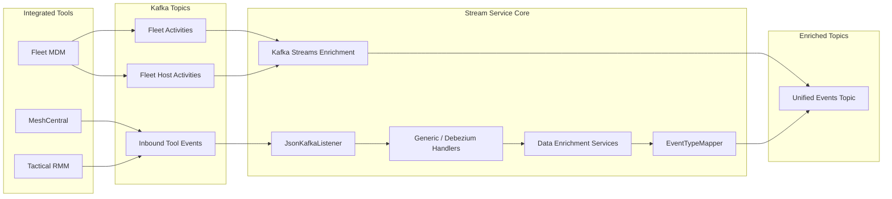
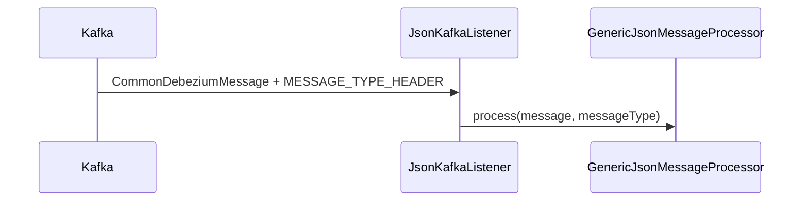
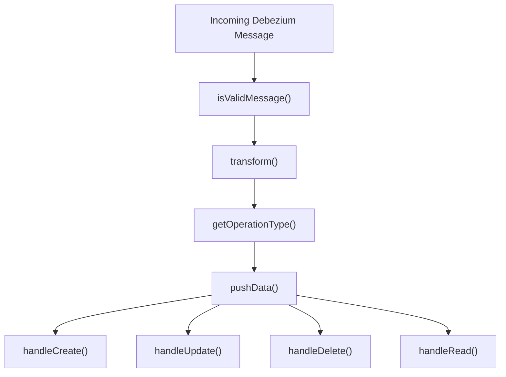
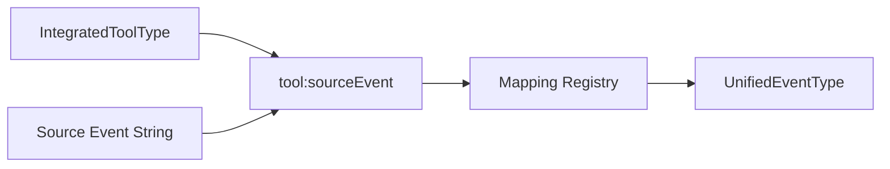
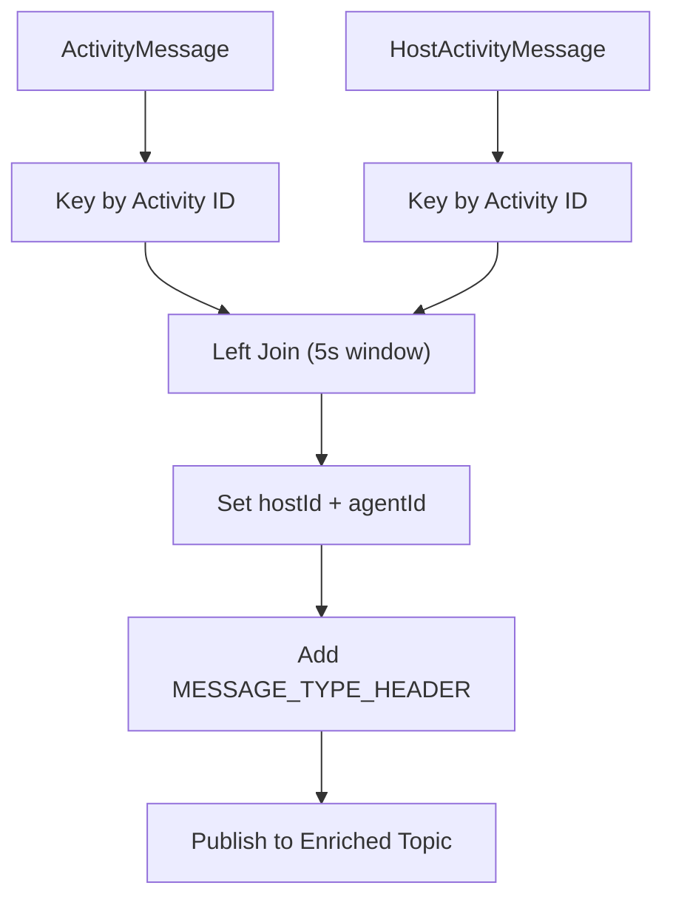
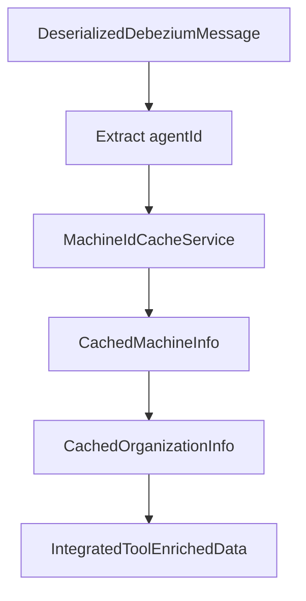
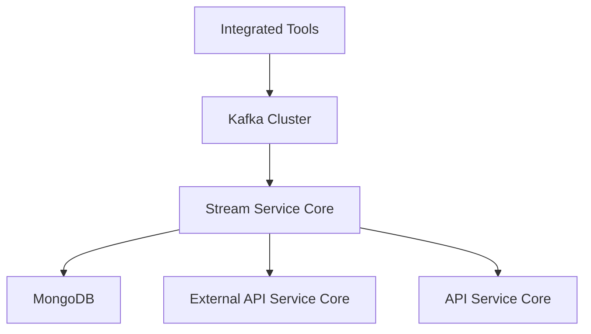

# Stream Service Core

## Overview

The **Stream Service Core** module is the real-time event processing engine of the OpenFrame platform. It is responsible for:

- Consuming events from Kafka topics (including Debezium CDC streams and integrated tool events)
- Enriching and transforming raw messages into unified domain events
- Normalizing heterogeneous tool-specific event types into platform-wide unified event types
- Performing stream processing and joins using Kafka Streams
- Publishing enriched events back to Kafka for downstream services

This module acts as the backbone for real-time telemetry, activity tracking, and cross-tool event standardization within the multi-tenant OpenFrame architecture.

It is packaged and bootstrapped by the `StreamApplication` in the `service-applications` module.

---

## Architectural Context

The Stream Service Core integrates tightly with:

- **Data Layer Kafka** – Topic configuration, Debezium models, Kafka headers
- **Data Layer Mongo / Redis** – Cached machine and organization metadata
- **Management Service Core** – Tool lifecycle and integration configuration
- **External API / API Service Core** – Downstream consumers of enriched events

### High-Level Flow



---

## Core Responsibilities

The module is organized around five primary concerns:

1. **Kafka Configuration & Streams Setup**
2. **Message Consumption & Routing**
3. **Generic Message Handling Framework**
4. **Event Type Normalization**
5. **Activity & Tool Data Enrichment**

Each area is described below.

---

# 1. Kafka Configuration & Streams Setup

## KafkaConfig

**Component:** `KafkaConfig`

Provides infrastructure-level configuration for Kafka consumers.

### Key Responsibilities

- Registers a `Converter<byte[], MessageType>`
- Converts Kafka header values into strongly typed `MessageType` enums
- Gracefully handles unknown or malformed header values

This enables type-safe routing of inbound events based on message headers.

---

## KafkaStreamsConfig

**Component:** `KafkaStreamsConfig`

Enables and configures Kafka Streams processing for the service.

### Key Features

- `@EnableKafkaStreams`
- Custom SerDes for:
  - `ActivityMessage`
  - `HostActivityMessage`
- Multi-tenant `application.id` construction
- Stream processing guarantees: `AT_LEAST_ONCE`
- Controlled consumer / producer tuning
- Explicit state store directory configuration

### Multi-Tenant Application ID Strategy

```text
If clusterId is empty:
    application.id = applicationName
Else:
    application.id = applicationName-clusterId
```

This ensures isolated stream processing per tenant/cluster.

---

# 2. Message Consumption & Routing

## JsonKafkaListener

**Component:** `JsonKafkaListener`

Acts as the main inbound Kafka consumer for integrated tool events.

### Subscribed Topics

Configured via properties:

- MeshCentral events
- Tactical RMM events
- Fleet MDM events
- Fleet query result events

### Processing Flow



The listener:

- Extracts the `MESSAGE_TYPE_HEADER`
- Delegates message processing to `GenericJsonMessageProcessor`
- Keeps the consumption layer thin and focused

---

# 3. Generic Message Handling Framework

This module defines a reusable, extensible framework for processing Debezium-style change events.

## GenericMessageHandler

**Component:** `GenericMessageHandler<T, U, V>`

An abstract base class implementing the full lifecycle of event processing.

### Responsibilities

- Validates messages
- Transforms raw CDC payloads
- Determines operation type
- Routes to operation-specific handlers:
  - `handleCreate`
  - `handleRead`
  - `handleUpdate`
  - `handleDelete`

### Processing Template



This enforces consistency across all tool-specific handlers.

---

## DebeziumMessageHandler

**Component:** `DebeziumMessageHandler`

Specialized abstract class for handling Debezium CDC events.

### Responsibilities

- Extracts CDC operation type (`c`, `r`, `u`, `d`)
- Maps it to internal `OperationType` enum
- Delegates transformation to subclasses

This abstraction isolates CDC semantics from domain logic.

---

# 4. Event Type Normalization

Integrated tools emit heterogeneous event types. The platform requires unified event semantics.

## SourceEventTypes

Defines structured constants for:

- MeshCentral event types
- Tactical RMM event types
- Fleet MDM event types

This avoids hardcoded strings and improves maintainability.

---

## EventTypeMapper

Central mapping registry converting:

```text
(IntegratedToolType + SourceEventType) -> UnifiedEventType
```

### Mapping Strategy



If no mapping is found:

```text
UnifiedEventType.UNKNOWN
```

### Why This Matters

- Enables cross-tool analytics
- Standardizes audit events
- Simplifies UI and reporting
- Decouples tool evolution from platform semantics

---

# 5. Activity & Tool Data Enrichment

The Stream Service Core performs two major enrichment operations:

1. Activity enrichment via Kafka Streams joins
2. Tool event enrichment via Redis-based machine lookup

---

## ActivityEnrichmentService

Processes Fleet MDM activity streams.

### Input Topics

- Fleet activities
- Fleet host activities

### Processing Steps

1. Re-key streams by activity ID
2. Left join activity with host activity
3. Enrich activity with hostId and agentId
4. Add required Kafka headers
5. Publish enriched message to outbound topic

### Join Logic



### Characteristics

- Windowed join: 5 seconds
- No grace period
- Adds `FLEET_MDM_EVENT` message type header
- Preserves Debezium compatibility headers

---

## IntegratedToolDataEnrichmentService

Enriches integrated tool CDC events using Redis-backed caches.

### Responsibilities

- Lookup machine metadata by `agentId`
- Resolve organization information
- Populate:
  - machineId
  - hostname
  - organizationId
  - organizationName

### Enrichment Flow



If no machine is found:

```text
Event proceeds without enrichment
```

This design ensures resilience even when cache entries are missing.

---

# Operational Characteristics

## Processing Guarantees

- Kafka Streams: `AT_LEAST_ONCE`
- Controlled batch sizes and poll settings
- Explicit state directory configuration

## Multi-Tenancy

- Tenant-aware Kafka topics
- Tenant-aware stream `application.id`
- Cache lookups scoped by organization

## Extensibility Model

To support a new integrated tool:

1. Add source event constants in `SourceEventTypes`
2. Register mappings in `EventTypeMapper`
3. Implement tool-specific `DebeziumMessageHandler`
4. Configure inbound topic in `JsonKafkaListener`

---

# How Stream Service Core Fits Into the Platform



The Stream Service Core is:

- The normalization engine for tool telemetry
- The enrichment layer for activity intelligence
- The real-time transformation hub between raw events and domain events

Without this module, the platform would receive fragmented, tool-specific, non-normalized event streams.

---

# Summary

The **Stream Service Core** module provides:

- Kafka consumer and stream processing infrastructure
- A reusable Debezium-based message handling framework
- A centralized event normalization registry
- Real-time enrichment pipelines
- Multi-tenant aware stream isolation

It forms the foundation of OpenFrame’s real-time observability, unified event modeling, and integrated tool intelligence.