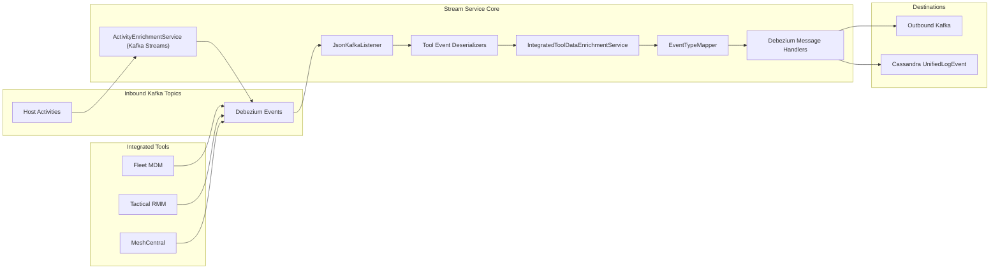
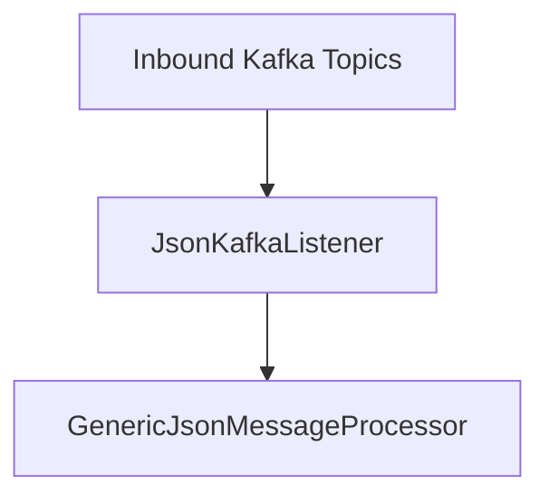
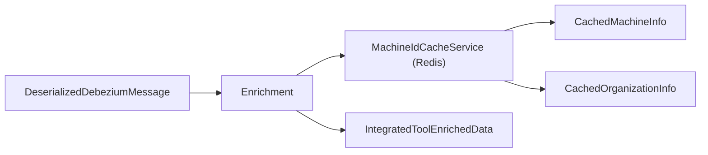
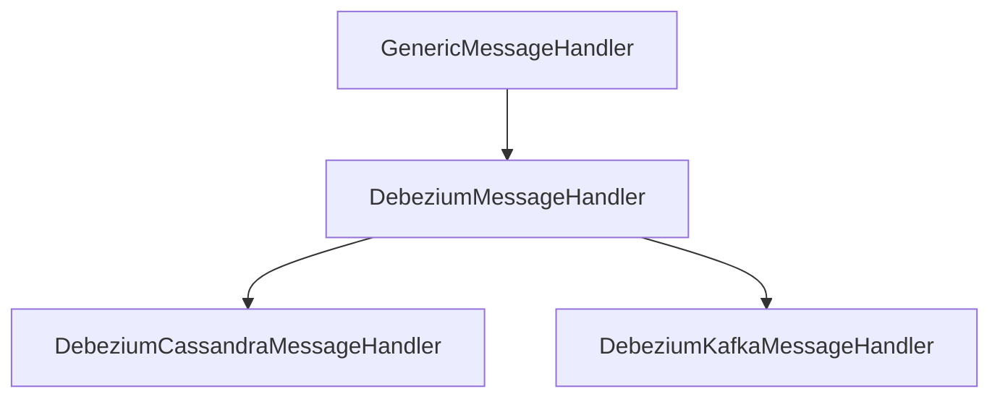
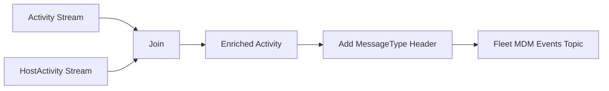
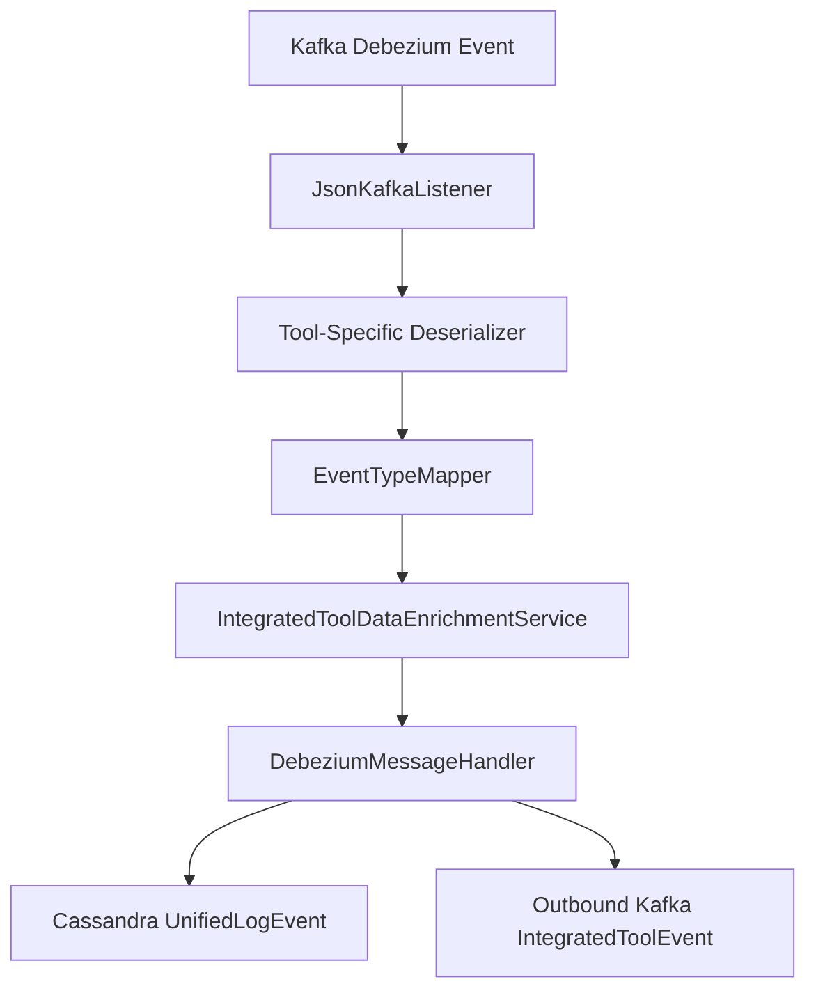

# Stream Service Core

## Overview

The **Stream Service Core** module is the real-time event processing backbone of the OpenFrame platform. It ingests change data capture (CDC) events from integrated tools (Fleet MDM, Tactical RMM, MeshCentral), enriches them with tenant and device metadata, maps them into a unified event model, and distributes them to downstream destinations such as Kafka and Cassandra.

This module is responsible for:

- Consuming Debezium-based CDC events from Kafka
- Deserializing tool-specific payloads
- Mapping tool-native event types to unified event types
- Enriching events with machine and organization metadata
- Persisting unified events to Cassandra
- Publishing normalized events to outbound Kafka topics
- Performing stream-level joins using Kafka Streams (Fleet activity enrichment)

It acts as the central normalization and enrichment layer between external integrations and the rest of the OpenFrame data platform.

---

## High-Level Architecture



---

## Core Responsibilities

### 1. Kafka Configuration and Streams Setup

#### KafkaConfig
- Provides a `Converter<byte[], MessageType>`
- Converts Kafka header values into strongly typed `MessageType` enums
- Enables routing and processing logic based on message headers

#### KafkaStreamsConfig
- Enables Kafka Streams processing
- Configures:
  - `application.id` (namespaced by cluster ID)
  - Bootstrap servers
  - Serdes for `ActivityMessage` and `HostActivityMessage`
  - At-least-once processing
  - State directory
  - Consumer and producer tuning
- Registers custom JSON Serdes using Jackson

Application ID logic ensures tenant isolation:

```text
applicationId = applicationName + "-" + clusterId
```

This prevents state store collisions in multi-tenant SaaS deployments.

---

## Event Ingestion Pipeline

### JsonKafkaListener

The `JsonKafkaListener` subscribes to multiple inbound Kafka topics:

- MeshCentral events
- Tactical RMM events
- Fleet MDM events
- Fleet MDM query result events



Each message includes a `MessageType` header that determines which deserializer and handler chain will process it.

---

## Tool-Specific Deserializers

All tool-specific deserializers extend a shared base (`IntegratedToolEventDeserializer`) and implement logic to:

- Extract `agentId`
- Extract source event type
- Extract tool event ID
- Extract message and details
- Extract timestamps
- Define the associated `MessageType`

### FleetEventDeserializer
- Parses Fleet activity events
- Maps `activity_type` to readable messages
- Extracts timestamps via `TimestampParser`
- Emits `MessageType.FLEET_MDM_EVENT`

### FleetQueryResultEventDeserializer
- Handles Fleet query execution results
- Enriches output using `FleetMdmCacheService`
- Formats structured JSON results and errors
- Emits `MessageType.FLEET_MDM_QUERY_RESULT_EVENT`

### MeshCentralEventDeserializer
- Parses nested JSON payloads
- Combines `etype` and `action` fields
- Extracts Mongo-style `_id.$oid` identifiers
- Emits `MessageType.MESHCENTRAL_EVENT`

### TrmmAgentHistoryEventDeserializer
- Handles Tactical RMM agent command and script executions
- Uses `TacticalRmmCacheService` to resolve agent and script metadata
- Extracts stdout/stderr and execution time
- Emits `MessageType.TACTICAL_RMM_AGENT_HISTORY_EVENT`

### TrmmAuditEventDeserializer
- Processes Tactical audit log events
- Combines `object_type` and `action`
- Extracts audit details and timestamps
- Emits `MessageType.TACTICAL_RMM_AUDIT_EVENT`

---

## Unified Event Mapping

### EventTypeMapper

The `EventTypeMapper` converts tool-specific event types into platform-wide `UnifiedEventType` values.

Mapping key format:

```text
toolDbName:sourceEventType
```

If no mapping exists:

```text
UnifiedEventType.UNKNOWN
```

This ensures:
- Consistent cross-tool event semantics
- Unified severity classification
- Standardized summaries

---

## Data Enrichment Layer

### IntegratedToolDataEnrichmentService

Before persisting or publishing events, the module enriches them with:

- Machine ID
- Hostname
- Organization ID
- Organization name



If a machine cannot be resolved, the message still proceeds but without enrichment fields.

---

## Message Handling Framework

The module implements a generic handler framework:



### GenericMessageHandler
- Handles operation dispatching (CREATE, READ, UPDATE, DELETE)
- Calls appropriate handler methods
- Provides transformation hook

### DebeziumMessageHandler
- Extracts operation type from Debezium payload
- Converts `c`, `r`, `u`, `d` to `OperationType`

---

## Destinations

### DebeziumCassandraMessageHandler

Transforms events into `UnifiedLogEvent` entities:

- Builds composite primary key:
  - Ingest day
  - Tool type
  - Unified event type
  - Event timestamp
  - Tool event ID
- Saves to Cassandra

Destination:

```text
Destination.CASSANDRA
```

### DebeziumKafkaMessageHandler

Transforms events into `IntegratedToolEvent` messages:

- Publishes to outbound Kafka topic
- Uses tenant-aware retrying producer
- Builds partition key using:
  - Device ID + tool type
  - Or user ID + tool type

Destination:

```text
Destination.KAFKA
```

Messages marked as invisible (`getIsVisible() == false`) are filtered out.

---

## Kafka Streams: Activity Enrichment

### ActivityEnrichmentService

This component performs a time-windowed join between:

- `ActivityMessage` (Fleet activities)
- `HostActivityMessage` (host-to-activity mapping)

Join window:

```text
5 seconds (no grace period)
```



It:
- Sets `hostId`
- Aligns `agentId` with host
- Adds `MESSAGE_TYPE_HEADER`
- Emits enriched events back to Kafka

This ensures downstream handlers receive fully correlated activity records.

---

## Timestamp Handling

### TimestampParser

Utility class for parsing ISO 8601 timestamps:

```text
Instant.parse(timestamp).toEpochMilli()
```

If parsing fails:
- Logs a warning
- Returns empty Optional

This provides safe and consistent time normalization across tools.

---

## End-to-End Processing Flow



---

## Design Characteristics

- **Tool-agnostic core** with tool-specific deserializers
- **Pluggable handler architecture**
- **Tenant-aware Kafka configuration**
- **Redis-backed enrichment layer**
- **Unified cross-tool event taxonomy**
- **At-least-once processing guarantees**
- **Extensive structured logging**

---

## Role in the OpenFrame Platform

The Stream Service Core is the central normalization engine of the OpenFrame architecture.

It bridges:

- External integrations (Fleet, Tactical, MeshCentral)
- Real-time Kafka event distribution
- Persistent audit storage in Cassandra
- Downstream analytics and API services

Without this module, each integrated tool would produce incompatible event formats. Stream Service Core guarantees that all integrations conform to a unified event contract used throughout the platform.

---

**Module Type:** Real-Time Stream Processing

**Primary Technologies:**
- Spring Boot
- Spring Kafka
- Kafka Streams
- Cassandra
- Redis (via MachineIdCacheService)
- Debezium CDC

---

This module is foundational to observability, audit logging, automation tracking, and cross-tool event consistency in OpenFrame.