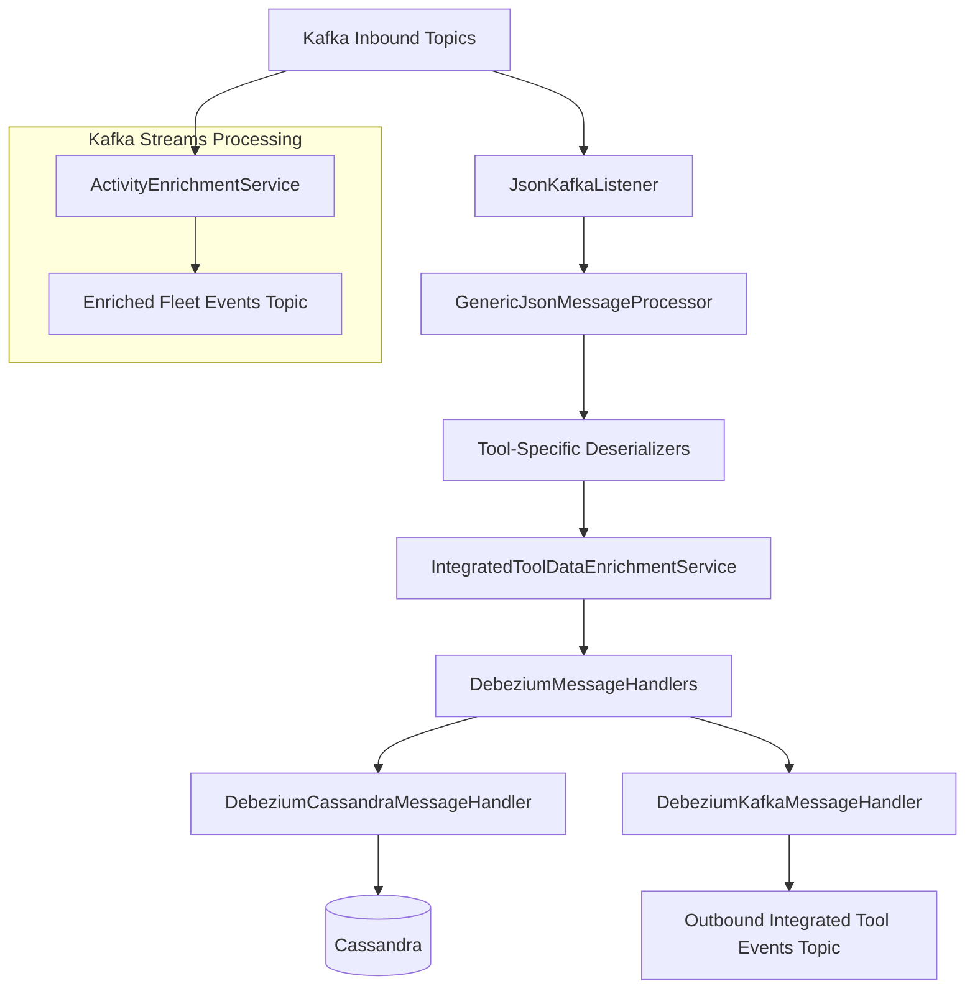
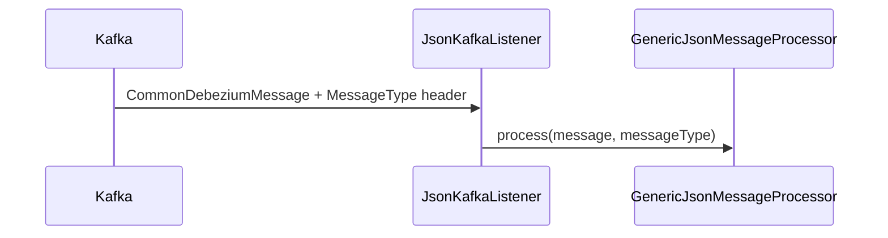
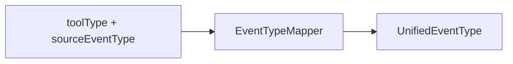
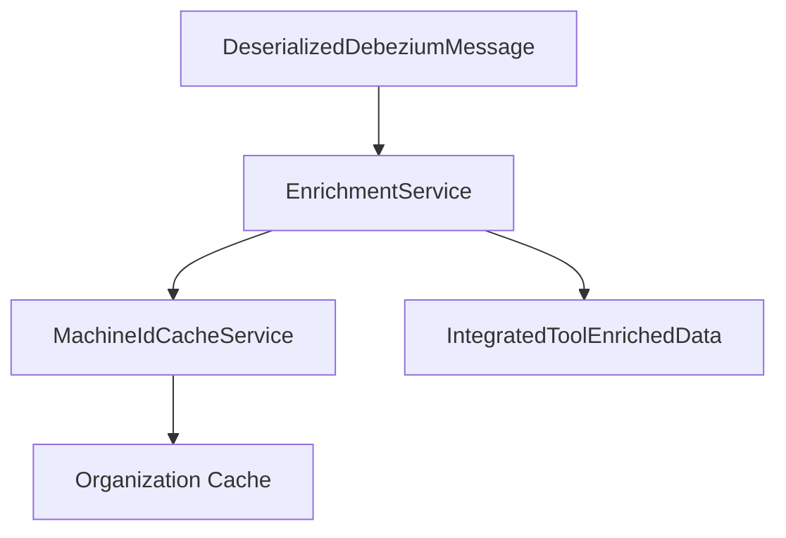
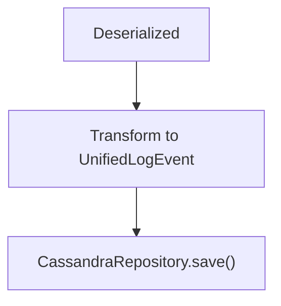
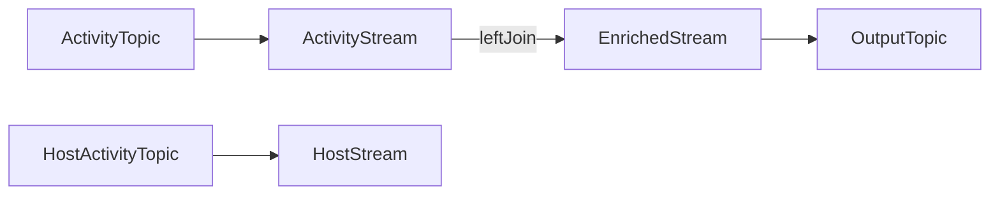
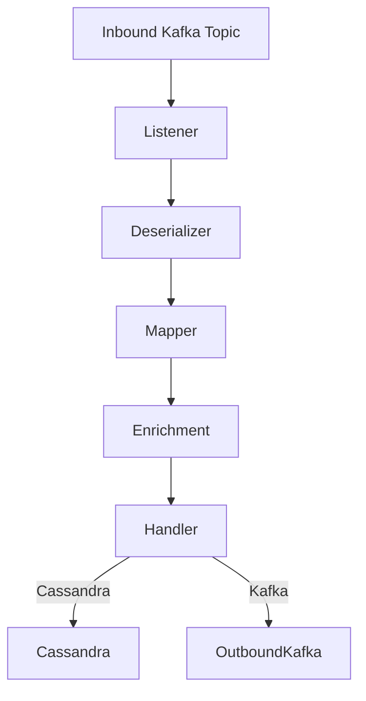

# Stream Service Core Kafka Listeners Deserializers And Handlers

## Overview

The **Stream Service Core Kafka Listeners Deserializers And Handlers** module is the event ingestion and transformation backbone of the OpenFrame streaming layer. It consumes Change Data Capture (CDC) events and tool-generated messages from Kafka, normalizes them into unified domain events, enriches them with tenant and device context, and routes them to downstream destinations such as Cassandra and Kafka topics.

This module acts as the bridge between:

- Integrated tools (Fleet MDM, Tactical RMM, MeshCentral)
- Kafka topics (Debezium CDC streams and activity topics)
- Internal unified event model (`UnifiedEventType`, `IntegratedToolEvent`)
- Downstream storage and analytics systems (Cassandra, Kafka Streams, Pinot)

It is deployed as part of the Stream service entrypoint (`StreamApplication`) and integrates tightly with the streaming and data-layer modules.

---

## High-Level Architecture



The processing pipeline consists of:

1. **Kafka Listener Layer** – Consumes inbound topics.
2. **Deserializer Layer** – Converts raw Debezium messages into typed internal models.
3. **Mapping Layer** – Maps source event types to unified event types.
4. **Enrichment Layer** – Resolves agent, machine, and organization context.
5. **Handler Layer** – Routes transformed events to Cassandra and/or Kafka.
6. **Kafka Streams Layer** – Performs stream-time joins and activity enrichment.

---

## Kafka Configuration Layer

### KafkaConfig

Defines infrastructure beans required for Kafka integration, including:

- `Converter<byte[], MessageType>` – Converts Kafka header values into `MessageType` enums.
- Enables routing of events based on the `MESSAGE_TYPE_HEADER`.

This ensures tool-specific deserializers can be selected dynamically based on Kafka headers.

---

### KafkaStreamsConfig

Configures Spring Kafka Streams for stateful stream processing.

Key responsibilities:

- Defines `Serde<ActivityMessage>` and `Serde<HostActivityMessage>`.
- Configures:
  - `application.id` (namespaced by cluster/tenant)
  - `AT_LEAST_ONCE` processing guarantee
  - State store directory
  - Consumer/producer performance properties
- Supports multi-tenant isolation via `clusterId`.

This configuration powers the `ActivityEnrichmentService`.

---

## Kafka Listener Layer

### JsonKafkaListener

The primary Kafka consumer entrypoint.

It listens to inbound integrated tool topics:

- MeshCentral events
- Tactical RMM events
- Fleet MDM events
- Fleet query result events



Routing is determined by the `MessageType` Kafka header.

---

## Deserializer Layer

All tool-specific deserializers extend a shared base: `IntegratedToolEventDeserializer` (not shown here but assumed in hierarchy).

They extract:

- Agent ID
- Source event type
- Tool-specific event ID
- Message / summary
- Timestamp
- Error/result details

### Implemented Deserializers

| Tool | Class | MessageType |
|------|--------|-------------|
| Fleet MDM | FleetEventDeserializer | FLEET_MDM_EVENT |
| Fleet Query Result | FleetQueryResultEventDeserializer | FLEET_MDM_QUERY_RESULT_EVENT |
| MeshCentral | MeshCentralEventDeserializer | MESHCENTRAL_EVENT |
| Tactical RMM Agent History | TrmmAgentHistoryEventDeserializer | TACTICAL_RMM_AGENT_HISTORY_EVENT |
| Tactical RMM Audit | TrmmAuditEventDeserializer | TACTICAL_RMM_AUDIT_EVENT |

Each deserializer:

- Extracts structured data from Debezium `after` fields
- Converts timestamps via `TimestampParser`
- Normalizes source event types
- Optionally enriches results (e.g., query names, script names)

---

## Event Type Mapping

### EventTypeMapper

Maps tool-specific event types into a unified domain enum: `UnifiedEventType`.



Mapping key format:

```text
toolDbName:sourceEventType
```

If no mapping exists, the event defaults to `UNKNOWN`.

This abstraction allows:

- Cross-tool reporting
- Unified audit trail
- Consistent severity handling

---

## Enrichment Layer

### IntegratedToolDataEnrichmentService

Enriches deserialized events using Redis-backed caches.

Inputs:

- `agentId`

Resolves:

- Machine ID
- Hostname
- Organization ID
- Organization name



This ensures downstream handlers receive tenant-aware and device-aware data.

---

## Handler Layer

All handlers extend:

```text
GenericMessageHandler<T, U, V>
```

Where:
- `U` = DeserializedDebeziumMessage
- `V` = IntegratedToolEnrichedData
- `T` = Destination model

### GenericMessageHandler

Core responsibilities:

- Validate message
- Determine operation type (`CREATE`, `READ`, `UPDATE`, `DELETE`)
- Transform message
- Route to appropriate `handle*` method

Operation mapping is derived from Debezium operation codes:

```text
c → CREATE
r → READ
u → UPDATE
d → DELETE
```

---

### DebeziumMessageHandler

Adds Debezium-specific behavior and operation resolution.

Concrete handlers must:

- Implement `transform()`
- Define destination
- Handle lifecycle operations

---

### DebeziumCassandraMessageHandler

Destination: **Cassandra**

Transforms events into `UnifiedLogEvent`.

Key responsibilities:

- Builds composite partition key
- Sets severity and summary
- Persists via `CassandraRepository`



Used for long-term event storage and analytics.

---

### DebeziumKafkaMessageHandler

Destination: **Kafka (Outbound Integrated Tool Events)**

Publishes normalized `IntegratedToolEvent` messages.

Features:

- Visibility filtering (`getIsVisible()`)
- Partition key built from device or user ID
- Uses `OssTenantRetryingKafkaProducer`

This enables downstream services to consume a unified, enriched event stream.

---

## Kafka Streams Processing

### ActivityEnrichmentService

Uses Kafka Streams to join:

- Fleet `ActivityMessage`
- Fleet `HostActivityMessage`

Join window:

```text
5 seconds (left join)
```



Enhancements performed:

- Inject `hostId` into activity
- Set `agentId` from host
- Add `MESSAGE_TYPE_HEADER`
- Forward enriched message to Fleet events topic

This ensures Fleet events include device context before reaching the deserializer layer.

---

## Timestamp Handling

### TimestampParser

All Debezium timestamps are expected in ISO 8601 format.

```text
2024-01-01T10:15:30Z
```

Converted to epoch milliseconds for:

- Cassandra partition keys
- Event ordering
- Unified event storage

Invalid timestamps are logged and safely ignored.

---

## End-to-End Processing Flow



1. Kafka emits Debezium message.
2. `JsonKafkaListener` receives event.
3. Correct deserializer selected via `MessageType`.
4. Source event type mapped to `UnifiedEventType`.
5. Device and organization context enriched.
6. Event routed to Cassandra and/or Kafka.

---

## Responsibilities Within the Platform

The **Stream Service Core Kafka Listeners Deserializers And Handlers** module:

- Normalizes heterogeneous tool event schemas.
- Enforces unified event semantics.
- Ensures tenant isolation through enrichment.
- Provides durable event storage (Cassandra).
- Publishes normalized events for real-time consumers.
- Enables stream-based enrichment for Fleet MDM.

It is the canonical ingestion layer for integrated tool events across the OpenFrame platform.

---

## Design Principles

- **Extensibility** – New tools require only a new deserializer and mappings.
- **Separation of Concerns** – Listener, deserialization, enrichment, and routing are independent layers.
- **Multi-Tenancy Awareness** – Cluster ID and Redis enrichment ensure tenant isolation.
- **Unified Domain Model** – All tools converge into `UnifiedEventType`.
- **Stream-Native Processing** – Kafka Streams for stateful joins and header manipulation.

---

## Conclusion

The Stream Service Core Kafka Listeners Deserializers And Handlers module is the central ingestion and normalization engine for OpenFrame’s streaming architecture.

By combining:

- Kafka listeners
- Tool-aware deserializers
- Unified event mapping
- Context enrichment
- Destination-specific handlers
- Kafka Streams joins

It guarantees that every integrated tool event becomes a structured, enriched, tenant-aware unified event ready for analytics, audit, and real-time processing.