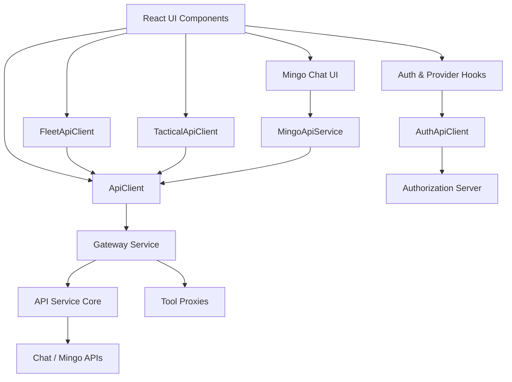
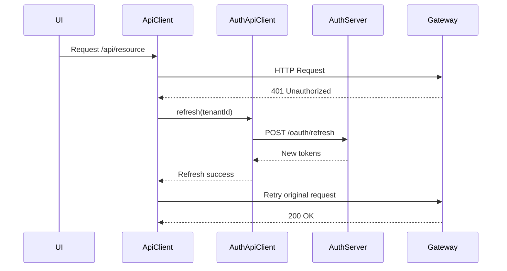
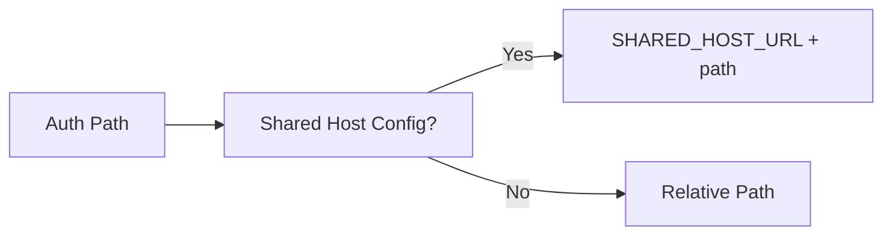
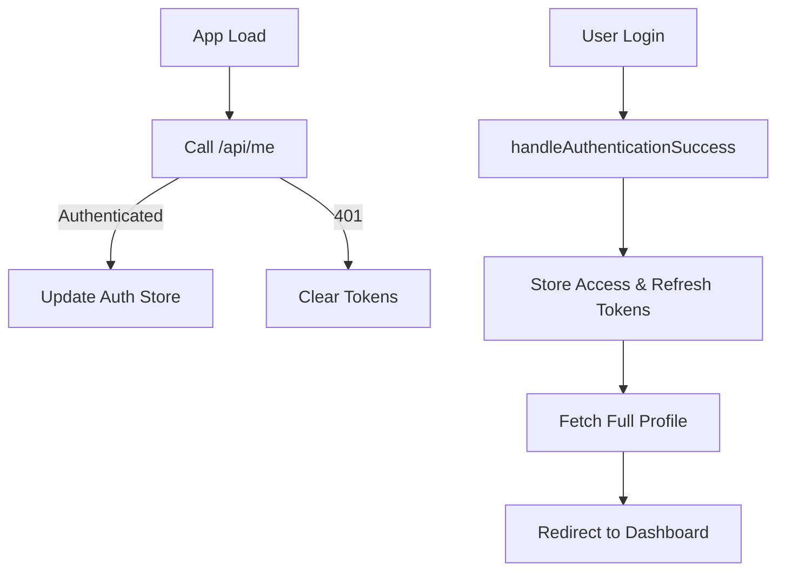
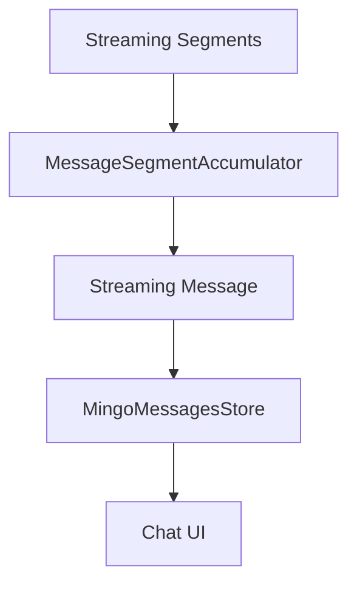

# Tenant Frontend Api Clients And Hooks

The **Tenant Frontend Api Clients And Hooks** module provides the frontend integration layer between the OpenFrame tenant UI and the backend microservices ecosystem. It centralizes:

- Authenticated HTTP communication
- OAuth and SaaS-aware authentication flows
- Tool-specific API integrations (Fleet MDM, Tactical RMM)
- Chat (Mingo AI) API access and state management
- React hooks for authentication and SSO provider discovery

This module acts as the **frontend gateway abstraction**, ensuring consistent request handling, token refresh, error management, and multi-tenant awareness across the application.

---

## 1. Architectural Overview

At a high level, this module sits between the React UI and the backend service mesh (Gateway, Authorization Server, API Service, Chat APIs, Tool Proxies).



### Key Responsibilities

- Provide a **single source of truth** for HTTP request behavior
- Handle cookie-based and header-based authentication
- Perform automatic token refresh with queuing
- Support SaaS shared-host and tenant-specific modes
- Provide domain-specific API clients for tools and chat
- Maintain reactive chat state using Zustand

---

## 2. Core HTTP Layer

### 2.1 ApiClient

**Component:** `ApiClient`

The `ApiClient` is the foundational HTTP abstraction used across the tenant frontend.

#### Responsibilities

- Builds URLs using tenant-aware runtime configuration
- Automatically includes credentials (`credentials: include`)
- Injects `Authorization` headers when Dev Ticket mode is enabled
- Detects `401` responses and triggers token refresh
- Queues concurrent requests during token refresh
- Forces logout on refresh failure

#### Token Refresh Flow



#### Important Features

- **Single retry policy** to prevent infinite loops
- Auth-page detection to prevent redirect loops
- Graceful handling of aborted requests
- Unified error response shape via `ApiResponse<T>`

---

### 2.2 AuthApiClient

**Component:** `AuthApiClient`

The `AuthApiClient` handles all authentication-specific endpoints:

- `/oauth/*`
- `/oauth/refresh`
- `/sas/*` (SaaS registration & discovery)
- Invitation and SSO flows

#### Key Capabilities

- Shared-host URL support (SaaS shared mode)
- Refresh token via header (`Refresh-Token`) in Dev Ticket mode
- Automatic retry after `401`
- SSO redirect URL construction
- Tenant discovery & domain availability checks

#### SaaS-Aware URL Building



This enables the frontend to run in:

- Multi-tenant SaaS mode
- Local development mode
- Dedicated tenant-host deployments

---

## 3. Tool-Specific API Clients

These clients extend the base `ApiClient` while preserving authentication behavior.

### 3.1 FleetApiClient

**Component:** `FleetApiClient`

Integrates with Fleet MDM via the tool proxy:

Base path:

```text
/tools/fleetmdm-server
```

#### Functional Areas

- Policies
- Queries
- Hosts
- Teams
- Labels
- Packs

All requests are routed through `ApiClient`, ensuring:

- Automatic token refresh
- Tenant host awareness
- Unified error handling

---

### 3.2 TacticalApiClient

**Component:** `TacticalApiClient`

Integrates with Tactical RMM via:

```text
/tools/tactical-rmm
```

#### Supported Operations

- Agent management
- Script execution
- Bulk actions
- Scheduled tasks
- Logs and monitoring data
- System & network info retrieval

Like Fleet, it inherits all authentication and retry logic from `ApiClient`.

---

## 4. Authentication Hooks

### 4.1 useAuth

**Component:** `useAuth`

The `useAuth` hook orchestrates authentication state across the application.

#### Responsibilities

- Tenant discovery
- Organization registration (password & SSO)
- SSO login redirect
- Logout handling
- Periodic `/me` authentication checks
- Token storage integration
- Toast-based UX feedback

#### Authentication Lifecycle



#### Tenant Discovery Flow

- Calls `AuthApiClient.discoverTenants`
- Detects existing accounts
- Retrieves available SSO providers
- Stores tenant ID for refresh usage

---

### 4.2 useInviteProviders

Fetches SSO providers available for a specific invitation ID.

- Uses `AuthApiClient.getInviteProviders`
- Returns provider list with loading & error state

---

### 4.3 useRegistrationProviders

Fetches available SSO providers for tenant registration.

- Uses `AuthApiClient.getRegistrationProviders`
- Normalizes provider structure for UI consumption

---

## 5. Mingo (Chat) Integration

The module includes a complete chat API integration layer for Mingo AI.

### 5.1 MingoApiService

**Component:** `MingoApiService`

Provides React Query mutation factories:

- `createDialogMutation()`
- `sendMessageMutation()`
- `approveRequestMutation()`
- `rejectRequestMutation()`

All operations use `ApiClient`.

#### Chat API Endpoints

```text
POST /chat/api/v1/dialogs
POST /chat/api/v1/messages
POST /chat/api/v1/approval-requests/{id}/approve
```

---

### 5.2 MingoMessagesStore

**Component:** `MingoMessagesStore`

A Zustand store managing:

- Messages per dialog
- Streaming state
- Typing indicators
- Unread counts
- Segment accumulation
- Approval status updates
- Pagination cursors

#### Real-Time Streaming Architecture



#### Key Capabilities

- Maintains `Map<string, Message[]>` per dialog
- Handles approval segments with status updates
- Supports optimistic updates
- Tracks streaming messages independently
- Supports pagination cursors

---

## 6. GraphQL Response Typing

### Dialog Types

- `DialogResponse`
- `DialogsResponse`
- `DialogConnection`
- `DialogNode`

### Message Types

- `MessagesResponse`
- `GraphQLMessage`
- `CoreMessage`

These types ensure strict typing between:

- Backend GraphQL APIs
- Chat UI components
- State store transformations

---

## 7. Security Model

This module supports two authentication strategies:

1. **Cookie-based auth** (default)
2. **Header-based token auth** (Dev Ticket mode)

### Security Guarantees

- Automatic token refresh
- Refresh token isolation
- Forced logout on failure
- Prevention of infinite retry loops
- Tenant-aware token resolution

---

## 8. Multi-Tenant Awareness

Tenant awareness is embedded at multiple layers:

- `runtimeEnv.tenantHostUrl()` for routing
- Tenant ID propagation in refresh requests
- Shared-host SaaS compatibility
- SSO login URL construction
- Tenant discovery via email

This ensures the frontend can operate in:

- Local development
- Dedicated tenant environments
- Shared SaaS multi-tenant mode

---

# Summary

The **Tenant Frontend Api Clients And Hooks** module is the backbone of tenant-side backend communication. It:

- Centralizes HTTP behavior
- Manages authentication lifecycle
- Integrates tool-specific APIs
- Powers AI chat interactions
- Enforces multi-tenant security guarantees

By abstracting all network and authentication complexity into this module, the rest of the frontend can remain focused on UI and user experience while maintaining strong security, consistency, and scalability across the OpenFrame platform.
