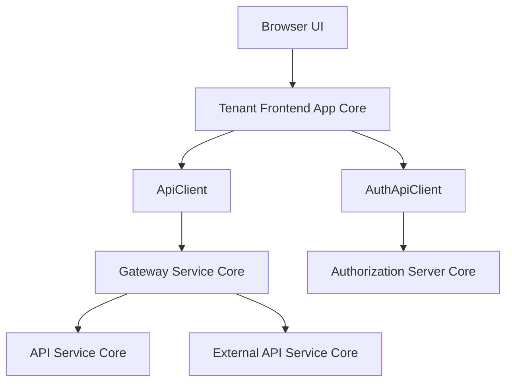
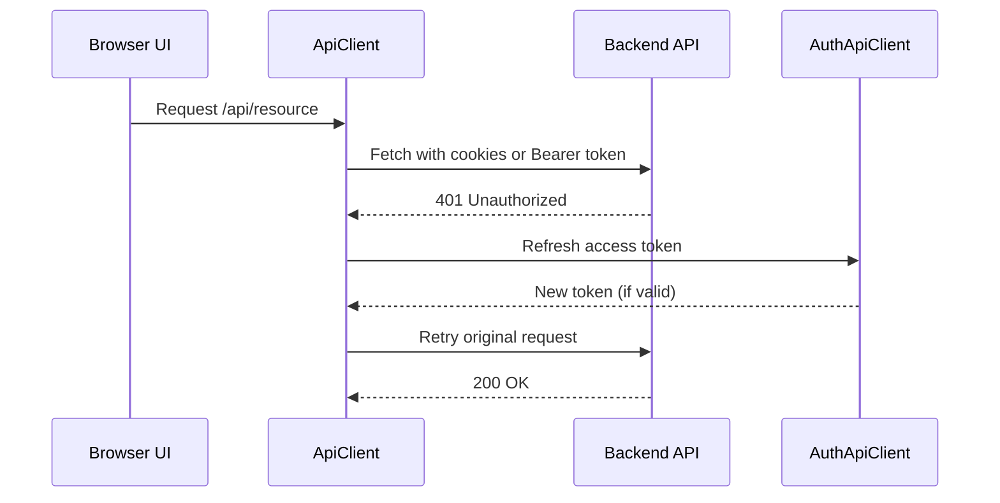
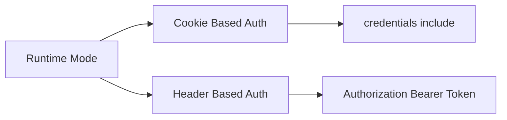

# Tenant Frontend App Core

## Overview

The **Tenant Frontend App Core** module is the client-side integration layer between the OpenFrame tenant web application and the backend microservices ecosystem. It provides:

- A centralized API communication layer
- Unified authentication and token lifecycle management
- Multi-tenant–aware request routing
- Seamless support for cookie-based and header-based authentication
- Automatic token refresh and session recovery

At its core, this module exposes two primary components:

- `ApiClient` – General-purpose authenticated API client for tenant application APIs
- `AuthApiClient` – Dedicated authentication and OAuth client for login, registration, SSO, and token refresh flows

This module acts as the **frontend boundary adapter** to backend services such as the API Service Core, Authorization Server Core, Gateway Service Core, and other tenant-aware services.

---

## Architectural Role in the System

The Tenant Frontend App Core sits between the browser UI and the distributed backend services.



### Key Responsibilities

1. **Authentication Boundary**
   - Handles OAuth login flows
   - Manages access and refresh tokens
   - Supports cookie-based auth and bearer token fallback

2. **Tenant-Aware Routing**
   - Builds URLs dynamically using runtime environment configuration
   - Supports shared SaaS mode and dedicated tenant domains

3. **Session Resilience**
   - Automatically refreshes expired access tokens
   - Queues and retries failed requests
   - Forces logout when refresh fails

4. **Environment Adaptation**
   - Dev ticket support
   - Runtime host resolution
   - Shared vs dedicated deployment support

---

## Core Components

### 1. ApiClient

**File:** `src/lib/api-client.ts`  
**Class:** `ApiClient`

The `ApiClient` is the main HTTP abstraction used throughout the tenant application for authenticated API communication.

### Responsibilities

- Standardized `GET`, `POST`, `PUT`, `PATCH`, `DELETE` methods
- Automatic JSON parsing
- Authentication header injection (when required)
- Cookie inclusion (`credentials: 'include'`)
- Transparent token refresh on 401 responses
- Request retry queue during refresh
- Forced logout on refresh failure

---

### ApiClient Authentication Flow



---

### Token Refresh Strategy

The `ApiClient` implements a **single-refresh concurrency guard**:

- Only one refresh request runs at a time
- Additional failed requests are queued
- When refresh completes:
  - All queued requests are retried
  - Or forced logout is triggered

This prevents refresh storms and race conditions in multi-request scenarios.

---

### Dev Ticket Support

When `runtimeEnv.enableDevTicketObserver()` is enabled:

- Access token is stored in `localStorage`
- Authorization header is manually injected
- Refresh token may be passed via headers

This allows local development and debugging without relying solely on secure HTTP-only cookies.

---

### 2. AuthApiClient

**File:** `src/lib/auth-api-client.ts`  
**Class:** `AuthApiClient`

The `AuthApiClient` is specialized for authentication and tenant onboarding workflows.

It communicates primarily with the **Authorization Server Core** and supports SaaS onboarding flows.

---

## AuthApiClient Responsibilities

### 1. OAuth Flows

- `/oauth/login`
- `/oauth/logout`
- `/oauth/refresh`
- `/oauth/dev-exchange`

### 2. SaaS Tenant Registration

- Discover tenants by email
- Check domain availability
- Register organization (password or SSO)
- Accept invitations
- Validate access codes

### 3. Password Management

- Request password reset
- Confirm password reset

### 4. SSO Provider Integration

Supports:

- Google
- Microsoft

Registration and invitation acceptance flows redirect the browser directly to the authorization endpoint.

---

## Authentication Model

The module supports two complementary authentication mechanisms:

### 1. Cookie-Based Authentication (Primary)

- Uses secure HTTP-only cookies
- `credentials: 'include'` on all requests
- Transparent to frontend logic

### 2. Header-Based Authentication (Dev Mode)

- Stores access token in `localStorage`
- Injects `Authorization: Bearer <token>` header
- Used when Dev Ticket observer is enabled



---

## Multi-Tenant URL Resolution

Both clients dynamically resolve URLs based on runtime configuration:

- `runtimeEnv.tenantHostUrl()` → API base host
- `runtimeEnv.sharedHostUrl()` → Shared SaaS auth host

Resolution logic ensures:

- Absolute URLs pass through untouched
- Relative paths are prefixed with the appropriate tenant or shared host
- SaaS shared mode is correctly handled

This allows the same frontend build to work in:

- Dedicated tenant deployments
- Multi-tenant shared SaaS environments
- Local development

---

## Error Handling Strategy

### Network Errors

- Returns standardized response format
- Status `0` for network failures

### 401 Unauthorized

Handled differently depending on context:

- If on `/auth` page → return error without forcing logout
- Otherwise → attempt refresh
- If refresh fails → force logout

### Standardized Response Format

Both clients return:

```typescript
{
  data?: T,
  error?: string,
  status: number,
  ok: boolean
}
```

This enforces consistent error handling across the UI.

---

## Force Logout Integration

Both clients rely on a shared logout utility to:

- Clear stored tokens
- Reset auth store state
- Redirect to login

This ensures centralized session termination logic across the entire application.

---

## Interaction With Backend Services

| Frontend Client | Backend Target | Purpose |
|------------------|----------------|---------|
| ApiClient | Gateway Service Core | Tenant API access |
| ApiClient | API Service Core | Business data endpoints |
| AuthApiClient | Authorization Server Core | OAuth & tenant lifecycle |
| AuthApiClient | Gateway Service Core | Refresh and session management |

The frontend does not directly implement business logic. Instead, it acts as a resilient communication layer that:

- Protects backend services from malformed or repeated refresh attempts
- Shields UI components from token lifecycle complexity
- Encapsulates multi-tenant routing rules

---

## Design Principles

### 1. Separation of Concerns

- `ApiClient` → General API access
- `AuthApiClient` → Authentication and tenant lifecycle

### 2. Idempotent Retry Safety

Refresh logic retries requests only once to avoid infinite loops.

### 3. Concurrency Control

Refresh requests are serialized to prevent race conditions.

### 4. Runtime Configurability

All environment behavior is driven by `runtimeEnv`, enabling flexible deployment.

---

## Summary

The **Tenant Frontend App Core** module is a critical infrastructure layer in the OpenFrame tenant architecture. It:

- Centralizes API communication
- Enforces secure authentication handling
- Implements robust token refresh and retry logic
- Supports multi-tenant SaaS and dedicated deployments
- Shields UI components from backend complexity

By abstracting authentication and networking concerns into two specialized clients, the module ensures consistency, resilience, and maintainability across the entire tenant-facing frontend application.